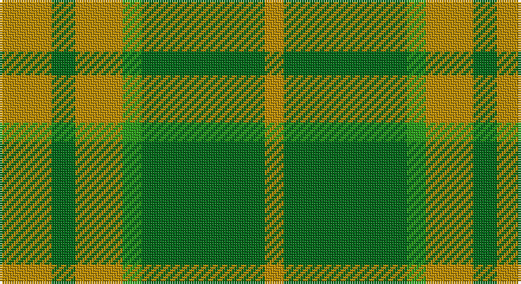

This page is one **sett** — a single exact thread-count. It belongs to the [tartan](/setts/lo11gi5lo10g4gi26lo4/)
(the same proportion at any scale), whose colour order is pattern [YGGYGY](/stripes/yggygy/).

Sourced from tartans-authority.  It is a [6 stripe tartan](/stripes/stripes6/).

Original link http://www.tartansauthority.com/tartan-ferret/display/10517/

## Also known as

This cloth is also recorded under:

- North Dakota State University (Corp.

## Register references

External register numbers recorded for this tartan.

- Scottish Register of Tartans: [10517](https://www.tartanregister.gov.uk/tartanDetails?ref=10517)
- Scottish Tartans Authority (ITI): 10517

## Thread count
DY/22 Ga10 DY20 G8 Ga52 DY/8

One full sett is **210 threads**.

## Palette

Palette: <strong>Tartan Register</strong>
<table><thead><tr><th>Colour</th><th>Threads</th><th>Shade</th><th>Base</th><th>OKLCh</th></tr></thead><tbody><tr><td>DY/</td><td style="text-align:right;font-variant-numeric:tabular-nums">22</td><td><code style="background-color:#BC8C00;">#BC8C00</code> <small style="color:#888">#BC8C00</small></td><td>Y <code style="background-color:#F2BF00;">#F2BF00</code></td><td><small style="color:#888">oklch(66.8% 0.137 84.1)</small></td></tr><tr><td>Ga</td><td style="text-align:right;font-variant-numeric:tabular-nums">10</td><td><code style="background-color:#006818;">#006818</code> <small style="color:#888">#006818</small></td><td>G <code style="background-color:#006100;">#006100</code></td><td><small style="color:#888">oklch(45.0% 0.142 145.0)</small></td></tr><tr><td>DY</td><td style="text-align:right;font-variant-numeric:tabular-nums">20</td><td><code style="background-color:#BC8C00;">#BC8C00</code> <small style="color:#888">#BC8C00</small></td><td>Y <code style="background-color:#F2BF00;">#F2BF00</code></td><td><small style="color:#888">oklch(66.8% 0.137 84.1)</small></td></tr><tr><td>G</td><td style="text-align:right;font-variant-numeric:tabular-nums">8</td><td><code style="background-color:#289C18;">#289C18</code> <small style="color:#888">#289C18</small></td><td>G <code style="background-color:#006100;">#006100</code></td><td><small style="color:#888">oklch(60.6% 0.191 141.6)</small></td></tr><tr><td>Ga</td><td style="text-align:right;font-variant-numeric:tabular-nums">52</td><td><code style="background-color:#006818;">#006818</code> <small style="color:#888">#006818</small></td><td>G <code style="background-color:#006100;">#006100</code></td><td><small style="color:#888">oklch(45.0% 0.142 145.0)</small></td></tr><tr><td>DY/</td><td style="text-align:right;font-variant-numeric:tabular-nums">8</td><td><code style="background-color:#BC8C00;">#BC8C00</code> <small style="color:#888">#BC8C00</small></td><td>Y <code style="background-color:#F2BF00;">#F2BF00</code></td><td><small style="color:#888">oklch(66.8% 0.137 84.1)</small></td></tr></tbody></table>

# Sample pattern

## Nearest tartans

The nearest existing variants by ΔTartan distance, with this tartan at the top so the swatches line up against it.

ΔTartan

Tartan

Sett

—

<a href="/ttd/edit/#slug=lo11gi5lo10g4gi26lo4~x2">North Dakota State University (Corp.</a> <a class="nn-out" href="/variants/s6/lo11gi5lo10g4gi26lo4~x2/" title="open its dictionary page">↗</a>

1.16

<a href="/ttd/edit/#slug=g8lo1g8lo12r1lo1~x4&amp;base=lo11gi5lo10g4gi26lo4~x2">Forget Family (Personal)</a> <a class="nn-out" href="/variants/s6/g8lo1g8lo12r1lo1~x4/" title="open its dictionary page">↗</a>

1.20

<a href="/ttd/edit/#slug=r2g12o3g8o14g2~x2&amp;base=lo11gi5lo10g4gi26lo4~x2">Confederate Artillery (Military)</a> <a class="nn-out" href="/variants/s6/r2g12o3g8o14g2~x2/" title="open its dictionary page">↗</a>

1.43

<a href="/ttd/edit/#slug=o1g1o5g8lg1g1lg1~x4&amp;base=lo11gi5lo10g4gi26lo4~x2">O'Neill Pipe Band 1983 (Corporate)</a> <a class="nn-out" href="/variants/s7/o1g1o5g8lg1g1lg1~x4/" title="open its dictionary page">↗</a>

1.46

<a href="/ttd/edit/#slug=g1o8g8r1g8o8w1~x4&amp;base=lo11gi5lo10g4gi26lo4~x2">MacKinnon, hunting</a> <a class="nn-out" href="/variants/s7/g1o8g8r1g8o8w1~x4/" title="open its dictionary page">↗</a>

1.47

<a href="/ttd/edit/#slug=g25lo6dg5r3lo10~x4&amp;base=lo11gi5lo10g4gi26lo4~x2">Pendlebury, Andrew (Personal)</a> <a class="nn-out" href="/variants/s5/g25lo6dg5r3lo10~x4/" title="open its dictionary page">↗</a>

1.73

<a href="/ttd/edit/#slug=r1g8o8w1~x2&amp;base=lo11gi5lo10g4gi26lo4~x2">MacKinnon, hunting</a> <a class="nn-out" href="/variants/s4/r1g8o8w1~x2/" title="open its dictionary page">↗</a>

1.76

<a href="/ttd/edit/#slug=g22k3g3gi16g6k4~x2&amp;base=lo11gi5lo10g4gi26lo4~x2">Campbell Simpson (Dalgliesh)</a> <a class="nn-out" href="/variants/s6/g22k3g3gi16g6k4~x2/" title="open its dictionary page">↗</a>

1.79

<a href="/ttd/edit/#slug=o20g40w5g40o20g9~x2&amp;base=lo11gi5lo10g4gi26lo4~x2">O'Neill (Australia)</a> <a class="nn-out" href="/variants/s6/o20g40w5g40o20g9~x2/" title="open its dictionary page">↗</a>

1.81

<a href="/ttd/edit/#slug=g12k2g2dg9g4k2~x4&amp;base=lo11gi5lo10g4gi26lo4~x2">Campbell-Simpson (Personal)</a> <a class="nn-out" href="/variants/s6/g12k2g2dg9g4k2~x4/" title="open its dictionary page">↗</a>

1.84

<a href="/ttd/edit/#slug=g4r5g31r5g31lo5g4lo27ly3~x2&amp;base=lo11gi5lo10g4gi26lo4~x2">Campbell &amp; Co (Beauly) (Corporate)</a> <a class="nn-out" href="/variants/s9/g4r5g31r5g31lo5g4lo27ly3~x2/" title="open its dictionary page">↗</a>

## Neighbour map

Every grey dot is one of 14360 variants placed by the first two principal components of the ΔTartan feature space (44% of its variance). Red is this tartan; blue dots are its nearest — click one to open its page.

<svg viewBox="0 0 640 380" role="img" style="max-width:100%;height:auto;border:1px solid #e0e0e0;border-radius:4px;display:block" xmlns="http://www.w3.org/2000/svg"><image href="/nn/cloud.v1.png" width="640" height="380"/><a href="/variants/s6/g8lo1g8lo12r1lo1~x4/"><circle cx="374.6" cy="244.0" r="4" fill="#3465a4"><title>Forget Family (Personal)</title></circle></a><a href="/variants/s6/r2g12o3g8o14g2~x2/"><circle cx="384.8" cy="298.7" r="4" fill="#3465a4"><title>Confederate Artillery (Military)</title></circle></a><a href="/variants/s7/o1g1o5g8lg1g1lg1~x4/"><circle cx="368.6" cy="240.0" r="4" fill="#3465a4"><title>O'Neill Pipe Band 1983 (Corporate)</title></circle></a><a href="/variants/s7/g1o8g8r1g8o8w1~x4/"><circle cx="334.8" cy="268.5" r="4" fill="#3465a4"><title>MacKinnon, hunting</title></circle></a><a href="/variants/s5/g25lo6dg5r3lo10~x4/"><circle cx="298.4" cy="242.2" r="4" fill="#3465a4"><title>Pendlebury, Andrew (Personal)</title></circle></a><a href="/variants/s4/r1g8o8w1~x2/"><circle cx="301.4" cy="268.4" r="4" fill="#3465a4"><title>MacKinnon, hunting</title></circle></a><a href="/variants/s6/g22k3g3gi16g6k4~x2/"><circle cx="373.8" cy="286.1" r="4" fill="#3465a4"><title>Campbell Simpson (Dalgliesh)</title></circle></a><a href="/variants/s6/o20g40w5g40o20g9~x2/"><circle cx="421.3" cy="295.6" r="4" fill="#3465a4"><title>O'Neill (Australia)</title></circle></a><a href="/variants/s6/g12k2g2dg9g4k2~x4/"><circle cx="318.2" cy="274.4" r="4" fill="#3465a4"><title>Campbell-Simpson (Personal)</title></circle></a><a href="/variants/s9/g4r5g31r5g31lo5g4lo27ly3~x2/"><circle cx="373.7" cy="212.4" r="4" fill="#3465a4"><title>Campbell &amp; Co (Beauly) (Corporate)</title></circle></a><circle cx="345.3" cy="280.2" r="5" fill="#c00000"/></svg>

ID: /variants/s6/lo11gi5lo10g4gi26lo4~x2/
