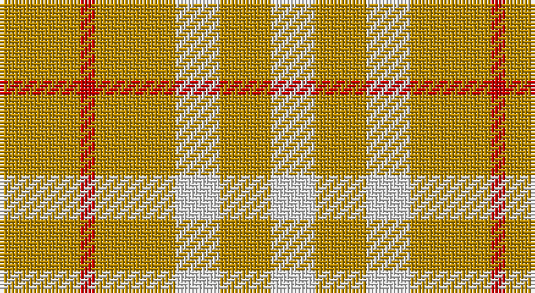

This page is one **sett** — a single exact thread-count. It belongs to the [tartan](/setts/lo11r2lo11w6lo7w6/)
(the same proportion at any scale), whose colour order is pattern [WYWYRY](/stripes/wywyry/).

Part of the [Virgin One](/tartans/virgin-one/) tartan — the named design grouping this sett with its other cloths.

Sourced from register-of-tartans.  It is a [6 stripe tartan](/stripes/stripes6/).

Original link https://www.tartanregister.gov.uk/tartanDetails.aspx?ref=5074

## Register references

External register numbers recorded for this tartan.

- Scottish Register of Tartans: [5074](https://www.tartanregister.gov.uk/tartanDetails.aspx?ref=5074)
- Scottish Tartans Authority (ITI): 3842

## Thread count
DY/22 R4 DY22 LN12 DY14 LN/12

One full sett is **138 threads**.

## Palette

Palette: <strong>Tartan Register</strong>
<table><thead><tr><th>Colour</th><th>Threads</th><th>Shade</th><th>Base</th><th>OKLCh</th></tr></thead><tbody><tr><td>DY/</td><td style="text-align:right;font-variant-numeric:tabular-nums">22</td><td><code style="background-color:#BC8C00;">#BC8C00</code> <small style="color:#888">#BC8C00</small></td><td>Y <code style="background-color:#F2BF00;">#F2BF00</code></td><td><small style="color:#888">oklch(66.8% 0.137 84.1)</small></td></tr><tr><td>R</td><td style="text-align:right;font-variant-numeric:tabular-nums">4</td><td><code style="background-color:#C80000;">#C80000</code> <small style="color:#888">#C80000</small></td><td>R <code style="background-color:#CC0000;">#CC0000</code></td><td><small style="color:#888">oklch(52.3% 0.215 29.2)</small></td></tr><tr><td>DY</td><td style="text-align:right;font-variant-numeric:tabular-nums">22</td><td><code style="background-color:#BC8C00;">#BC8C00</code> <small style="color:#888">#BC8C00</small></td><td>Y <code style="background-color:#F2BF00;">#F2BF00</code></td><td><small style="color:#888">oklch(66.8% 0.137 84.1)</small></td></tr><tr><td>LN</td><td style="text-align:right;font-variant-numeric:tabular-nums">12</td><td><code style="background-color:#E0E0E0;">#E0E0E0</code> <small style="color:#888">#E0E0E0</small></td><td>W <code style="background-color:#F7F7F7;">#F7F7F7</code></td><td><small style="color:#888">oklch(90.7% 0.000 89.9)</small></td></tr><tr><td>DY</td><td style="text-align:right;font-variant-numeric:tabular-nums">14</td><td><code style="background-color:#BC8C00;">#BC8C00</code> <small style="color:#888">#BC8C00</small></td><td>Y <code style="background-color:#F2BF00;">#F2BF00</code></td><td><small style="color:#888">oklch(66.8% 0.137 84.1)</small></td></tr><tr><td>LN/</td><td style="text-align:right;font-variant-numeric:tabular-nums">12</td><td><code style="background-color:#E0E0E0;">#E0E0E0</code> <small style="color:#888">#E0E0E0</small></td><td>W <code style="background-color:#F7F7F7;">#F7F7F7</code></td><td><small style="color:#888">oklch(90.7% 0.000 89.9)</small></td></tr></tbody></table>

# Sample pattern

## Nearest tartans

The nearest existing variants by ΔTartan distance, with this tartan at the top so the swatches line up against it.

ΔTartan

Tartan

Sett

—

<a href="/ttd/edit/#slug=lo11r2lo11w6lo7w6~x2">Virgin One</a> <a class="nn-out" href="/variants/s6/lo11r2lo11w6lo7w6~x2/" title="open its dictionary page">↗</a>

0.91

<a href="/ttd/edit/#slug=lo7w6lo11r2~x2&amp;base=lo11r2lo11w6lo7w6~x2">Virgin One (Corporate)</a> <a class="nn-out" href="/variants/s4/lo7w6lo11r2~x2/" title="open its dictionary page">↗</a>

1.39

<a href="/ttd/edit/#slug=ly12w5ly6w5ly12r2~x2&amp;base=lo11r2lo11w6lo7w6~x2">One Account</a> <a class="nn-out" href="/variants/s6/ly12w5ly6w5ly12r2~x2/" title="open its dictionary page">↗</a>

1.65

<a href="/ttd/edit/#slug=ly6w5ly12r2~x2&amp;base=lo11r2lo11w6lo7w6~x2">One Account (Corporate)</a> <a class="nn-out" href="/variants/s4/ly6w5ly12r2~x2/" title="open its dictionary page">↗</a>

1.67

<a href="/ttd/edit/#slug=ly8r2ly8g1r6ly3g4ly2~x4&amp;base=lo11r2lo11w6lo7w6~x2">Glufree</a> <a class="nn-out" href="/variants/s8/ly8r2ly8g1r6ly3g4ly2~x4/" title="open its dictionary page">↗</a>

2.41

<a href="/ttd/edit/#slug=w1o6loi4o4lo1~x10&amp;base=lo11r2lo11w6lo7w6~x2">Amber Rose (Fashion)</a> <a class="nn-out" href="/variants/s5/w1o6loi4o4lo1~x10/" title="open its dictionary page">↗</a>

2.44

<a href="/ttd/edit/#slug=lo40g13lo6db13lo22~x2&amp;base=lo11r2lo11w6lo7w6~x2">Burt's Highlanders (Fashion)</a> <a class="nn-out" href="/variants/s5/lo40g13lo6db13lo22~x2/" title="open its dictionary page">↗</a>

2.57

<a href="/ttd/edit/#slug=o3w17o11w2o11w2~x4&amp;base=lo11r2lo11w6lo7w6~x2">Fallow Deer, The</a> <a class="nn-out" href="/variants/s6/o3w17o11w2o11w2~x4/" title="open its dictionary page">↗</a>

2.60

<a href="/ttd/edit/#slug=r8ly2r15g10r4g10r4~x2&amp;base=lo11r2lo11w6lo7w6~x2">Caspari (Corporate)</a> <a class="nn-out" href="/variants/s7/r8ly2r15g10r4g10r4~x2/" title="open its dictionary page">↗</a>

2.67

<a href="/ttd/edit/#slug=ly1r3g7r3g7r3ly1~x4&amp;base=lo11r2lo11w6lo7w6~x2">Unidentified 24</a> <a class="nn-out" href="/variants/s7/ly1r3g7r3g7r3ly1~x4/" title="open its dictionary page">↗</a>

2.68

<a href="/ttd/edit/#slug=t25r46w11r11w7r11w11r46t12&amp;base=lo11r2lo11w6lo7w6~x2">Twilfit</a> <a class="nn-out" href="/variants/s9/t25r46w11r11w7r11w11r46t12/" title="open its dictionary page">↗</a>

## Neighbour map

Every grey dot is one of 14360 variants placed by the first two principal components of the ΔTartan feature space (44% of its variance). Red is this tartan; blue dots are its nearest — click one to open its page.

<svg viewBox="0 0 640 380" role="img" style="max-width:100%;height:auto;border:1px solid #e0e0e0;border-radius:4px;display:block" xmlns="http://www.w3.org/2000/svg"><image href="/nn/cloud.v1.png" width="640" height="380"/><a href="/variants/s4/lo7w6lo11r2~x2/"><circle cx="399.4" cy="305.9" r="4" fill="#3465a4"><title>Virgin One (Corporate)</title></circle></a><a href="/variants/s6/ly12w5ly6w5ly12r2~x2/"><circle cx="413.4" cy="276.9" r="4" fill="#3465a4"><title>One Account</title></circle></a><a href="/variants/s4/ly6w5ly12r2~x2/"><circle cx="416.9" cy="282.3" r="4" fill="#3465a4"><title>One Account (Corporate)</title></circle></a><a href="/variants/s8/ly8r2ly8g1r6ly3g4ly2~x4/"><circle cx="346.7" cy="240.3" r="4" fill="#3465a4"><title>Glufree</title></circle></a><a href="/variants/s5/w1o6loi4o4lo1~x10/"><circle cx="373.5" cy="286.0" r="4" fill="#3465a4"><title>Amber Rose (Fashion)</title></circle></a><a href="/variants/s5/lo40g13lo6db13lo22~x2/"><circle cx="373.0" cy="245.5" r="4" fill="#3465a4"><title>Burt's Highlanders (Fashion)</title></circle></a><a href="/variants/s6/o3w17o11w2o11w2~x4/"><circle cx="342.7" cy="240.5" r="4" fill="#3465a4"><title>Fallow Deer, The</title></circle></a><a href="/variants/s7/r8ly2r15g10r4g10r4~x2/"><circle cx="340.4" cy="257.0" r="4" fill="#3465a4"><title>Caspari (Corporate)</title></circle></a><a href="/variants/s7/ly1r3g7r3g7r3ly1~x4/"><circle cx="307.3" cy="251.0" r="4" fill="#3465a4"><title>Unidentified 24</title></circle></a><a href="/variants/s9/t25r46w11r11w7r11w11r46t12/"><circle cx="362.4" cy="227.4" r="4" fill="#3465a4"><title>Twilfit</title></circle></a><circle cx="375.0" cy="295.9" r="5" fill="#c00000"/></svg>

ID: /variants/s6/lo11r2lo11w6lo7w6~x2/
