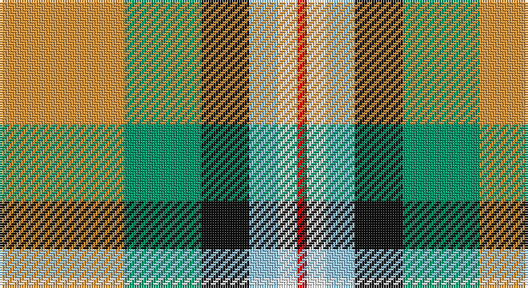

This page is one **sett** — a single exact thread-count. It belongs to the [tartan](/setts/lo13g8k5lb3w2r1/)
(the same proportion at any scale), whose colour order is pattern [RWWKGY](/stripes/rwwkgy/).

Sourced from register-of-tartans.  It is a [6 stripe tartan](/stripes/stripes6/).

Original link https://www.tartanregister.gov.uk/tartanDetails.aspx?ref=176

## Also known as

This cloth is also recorded under:

- Ball Htg

2 attestations — the source records this cloth was collapsed from (oldest owns this page)

<ul>
<li>01/01/2004 — Ball Hunting (register-of-tartans, <a href="https://www.tartanregister.gov.uk/tartanDetails.aspx?ref=176">record</a>)</li>
<li>pre 2004 — Ball Htg (Name) (tartans-authority, <a href="http://www.tartansauthority.com/tartan-ferret/display/6355/">record</a>)</li>
</ul>

## Register references

External register numbers recorded for this tartan.

- Scottish Register of Tartans: [176](https://www.tartanregister.gov.uk/tartanDetails.aspx?ref=176)
- Scottish Tartans Authority (ITI): 6355

## Thread count
O/52 B32 K20 LB12 W8 R/4

One full sett is **200 threads**.

## Palette

Palette: <strong>Tartan Register</strong> <small style="color:#888">(7 of 8 colours)</small>
<table><thead><tr><th>Colour</th><th>Threads</th><th>Shade</th><th>Base</th><th>OKLCh</th></tr></thead><tbody><tr><td>O/</td><td style="text-align:right;font-variant-numeric:tabular-nums">52</td><td><code style="background-color:#DC943C;">#DC943C</code> <small style="color:#888">#DC943C</small></td><td>Y <code style="background-color:#F2BF00;">#F2BF00</code></td><td><small style="color:#888">oklch(72.3% 0.133 67.9)</small></td></tr><tr><td>B</td><td style="text-align:right;font-variant-numeric:tabular-nums">32</td><td><code style="background-color:#009468;">#009468</code> <small style="color:#888">#009468</small></td><td>G <code style="background-color:#006100;">#006100</code></td><td><small style="color:#888">oklch(59.0% 0.126 163.6)</small></td></tr><tr><td>K</td><td style="text-align:right;font-variant-numeric:tabular-nums">20</td><td><code style="background-color:#101010;">#101010</code> <small style="color:#888">#101010</small></td><td>K <code style="background-color:#000000;">#000000</code></td><td><small style="color:#888">oklch(17.3% 0.000 89.9)</small></td></tr><tr><td>LB</td><td style="text-align:right;font-variant-numeric:tabular-nums">12</td><td><code style="background-color:#98C8E8;">#98C8E8</code> <small style="color:#888">#98C8E8</small></td><td>W <code style="background-color:#F7F7F7;">#F7F7F7</code></td><td><small style="color:#888">oklch(81.0% 0.068 237.9)</small></td></tr><tr><td>W</td><td style="text-align:right;font-variant-numeric:tabular-nums">8</td><td><code style="background-color:#F8F8F8;">#F8F8F8</code> <small style="color:#888">#F8F8F8</small></td><td>W <code style="background-color:#F7F7F7;">#F7F7F7</code></td><td><small style="color:#888">oklch(97.9% 0.000 89.9)</small></td></tr><tr><td>R/</td><td style="text-align:right;font-variant-numeric:tabular-nums">4</td><td><code style="background-color:#C80000;">#C80000</code> <small style="color:#888">#C80000</small></td><td>R <code style="background-color:#CC0000;">#CC0000</code></td><td><small style="color:#888">oklch(52.3% 0.215 29.2)</small></td></tr></tbody></table>

# Sample pattern

## Nearest tartans

The nearest existing variants by ΔTartan distance, with this tartan at the top so the swatches line up against it.

ΔTartan

Tartan

Sett

—

<a href="/ttd/edit/#slug=lo13g8k5lb3w2r1~x4">Ball Hunting</a> <a class="nn-out" href="/variants/s6/lo13g8k5lb3w2r1~x4/" title="open its dictionary page">↗</a>

0.88

<a href="/ttd/edit/#slug=r5dg8do13o21y34w55dg3&amp;base=lo13g8k5lb3w2r1~x4">Canadian Shield (Personal)</a> <a class="nn-out" href="/variants/s7/r5dg8do13o21y34w55dg3/" title="open its dictionary page">↗</a>

0.90

<a href="/ttd/edit/#slug=ly8r3b2db1w6g12db2~x2&amp;base=lo13g8k5lb3w2r1~x4">Carmen Lau (Hong Kong) (Personal)</a> <a class="nn-out" href="/variants/s7/ly8r3b2db1w6g12db2~x2/" title="open its dictionary page">↗</a>

0.96

<a href="/ttd/edit/#slug=lo13b8r5k3w2g1~x4&amp;base=lo13g8k5lb3w2r1~x4">Ball</a> <a class="nn-out" href="/variants/s6/lo13b8r5k3w2g1~x4/" title="open its dictionary page">↗</a>

1.04

<a href="/ttd/edit/#slug=dy17o5db2w12db2ly4g7~x2&amp;base=lo13g8k5lb3w2r1~x4">Ontario Northern Canadian District Tartan</a> <a class="nn-out" href="/variants/s7/dy17o5db2w12db2ly4g7~x2/" title="open its dictionary page">↗</a>

1.07

<a href="/ttd/edit/#slug=ly8k3t2do1w6g12do2~x2&amp;base=lo13g8k5lb3w2r1~x4">Carmen Lau (Hong Kong) (Personal)</a> <a class="nn-out" href="/variants/s7/ly8k3t2do1w6g12do2~x2/" title="open its dictionary page">↗</a>

1.23

<a href="/ttd/edit/#slug=r34w3gi4g23w24k3gi4~x2&amp;base=lo13g8k5lb3w2r1~x4">MacLachlan Dress Clan Tartan</a> <a class="nn-out" href="/variants/s7/r34w3gi4g23w24k3gi4~x2/" title="open its dictionary page">↗</a>

1.23

<a href="/ttd/edit/#slug=r1w12g6r8t3ly1~x4&amp;base=lo13g8k5lb3w2r1~x4">MacLean, dress</a> <a class="nn-out" href="/variants/s6/r1w12g6r8t3ly1~x4/" title="open its dictionary page">↗</a>

1.25

<a href="/ttd/edit/#slug=ly25r10g10db11w2~x2&amp;base=lo13g8k5lb3w2r1~x4">Samye</a> <a class="nn-out" href="/variants/s5/ly25r10g10db11w2~x2/" title="open its dictionary page">↗</a>

1.26

<a href="/ttd/edit/#slug=r34w3dg4g23w24k3dg4~x2&amp;base=lo13g8k5lb3w2r1~x4">MacLachlan, dress</a> <a class="nn-out" href="/variants/s7/r34w3dg4g23w24k3dg4~x2/" title="open its dictionary page">↗</a>

1.31

<a href="/ttd/edit/#slug=o17y5db2w12db2ly4g7~x2&amp;base=lo13g8k5lb3w2r1~x4">Ontario, Northern</a> <a class="nn-out" href="/variants/s7/o17y5db2w12db2ly4g7~x2/" title="open its dictionary page">↗</a>

## Neighbour map

Every grey dot is one of 14360 variants placed by the first two principal components of the ΔTartan feature space (44% of its variance). Red is this tartan; blue dots are its nearest — click one to open its page.

<svg viewBox="0 0 640 380" role="img" style="max-width:100%;height:auto;border:1px solid #e0e0e0;border-radius:4px;display:block" xmlns="http://www.w3.org/2000/svg"><image href="/nn/cloud.v1.png" width="640" height="380"/><a href="/variants/s7/r5dg8do13o21y34w55dg3/"><circle cx="152.5" cy="121.3" r="4" fill="#3465a4"><title>Canadian Shield (Personal)</title></circle></a><a href="/variants/s7/ly8r3b2db1w6g12db2~x2/"><circle cx="88.9" cy="145.2" r="4" fill="#3465a4"><title>Carmen Lau (Hong Kong) (Personal)</title></circle></a><a href="/variants/s6/lo13b8r5k3w2g1~x4/"><circle cx="150.2" cy="152.2" r="4" fill="#3465a4"><title>Ball</title></circle></a><a href="/variants/s7/dy17o5db2w12db2ly4g7~x2/"><circle cx="87.2" cy="167.3" r="4" fill="#3465a4"><title>Ontario Northern Canadian District Tartan</title></circle></a><a href="/variants/s7/ly8k3t2do1w6g12do2~x2/"><circle cx="82.7" cy="141.4" r="4" fill="#3465a4"><title>Carmen Lau (Hong Kong) (Personal)</title></circle></a><a href="/variants/s7/r34w3gi4g23w24k3gi4~x2/"><circle cx="153.8" cy="156.0" r="4" fill="#3465a4"><title>MacLachlan Dress Clan Tartan</title></circle></a><a href="/variants/s6/r1w12g6r8t3ly1~x4/"><circle cx="157.9" cy="165.6" r="4" fill="#3465a4"><title>MacLean, dress</title></circle></a><a href="/variants/s5/ly25r10g10db11w2~x2/"><circle cx="158.9" cy="184.5" r="4" fill="#3465a4"><title>Samye</title></circle></a><a href="/variants/s7/r34w3dg4g23w24k3dg4~x2/"><circle cx="148.0" cy="151.7" r="4" fill="#3465a4"><title>MacLachlan, dress</title></circle></a><a href="/variants/s7/o17y5db2w12db2ly4g7~x2/"><circle cx="104.5" cy="174.6" r="4" fill="#3465a4"><title>Ontario, Northern</title></circle></a><circle cx="140.7" cy="153.5" r="5" fill="#c00000"/></svg>

ID: /variants/s6/lo13g8k5lb3w2r1~x4/
