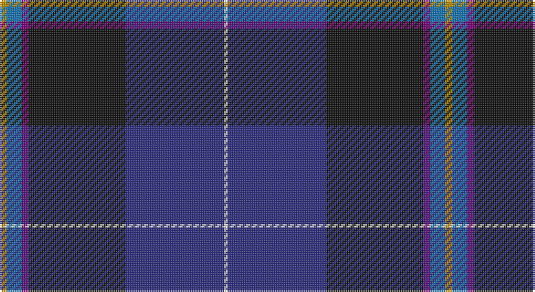

This page is one **sett** — a single exact thread-count. It belongs to the [tartan](/setts/lo4b8dp4k53db54w2/)
(the same proportion at any scale), whose colour order is pattern [WBKBBY](/stripes/wbkbby/).

Sourced from tartans-authority.  It is a [6 stripe tartan](/stripes/stripes6/).

Original link http://www.tartansauthority.com/tartan-ferret/display/8014/

## Register references

External register numbers recorded for this tartan.

- Scottish Register of Tartans: [8014](https://www.tartanregister.gov.uk/tartanDetails?ref=8014)
- Scottish Tartans Authority (ITI): 8014

## Thread count
DY/4 B8 P4 K53 DB54 LN/2

One full sett is **244 threads**.

## Palette

Palette: <strong>Tartan Register</strong>
<table><thead><tr><th>Colour</th><th>Threads</th><th>Shade</th><th>Base</th><th>OKLCh</th></tr></thead><tbody><tr><td>DY/</td><td style="text-align:right;font-variant-numeric:tabular-nums">4</td><td><code style="background-color:#BC8C00;">#BC8C00</code> <small style="color:#888">#BC8C00</small></td><td>Y <code style="background-color:#F2BF00;">#F2BF00</code></td><td><small style="color:#888">oklch(66.8% 0.137 84.1)</small></td></tr><tr><td>B</td><td style="text-align:right;font-variant-numeric:tabular-nums">8</td><td><code style="background-color:#1474B4;">#1474B4</code> <small style="color:#888">#1474B4</small></td><td>B <code style="background-color:#2A418A;">#2A418A</code></td><td><small style="color:#888">oklch(54.0% 0.129 245.1)</small></td></tr><tr><td>P</td><td style="text-align:right;font-variant-numeric:tabular-nums">4</td><td><code style="background-color:#780078;">#780078</code> <small style="color:#888">#780078</small></td><td>B <code style="background-color:#2A418A;">#2A418A</code></td><td><small style="color:#888">oklch(40.2% 0.185 328.4)</small></td></tr><tr><td>K</td><td style="text-align:right;font-variant-numeric:tabular-nums">53</td><td><code style="background-color:#101010;">#101010</code> <small style="color:#888">#101010</small></td><td>K <code style="background-color:#000000;">#000000</code></td><td><small style="color:#888">oklch(17.3% 0.000 89.9)</small></td></tr><tr><td>DB</td><td style="text-align:right;font-variant-numeric:tabular-nums">54</td><td><code style="background-color:#2C2C80;">#2C2C80</code> <small style="color:#888">#2C2C80</small></td><td>B <code style="background-color:#2A418A;">#2A418A</code></td><td><small style="color:#888">oklch(35.0% 0.138 276.6)</small></td></tr><tr><td>LN/</td><td style="text-align:right;font-variant-numeric:tabular-nums">2</td><td><code style="background-color:#E0E0E0;">#E0E0E0</code> <small style="color:#888">#E0E0E0</small></td><td>W <code style="background-color:#F7F7F7;">#F7F7F7</code></td><td><small style="color:#888">oklch(90.7% 0.000 89.9)</small></td></tr></tbody></table>

# Sample pattern

## Nearest tartans

The nearest existing variants by ΔTartan distance, with this tartan at the top so the swatches line up against it.

ΔTartan

Tartan

Sett

—

<a href="/ttd/edit/#slug=lo4b8dp4k53db54w2">Pipers' Trail (Corporate)</a> <a class="nn-out" href="/variants/s6/lo4b8dp4k53db54w2/" title="open its dictionary page">↗</a>

1.07

<a href="/ttd/edit/#slug=k8r4k36db48r6g3lo2~x2&amp;base=lo4b8dp4k53db54w2">Royal Marines Condor</a> <a class="nn-out" href="/variants/s7/k8r4k36db48r6g3lo2~x2/" title="open its dictionary page">↗</a>

1.20

<a href="/ttd/edit/#slug=r3w2g5k35db40ly3~x2&amp;base=lo4b8dp4k53db54w2">Italian National</a> <a class="nn-out" href="/variants/s6/r3w2g5k35db40ly3~x2/" title="open its dictionary page">↗</a>

1.21

<a href="/ttd/edit/#slug=k4lo2k34db10lr4db4dp4db23w3~x2&amp;base=lo4b8dp4k53db54w2">Heirloom Dark Alba (Fashion)</a> <a class="nn-out" href="/variants/s9/k4lo2k34db10lr4db4dp4db23w3~x2/" title="open its dictionary page">↗</a>

1.26

<a href="/ttd/edit/#slug=t2g13r2k6db23w1~x4&amp;base=lo4b8dp4k53db54w2">Gamblin Thompson (Personal)</a> <a class="nn-out" href="/variants/s6/t2g13r2k6db23w1~x4/" title="open its dictionary page">↗</a>

1.31

<a href="/ttd/edit/#slug=db18w2db2r3db21k28ly1k1g2~x2&amp;base=lo4b8dp4k53db54w2">St Andrew's College</a> <a class="nn-out" href="/variants/s9/db18w2db2r3db21k28ly1k1g2~x2/" title="open its dictionary page">↗</a>

1.35

<a href="/ttd/edit/#slug=w4dt54k53dp4b8lo4&amp;base=lo4b8dp4k53db54w2">Pipers' Trail, The</a> <a class="nn-out" href="/variants/s6/w4dt54k53dp4b8lo4/" title="open its dictionary page">↗</a>

1.35

<a href="/ttd/edit/#slug=dbi49g3k22r2b33db3b7~x2&amp;base=lo4b8dp4k53db54w2">U.S. 2001 Air Force (Military?)</a> <a class="nn-out" href="/variants/s7/dbi49g3k22r2b33db3b7~x2/" title="open its dictionary page">↗</a>

1.36

<a href="/ttd/edit/#slug=db3dg1r22k12db28lb3~x2&amp;base=lo4b8dp4k53db54w2">Diaspora</a> <a class="nn-out" href="/variants/s6/db3dg1r22k12db28lb3~x2/" title="open its dictionary page">↗</a>

1.37

<a href="/ttd/edit/#slug=dp72k40dg23r4dg23k2w4~x2&amp;base=lo4b8dp4k53db54w2">Ferguson Unidentified</a> <a class="nn-out" href="/variants/s7/dp72k40dg23r4dg23k2w4~x2/" title="open its dictionary page">↗</a>

1.37

<a href="/ttd/edit/#slug=t23w3k10r2dt45ly1~x2&amp;base=lo4b8dp4k53db54w2">Kirkcaldy Name Tartan</a> <a class="nn-out" href="/variants/s6/t23w3k10r2dt45ly1~x2/" title="open its dictionary page">↗</a>

## Neighbour map

Every grey dot is one of 14360 variants placed by the first two principal components of the ΔTartan feature space (44% of its variance). Red is this tartan; blue dots are its nearest — click one to open its page.

<svg viewBox="0 0 640 380" role="img" style="max-width:100%;height:auto;border:1px solid #e0e0e0;border-radius:4px;display:block" xmlns="http://www.w3.org/2000/svg"><image href="/nn/cloud.v1.png" width="640" height="380"/><a href="/variants/s7/k8r4k36db48r6g3lo2~x2/"><circle cx="320.6" cy="164.0" r="4" fill="#3465a4"><title>Royal Marines Condor</title></circle></a><a href="/variants/s6/r3w2g5k35db40ly3~x2/"><circle cx="260.3" cy="144.0" r="4" fill="#3465a4"><title>Italian National</title></circle></a><a href="/variants/s9/k4lo2k34db10lr4db4dp4db23w3~x2/"><circle cx="257.8" cy="146.5" r="4" fill="#3465a4"><title>Heirloom Dark Alba (Fashion)</title></circle></a><a href="/variants/s6/t2g13r2k6db23w1~x4/"><circle cx="268.1" cy="149.6" r="4" fill="#3465a4"><title>Gamblin Thompson (Personal)</title></circle></a><a href="/variants/s9/db18w2db2r3db21k28ly1k1g2~x2/"><circle cx="321.6" cy="121.3" r="4" fill="#3465a4"><title>St Andrew's College</title></circle></a><a href="/variants/s6/w4dt54k53dp4b8lo4/"><circle cx="245.6" cy="170.9" r="4" fill="#3465a4"><title>Pipers' Trail, The</title></circle></a><a href="/variants/s7/dbi49g3k22r2b33db3b7~x2/"><circle cx="262.6" cy="159.2" r="4" fill="#3465a4"><title>U.S. 2001 Air Force (Military?)</title></circle></a><a href="/variants/s6/db3dg1r22k12db28lb3~x2/"><circle cx="281.6" cy="166.3" r="4" fill="#3465a4"><title>Diaspora</title></circle></a><a href="/variants/s7/dp72k40dg23r4dg23k2w4~x2/"><circle cx="281.1" cy="144.9" r="4" fill="#3465a4"><title>Ferguson Unidentified</title></circle></a><a href="/variants/s6/t23w3k10r2dt45ly1~x2/"><circle cx="331.8" cy="121.2" r="4" fill="#3465a4"><title>Kirkcaldy Name Tartan</title></circle></a><circle cx="295.1" cy="149.9" r="5" fill="#c00000"/></svg>

ID: /variants/s6/lo4b8dp4k53db54w2/
