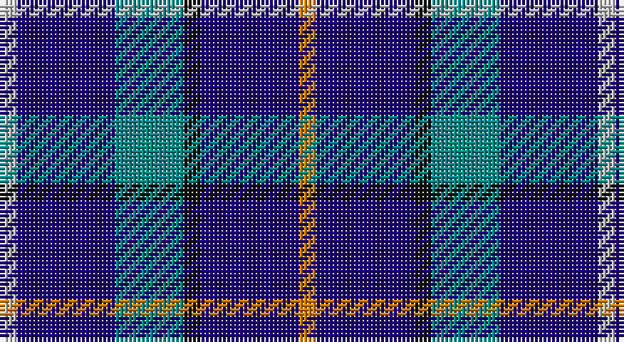

This page is one **sett** — a single exact thread-count. It belongs to the [tartan](/setts/lo4db23k4g16db23lb4/)
(the same proportion at any scale), whose colour order is pattern [WBGKBY](/stripes/wbgkby/).

Sourced from register-of-tartans.  It is a [6 stripe tartan](/stripes/stripes6/).

Original link https://www.tartanregister.gov.uk/tartanDetails.aspx?ref=207

2 attestations — the source records this cloth was collapsed from (oldest owns this page)

<ul>
<li>05/07/2001 — Baptist Union of Scotland (register-of-tartans, <a href="https://www.tartanregister.gov.uk/tartanDetails.aspx?ref=207">record</a>)</li>
<li>July 2001 — Baptist Union of Scotland (Corp) (tartans-authority, <a href="http://www.tartansauthority.com/tartan-ferret/display/4104/">record</a>)</li>
</ul>

## Register references

External register numbers recorded for this tartan.

- Scottish Register of Tartans: [207](https://www.tartanregister.gov.uk/tartanDetails.aspx?ref=207)
- Scottish Tartans Authority (ITI): 4104
- Scottish Tartans World Register: 2821

## Thread count
N/4 DB23 B16 K4 DB23 O/4

One full sett is **140 threads**.

## Palette

Palette: <strong>Tartan Register</strong>
<table><thead><tr><th>Colour</th><th>Threads</th><th>Shade</th><th>Base</th><th>OKLCh</th></tr></thead><tbody><tr><td>N/</td><td style="text-align:right;font-variant-numeric:tabular-nums">4</td><td><code style="background-color:#C0C0C0;">#C0C0C0</code> <small style="color:#888">#C0C0C0</small></td><td>W <code style="background-color:#F7F7F7;">#F7F7F7</code></td><td><small style="color:#888">oklch(80.8% 0.000 89.9)</small></td></tr><tr><td>DB</td><td style="text-align:right;font-variant-numeric:tabular-nums">23</td><td><code style="background-color:#1C0070;">#1C0070</code> <small style="color:#888">#1C0070</small></td><td>B <code style="background-color:#2A418A;">#2A418A</code></td><td><small style="color:#888">oklch(26.3% 0.162 277.1)</small></td></tr><tr><td>B</td><td style="text-align:right;font-variant-numeric:tabular-nums">16</td><td><code style="background-color:#048888;">#048888</code> <small style="color:#888">#048888</small></td><td>G <code style="background-color:#006100;">#006100</code></td><td><small style="color:#888">oklch(56.8% 0.096 194.8)</small></td></tr><tr><td>K</td><td style="text-align:right;font-variant-numeric:tabular-nums">4</td><td><code style="background-color:#101010;">#101010</code> <small style="color:#888">#101010</small></td><td>K <code style="background-color:#000000;">#000000</code></td><td><small style="color:#888">oklch(17.3% 0.000 89.9)</small></td></tr><tr><td>DB</td><td style="text-align:right;font-variant-numeric:tabular-nums">23</td><td><code style="background-color:#1C0070;">#1C0070</code> <small style="color:#888">#1C0070</small></td><td>B <code style="background-color:#2A418A;">#2A418A</code></td><td><small style="color:#888">oklch(26.3% 0.162 277.1)</small></td></tr><tr><td>O/</td><td style="text-align:right;font-variant-numeric:tabular-nums">4</td><td><code style="background-color:#D87C00;">#D87C00</code> <small style="color:#888">#D87C00</small></td><td>Y <code style="background-color:#F2BF00;">#F2BF00</code></td><td><small style="color:#888">oklch(67.3% 0.155 61.8)</small></td></tr></tbody></table>

# Sample pattern

## Nearest tartans

The nearest existing variants by ΔTartan distance, with this tartan at the top so the swatches line up against it.

ΔTartan

Tartan

Sett

—

<a href="/ttd/edit/#slug=lo4db23k4g16db23lb4">Baptist Union of Scotland</a> <a class="nn-out" href="/variants/s6/lo4db23k4g16db23lb4/" title="open its dictionary page">↗</a>

1.08

<a href="/ttd/edit/#slug=w1db6dy5k1db6ly1~x4&amp;base=lo4db23k4g16db23lb4">Ancient Atlantic</a> <a class="nn-out" href="/variants/s6/w1db6dy5k1db6ly1~x4/" title="open its dictionary page">↗</a>

1.13

<a href="/ttd/edit/#slug=o3k15r2k15n15p3~x2&amp;base=lo4db23k4g16db23lb4">H.M.S. DUNCAN</a> <a class="nn-out" href="/variants/s6/o3k15r2k15n15p3~x2/" title="open its dictionary page">↗</a>

1.13

<a href="/ttd/edit/#slug=db10m3b4m3db7b3g7db17ly2~x2&amp;base=lo4db23k4g16db23lb4">Ayrshire Tourist Board</a> <a class="nn-out" href="/variants/s9/db10m3b4m3db7b3g7db17ly2~x2/" title="open its dictionary page">↗</a>

1.39

<a href="/ttd/edit/#slug=k22b16r3b16k2b16g3b3lb5~x2&amp;base=lo4db23k4g16db23lb4">Jethart (District)</a> <a class="nn-out" href="/variants/s9/k22b16r3b16k2b16g3b3lb5~x2/" title="open its dictionary page">↗</a>

1.39

<a href="/ttd/edit/#slug=db36r4db6g18db15k18w4~x2&amp;base=lo4db23k4g16db23lb4">Grainger (Name)</a> <a class="nn-out" href="/variants/s7/db36r4db6g18db15k18w4~x2/" title="open its dictionary page">↗</a>

1.39

<a href="/ttd/edit/#slug=lo1db6k5db6lb1~x6&amp;base=lo4db23k4g16db23lb4">Bank of Scotland (1995)</a> <a class="nn-out" href="/variants/s5/lo1db6k5db6lb1~x6/" title="open its dictionary page">↗</a>

1.40

<a href="/ttd/edit/#slug=r6db35k36db36w6&amp;base=lo4db23k4g16db23lb4">Davidson of Tulloch Clan Tartan</a> <a class="nn-out" href="/variants/s5/r6db35k36db36w6/" title="open its dictionary page">↗</a>

1.44

<a href="/ttd/edit/#slug=r1db12k5lo3db5lb1~x4&amp;base=lo4db23k4g16db23lb4">Massachusetts (Unofficial)</a> <a class="nn-out" href="/variants/s6/r1db12k5lo3db5lb1~x4/" title="open its dictionary page">↗</a>

1.46

<a href="/ttd/edit/#slug=k22db16r3db16k3db16g3db3b5~x2&amp;base=lo4db23k4g16db23lb4">Jethart</a> <a class="nn-out" href="/variants/s9/k22db16r3db16k3db16g3db3b5~x2/" title="open its dictionary page">↗</a>

1.46

<a href="/ttd/edit/#slug=db30dp9dg6dp9r4db17w5~x2&amp;base=lo4db23k4g16db23lb4">Woodcock (2014)</a> <a class="nn-out" href="/variants/s7/db30dp9dg6dp9r4db17w5~x2/" title="open its dictionary page">↗</a>

## Neighbour map

Every grey dot is one of 14360 variants placed by the first two principal components of the ΔTartan feature space (44% of its variance). Red is this tartan; blue dots are its nearest — click one to open its page.

<svg viewBox="0 0 640 380" role="img" style="max-width:100%;height:auto;border:1px solid #e0e0e0;border-radius:4px;display:block" xmlns="http://www.w3.org/2000/svg"><image href="/nn/cloud.v1.png" width="640" height="380"/><a href="/variants/s6/w1db6dy5k1db6ly1~x4/"><circle cx="271.4" cy="230.4" r="4" fill="#3465a4"><title>Ancient Atlantic</title></circle></a><a href="/variants/s6/o3k15r2k15n15p3~x2/"><circle cx="251.7" cy="222.3" r="4" fill="#3465a4"><title>H.M.S. DUNCAN</title></circle></a><a href="/variants/s9/db10m3b4m3db7b3g7db17ly2~x2/"><circle cx="274.5" cy="204.7" r="4" fill="#3465a4"><title>Ayrshire Tourist Board</title></circle></a><a href="/variants/s9/k22b16r3b16k2b16g3b3lb5~x2/"><circle cx="283.8" cy="187.8" r="4" fill="#3465a4"><title>Jethart (District)</title></circle></a><a href="/variants/s7/db36r4db6g18db15k18w4~x2/"><circle cx="263.7" cy="214.6" r="4" fill="#3465a4"><title>Grainger (Name)</title></circle></a><a href="/variants/s5/lo1db6k5db6lb1~x6/"><circle cx="295.8" cy="264.2" r="4" fill="#3465a4"><title>Bank of Scotland (1995)</title></circle></a><a href="/variants/s5/r6db35k36db36w6/"><circle cx="305.4" cy="275.2" r="4" fill="#3465a4"><title>Davidson of Tulloch Clan Tartan</title></circle></a><a href="/variants/s6/r1db12k5lo3db5lb1~x4/"><circle cx="324.0" cy="199.6" r="4" fill="#3465a4"><title>Massachusetts (Unofficial)</title></circle></a><a href="/variants/s9/k22db16r3db16k3db16g3db3b5~x2/"><circle cx="297.0" cy="222.6" r="4" fill="#3465a4"><title>Jethart</title></circle></a><a href="/variants/s7/db30dp9dg6dp9r4db17w5~x2/"><circle cx="268.6" cy="209.1" r="4" fill="#3465a4"><title>Woodcock (2014)</title></circle></a><circle cx="274.4" cy="236.1" r="5" fill="#c00000"/></svg>

ID: /variants/s6/lo4db23k4g16db23lb4/
