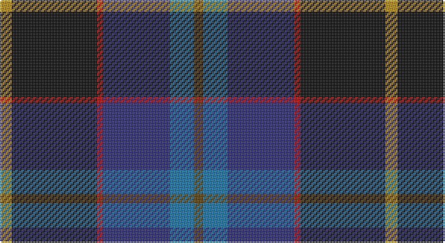

This page is one **sett** — a single exact thread-count. It belongs to the [tartan](/setts/lo4k28r2db22b8dy3/)
(the same proportion at any scale), whose colour order is pattern [GBBRKY](/stripes/gbbrky/).

Part of the [Loch Long One Design](/tartans/loch-long-one-design/) tartan — the named design grouping this sett with its other cloths.

Sourced from tartans-authority.  It is a [6 stripe tartan](/stripes/stripes6/).

Original link http://www.tartansauthority.com/tartan-ferret/display/10391/

## Register references

External register numbers recorded for this tartan.

- Scottish Register of Tartans: [10391](https://www.tartanregister.gov.uk/tartanDetails?ref=10391)
- Scottish Tartans Authority (ITI): 10391

## Thread count
DY/8 K56 R4 DB44 B16 T/6

One full sett is **254 threads**.

## Palette

Palette: <strong>Tartan Register</strong>
<table><thead><tr><th>Colour</th><th>Threads</th><th>Shade</th><th>Base</th><th>OKLCh</th></tr></thead><tbody><tr><td>DY/</td><td style="text-align:right;font-variant-numeric:tabular-nums">8</td><td><code style="background-color:#BC8C00;">#BC8C00</code> <small style="color:#888">#BC8C00</small></td><td>Y <code style="background-color:#F2BF00;">#F2BF00</code></td><td><small style="color:#888">oklch(66.8% 0.137 84.1)</small></td></tr><tr><td>K</td><td style="text-align:right;font-variant-numeric:tabular-nums">56</td><td><code style="background-color:#101010;">#101010</code> <small style="color:#888">#101010</small></td><td>K <code style="background-color:#000000;">#000000</code></td><td><small style="color:#888">oklch(17.3% 0.000 89.9)</small></td></tr><tr><td>R</td><td style="text-align:right;font-variant-numeric:tabular-nums">4</td><td><code style="background-color:#C80000;">#C80000</code> <small style="color:#888">#C80000</small></td><td>R <code style="background-color:#CC0000;">#CC0000</code></td><td><small style="color:#888">oklch(52.3% 0.215 29.2)</small></td></tr><tr><td>DB</td><td style="text-align:right;font-variant-numeric:tabular-nums">44</td><td><code style="background-color:#2C2C80;">#2C2C80</code> <small style="color:#888">#2C2C80</small></td><td>B <code style="background-color:#2A418A;">#2A418A</code></td><td><small style="color:#888">oklch(35.0% 0.138 276.6)</small></td></tr><tr><td>B</td><td style="text-align:right;font-variant-numeric:tabular-nums">16</td><td><code style="background-color:#1474B4;">#1474B4</code> <small style="color:#888">#1474B4</small></td><td>B <code style="background-color:#2A418A;">#2A418A</code></td><td><small style="color:#888">oklch(54.0% 0.129 245.1)</small></td></tr><tr><td>T/</td><td style="text-align:right;font-variant-numeric:tabular-nums">6</td><td><code style="background-color:#604000;">#604000</code> <small style="color:#888">#604000</small></td><td>G <code style="background-color:#006100;">#006100</code></td><td><small style="color:#888">oklch(39.8% 0.083 76.8)</small></td></tr></tbody></table>

# Sample pattern

## Compared to the master

This cloth is one sett of its design; the master sett (the exemplar the design is anchored on) is below for comparison.

<figure style="margin:0"><figcaption style="color:#888;font-size:smaller">this sett</figcaption></figure>
<figure style="margin:0"><figcaption style="color:#888;font-size:smaller"><a href="/setts/lo4k28r2do22t8do3/">master sett →</a></figcaption></figure>

## Nearest tartans

The nearest existing variants by ΔTartan distance, with this tartan at the top so the swatches line up against it.

ΔTartan

Tartan

Sett

—

<a href="/ttd/edit/#slug=lo4k28r2db22b8dy3~x2">Loch Long One Design (Corporate)</a> <a class="nn-out" href="/variants/s6/lo4k28r2db22b8dy3~x2/" title="open its dictionary page">↗</a>

0.67

<a href="/ttd/edit/#slug=r3dbi15db8g5k2w1~x2&amp;base=lo4k28r2db22b8dy3~x2">Nicolson of Harris (Clan?)</a> <a class="nn-out" href="/variants/s6/r3dbi15db8g5k2w1~x2/" title="open its dictionary page">↗</a>

0.90

<a href="/ttd/edit/#slug=w4dt54k53dp4b8lo4&amp;base=lo4k28r2db22b8dy3~x2">Pipers' Trail, The</a> <a class="nn-out" href="/variants/s6/w4dt54k53dp4b8lo4/" title="open its dictionary page">↗</a>

0.95

<a href="/ttd/edit/#slug=b11db5g4w3r3k16db28b2~x2&amp;base=lo4k28r2db22b8dy3~x2">Scottish Italian</a> <a class="nn-out" href="/variants/s8/b11db5g4w3r3k16db28b2~x2/" title="open its dictionary page">↗</a>

1.04

<a href="/ttd/edit/#slug=k2w1k12g5db11r1~x2&amp;base=lo4k28r2db22b8dy3~x2">New England (Fashion)</a> <a class="nn-out" href="/variants/s6/k2w1k12g5db11r1~x2/" title="open its dictionary page">↗</a>

1.04

<a href="/ttd/edit/#slug=k37r4db30n7k10w5n10y7~x2&amp;base=lo4k28r2db22b8dy3~x2">Yates</a> <a class="nn-out" href="/variants/s8/k37r4db30n7k10w5n10y7~x2/" title="open its dictionary page">↗</a>

1.06

<a href="/ttd/edit/#slug=w4db54k53dp4t8ly4&amp;base=lo4k28r2db22b8dy3~x2">Pipers' Trail, The</a> <a class="nn-out" href="/variants/s6/w4db54k53dp4t8ly4/" title="open its dictionary page">↗</a>

1.06

<a href="/ttd/edit/#slug=dg10w2dt10lo5db35r6~x2&amp;base=lo4k28r2db22b8dy3~x2">Hatfield &amp; Mize (Personal)</a> <a class="nn-out" href="/variants/s6/dg10w2dt10lo5db35r6~x2/" title="open its dictionary page">↗</a>

1.09

<a href="/ttd/edit/#slug=k29r3dt24n6k8w4n8o6~x2&amp;base=lo4k28r2db22b8dy3~x2">Yates (Personal)</a> <a class="nn-out" href="/variants/s8/k29r3dt24n6k8w4n8o6~x2/" title="open its dictionary page">↗</a>

1.13

<a href="/ttd/edit/#slug=dp4db2t8db25k8g13ly4~x2&amp;base=lo4k28r2db22b8dy3~x2">Renfrewshire</a> <a class="nn-out" href="/variants/s7/dp4db2t8db25k8g13ly4~x2/" title="open its dictionary page">↗</a>

1.15

<a href="/ttd/edit/#slug=r3dg20k2n11k2db20lr2~x2&amp;base=lo4k28r2db22b8dy3~x2">Grandfather Mountain Games (District</a> <a class="nn-out" href="/variants/s7/r3dg20k2n11k2db20lr2~x2/" title="open its dictionary page">↗</a>

## Neighbour map

Every grey dot is one of 14360 variants placed by the first two principal components of the ΔTartan feature space (44% of its variance). Red is this tartan; blue dots are its nearest — click one to open its page.

<svg viewBox="0 0 640 380" role="img" style="max-width:100%;height:auto;border:1px solid #e0e0e0;border-radius:4px;display:block" xmlns="http://www.w3.org/2000/svg"><image href="/nn/cloud.v1.png" width="640" height="380"/><a href="/variants/s6/r3dbi15db8g5k2w1~x2/"><circle cx="222.2" cy="185.6" r="4" fill="#3465a4"><title>Nicolson of Harris (Clan?)</title></circle></a><a href="/variants/s6/w4dt54k53dp4b8lo4/"><circle cx="245.6" cy="170.9" r="4" fill="#3465a4"><title>Pipers' Trail, The</title></circle></a><a href="/variants/s8/b11db5g4w3r3k16db28b2~x2/"><circle cx="208.2" cy="156.9" r="4" fill="#3465a4"><title>Scottish Italian</title></circle></a><a href="/variants/s6/k2w1k12g5db11r1~x2/"><circle cx="238.3" cy="204.6" r="4" fill="#3465a4"><title>New England (Fashion)</title></circle></a><a href="/variants/s8/k37r4db30n7k10w5n10y7~x2/"><circle cx="174.5" cy="179.7" r="4" fill="#3465a4"><title>Yates</title></circle></a><a href="/variants/s6/w4db54k53dp4t8ly4/"><circle cx="232.4" cy="159.6" r="4" fill="#3465a4"><title>Pipers' Trail, The</title></circle></a><a href="/variants/s6/dg10w2dt10lo5db35r6~x2/"><circle cx="254.0" cy="157.2" r="4" fill="#3465a4"><title>Hatfield &amp; Mize (Personal)</title></circle></a><a href="/variants/s8/k29r3dt24n6k8w4n8o6~x2/"><circle cx="174.5" cy="179.6" r="4" fill="#3465a4"><title>Yates (Personal)</title></circle></a><a href="/variants/s7/dp4db2t8db25k8g13ly4~x2/"><circle cx="168.0" cy="174.7" r="4" fill="#3465a4"><title>Renfrewshire</title></circle></a><a href="/variants/s7/r3dg20k2n11k2db20lr2~x2/"><circle cx="155.3" cy="184.5" r="4" fill="#3465a4"><title>Grandfather Mountain Games (District</title></circle></a><circle cx="216.3" cy="178.6" r="5" fill="#c00000"/></svg>

ID: /variants/s6/lo4k28r2db22b8dy3~x2/
