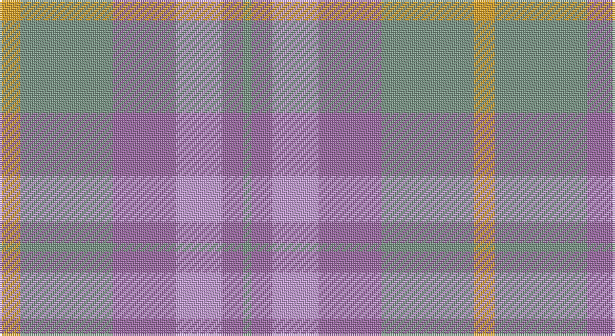

This page is one **sett** — a single exact thread-count. It belongs to the [tartan](/setts/lo5y22m15lp11m5y2/)
(the same proportion at any scale), whose colour order is pattern [GRWRGY](/stripes/grwrgy/).

Part of the [Scottish Ballet](/tartans/scottish-ballet/) tartan — the named design grouping this sett with its other cloths.

Sourced from register-of-tartans.  It is a [6 stripe tartan](/stripes/stripes6/).

Original link https://www.tartanregister.gov.uk/tartanDetails.aspx?ref=10896

## Register references

External register numbers recorded for this tartan.

- Scottish Register of Tartans: [10896](https://www.tartanregister.gov.uk/tartanDetails.aspx?ref=10896)

## Thread count
Y/10 LG44 LP30 LPa22 LP10 LG/4

One full sett is **226 threads**.

## Palette

Palette: <strong>Tartan Register</strong>
<table><thead><tr><th>Colour</th><th>Threads</th><th>Shade</th><th>Base</th><th>OKLCh</th></tr></thead><tbody><tr><td>Y/</td><td style="text-align:right;font-variant-numeric:tabular-nums">10</td><td><code style="background-color:#E0A126;">#E0A126</code> <small style="color:#888">#E0A126</small></td><td>Y <code style="background-color:#F2BF00;">#F2BF00</code></td><td><small style="color:#888">oklch(75.1% 0.146 78.3)</small></td></tr><tr><td>LG</td><td style="text-align:right;font-variant-numeric:tabular-nums">44</td><td><code style="background-color:#789484;">#789484</code> <small style="color:#888">#789484</small></td><td>G <code style="background-color:#006100;">#006100</code></td><td><small style="color:#888">oklch(64.0% 0.040 160.0)</small></td></tr><tr><td>LP</td><td style="text-align:right;font-variant-numeric:tabular-nums">30</td><td><code style="background-color:#9C68A4;">#9C68A4</code> <small style="color:#888">#9C68A4</small></td><td>R <code style="background-color:#CC0000;">#CC0000</code></td><td><small style="color:#888">oklch(59.4% 0.107 322.0)</small></td></tr><tr><td>LPa</td><td style="text-align:right;font-variant-numeric:tabular-nums">22</td><td><code style="background-color:#C49CD8;">#C49CD8</code> <small style="color:#888">#C49CD8</small></td><td>W <code style="background-color:#F7F7F7;">#F7F7F7</code></td><td><small style="color:#888">oklch(75.0% 0.095 314.2)</small></td></tr><tr><td>LP</td><td style="text-align:right;font-variant-numeric:tabular-nums">10</td><td><code style="background-color:#9C68A4;">#9C68A4</code> <small style="color:#888">#9C68A4</small></td><td>R <code style="background-color:#CC0000;">#CC0000</code></td><td><small style="color:#888">oklch(59.4% 0.107 322.0)</small></td></tr><tr><td>LG/</td><td style="text-align:right;font-variant-numeric:tabular-nums">4</td><td><code style="background-color:#789484;">#789484</code> <small style="color:#888">#789484</small></td><td>G <code style="background-color:#006100;">#006100</code></td><td><small style="color:#888">oklch(64.0% 0.040 160.0)</small></td></tr></tbody></table>

# Sample pattern

## Nearest tartans

The nearest existing variants by ΔTartan distance, with this tartan at the top so the swatches line up against it.

ΔTartan

Tartan

Sett

—

<a href="/ttd/edit/#slug=lo5y22m15lp11m5y2~x2">Scottish Ballet</a> <a class="nn-out" href="/variants/s6/lo5y22m15lp11m5y2~x2/" title="open its dictionary page">↗</a>

1.39

<a href="/ttd/edit/#slug=w3y36lp6b6lp6b12lp32w3&amp;base=lo5y22m15lp11m5y2~x2">Tenmaya</a> <a class="nn-out" href="/variants/s8/w3y36lp6b6lp6b12lp32w3/" title="open its dictionary page">↗</a>

1.56

<a href="/ttd/edit/#slug=lr2m24lo14lr25lo14lr25ly20lr2~x2&amp;base=lo5y22m15lp11m5y2~x2">Froach's Grian</a> <a class="nn-out" href="/variants/s8/lr2m24lo14lr25lo14lr25ly20lr2~x2/" title="open its dictionary page">↗</a>

1.77

<a href="/ttd/edit/#slug=lr24o9n23ly3~x2&amp;base=lo5y22m15lp11m5y2~x2">Porcelanosa</a> <a class="nn-out" href="/variants/s4/lr24o9n23ly3~x2/" title="open its dictionary page">↗</a>

1.87

<a href="/ttd/edit/#slug=o24n3o3n3o3n20lr22n4~x2&amp;base=lo5y22m15lp11m5y2~x2">Turnberry (MacArthur)</a> <a class="nn-out" href="/variants/s8/o24n3o3n3o3n20lr22n4~x2/" title="open its dictionary page">↗</a>

1.91

<a href="/variants/s10/o5n3o22r3n6ni17r2ni4r2ni4~x2/">Clyde</a>

2.00

<a href="/ttd/edit/#slug=o7n6lb1lo6n1lo6n6lb1o6~x8&amp;base=lo5y22m15lp11m5y2~x2">Outlander #2</a> <a class="nn-out" href="/variants/s9/o7n6lb1lo6n1lo6n6lb1o6~x8/" title="open its dictionary page">↗</a>

2.05

<a href="/ttd/edit/#slug=y7n6lt1lo6n1lo6n6lt1y6~x8&amp;base=lo5y22m15lp11m5y2~x2">Outlander #2</a> <a class="nn-out" href="/variants/s9/y7n6lt1lo6n1lo6n6lt1y6~x8/" title="open its dictionary page">↗</a>

2.05

<a href="/ttd/edit/#slug=dy4lg11dy14o30r4~x2&amp;base=lo5y22m15lp11m5y2~x2">Trinity Bicycles</a> <a class="nn-out" href="/variants/s5/dy4lg11dy14o30r4~x2/" title="open its dictionary page">↗</a>

2.08

<a href="/ttd/edit/#slug=g35y25m15t2t21~x2&amp;base=lo5y22m15lp11m5y2~x2">Dunans Rising</a> <a class="nn-out" href="/variants/s5/g35y25m15t2t21~x2/" title="open its dictionary page">↗</a>

2.17

<a href="/ttd/edit/#slug=r3o23y8g6y8t6y10t12y3~x2&amp;base=lo5y22m15lp11m5y2~x2">Lawrence's Seven Pillars of Khaki</a> <a class="nn-out" href="/variants/s9/r3o23y8g6y8t6y10t12y3~x2/" title="open its dictionary page">↗</a>

## Neighbour map

Every grey dot is one of 14360 variants placed by the first two principal components of the ΔTartan feature space (44% of its variance). Red is this tartan; blue dots are its nearest — click one to open its page.

<svg viewBox="0 0 640 380" role="img" style="max-width:100%;height:auto;border:1px solid #e0e0e0;border-radius:4px;display:block" xmlns="http://www.w3.org/2000/svg"><image href="/nn/cloud.v1.png" width="640" height="380"/><a href="/variants/s8/w3y36lp6b6lp6b12lp32w3/"><circle cx="341.0" cy="227.7" r="4" fill="#3465a4"><title>Tenmaya</title></circle></a><a href="/variants/s8/lr2m24lo14lr25lo14lr25ly20lr2~x2/"><circle cx="267.0" cy="245.3" r="4" fill="#3465a4"><title>Froach's Grian</title></circle></a><a href="/variants/s4/lr24o9n23ly3~x2/"><circle cx="281.2" cy="293.0" r="4" fill="#3465a4"><title>Porcelanosa</title></circle></a><a href="/variants/s8/o24n3o3n3o3n20lr22n4~x2/"><circle cx="346.6" cy="283.0" r="4" fill="#3465a4"><title>Turnberry (MacArthur)</title></circle></a><a href="/variants/s10/o5n3o22r3n6ni17r2ni4r2ni4~x2/"><circle cx="338.3" cy="236.9" r="4" fill="#3465a4"><title>Clyde</title></circle></a><a href="/variants/s9/o7n6lb1lo6n1lo6n6lb1o6~x8/"><circle cx="264.4" cy="299.2" r="4" fill="#3465a4"><title>Outlander #2</title></circle></a><a href="/variants/s9/y7n6lt1lo6n1lo6n6lt1y6~x8/"><circle cx="264.9" cy="300.4" r="4" fill="#3465a4"><title>Outlander #2</title></circle></a><a href="/variants/s5/dy4lg11dy14o30r4~x2/"><circle cx="317.1" cy="270.9" r="4" fill="#3465a4"><title>Trinity Bicycles</title></circle></a><a href="/variants/s5/g35y25m15t2t21~x2/"><circle cx="263.3" cy="272.3" r="4" fill="#3465a4"><title>Dunans Rising</title></circle></a><a href="/variants/s9/r3o23y8g6y8t6y10t12y3~x2/"><circle cx="256.8" cy="261.7" r="4" fill="#3465a4"><title>Lawrence's Seven Pillars of Khaki</title></circle></a><circle cx="309.4" cy="266.6" r="5" fill="#c00000"/></svg>

ID: /variants/s6/lo5y22m15lp11m5y2~x2/
