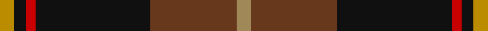
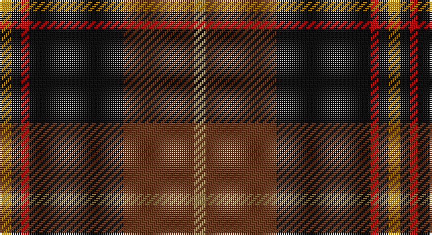

This page is one **sett** — a single exact thread-count. It belongs to the [tartan](/setts/lo6k5r4k48dy36loi6/)
(the same proportion at any scale), whose colour order is pattern [YGKRKY](/stripes/ygkrky/).

Part of the [Drambuie Hunting](/tartans/drambuie-hunting/) tartan — the named design grouping this sett with its other cloths.

Sourced from register-of-tartans.  It is a [6 stripe tartan](/stripes/stripes6/).

Original link https://www.tartanregister.gov.uk/tartanDetails.aspx?ref=974

## Also known as

This cloth is also recorded under:

- Drambuie Htg
- Drambuie hunting

2 attestations — the source records this cloth was collapsed from (oldest owns this page)

<ul>
<li>01/01/1998 — Drambuie Hunting (register-of-tartans, <a href="https://www.tartanregister.gov.uk/tartanDetails.aspx?ref=974">record</a>)</li>
<li>pre 1998 — Drambuie Htg (Corporate) (tartans-authority, <a href="http://www.tartansauthority.com/tartan-ferret/display/2475/">record</a>)</li>
</ul>

## Register references

External register numbers recorded for this tartan.

- Scottish Register of Tartans: [974](https://www.tartanregister.gov.uk/tartanDetails.aspx?ref=974)
- Scottish Tartans Authority (ITI): 2475
- Scottish Tartans World Register: 2475

## Thread count
DY/6 K5 R4 K48 T36 LT/6

One full sett is **198 threads**.

## Palette

Palette: <strong>Tartan Register</strong> <small style="color:#888">(4 of 5 colours)</small>
<table><thead><tr><th>Colour</th><th>Threads</th><th>Shade</th><th>Base</th><th>OKLCh</th></tr></thead><tbody><tr><td>DY/</td><td style="text-align:right;font-variant-numeric:tabular-nums">6</td><td><code style="background-color:#BC8C00;">#BC8C00</code> <small style="color:#888">#BC8C00</small></td><td>Y <code style="background-color:#F2BF00;">#F2BF00</code></td><td><small style="color:#888">oklch(66.8% 0.137 84.1)</small></td></tr><tr><td>K</td><td style="text-align:right;font-variant-numeric:tabular-nums">5</td><td><code style="background-color:#101010;">#101010</code> <small style="color:#888">#101010</small></td><td>K <code style="background-color:#000000;">#000000</code></td><td><small style="color:#888">oklch(17.3% 0.000 89.9)</small></td></tr><tr><td>R</td><td style="text-align:right;font-variant-numeric:tabular-nums">4</td><td><code style="background-color:#C80000;">#C80000</code> <small style="color:#888">#C80000</small></td><td>R <code style="background-color:#CC0000;">#CC0000</code></td><td><small style="color:#888">oklch(52.3% 0.215 29.2)</small></td></tr><tr><td>K</td><td style="text-align:right;font-variant-numeric:tabular-nums">48</td><td><code style="background-color:#101010;">#101010</code> <small style="color:#888">#101010</small></td><td>K <code style="background-color:#000000;">#000000</code></td><td><small style="color:#888">oklch(17.3% 0.000 89.9)</small></td></tr><tr><td>T</td><td style="text-align:right;font-variant-numeric:tabular-nums">36</td><td><code style="background-color:#68381C;">#68381C</code> <small style="color:#888">#68381C</small></td><td>G <code style="background-color:#006100;">#006100</code></td><td><small style="color:#888">oklch(39.5% 0.079 49.1)</small></td></tr><tr><td>LT/</td><td style="text-align:right;font-variant-numeric:tabular-nums">6</td><td><code style="background-color:#A08858;">#A08858</code> <small style="color:#888">#A08858</small></td><td>Y <code style="background-color:#F2BF00;">#F2BF00</code></td><td><small style="color:#888">oklch(63.7% 0.071 84.0)</small></td></tr></tbody></table>

# Sample pattern

## Nearest tartans

The nearest existing variants by ΔTartan distance, with this tartan at the top so the swatches line up against it.

ΔTartan

Tartan

Sett

—

<a href="/ttd/edit/#slug=lo6k5r4k48dy36loi6">Drambuie Hunting</a> <a class="nn-out" href="/variants/s6/lo6k5r4k48dy36loi6/" title="open its dictionary page">↗</a>

1.11

<a href="/ttd/edit/#slug=dt12w2dt13dg3g2r24g3~x2&amp;base=lo6k5r4k48dy36loi6">Wellmont Foundation (Corporate)</a> <a class="nn-out" href="/variants/s7/dt12w2dt13dg3g2r24g3~x2/" title="open its dictionary page">↗</a>

1.14

<a href="/ttd/edit/#slug=w6dy36k48r4k5ly6&amp;base=lo6k5r4k48dy36loi6">Drambuie Dress</a> <a class="nn-out" href="/variants/s6/w6dy36k48r4k5ly6/" title="open its dictionary page">↗</a>

1.15

<a href="/ttd/edit/#slug=dr2dg14lb3dr13ly1dr2~x4&amp;base=lo6k5r4k48dy36loi6">Swedish Para Whisky Club (Corporate</a> <a class="nn-out" href="/variants/s6/dr2dg14lb3dr13ly1dr2~x4/" title="open its dictionary page">↗</a>

1.23

<a href="/variants/s7/k3dy3yi6k12y1dyi2dy2~x4/">Joe Strummer Commemorative</a>

1.27

<a href="/ttd/edit/#slug=lb2dr12g6dr1n6dr1~x4&amp;base=lo6k5r4k48dy36loi6">Fraser Green</a> <a class="nn-out" href="/variants/s6/lb2dr12g6dr1n6dr1~x4/" title="open its dictionary page">↗</a>

1.28

<a href="/ttd/edit/#slug=k4dg5k2dg5r17db2~x2&amp;base=lo6k5r4k48dy36loi6">Denny Hunting</a> <a class="nn-out" href="/variants/s6/k4dg5k2dg5r17db2~x2/" title="open its dictionary page">↗</a>

1.30

<a href="/ttd/edit/#slug=k62db15dp15o20ly5db5k15~x2&amp;base=lo6k5r4k48dy36loi6">Black Raven</a> <a class="nn-out" href="/variants/s7/k62db15dp15o20ly5db5k15~x2/" title="open its dictionary page">↗</a>

1.30

<a href="/ttd/edit/#slug=m11dr5dg5k40ly3~x2&amp;base=lo6k5r4k48dy36loi6">MacShimsi Personal Tartan</a> <a class="nn-out" href="/variants/s5/m11dr5dg5k40ly3~x2/" title="open its dictionary page">↗</a>

1.33

<a href="/ttd/edit/#slug=dy30ly5b10k10w2k2~x2&amp;base=lo6k5r4k48dy36loi6">Bryan Wedding (Personal)</a> <a class="nn-out" href="/variants/s6/dy30ly5b10k10w2k2~x2/" title="open its dictionary page">↗</a>

1.36

<a href="/ttd/edit/#slug=lo4k28r2do22t8do3~x2&amp;base=lo6k5r4k48dy36loi6">Loch Long One Design</a> <a class="nn-out" href="/variants/s6/lo4k28r2do22t8do3~x2/" title="open its dictionary page">↗</a>

## Neighbour map

Every grey dot is one of 14360 variants placed by the first two principal components of the ΔTartan feature space (44% of its variance). Red is this tartan; blue dots are its nearest — click one to open its page.

<svg viewBox="0 0 640 380" role="img" style="max-width:100%;height:auto;border:1px solid #e0e0e0;border-radius:4px;display:block" xmlns="http://www.w3.org/2000/svg"><image href="/nn/cloud.v1.png" width="640" height="380"/><a href="/variants/s7/dt12w2dt13dg3g2r24g3~x2/"><circle cx="248.0" cy="180.5" r="4" fill="#3465a4"><title>Wellmont Foundation (Corporate)</title></circle></a><a href="/variants/s6/w6dy36k48r4k5ly6/"><circle cx="266.3" cy="174.6" r="4" fill="#3465a4"><title>Drambuie Dress</title></circle></a><a href="/variants/s6/dr2dg14lb3dr13ly1dr2~x4/"><circle cx="312.2" cy="199.8" r="4" fill="#3465a4"><title>Swedish Para Whisky Club (Corporate</title></circle></a><a href="/variants/s7/k3dy3yi6k12y1dyi2dy2~x4/"><circle cx="284.7" cy="206.9" r="4" fill="#3465a4"><title>Joe Strummer Commemorative</title></circle></a><a href="/variants/s6/lb2dr12g6dr1n6dr1~x4/"><circle cx="287.9" cy="212.9" r="4" fill="#3465a4"><title>Fraser Green</title></circle></a><a href="/variants/s6/k4dg5k2dg5r17db2~x2/"><circle cx="266.1" cy="216.9" r="4" fill="#3465a4"><title>Denny Hunting</title></circle></a><a href="/variants/s7/k62db15dp15o20ly5db5k15~x2/"><circle cx="289.6" cy="186.7" r="4" fill="#3465a4"><title>Black Raven</title></circle></a><a href="/variants/s5/m11dr5dg5k40ly3~x2/"><circle cx="365.8" cy="192.1" r="4" fill="#3465a4"><title>MacShimsi Personal Tartan</title></circle></a><a href="/variants/s6/dy30ly5b10k10w2k2~x2/"><circle cx="267.3" cy="172.5" r="4" fill="#3465a4"><title>Bryan Wedding (Personal)</title></circle></a><a href="/variants/s6/lo4k28r2do22t8do3~x2/"><circle cx="265.3" cy="202.2" r="4" fill="#3465a4"><title>Loch Long One Design</title></circle></a><circle cx="300.3" cy="190.7" r="5" fill="#c00000"/></svg>

ID: /variants/s6/lo6k5r4k48dy36loi6/
