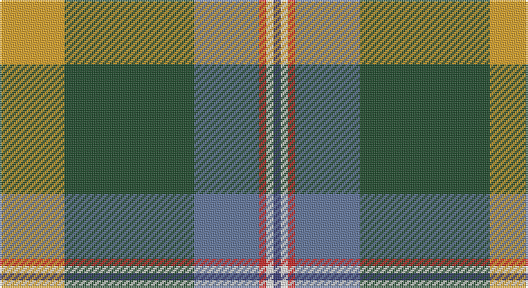

This page is one **sett** — a single exact thread-count. It belongs to the [tartan](/setts/lo9dg18t9r1w1db1/)
(the same proportion at any scale), whose colour order is pattern [BWRBGY](/stripes/bwrbgy/).

Sourced from register-of-tartans.  It is a [6 stripe tartan](/stripes/stripes6/).

Original link https://www.tartanregister.gov.uk/tartanDetails.aspx?ref=10286

## Also known as

This cloth is also recorded under:

- COG USA, THE

## Register references

External register numbers recorded for this tartan.

- Scottish Register of Tartans: [10286](https://www.tartanregister.gov.uk/tartanDetails.aspx?ref=10286)

## Thread count
Y/36 DG72 B36 R4 W4 DB/4

One full sett is **272 threads**.

## Palette

Palette: <strong>Tartan Register</strong> <small style="color:#888">(2 of 6 colours)</small>
<table><thead><tr><th>Colour</th><th>Threads</th><th>Shade</th><th>Base</th><th>OKLCh</th></tr></thead><tbody><tr><td>Y/</td><td style="text-align:right;font-variant-numeric:tabular-nums">36</td><td><code style="background-color:#E0A126;">#E0A126</code> <small style="color:#888">#E0A126</small></td><td>Y <code style="background-color:#F2BF00;">#F2BF00</code></td><td><small style="color:#888">oklch(75.1% 0.146 78.3)</small></td></tr><tr><td>DG</td><td style="text-align:right;font-variant-numeric:tabular-nums">72</td><td><code style="background-color:#1E492B;">#1E492B</code> <small style="color:#888">#1E492B</small></td><td>G <code style="background-color:#006100;">#006100</code></td><td><small style="color:#888">oklch(36.6% 0.071 151.3)</small></td></tr><tr><td>B</td><td style="text-align:right;font-variant-numeric:tabular-nums">36</td><td><code style="background-color:#5F749C;">#5F749C</code> <small style="color:#888">#5F749C</small></td><td>B <code style="background-color:#2A418A;">#2A418A</code></td><td><small style="color:#888">oklch(55.8% 0.067 262.9)</small></td></tr><tr><td>R</td><td style="text-align:right;font-variant-numeric:tabular-nums">4</td><td><code style="background-color:#CA2625;">#CA2625</code> <small style="color:#888">#CA2625</small></td><td>R <code style="background-color:#CC0000;">#CC0000</code></td><td><small style="color:#888">oklch(54.4% 0.199 27.2)</small></td></tr><tr><td>W</td><td style="text-align:right;font-variant-numeric:tabular-nums">4</td><td><code style="background-color:#F9F5EF;">#F9F5EF</code> <small style="color:#888">#F9F5EF</small></td><td>W <code style="background-color:#F7F7F7;">#F7F7F7</code></td><td><small style="color:#888">oklch(97.2% 0.009 78.3)</small></td></tr><tr><td>DB/</td><td style="text-align:right;font-variant-numeric:tabular-nums">4</td><td><code style="background-color:#373875;">#373875</code> <small style="color:#888">#373875</small></td><td>B <code style="background-color:#2A418A;">#2A418A</code></td><td><small style="color:#888">oklch(37.4% 0.102 279.5)</small></td></tr></tbody></table>

# Sample pattern

## Nearest tartans

The nearest existing variants by ΔTartan distance, with this tartan at the top so the swatches line up against it.

ΔTartan

Tartan

Sett

—

<a href="/ttd/edit/#slug=lo9dg18t9r1w1db1~x4">COG USA, THE</a> <a class="nn-out" href="/variants/s6/lo9dg18t9r1w1db1~x4/" title="open its dictionary page">↗</a>

1.02

<a href="/ttd/edit/#slug=g22r3w1g2r3t16k3ly2~x4&amp;base=lo9dg18t9r1w1db1~x4">Stirling University (Corporate)</a> <a class="nn-out" href="/variants/s8/g22r3w1g2r3t16k3ly2~x4/" title="open its dictionary page">↗</a>

1.03

<a href="/variants/s8/g22r3k1g2r3t16ki3ly2~x4/">Stirling, University of Corporate Univ Tartan</a>

1.16

<a href="/ttd/edit/#slug=lb5o49lb3dg24r5lo4dy30lb4~x2&amp;base=lo9dg18t9r1w1db1~x4">State Seal of New Mexico (Fashion)</a> <a class="nn-out" href="/variants/s8/lb5o49lb3dg24r5lo4dy30lb4~x2/" title="open its dictionary page">↗</a>

1.19

<a href="/ttd/edit/#slug=k2o30g4w2g14m13ly2~x2&amp;base=lo9dg18t9r1w1db1~x4">Red Rum</a> <a class="nn-out" href="/variants/s7/k2o30g4w2g14m13ly2~x2/" title="open its dictionary page">↗</a>

1.23

<a href="/ttd/edit/#slug=o49lo3b13dy8k23b10o14r4~x2&amp;base=lo9dg18t9r1w1db1~x4">State Seal of West Virginia (Fash)</a> <a class="nn-out" href="/variants/s8/o49lo3b13dy8k23b10o14r4~x2/" title="open its dictionary page">↗</a>

1.24

<a href="/ttd/edit/#slug=lo16k7w1g7k1ly3~x4&amp;base=lo9dg18t9r1w1db1~x4">Hamilton of Brandon (Fashion)</a> <a class="nn-out" href="/variants/s6/lo16k7w1g7k1ly3~x4/" title="open its dictionary page">↗</a>

1.25

<a href="/ttd/edit/#slug=w3k1t25r7g12k1ly3~x2&amp;base=lo9dg18t9r1w1db1~x4">Caskie</a> <a class="nn-out" href="/variants/s7/w3k1t25r7g12k1ly3~x2/" title="open its dictionary page">↗</a>

1.25

<a href="/ttd/edit/#slug=r6b2g20k3db8gi2b4~x2&amp;base=lo9dg18t9r1w1db1~x4">Royal British Legion, The</a> <a class="nn-out" href="/variants/s7/r6b2g20k3db8gi2b4~x2/" title="open its dictionary page">↗</a>

1.28

<a href="/ttd/edit/#slug=r3y13db13ly2dg34w3~x2&amp;base=lo9dg18t9r1w1db1~x4">Glencross, Tynron (Name)</a> <a class="nn-out" href="/variants/s6/r3y13db13ly2dg34w3~x2/" title="open its dictionary page">↗</a>

1.28

<a href="/ttd/edit/#slug=r8ly2o7ly2n24k2g1~x2&amp;base=lo9dg18t9r1w1db1~x4">(4) Traill</a> <a class="nn-out" href="/variants/s7/r8ly2o7ly2n24k2g1~x2/" title="open its dictionary page">↗</a>

## Neighbour map

Every grey dot is one of 14360 variants placed by the first two principal components of the ΔTartan feature space (44% of its variance). Red is this tartan; blue dots are its nearest — click one to open its page.

<svg viewBox="0 0 640 380" role="img" style="max-width:100%;height:auto;border:1px solid #e0e0e0;border-radius:4px;display:block" xmlns="http://www.w3.org/2000/svg"><image href="/nn/cloud.v1.png" width="640" height="380"/><a href="/variants/s8/g22r3w1g2r3t16k3ly2~x4/"><circle cx="249.9" cy="124.2" r="4" fill="#3465a4"><title>Stirling University (Corporate)</title></circle></a><a href="/variants/s8/g22r3k1g2r3t16ki3ly2~x4/"><circle cx="249.9" cy="125.0" r="4" fill="#3465a4"><title>Stirling, University of Corporate Univ Tartan</title></circle></a><a href="/variants/s8/lb5o49lb3dg24r5lo4dy30lb4~x2/"><circle cx="196.5" cy="136.2" r="4" fill="#3465a4"><title>State Seal of New Mexico (Fashion)</title></circle></a><a href="/variants/s7/k2o30g4w2g14m13ly2~x2/"><circle cx="243.9" cy="155.5" r="4" fill="#3465a4"><title>Red Rum</title></circle></a><a href="/variants/s8/o49lo3b13dy8k23b10o14r4~x2/"><circle cx="243.1" cy="148.2" r="4" fill="#3465a4"><title>State Seal of West Virginia (Fash)</title></circle></a><a href="/variants/s6/lo16k7w1g7k1ly3~x4/"><circle cx="215.3" cy="163.5" r="4" fill="#3465a4"><title>Hamilton of Brandon (Fashion)</title></circle></a><a href="/variants/s7/w3k1t25r7g12k1ly3~x2/"><circle cx="241.3" cy="119.5" r="4" fill="#3465a4"><title>Caskie</title></circle></a><a href="/variants/s7/r6b2g20k3db8gi2b4~x2/"><circle cx="168.2" cy="164.9" r="4" fill="#3465a4"><title>Royal British Legion, The</title></circle></a><a href="/variants/s6/r3y13db13ly2dg34w3~x2/"><circle cx="259.2" cy="165.3" r="4" fill="#3465a4"><title>Glencross, Tynron (Name)</title></circle></a><a href="/variants/s7/r8ly2o7ly2n24k2g1~x2/"><circle cx="275.7" cy="119.0" r="4" fill="#3465a4"><title>(4) Traill</title></circle></a><circle cx="230.9" cy="148.1" r="5" fill="#c00000"/></svg>

ID: /variants/s6/lo9dg18t9r1w1db1~x4/
