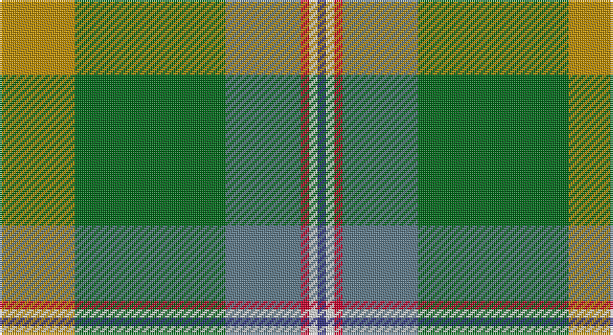

This page is one **sett** — a single exact thread-count. It belongs to the [tartan](/setts/lo9g18t9r1w1db1/)
(the same proportion at any scale), whose colour order is pattern [BWRBGY](/stripes/bwrbgy/).

Sourced from tartans-authority.  It is a [6 stripe tartan](/stripes/stripes6/).

Original link http://www.tartansauthority.com/tartan-ferret/display/10286/

## Register references

External register numbers recorded for this tartan.

- Scottish Register of Tartans: [10286](https://www.tartanregister.gov.uk/tartanDetails?ref=10286)
- Scottish Tartans Authority (ITI): 10286

## Thread count
DY/36 G72 B36 R4 LN4 DB/4

One full sett is **272 threads**.

## Palette

Palette: <strong>Tartan Register</strong> <small style="color:#888">(5 of 6 colours)</small>
<table><thead><tr><th>Colour</th><th>Threads</th><th>Shade</th><th>Base</th><th>OKLCh</th></tr></thead><tbody><tr><td>DY/</td><td style="text-align:right;font-variant-numeric:tabular-nums">36</td><td><code style="background-color:#BC8C00;">#BC8C00</code> <small style="color:#888">#BC8C00</small></td><td>Y <code style="background-color:#F2BF00;">#F2BF00</code></td><td><small style="color:#888">oklch(66.8% 0.137 84.1)</small></td></tr><tr><td>G</td><td style="text-align:right;font-variant-numeric:tabular-nums">72</td><td><code style="background-color:#006818;">#006818</code> <small style="color:#888">#006818</small></td><td>G <code style="background-color:#006100;">#006100</code></td><td><small style="color:#888">oklch(45.0% 0.142 145.0)</small></td></tr><tr><td>B</td><td style="text-align:right;font-variant-numeric:tabular-nums">36</td><td><code style="background-color:#5C7888;">#5C7888</code> <small style="color:#888">#5C7888</small></td><td>B <code style="background-color:#2A418A;">#2A418A</code></td><td><small style="color:#888">oklch(55.7% 0.041 233.5)</small></td></tr><tr><td>R</td><td style="text-align:right;font-variant-numeric:tabular-nums">4</td><td><code style="background-color:#C8002C;">#C8002C</code> <small style="color:#888">#C8002C</small></td><td>R <code style="background-color:#CC0000;">#CC0000</code></td><td><small style="color:#888">oklch(52.6% 0.212 22.0)</small></td></tr><tr><td>LN</td><td style="text-align:right;font-variant-numeric:tabular-nums">4</td><td><code style="background-color:#E0E0E0;">#E0E0E0</code> <small style="color:#888">#E0E0E0</small></td><td>W <code style="background-color:#F7F7F7;">#F7F7F7</code></td><td><small style="color:#888">oklch(90.7% 0.000 89.9)</small></td></tr><tr><td>DB/</td><td style="text-align:right;font-variant-numeric:tabular-nums">4</td><td><code style="background-color:#2C2C80;">#2C2C80</code> <small style="color:#888">#2C2C80</small></td><td>B <code style="background-color:#2A418A;">#2A418A</code></td><td><small style="color:#888">oklch(35.0% 0.138 276.6)</small></td></tr></tbody></table>

# Sample pattern

## Nearest tartans

The nearest existing variants by ΔTartan distance, with this tartan at the top so the swatches line up against it.

ΔTartan

Tartan

Sett

—

<a href="/ttd/edit/#slug=lo9g18t9r1w1db1~x4">T.H.E. C.O.G. USA (Corporate)</a> <a class="nn-out" href="/variants/s6/lo9g18t9r1w1db1~x4/" title="open its dictionary page">↗</a>

1.27

<a href="/ttd/edit/#slug=r3db6ly2db15dg12g39w3~x2&amp;base=lo9g18t9r1w1db1~x4">Wagland</a> <a class="nn-out" href="/variants/s7/r3db6ly2db15dg12g39w3~x2/" title="open its dictionary page">↗</a>

1.30

<a href="/ttd/edit/#slug=gi2lo1gi12lb6g12r1~x4&amp;base=lo9g18t9r1w1db1~x4">City of Vancouver (Commemorative)</a> <a class="nn-out" href="/variants/s6/gi2lo1gi12lb6g12r1~x4/" title="open its dictionary page">↗</a>

1.32

<a href="/ttd/edit/#slug=g42ly2gi16db7dr16r5~x2&amp;base=lo9g18t9r1w1db1~x4">Waterford</a> <a class="nn-out" href="/variants/s6/g42ly2gi16db7dr16r5~x2/" title="open its dictionary page">↗</a>

1.35

<a href="/ttd/edit/#slug=p4g4dy2w3g27dy30ly1r3~x2&amp;base=lo9g18t9r1w1db1~x4">Hannigan of Dirleton</a> <a class="nn-out" href="/variants/s8/p4g4dy2w3g27dy30ly1r3~x2/" title="open its dictionary page">↗</a>

1.40

<a href="/ttd/edit/#slug=r3db6ly2db15g12dg39w3~x2&amp;base=lo9g18t9r1w1db1~x4">Wagland (Name)</a> <a class="nn-out" href="/variants/s7/r3db6ly2db15g12dg39w3~x2/" title="open its dictionary page">↗</a>

1.40

<a href="/ttd/edit/#slug=r4g14k3m3g12n36w4~x2&amp;base=lo9g18t9r1w1db1~x4">Vipont (White line)</a> <a class="nn-out" href="/variants/s7/r4g14k3m3g12n36w4~x2/" title="open its dictionary page">↗</a>

1.42

<a href="/ttd/edit/#slug=k2o30g4w2g14m13ly2~x2&amp;base=lo9g18t9r1w1db1~x4">Red Rum</a> <a class="nn-out" href="/variants/s7/k2o30g4w2g14m13ly2~x2/" title="open its dictionary page">↗</a>

1.45

<a href="/ttd/edit/#slug=k3r12dy8lo2g36dy10t2~x2&amp;base=lo9g18t9r1w1db1~x4">Snelgrove Htg (Name)</a> <a class="nn-out" href="/variants/s7/k3r12dy8lo2g36dy10t2~x2/" title="open its dictionary page">↗</a>

1.48

<a href="/ttd/edit/#slug=g10r3g30y10w2db15r4~x2&amp;base=lo9g18t9r1w1db1~x4">Sinclair</a> <a class="nn-out" href="/variants/s7/g10r3g30y10w2db15r4~x2/" title="open its dictionary page">↗</a>

1.50

<a href="/ttd/edit/#slug=gi18w1gi4w1lo4g1lo2g12r2g4~x2&amp;base=lo9g18t9r1w1db1~x4">Michigan, State of (District)</a> <a class="nn-out" href="/variants/s10/gi18w1gi4w1lo4g1lo2g12r2g4~x2/" title="open its dictionary page">↗</a>

## Neighbour map

Every grey dot is one of 14360 variants placed by the first two principal components of the ΔTartan feature space (44% of its variance). Red is this tartan; blue dots are its nearest — click one to open its page.

<svg viewBox="0 0 640 380" role="img" style="max-width:100%;height:auto;border:1px solid #e0e0e0;border-radius:4px;display:block" xmlns="http://www.w3.org/2000/svg"><image href="/nn/cloud.v1.png" width="640" height="380"/><a href="/variants/s7/r3db6ly2db15dg12g39w3~x2/"><circle cx="281.3" cy="156.9" r="4" fill="#3465a4"><title>Wagland</title></circle></a><a href="/variants/s6/gi2lo1gi12lb6g12r1~x4/"><circle cx="246.1" cy="215.0" r="4" fill="#3465a4"><title>City of Vancouver (Commemorative)</title></circle></a><a href="/variants/s6/g42ly2gi16db7dr16r5~x2/"><circle cx="240.0" cy="160.8" r="4" fill="#3465a4"><title>Waterford</title></circle></a><a href="/variants/s8/p4g4dy2w3g27dy30ly1r3~x2/"><circle cx="305.6" cy="129.9" r="4" fill="#3465a4"><title>Hannigan of Dirleton</title></circle></a><a href="/variants/s7/r3db6ly2db15g12dg39w3~x2/"><circle cx="271.6" cy="154.6" r="4" fill="#3465a4"><title>Wagland (Name)</title></circle></a><a href="/variants/s7/r4g14k3m3g12n36w4~x2/"><circle cx="255.4" cy="177.2" r="4" fill="#3465a4"><title>Vipont (White line)</title></circle></a><a href="/variants/s7/k2o30g4w2g14m13ly2~x2/"><circle cx="243.9" cy="155.5" r="4" fill="#3465a4"><title>Red Rum</title></circle></a><a href="/variants/s7/k3r12dy8lo2g36dy10t2~x2/"><circle cx="286.9" cy="154.1" r="4" fill="#3465a4"><title>Snelgrove Htg (Name)</title></circle></a><a href="/variants/s7/g10r3g30y10w2db15r4~x2/"><circle cx="288.8" cy="190.0" r="4" fill="#3465a4"><title>Sinclair</title></circle></a><a href="/variants/s10/gi18w1gi4w1lo4g1lo2g12r2g4~x2/"><circle cx="280.4" cy="156.2" r="4" fill="#3465a4"><title>Michigan, State of (District)</title></circle></a><circle cx="268.5" cy="172.2" r="5" fill="#c00000"/></svg>

ID: /variants/s6/lo9g18t9r1w1db1~x4/
