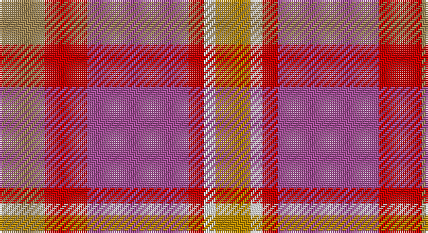

This page is one **sett** — a single exact thread-count. It belongs to the [tartan](/setts/loi23r22m52r8w6lo18/)
(the same proportion at any scale), whose colour order is pattern [YRRRWY](/stripes/yrrrwy/).

Sourced from tartans-authority.  It is a [6 stripe tartan](/stripes/stripes6/).

Original link http://www.tartansauthority.com/tartan-ferret/display/7142/

2 attestations — the source records this cloth was collapsed from (oldest owns this page)

<ul>
<li>pre 2005 — Lady Boys of Bangkok (Corporate) (tartans-authority, <a href="http://www.tartansauthority.com/tartan-ferret/display/7142/">record</a>)</li>
<li>undated — Lady Boys of Bangkok (register-of-tartans, <a href="https://www.tartanregister.gov.uk/tartanDetails.aspx?ref=5075">record</a>)</li>
</ul>

## Register references

External register numbers recorded for this tartan.

- Scottish Register of Tartans: [5075](https://www.tartanregister.gov.uk/tartanDetails.aspx?ref=5075)
- Scottish Tartans Authority (ITI): 7142
- Scottish Tartans World Register: 3069

## Thread count
LT/23 R22 P52 R8 LN6 DY/18

One full sett is **217 threads**.

## Palette

Palette: <strong>Tartan Register</strong> <small style="color:#888">(4 of 5 colours)</small>
<table><thead><tr><th>Colour</th><th>Threads</th><th>Shade</th><th>Base</th><th>OKLCh</th></tr></thead><tbody><tr><td>LT/</td><td style="text-align:right;font-variant-numeric:tabular-nums">23</td><td><code style="background-color:#A08858;">#A08858</code> <small style="color:#888">#A08858</small></td><td>Y <code style="background-color:#F2BF00;">#F2BF00</code></td><td><small style="color:#888">oklch(63.7% 0.071 84.0)</small></td></tr><tr><td>R</td><td style="text-align:right;font-variant-numeric:tabular-nums">22</td><td><code style="background-color:#C80000;">#C80000</code> <small style="color:#888">#C80000</small></td><td>R <code style="background-color:#CC0000;">#CC0000</code></td><td><small style="color:#888">oklch(52.3% 0.215 29.2)</small></td></tr><tr><td>P</td><td style="text-align:right;font-variant-numeric:tabular-nums">52</td><td><code style="background-color:#A45098;">#A45098</code> <small style="color:#888">#A45098</small></td><td>R <code style="background-color:#CC0000;">#CC0000</code></td><td><small style="color:#888">oklch(56.0% 0.143 333.0)</small></td></tr><tr><td>R</td><td style="text-align:right;font-variant-numeric:tabular-nums">8</td><td><code style="background-color:#C80000;">#C80000</code> <small style="color:#888">#C80000</small></td><td>R <code style="background-color:#CC0000;">#CC0000</code></td><td><small style="color:#888">oklch(52.3% 0.215 29.2)</small></td></tr><tr><td>LN</td><td style="text-align:right;font-variant-numeric:tabular-nums">6</td><td><code style="background-color:#E0E0E0;">#E0E0E0</code> <small style="color:#888">#E0E0E0</small></td><td>W <code style="background-color:#F7F7F7;">#F7F7F7</code></td><td><small style="color:#888">oklch(90.7% 0.000 89.9)</small></td></tr><tr><td>DY/</td><td style="text-align:right;font-variant-numeric:tabular-nums">18</td><td><code style="background-color:#BC8C00;">#BC8C00</code> <small style="color:#888">#BC8C00</small></td><td>Y <code style="background-color:#F2BF00;">#F2BF00</code></td><td><small style="color:#888">oklch(66.8% 0.137 84.1)</small></td></tr></tbody></table>

# Sample pattern

## Nearest tartans

The nearest existing variants by ΔTartan distance, with this tartan at the top so the swatches line up against it.

ΔTartan

Tartan

Sett

—

<a href="/ttd/edit/#slug=loi23r22m52r8w6lo18">Lady Boys of Bangkok (Corporate)</a> <a class="nn-out" href="/variants/s6/loi23r22m52r8w6lo18/" title="open its dictionary page">↗</a>

1.56

<a href="/ttd/edit/#slug=w6lri27dr6o40lr44w8o4&amp;base=loi23r22m52r8w6lo18">Susan G Komen 06</a> <a class="nn-out" href="/variants/s7/w6lri27dr6o40lr44w8o4/" title="open its dictionary page">↗</a>

1.57

<a href="/ttd/edit/#slug=n7r1dt6r8lr1~x8&amp;base=loi23r22m52r8w6lo18">Callum (Buchan) (Name)</a> <a class="nn-out" href="/variants/s5/n7r1dt6r8lr1~x8/" title="open its dictionary page">↗</a>

1.63

<a href="/ttd/edit/#slug=dp2t9dp3r7ri19ly2~x2&amp;base=loi23r22m52r8w6lo18">Stevens #3</a> <a class="nn-out" href="/variants/s6/dp2t9dp3r7ri19ly2~x2/" title="open its dictionary page">↗</a>

1.65

<a href="/ttd/edit/#slug=k1r9n8y8w1~x2&amp;base=loi23r22m52r8w6lo18">Pople (Name)</a> <a class="nn-out" href="/variants/s5/k1r9n8y8w1~x2/" title="open its dictionary page">↗</a>

1.73

<a href="/ttd/edit/#slug=loi36do15loi9r31lo5do4r16~x2&amp;base=loi23r22m52r8w6lo18">Manhattan Ethnic</a> <a class="nn-out" href="/variants/s7/loi36do15loi9r31lo5do4r16~x2/" title="open its dictionary page">↗</a>

1.76

<a href="/ttd/edit/#slug=lr2oi1r10o12oi10lr6r10oi1lr2~x2&amp;base=loi23r22m52r8w6lo18">Unidentified, Sett</a> <a class="nn-out" href="/variants/s9/lr2oi1r10o12oi10lr6r10oi1lr2~x2/" title="open its dictionary page">↗</a>

1.78

<a href="/ttd/edit/#slug=db15n20do12r34lb3~x2&amp;base=loi23r22m52r8w6lo18">McCurdy-Stribbling (Personal)</a> <a class="nn-out" href="/variants/s5/db15n20do12r34lb3~x2/" title="open its dictionary page">↗</a>

1.84

<a href="/ttd/edit/#slug=oi24lo8dr2lo8dr2lo8o15g2~x2&amp;base=loi23r22m52r8w6lo18">Unidentified from Winnipeg</a> <a class="nn-out" href="/variants/s8/oi24lo8dr2lo8dr2lo8o15g2~x2/" title="open its dictionary page">↗</a>

1.91

<a href="/ttd/edit/#slug=r5o3r19dr6o5dr6n12n5n12n3~x2&amp;base=loi23r22m52r8w6lo18">Roscommon</a> <a class="nn-out" href="/variants/s10/r5o3r19dr6o5dr6n12n5n12n3~x2/" title="open its dictionary page">↗</a>

1.95

<a href="/ttd/edit/#slug=lr2dy1r10o12dy10lr6r10dy1lr2~x2&amp;base=loi23r22m52r8w6lo18">Unidentified Sett</a> <a class="nn-out" href="/variants/s9/lr2dy1r10o12dy10lr6r10dy1lr2~x2/" title="open its dictionary page">↗</a>

## Neighbour map

Every grey dot is one of 14360 variants placed by the first two principal components of the ΔTartan feature space (44% of its variance). Red is this tartan; blue dots are its nearest — click one to open its page.

<svg viewBox="0 0 640 380" role="img" style="max-width:100%;height:auto;border:1px solid #e0e0e0;border-radius:4px;display:block" xmlns="http://www.w3.org/2000/svg"><image href="/nn/cloud.v1.png" width="640" height="380"/><a href="/variants/s7/w6lri27dr6o40lr44w8o4/"><circle cx="218.6" cy="196.1" r="4" fill="#3465a4"><title>Susan G Komen 06</title></circle></a><a href="/variants/s5/n7r1dt6r8lr1~x8/"><circle cx="258.2" cy="263.9" r="4" fill="#3465a4"><title>Callum (Buchan) (Name)</title></circle></a><a href="/variants/s6/dp2t9dp3r7ri19ly2~x2/"><circle cx="244.9" cy="195.0" r="4" fill="#3465a4"><title>Stevens #3</title></circle></a><a href="/variants/s5/k1r9n8y8w1~x2/"><circle cx="200.7" cy="237.5" r="4" fill="#3465a4"><title>Pople (Name)</title></circle></a><a href="/variants/s7/loi36do15loi9r31lo5do4r16~x2/"><circle cx="244.3" cy="220.8" r="4" fill="#3465a4"><title>Manhattan Ethnic</title></circle></a><a href="/variants/s9/lr2oi1r10o12oi10lr6r10oi1lr2~x2/"><circle cx="260.4" cy="220.5" r="4" fill="#3465a4"><title>Unidentified, Sett</title></circle></a><a href="/variants/s5/db15n20do12r34lb3~x2/"><circle cx="206.0" cy="223.2" r="4" fill="#3465a4"><title>McCurdy-Stribbling (Personal)</title></circle></a><a href="/variants/s8/oi24lo8dr2lo8dr2lo8o15g2~x2/"><circle cx="229.9" cy="188.1" r="4" fill="#3465a4"><title>Unidentified from Winnipeg</title></circle></a><a href="/variants/s10/r5o3r19dr6o5dr6n12n5n12n3~x2/"><circle cx="231.8" cy="236.8" r="4" fill="#3465a4"><title>Roscommon</title></circle></a><a href="/variants/s9/lr2dy1r10o12dy10lr6r10dy1lr2~x2/"><circle cx="214.2" cy="191.8" r="4" fill="#3465a4"><title>Unidentified Sett</title></circle></a><circle cx="228.1" cy="220.1" r="5" fill="#c00000"/></svg>

ID: /variants/s6/loi23r22m52r8w6lo18/
