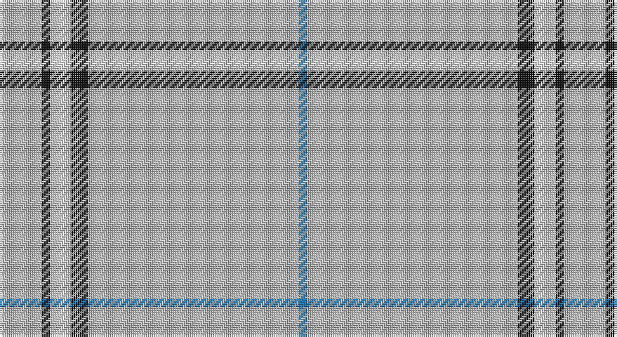

This page is one **sett** — a single exact thread-count. It belongs to the [tartan](/setts/lr10k2w5k4lr50b2/)
(the same proportion at any scale), whose colour order is pattern [BYKWKY](/stripes/bykwky/).

Sourced from tartans-authority.  It is a [6 stripe tartan](/stripes/stripes6/).

Original link http://www.tartansauthority.com/tartan-ferret/display/7270/

## Register references

External register numbers recorded for this tartan.

- Scottish Tartans Authority (ITI): 7270

## Thread count
N/20 K4 LN10 K8 N100 B/4

One full sett is **268 threads**.

## Palette

Palette: <strong>Tartan Register</strong> <small style="color:#888">(3 of 4 colours)</small>
<table><thead><tr><th>Colour</th><th>Threads</th><th>Shade</th><th>Base</th><th>OKLCh</th></tr></thead><tbody><tr><td>N/</td><td style="text-align:right;font-variant-numeric:tabular-nums">20</td><td><code style="background-color:#B8B8B8;">#B8B8B8</code> <small style="color:#888">#B8B8B8</small></td><td>Y <code style="background-color:#F2BF00;">#F2BF00</code></td><td><small style="color:#888">oklch(78.3% 0.000 89.9)</small></td></tr><tr><td>K</td><td style="text-align:right;font-variant-numeric:tabular-nums">4</td><td><code style="background-color:#101010;">#101010</code> <small style="color:#888">#101010</small></td><td>K <code style="background-color:#000000;">#000000</code></td><td><small style="color:#888">oklch(17.3% 0.000 89.9)</small></td></tr><tr><td>LN</td><td style="text-align:right;font-variant-numeric:tabular-nums">10</td><td><code style="background-color:#E0E0E0;">#E0E0E0</code> <small style="color:#888">#E0E0E0</small></td><td>W <code style="background-color:#F7F7F7;">#F7F7F7</code></td><td><small style="color:#888">oklch(90.7% 0.000 89.9)</small></td></tr><tr><td>K</td><td style="text-align:right;font-variant-numeric:tabular-nums">8</td><td><code style="background-color:#101010;">#101010</code> <small style="color:#888">#101010</small></td><td>K <code style="background-color:#000000;">#000000</code></td><td><small style="color:#888">oklch(17.3% 0.000 89.9)</small></td></tr><tr><td>N</td><td style="text-align:right;font-variant-numeric:tabular-nums">100</td><td><code style="background-color:#B8B8B8;">#B8B8B8</code> <small style="color:#888">#B8B8B8</small></td><td>Y <code style="background-color:#F2BF00;">#F2BF00</code></td><td><small style="color:#888">oklch(78.3% 0.000 89.9)</small></td></tr><tr><td>B/</td><td style="text-align:right;font-variant-numeric:tabular-nums">4</td><td><code style="background-color:#1474B4;">#1474B4</code> <small style="color:#888">#1474B4</small></td><td>B <code style="background-color:#2A418A;">#2A418A</code></td><td><small style="color:#888">oklch(54.0% 0.129 245.1)</small></td></tr></tbody></table>

# Sample pattern

## Nearest tartans

The nearest existing variants by ΔTartan distance, with this tartan at the top so the swatches line up against it.

ΔTartan

Tartan

Sett

—

<a href="/ttd/edit/#slug=lr10k2w5k4lr50b2~x2">London Fog Safari (Fashion)</a> <a class="nn-out" href="/variants/s6/lr10k2w5k4lr50b2~x2/" title="open its dictionary page">↗</a>

1.54

<a href="/ttd/edit/#slug=w24w1y9w1w9w2y2k2~x2&amp;base=lr10k2w5k4lr50b2~x2">Gairloch (Fashion)</a> <a class="nn-out" href="/variants/s8/w24w1y9w1w9w2y2k2~x2/" title="open its dictionary page">↗</a>

1.73

<a href="/ttd/edit/#slug=db3o1w1o25w1o1dp3~x4&amp;base=lr10k2w5k4lr50b2~x2">St. Giles Check (Corporate)</a> <a class="nn-out" href="/variants/s7/db3o1w1o25w1o1dp3~x4/" title="open its dictionary page">↗</a>

1.82

<a href="/ttd/edit/#slug=lb7w2m7w4lb50w2k2r2~x2&amp;base=lr10k2w5k4lr50b2~x2">MacDonald from Rawtenstall (Personal)</a> <a class="nn-out" href="/variants/s8/lb7w2m7w4lb50w2k2r2~x2/" title="open its dictionary page">↗</a>

1.94

<a href="/ttd/edit/#slug=w162k10dp10lo9y6dp3&amp;base=lr10k2w5k4lr50b2~x2">Young, Christina</a> <a class="nn-out" href="/variants/s6/w162k10dp10lo9y6dp3/" title="open its dictionary page">↗</a>

1.98

<a href="/ttd/edit/#slug=db3o1w1o25w1o1dp3~x2&amp;base=lr10k2w5k4lr50b2~x2">St Giles Check Tartan</a> <a class="nn-out" href="/variants/s7/db3o1w1o25w1o1dp3~x2/" title="open its dictionary page">↗</a>

1.99

<a href="/ttd/edit/#slug=w2lo44db8lo2db2lo3r1~x2&amp;base=lr10k2w5k4lr50b2~x2">Reece (Name)</a> <a class="nn-out" href="/variants/s7/w2lo44db8lo2db2lo3r1~x2/" title="open its dictionary page">↗</a>

2.02

<a href="/ttd/edit/#slug=w81dg6lo8dg8~x2&amp;base=lr10k2w5k4lr50b2~x2">Young in Australia</a> <a class="nn-out" href="/variants/s4/w81dg6lo8dg8~x2/" title="open its dictionary page">↗</a>

2.15

<a href="/ttd/edit/#slug=w168r2w2lo2w2loi3g26~x2&amp;base=lr10k2w5k4lr50b2~x2">Whisky Kilt (Fashion)</a> <a class="nn-out" href="/variants/s7/w168r2w2lo2w2loi3g26~x2/" title="open its dictionary page">↗</a>

2.16

<a href="/ttd/edit/#slug=b70db5b3w5b3w5b3r5b8~x2&amp;base=lr10k2w5k4lr50b2~x2">Wyckoff, Ann Grainger Phillips</a> <a class="nn-out" href="/variants/s9/b70db5b3w5b3w5b3r5b8~x2/" title="open its dictionary page">↗</a>

2.20

<a href="/ttd/edit/#slug=w45b2w4b15w7~x2&amp;base=lr10k2w5k4lr50b2~x2">Asahi (Estimated threadcount)</a> <a class="nn-out" href="/variants/s5/w45b2w4b15w7~x2/" title="open its dictionary page">↗</a>

## Neighbour map

Every grey dot is one of 14360 variants placed by the first two principal components of the ΔTartan feature space (44% of its variance). Red is this tartan; blue dots are its nearest — click one to open its page.

<svg viewBox="0 0 640 380" role="img" style="max-width:100%;height:auto;border:1px solid #e0e0e0;border-radius:4px;display:block" xmlns="http://www.w3.org/2000/svg"><image href="/nn/cloud.v1.png" width="640" height="380"/><a href="/variants/s8/w24w1y9w1w9w2y2k2~x2/"><circle cx="461.8" cy="131.0" r="4" fill="#3465a4"><title>Gairloch (Fashion)</title></circle></a><a href="/variants/s7/db3o1w1o25w1o1dp3~x4/"><circle cx="543.9" cy="137.5" r="4" fill="#3465a4"><title>St. Giles Check (Corporate)</title></circle></a><a href="/variants/s8/lb7w2m7w4lb50w2k2r2~x2/"><circle cx="469.5" cy="98.9" r="4" fill="#3465a4"><title>MacDonald from Rawtenstall (Personal)</title></circle></a><a href="/variants/s6/w162k10dp10lo9y6dp3/"><circle cx="529.6" cy="63.1" r="4" fill="#3465a4"><title>Young, Christina</title></circle></a><a href="/variants/s7/db3o1w1o25w1o1dp3~x2/"><circle cx="556.2" cy="144.0" r="4" fill="#3465a4"><title>St Giles Check Tartan</title></circle></a><a href="/variants/s7/w2lo44db8lo2db2lo3r1~x2/"><circle cx="588.1" cy="118.3" r="4" fill="#3465a4"><title>Reece (Name)</title></circle></a><a href="/variants/s4/w81dg6lo8dg8~x2/"><circle cx="495.6" cy="184.1" r="4" fill="#3465a4"><title>Young in Australia</title></circle></a><a href="/variants/s7/w168r2w2lo2w2loi3g26~x2/"><circle cx="596.3" cy="64.3" r="4" fill="#3465a4"><title>Whisky Kilt (Fashion)</title></circle></a><a href="/variants/s9/b70db5b3w5b3w5b3r5b8~x2/"><circle cx="558.6" cy="126.5" r="4" fill="#3465a4"><title>Wyckoff, Ann Grainger Phillips</title></circle></a><a href="/variants/s5/w45b2w4b15w7~x2/"><circle cx="532.9" cy="196.5" r="4" fill="#3465a4"><title>Asahi (Estimated threadcount)</title></circle></a><circle cx="550.4" cy="138.7" r="5" fill="#c00000"/></svg>

ID: /variants/s6/lr10k2w5k4lr50b2~x2/
