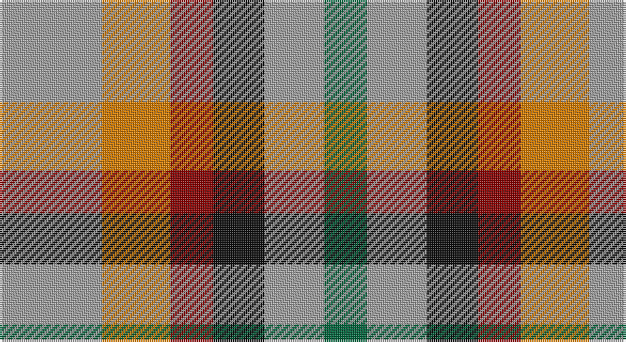

This page is one **sett** — a single exact thread-count. It belongs to the [tartan](/setts/lr12lo8r5k6lr7g5/)
(the same proportion at any scale), whose colour order is pattern [GYKRYY](/stripes/gykryy/).

Sourced from register-of-tartans.  It is a [6 stripe tartan](/stripes/stripes6/).

Original link https://www.tartanregister.gov.uk/tartanDetails.aspx?ref=11501

## Register references

External register numbers recorded for this tartan.

- Scottish Register of Tartans: [11501](https://www.tartanregister.gov.uk/tartanDetails.aspx?ref=11501)

## Thread count
N/48 O32 DR20 K24 N28 G/20

One full sett is **276 threads**.

## Palette

Palette: <strong>Tartan Register</strong>
<table><thead><tr><th>Colour</th><th>Threads</th><th>Shade</th><th>Base</th><th>OKLCh</th></tr></thead><tbody><tr><td>N/</td><td style="text-align:right;font-variant-numeric:tabular-nums">48</td><td><code style="background-color:#A0A0A0;">#A0A0A0</code> <small style="color:#888">#A0A0A0</small></td><td>Y <code style="background-color:#F2BF00;">#F2BF00</code></td><td><small style="color:#888">oklch(70.6% 0.000 89.9)</small></td></tr><tr><td>O</td><td style="text-align:right;font-variant-numeric:tabular-nums">32</td><td><code style="background-color:#D87C00;">#D87C00</code> <small style="color:#888">#D87C00</small></td><td>Y <code style="background-color:#F2BF00;">#F2BF00</code></td><td><small style="color:#888">oklch(67.3% 0.155 61.8)</small></td></tr><tr><td>DR</td><td style="text-align:right;font-variant-numeric:tabular-nums">20</td><td><code style="background-color:#880000;">#880000</code> <small style="color:#888">#880000</small></td><td>R <code style="background-color:#CC0000;">#CC0000</code></td><td><small style="color:#888">oklch(39.4% 0.162 29.2)</small></td></tr><tr><td>K</td><td style="text-align:right;font-variant-numeric:tabular-nums">24</td><td><code style="background-color:#101010;">#101010</code> <small style="color:#888">#101010</small></td><td>K <code style="background-color:#000000;">#000000</code></td><td><small style="color:#888">oklch(17.3% 0.000 89.9)</small></td></tr><tr><td>N</td><td style="text-align:right;font-variant-numeric:tabular-nums">28</td><td><code style="background-color:#A0A0A0;">#A0A0A0</code> <small style="color:#888">#A0A0A0</small></td><td>Y <code style="background-color:#F2BF00;">#F2BF00</code></td><td><small style="color:#888">oklch(70.6% 0.000 89.9)</small></td></tr><tr><td>G/</td><td style="text-align:right;font-variant-numeric:tabular-nums">20</td><td><code style="background-color:#00643C;">#00643C</code> <small style="color:#888">#00643C</small></td><td>G <code style="background-color:#006100;">#006100</code></td><td><small style="color:#888">oklch(44.3% 0.104 157.7)</small></td></tr></tbody></table>

# Sample pattern

## Nearest tartans

The nearest existing variants by ΔTartan distance, with this tartan at the top so the swatches line up against it.

ΔTartan

Tartan

Sett

—

<a href="/ttd/edit/#slug=lr12lo8r5k6lr7g5~x4">Mitchell, Martin (Personal)</a> <a class="nn-out" href="/variants/s6/lr12lo8r5k6lr7g5~x4/" title="open its dictionary page">↗</a>

1.36

<a href="/ttd/edit/#slug=db2m3g3o6ly2~x2&amp;base=lr12lo8r5k6lr7g5~x4">Dunoon Burgh Hall Trust</a> <a class="nn-out" href="/variants/s5/db2m3g3o6ly2~x2/" title="open its dictionary page">↗</a>

1.62

<a href="/ttd/edit/#slug=r5db12lyi11n21ly5~x2&amp;base=lr12lo8r5k6lr7g5~x4">Inspiration</a> <a class="nn-out" href="/variants/s5/r5db12lyi11n21ly5~x2/" title="open its dictionary page">↗</a>

1.72

<a href="/ttd/edit/#slug=db18t18lo28dt13~x2&amp;base=lr12lo8r5k6lr7g5~x4">Gold Country (California)</a> <a class="nn-out" href="/variants/s4/db18t18lo28dt13~x2/" title="open its dictionary page">↗</a>

1.76

<a href="/ttd/edit/#slug=n2r1k1lr1~x10&amp;base=lr12lo8r5k6lr7g5~x4">Kucher, Gregory (Personal)</a> <a class="nn-out" href="/variants/s4/n2r1k1lr1~x10/" title="open its dictionary page">↗</a>

1.77

<a href="/ttd/edit/#slug=r5t12ly11dt21lo5~x2&amp;base=lr12lo8r5k6lr7g5~x4">Inspiration</a> <a class="nn-out" href="/variants/s5/r5t12ly11dt21lo5~x2/" title="open its dictionary page">↗</a>

1.77

<a href="/ttd/edit/#slug=k13dy28lo13dy28k18w18k13~x2&amp;base=lr12lo8r5k6lr7g5~x4">Boxer Beauty</a> <a class="nn-out" href="/variants/s7/k13dy28lo13dy28k18w18k13~x2/" title="open its dictionary page">↗</a>

1.78

<a href="/ttd/edit/#slug=ly2oi1ly1o3oi3db3ly2lr2db1~x4&amp;base=lr12lo8r5k6lr7g5~x4">Titanic</a> <a class="nn-out" href="/variants/s9/ly2oi1ly1o3oi3db3ly2lr2db1~x4/" title="open its dictionary page">↗</a>

1.79

<a href="/ttd/edit/#slug=g12r11dp12ri3dp8g8dp8~x2&amp;base=lr12lo8r5k6lr7g5~x4">Fiddes (Corrected)</a> <a class="nn-out" href="/variants/s7/g12r11dp12ri3dp8g8dp8~x2/" title="open its dictionary page">↗</a>

1.80

<a href="/ttd/edit/#slug=g2ly1lo1r1dp1db1~x36&amp;base=lr12lo8r5k6lr7g5~x4">Rainbow (Fashion)</a> <a class="nn-out" href="/variants/s6/g2ly1lo1r1dp1db1~x36/" title="open its dictionary page">↗</a>

1.80

<a href="/ttd/edit/#slug=r10t5lb5dt4~x8&amp;base=lr12lo8r5k6lr7g5~x4">Haggis Hostels</a> <a class="nn-out" href="/variants/s4/r10t5lb5dt4~x8/" title="open its dictionary page">↗</a>

## Neighbour map

Every grey dot is one of 14360 variants placed by the first two principal components of the ΔTartan feature space (44% of its variance). Red is this tartan; blue dots are its nearest — click one to open its page.

<svg viewBox="0 0 640 380" role="img" style="max-width:100%;height:auto;border:1px solid #e0e0e0;border-radius:4px;display:block" xmlns="http://www.w3.org/2000/svg"><image href="/nn/cloud.v1.png" width="640" height="380"/><a href="/variants/s5/db2m3g3o6ly2~x2/"><circle cx="63.3" cy="268.2" r="4" fill="#3465a4"><title>Dunoon Burgh Hall Trust</title></circle></a><a href="/variants/s5/r5db12lyi11n21ly5~x2/"><circle cx="94.6" cy="241.3" r="4" fill="#3465a4"><title>Inspiration</title></circle></a><a href="/variants/s4/db18t18lo28dt13~x2/"><circle cx="54.5" cy="331.7" r="4" fill="#3465a4"><title>Gold Country (California)</title></circle></a><a href="/variants/s4/n2r1k1lr1~x10/"><circle cx="104.6" cy="340.7" r="4" fill="#3465a4"><title>Kucher, Gregory (Personal)</title></circle></a><a href="/variants/s5/r5t12ly11dt21lo5~x2/"><circle cx="97.7" cy="247.8" r="4" fill="#3465a4"><title>Inspiration</title></circle></a><a href="/variants/s7/k13dy28lo13dy28k18w18k13~x2/"><circle cx="83.4" cy="299.3" r="4" fill="#3465a4"><title>Boxer Beauty</title></circle></a><a href="/variants/s9/ly2oi1ly1o3oi3db3ly2lr2db1~x4/"><circle cx="14.0" cy="244.8" r="4" fill="#3465a4"><title>Titanic</title></circle></a><a href="/variants/s7/g12r11dp12ri3dp8g8dp8~x2/"><circle cx="149.6" cy="282.5" r="4" fill="#3465a4"><title>Fiddes (Corrected)</title></circle></a><a href="/variants/s6/g2ly1lo1r1dp1db1~x36/"><circle cx="14.0" cy="275.2" r="4" fill="#3465a4"><title>Rainbow (Fashion)</title></circle></a><a href="/variants/s4/r10t5lb5dt4~x8/"><circle cx="112.6" cy="306.3" r="4" fill="#3465a4"><title>Haggis Hostels</title></circle></a><circle cx="79.6" cy="288.9" r="5" fill="#c00000"/></svg>

ID: /variants/s6/lr12lo8r5k6lr7g5~x4/
