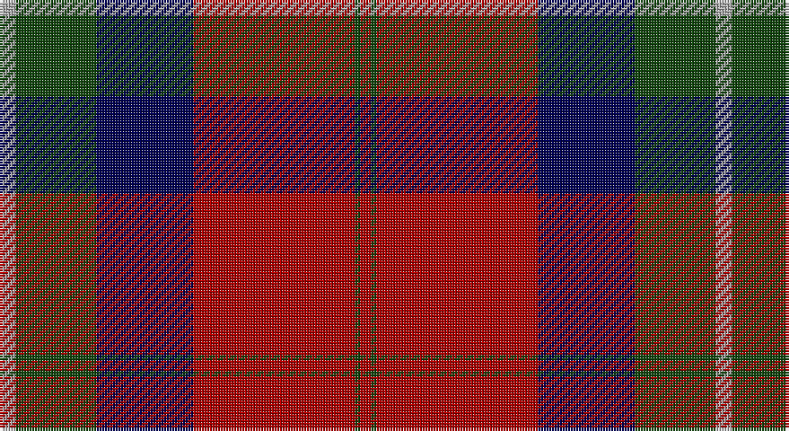

This page is one **sett** — a single exact thread-count. It belongs to the [tartan](/setts/lr3dg15db18r30dg1r2/)
(the same proportion at any scale), whose colour order is pattern [RGRBGY](/stripes/rgrbgy/).

Part of the [Ruthven](/tartans/ruthven/) tartan — the named design grouping this sett with its other cloths.

Sourced from weddslist.  It is a [6 stripe tartan](/stripes/stripes6/).

Original link http://www.weddslist.com/cgi-bin/tartans/pg.pl?source=tinsel

2 attestations — the source records this cloth was collapsed from (oldest owns this page)

<ul>
<li>undated — Ruthven (weddslist, <a href="http://www.weddslist.com/cgi-bin/tartans/pg.pl?source=tinsel">record</a>)</li>
<li>undated — Ruthven (weddslist, <a href="http://www.weddslist.com/cgi-bin/tartans/pg.pl?source=x">record</a>)</li>
</ul>

## Thread count
N/6 DG30 DB36 DR60 DG2 DR/4

One full sett is **266 threads**.

## Palette

Palette: <strong>custom</strong>
<table><thead><tr><th>Colour</th><th>Threads</th><th>Shade</th><th>Base</th><th>OKLCh</th></tr></thead><tbody><tr><td>N/</td><td style="text-align:right;font-variant-numeric:tabular-nums">6</td><td><code style="background-color:#AAAAAA;">#AAAAAA</code> <small style="color:#888">#AAAAAA</small></td><td>Y <code style="background-color:#F2BF00;">#F2BF00</code></td><td><small style="color:#888">oklch(73.8% 0.000 89.9)</small></td></tr><tr><td>DG</td><td style="text-align:right;font-variant-numeric:tabular-nums">30</td><td><code style="background-color:#11450D;">#11450D</code> <small style="color:#888">#11450D</small></td><td>G <code style="background-color:#006100;">#006100</code></td><td><small style="color:#888">oklch(34.4% 0.101 142.1)</small></td></tr><tr><td>DB</td><td style="text-align:right;font-variant-numeric:tabular-nums">36</td><td><code style="background-color:#000052;">#000052</code> <small style="color:#888">#000052</small></td><td>B <code style="background-color:#2A418A;">#2A418A</code></td><td><small style="color:#888">oklch(19.8% 0.137 264.1)</small></td></tr><tr><td>DR</td><td style="text-align:right;font-variant-numeric:tabular-nums">60</td><td><code style="background-color:#AA0000;">#AA0000</code> <small style="color:#888">#AA0000</small></td><td>R <code style="background-color:#CC0000;">#CC0000</code></td><td><small style="color:#888">oklch(46.3% 0.190 29.2)</small></td></tr><tr><td>DG</td><td style="text-align:right;font-variant-numeric:tabular-nums">2</td><td><code style="background-color:#11450D;">#11450D</code> <small style="color:#888">#11450D</small></td><td>G <code style="background-color:#006100;">#006100</code></td><td><small style="color:#888">oklch(34.4% 0.101 142.1)</small></td></tr><tr><td>DR/</td><td style="text-align:right;font-variant-numeric:tabular-nums">4</td><td><code style="background-color:#AA0000;">#AA0000</code> <small style="color:#888">#AA0000</small></td><td>R <code style="background-color:#CC0000;">#CC0000</code></td><td><small style="color:#888">oklch(46.3% 0.190 29.2)</small></td></tr></tbody></table>

# Sample pattern

## Compared to the master

This cloth is one sett of its design; the master sett (the exemplar the design is anchored on) is below for comparison.

<figure style="margin:0"><figcaption style="color:#888;font-size:smaller">this sett</figcaption></figure>
<figure style="margin:0"><figcaption style="color:#888;font-size:smaller"><a href="/setts/w6g15db18r30g2r4/">master sett →</a></figcaption></figure>

## Nearest tartans

The nearest existing variants by ΔTartan distance, with this tartan at the top so the swatches line up against it.

ΔTartan

Tartan

Sett

—

<a href="/ttd/edit/#slug=lr3dg15db18r30dg1r2~x2">Ruthven</a> <a class="nn-out" href="/variants/s6/lr3dg15db18r30dg1r2~x2/" title="open its dictionary page">↗</a>

0.72

<a href="/ttd/edit/#slug=lb3dg15db18r30db1r2~x2&amp;base=lr3dg15db18r30dg1r2~x2">Ruthven</a> <a class="nn-out" href="/variants/s6/lb3dg15db18r30db1r2~x2/" title="open its dictionary page">↗</a>

1.00

<a href="/ttd/edit/#slug=r2db12r2dg12r24w1~x2&amp;base=lr3dg15db18r30dg1r2~x2">Fraser</a> <a class="nn-out" href="/variants/s6/r2db12r2dg12r24w1~x2/" title="open its dictionary page">↗</a>

1.10

<a href="/ttd/edit/#slug=n19r2n3r2n3k43r22g3~x2&amp;base=lr3dg15db18r30dg1r2~x2">Carson Red (Personal)</a> <a class="nn-out" href="/variants/s8/n19r2n3r2n3k43r22g3~x2/" title="open its dictionary page">↗</a>

1.11

<a href="/ttd/edit/#slug=w3g15db18r30g1r2~x2&amp;base=lr3dg15db18r30dg1r2~x2">Ruthven</a> <a class="nn-out" href="/variants/s6/w3g15db18r30g1r2~x2/" title="open its dictionary page">↗</a>

1.20

<a href="/ttd/edit/#slug=r8dg8k1dg3k1dg1k10r20lb3~x2&amp;base=lr3dg15db18r30dg1r2~x2">Hunter of Bute (Clan ?)</a> <a class="nn-out" href="/variants/s9/r8dg8k1dg3k1dg1k10r20lb3~x2/" title="open its dictionary page">↗</a>

1.25

<a href="/ttd/edit/#slug=w3dg18db22r19dg1r2~x2&amp;base=lr3dg15db18r30dg1r2~x2">Nibley (Personal)</a> <a class="nn-out" href="/variants/s6/w3dg18db22r19dg1r2~x2/" title="open its dictionary page">↗</a>

1.27

<a href="/ttd/edit/#slug=lo1db14r28g14r1g14lo1~x2&amp;base=lr3dg15db18r30dg1r2~x2">Abernethy (Colerain USA) (Personal)</a> <a class="nn-out" href="/variants/s7/lo1db14r28g14r1g14lo1~x2/" title="open its dictionary page">↗</a>

1.28

<a href="/ttd/edit/#slug=r2db12r2g12r24w1~x2&amp;base=lr3dg15db18r30dg1r2~x2">Fraser (1745)</a> <a class="nn-out" href="/variants/s6/r2db12r2g12r24w1~x2/" title="open its dictionary page">↗</a>

1.28

<a href="/ttd/edit/#slug=dg7w1dg18db6r18dg2~x2&amp;base=lr3dg15db18r30dg1r2~x2">Finlaggan</a> <a class="nn-out" href="/variants/s6/dg7w1dg18db6r18dg2~x2/" title="open its dictionary page">↗</a>

1.30

<a href="/ttd/edit/#slug=r6dg16r4db12r16b1r2~x2&amp;base=lr3dg15db18r30dg1r2~x2">MacQuarrie LO</a> <a class="nn-out" href="/variants/s7/r6dg16r4db12r16b1r2~x2/" title="open its dictionary page">↗</a>

## Neighbour map

Every grey dot is one of 14360 variants placed by the first two principal components of the ΔTartan feature space (44% of its variance). Red is this tartan; blue dots are its nearest — click one to open its page.

<svg viewBox="0 0 640 380" role="img" style="max-width:100%;height:auto;border:1px solid #e0e0e0;border-radius:4px;display:block" xmlns="http://www.w3.org/2000/svg"><image href="/nn/cloud.v1.png" width="640" height="380"/><a href="/variants/s6/lb3dg15db18r30db1r2~x2/"><circle cx="282.2" cy="151.1" r="4" fill="#3465a4"><title>Ruthven</title></circle></a><a href="/variants/s6/r2db12r2dg12r24w1~x2/"><circle cx="321.0" cy="162.2" r="4" fill="#3465a4"><title>Fraser</title></circle></a><a href="/variants/s8/n19r2n3r2n3k43r22g3~x2/"><circle cx="284.3" cy="148.4" r="4" fill="#3465a4"><title>Carson Red (Personal)</title></circle></a><a href="/variants/s6/w3g15db18r30g1r2~x2/"><circle cx="298.5" cy="157.0" r="4" fill="#3465a4"><title>Ruthven</title></circle></a><a href="/variants/s9/r8dg8k1dg3k1dg1k10r20lb3~x2/"><circle cx="310.8" cy="160.9" r="4" fill="#3465a4"><title>Hunter of Bute (Clan ?)</title></circle></a><a href="/variants/s6/w3dg18db22r19dg1r2~x2/"><circle cx="224.2" cy="180.6" r="4" fill="#3465a4"><title>Nibley (Personal)</title></circle></a><a href="/variants/s7/lo1db14r28g14r1g14lo1~x2/"><circle cx="278.2" cy="162.4" r="4" fill="#3465a4"><title>Abernethy (Colerain USA) (Personal)</title></circle></a><a href="/variants/s6/r2db12r2g12r24w1~x2/"><circle cx="332.4" cy="163.8" r="4" fill="#3465a4"><title>Fraser (1745)</title></circle></a><a href="/variants/s6/dg7w1dg18db6r18dg2~x2/"><circle cx="316.9" cy="197.8" r="4" fill="#3465a4"><title>Finlaggan</title></circle></a><a href="/variants/s7/r6dg16r4db12r16b1r2~x2/"><circle cx="289.1" cy="201.4" r="4" fill="#3465a4"><title>MacQuarrie LO</title></circle></a><circle cx="300.3" cy="163.6" r="5" fill="#c00000"/></svg>

ID: /variants/s6/lr3dg15db18r30dg1r2~x2/
