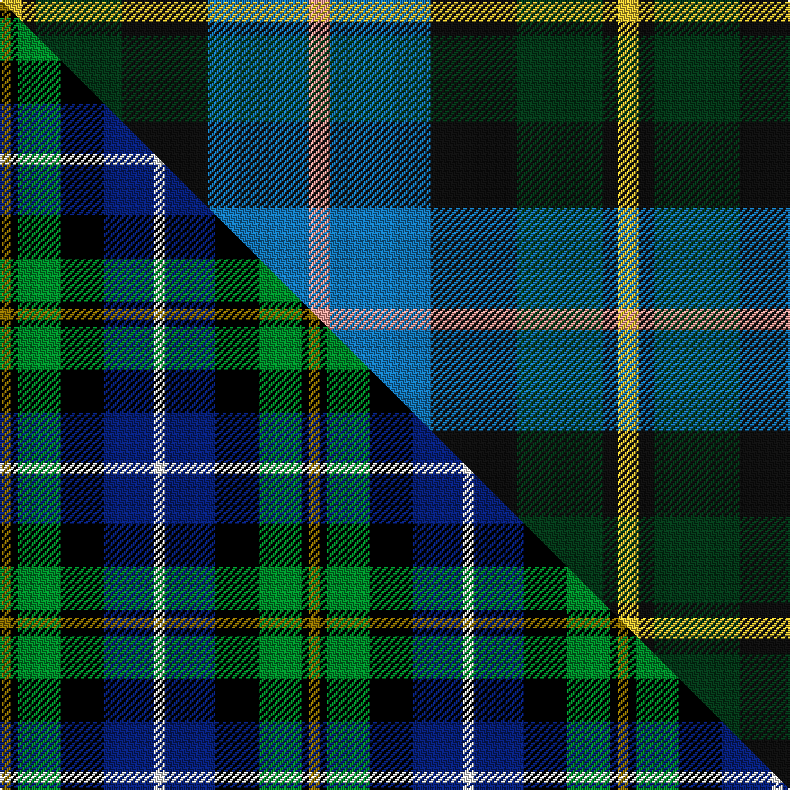

This page is one **sett** — a single exact thread-count. It belongs to the [tartan](/setts/lr3t14k12dg12k2ly3/)
(the same proportion at any scale), whose colour order is pattern [YBKGKY](/stripes/ybkgky/).

Part of the [MacNeil of Barra](/tartans/macneil-of-barra/) tartan — the named design grouping this sett with its other cloths.

Sourced from tartans-authority.  It is a [6 stripe tartan](/stripes/stripes6/).

Original link http://www.tartansauthority.com/tartan-ferret/display/1767/

## Register references

External register numbers recorded for this tartan.

- Scottish Tartans Authority (ITI): 1767

## Thread count
LY/12 K8 DG48 K48 T56 LR/12

One full sett is **344 threads**.

## Palette
<table><thead><tr><th>Colour</th><th>Shade</th><th>OKLCh</th></tr></thead><tbody><tr><td>T</td><td><code style="background-color:#1474B4;">#1474B4</code> <small style="color:#888">#1474B4</small></td><td><small style="color:#888">oklch(54.0% 0.129 245.1)</small></td></tr><tr><td>DG</td><td><code style="background-color:#053819;">#053819</code> <small style="color:#888">#053819</small></td><td><small style="color:#888">oklch(30.0% 0.075 151.3)</small></td></tr><tr><td>K</td><td><code style="background-color:#101010;">#101010</code> <small style="color:#888">#101010</small></td><td><small style="color:#888">oklch(17.3% 0.000 89.9)</small></td></tr><tr><td>LR</td><td><code style="background-color:#FF9C97;">#FF9C97</code> <small style="color:#888">#FF9C97</small></td><td><small style="color:#888">oklch(79.3% 0.119 23.2)</small></td></tr><tr><td>LY</td><td><code style="background-color:#DCBC32;">#DCBC32</code> <small style="color:#888">#DCBC32</small></td><td><small style="color:#888">oklch(80.0% 0.150 95.2)</small></td></tr></tbody></table>

# Sample pattern

## Compared to the master

This cloth is one sett of its design; the master sett (the exemplar the design is anchored on) is below for comparison.

Its **ΔTartan distance** from the master is **0.46** — the same measure the nearest-tartans table ranks by (0 is identical; a re-scale of the same cloth is near 0, a recolour or a different proportion further).

<figure class="master-compare" style="margin:0">

this sett
master sett ★

<figcaption style="color:#888;font-size:smaller">One weave of this sett against the <a href="/setts/y3k2g12k12db14w3/">master sett ★</a>, split on the diagonal: a shared proportion runs seamlessly across it with only the shades shifting; a different proportion breaks on it.</figcaption>
</figure>

## Nearest tartan variants

The nearest existing variants by ΔTartan distance, with this cloth at the top so the swatches line up against it.

ΔTartan

Threads

Variant

Sett

—

344

<a href="/variants/s6/lr3t14k12dg12k2ly3~x4~t2205244-k0700000/">MacNeil of Barra (Clan)</a>

<a href="/ttd/edit/#slug=y3k2g12k12db14w3&amp;base=lr3t14k12dg12k2ly3~x4~t2205244-k0700000" title="compare in the TTD">0.46</a>

86

<a href="/variants/s6/y3k2g12k12db14w3/">MacNeil of Barra</a>

<a href="/ttd/edit/#slug=y3k2g12k12db14w3~x2&amp;base=lr3t14k12dg12k2ly3~x4~t2205244-k0700000" title="compare in the TTD">0.46</a>

172

<a href="/variants/s6/y3k2g12k12db14w3~x2/">MacNeil 6</a>

<a href="/ttd/edit/#slug=y1k1g9k9db8w1~x4&amp;base=lr3t14k12dg12k2ly3~x4~t2205244-k0700000" title="compare in the TTD">0.76</a>

224

<a href="/variants/s6/y1k1g9k9db8w1~x4/">MacNeil 4</a>

<a href="/ttd/edit/#slug=dr1k1g6k6db6lr1~x4&amp;base=lr3t14k12dg12k2ly3~x4~t2205244-k0700000" title="compare in the TTD">0.78</a>

160

<a href="/variants/s6/dr1k1g6k6db6lr1~x4/">Gaines Center for the Humanities</a>

<a href="/ttd/edit/#slug=r4db24k12g14k4lb3~x2&amp;base=lr3t14k12dg12k2ly3~x4~t2205244-k0700000" title="compare in the TTD">0.82</a>

230

<a href="/variants/s6/r4db24k12g14k4lb3~x2/">MacPhail Hunting #2</a>

<a href="/ttd/edit/#slug=k4dg16k14ly3t16r4~x2&amp;base=lr3t14k12dg12k2ly3~x4~t2205244-k0700000" title="compare in the TTD">0.90</a>

212

<a href="/variants/s6/k4dg16k14ly3t16r4~x2/">Birse</a>

<a href="/ttd/edit/#slug=k4g16k14y3db16r4~x2&amp;base=lr3t14k12dg12k2ly3~x4~t2205244-k0700000" title="compare in the TTD">0.91</a>

212

<a href="/variants/s6/k4g16k14y3db16r4~x2/">Birse</a>

<a href="/ttd/edit/#slug=k1g8w1k8db8r1~x4&amp;base=lr3t14k12dg12k2ly3~x4~t2205244-k0700000" title="compare in the TTD">0.93</a>

208

<a href="/variants/s6/k1g8w1k8db8r1~x4/">Leslie Hunting</a>

<a href="/ttd/edit/#slug=k1g8w1k8db8r1~x4~db1004274&amp;base=lr3t14k12dg12k2ly3~x4~t2205244-k0700000" title="compare in the TTD">0.93</a>

208

<a href="/variants/s6/k1g8w1k8db8r1~x4~db1004274/">Syme</a>

<a href="/ttd/edit/#slug=r2db8k8w1g8k1&amp;base=lr3t14k12dg12k2ly3~x4~t2205244-k0700000" title="compare in the TTD">0.94</a>

53

<a href="/variants/s6/r2db8k8w1g8k1/">Leslie Hunting</a>

## Neighbour map

Every grey dot is one of 13620 variants placed by the first two principal components of the ΔTartan feature space (42% of its variance). Red is this tartan; blue dots are its nearest — click one to open its page.

<svg viewBox="0 0 640 380" role="img" style="max-width:100%;height:auto;border:1px solid #e0e0e0;border-radius:4px;display:block" xmlns="http://www.w3.org/2000/svg"><image href="/nn/cloud.v1.png" width="640" height="380"/><a href="/variants/s6/y3k2g12k12db14w3/"><circle cx="76.9" cy="211.9" r="4" fill="#3465a4"><title>MacNeil of Barra</title></circle></a><a href="/variants/s6/y3k2g12k12db14w3~x2/"><circle cx="76.9" cy="211.9" r="4" fill="#3465a4"><title>MacNeil 6</title></circle></a><a href="/variants/s6/y1k1g9k9db8w1~x4/"><circle cx="121.0" cy="189.8" r="4" fill="#3465a4"><title>MacNeil 4</title></circle></a><a href="/variants/s6/dr1k1g6k6db6lr1~x4/"><circle cx="99.9" cy="212.9" r="4" fill="#3465a4"><title>Gaines Center for the Humanities</title></circle></a><a href="/variants/s6/r4db24k12g14k4lb3~x2/"><circle cx="132.2" cy="198.5" r="4" fill="#3465a4"><title>MacPhail Hunting #2</title></circle></a><a href="/variants/s6/k4dg16k14ly3t16r4~x2/"><circle cx="77.4" cy="226.2" r="4" fill="#3465a4"><title>Birse</title></circle></a><a href="/variants/s6/k4g16k14y3db16r4~x2/"><circle cx="78.8" cy="226.5" r="4" fill="#3465a4"><title>Birse</title></circle></a><a href="/variants/s6/k1g8w1k8db8r1~x4/"><circle cx="109.3" cy="193.7" r="4" fill="#3465a4"><title>Leslie Hunting</title></circle></a><a href="/variants/s6/k1g8w1k8db8r1~x4~db1004274/"><circle cx="111.9" cy="193.4" r="4" fill="#3465a4"><title>Syme</title></circle></a><a href="/variants/s6/r2db8k8w1g8k1/"><circle cx="95.6" cy="198.7" r="4" fill="#3465a4"><title>Leslie Hunting</title></circle></a><circle cx="109.4" cy="222.1" r="5" fill="#c00000"/><text x="320" y="376" text-anchor="middle" font-size="11" fill="#999">ground</text><text x="11" y="190" text-anchor="middle" font-size="11" fill="#999" transform="rotate(-90 11 190)">complexity</text></svg>

ID: /variants/s6/lr3t14k12dg12k2ly3~x4~t2205244-k0700000/
