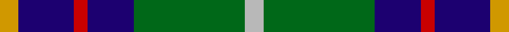

This is one **variant** — a specific cloth: this exact thread count and colourway, with its own
provenance below. It is one weaving of the [sett](/tartans/i/in/inglis/) (the scale-free proportion — the
same cloth at any scale or shade), whose colour order is pattern [YBRBGY](/stripes/ybrbgy/).

Part of the [Inglis](/tartans/i/in/inglis/) tartan — the named design grouping this sett with its other cloths.

Sourced from tartans-authority.  It is a [6 stripe tartan](/stripes/stripes6/).

Original link <code>http://www.tartansauthority.com/tartan-ferret/display/1798/</code> — retired · [Internet Archive copy](https://web.archive.org/web/*/http://www.tartansauthority.com/tartan-ferret/display/1798/*)

2 attestations — the source records this cloth was collapsed from (oldest owns this page)

<ul>
<li>pre 2002 — Inglis (Name) (tartans-authority, <a href="https://web.archive.org/web/*/http://www.tartansauthority.com/tartan-ferret/display/1798/*">record</a>)  <em>Notes said also known as MacIntyre: however MacIntyre has a green line in place of the yellow. Sample in STA Dalgety Collection. In the absence of any evidence to the contrary, it is assumed that this is a 'Name' tartan.</em></li>
<li>undated — Inglis (register-of-tartans, <a href="https://www.tartanregister.gov.uk/tartanDetails.aspx?ref=1825">record</a>)  <em>Notes said also known as MacIntyre: however MacIntyre has a green line in place of the yellow. There is also an Ancient Inglis version of the tartan which has much lighter colour tones.</em></li>
</ul>

Dataset <small>— provenance for this record, inherited from the source manifest</small>

<dl class="dataset-prov">
<dt>source</dt><dd><a href="/sources/tartans-authority/">Scottish Tartans Authority</a></dd>
<dt>data captured from</dt><dd><a href="https://github.com/thetartan/tartan-database/blob/master/data/tartans-authority/data.csv">https://github.com/thetartan/tartan-database/blob/master/data/tartans-authority/data.csv</a></dd>
<dt>data date</dt><dd>pre 2002 <small>(this record)</small></dd>
<dt>licence</dt><dd><a href="https://creativecommons.org/licenses/by-nc-nd/4.0/">CC BY-NC-ND 4.0</a></dd>
</dl>

Capture chain <small>— the hands this data passed through, oldest first; each capture carries its own licence</small>

<ol class="capture-chain">
<li><a href="https://www.tartansauthority.com/">Scottish Tartans Authority</a> <small>the heritage body’s archive — its tartan-ferret record browser is retired; dead record links are shown unlinked, with an Internet Archive copy (ITI numbers are not SRT references)</small></li>
<li><a href="https://github.com/thetartan/tartan-database">thetartan/tartan-database</a> <small>2016-2017</small> · <a href="https://creativecommons.org/licenses/by-nc-nd/4.0/">CC BY-NC-ND 4.0</a> <small>Levko Kravets's frozen compilation — the capture we vendored, and where its CC licence text came from</small></li>
<li>this dictionary <small>captured 2026-06-10 · commit 5bf86c7566</small> <small>each re-capture is a git commit to data/sources</small></li>
</ol>

## Register references

External register numbers recorded for this tartan.

- Scottish Register of Tartans: [1825](https://www.tartanregister.gov.uk/tartanDetails.aspx?ref=1825)
- Scottish Tartans Authority (ITI): 1798
- Scottish Tartans World Register: 1798

## Thread count
LO/8 DB24 R6 DB20 G48 LR/8

One full sett is **212 threads**.

## Palette
<table><thead><tr><th>Colour</th><th>Shade</th><th>OKLCh</th></tr></thead><tbody><tr><td>DB</td><td><code style="background-color:#082077;">#082077</code> <small style="color:#888">#082077</small></td><td><small style="color:#888">oklch(30.0% 0.149 265.1)</small></td></tr><tr><td>LO</td><td><code style="background-color:#FF9C34;">#FF9C34</code> <small style="color:#888">#FF9C34</small></td><td><small style="color:#888">oklch(77.9% 0.161 61.8)</small></td></tr><tr><td>G</td><td><code style="background-color:#008B2A;">#008B2A</code> <small style="color:#888">#008B2A</small></td><td><small style="color:#888">oklch(55.4% 0.170 145.9)</small></td></tr><tr><td>LR</td><td><code style="background-color:#FF9C97;">#FF9C97</code> <small style="color:#888">#FF9C97</small></td><td><small style="color:#888">oklch(79.3% 0.119 23.2)</small></td></tr><tr><td>R</td><td><code style="background-color:#D60020;">#D60020</code> <small style="color:#888">#D60020</small></td><td><small style="color:#888">oklch(55.2% 0.224 25.5)</small></td></tr></tbody></table>

# Sample pattern

## Nearest tartan variants

The nearest existing variants by ΔTartan distance, with this cloth at the top so the swatches line up against it.

ΔTartan

Threads

Variant

Sett

—

212

<a href="/variants/s6/lr4g24db10r3db12lo4~x2/">Inglis (Name)</a>

<a href="/ttd/edit/#slug=w4g28db18r4db18y3~x2&amp;base=lr4g24db10r3db12lo4~x2" title="compare in the TTD">1.10</a>

286

<a href="/variants/s6/w4g28db18r4db18y3~x2/">Inglis Family Tartan</a>

<a href="/ttd/edit/#slug=g11dy4w1db10dr1db2~x4&amp;base=lr4g24db10r3db12lo4~x2" title="compare in the TTD">1.13</a>

180

<a href="/variants/s6/g11dy4w1db10dr1db2~x4/">Ayrshire</a>

<a href="/ttd/edit/#slug=y15db8r25db72dg98w15&amp;base=lr4g24db10r3db12lo4~x2" title="compare in the TTD">1.17</a>

436

<a href="/variants/s6/y15db8r25db72dg98w15/">Afternoon Tea / Darjeeling</a>

<a href="/ttd/edit/#slug=db3g13lb1r3lb1db10ly1~x2&amp;base=lr4g24db10r3db12lo4~x2" title="compare in the TTD">1.70</a>

120

<a href="/variants/s7/db3g13lb1r3lb1db10ly1~x2/">Heckenberg Htg (Personal)</a>

<a href="/ttd/edit/#slug=db3g13lb1r3lb1db10y1~x2&amp;base=lr4g24db10r3db12lo4~x2" title="compare in the TTD">1.70</a>

120

<a href="/variants/s7/db3g13lb1r3lb1db10y1~x2/">Graeme Heckenberg Hunting</a>

<a href="/ttd/edit/#slug=k3db3g23db21w2~x2~db3514276&amp;base=lr4g24db10r3db12lo4~x2" title="compare in the TTD">1.74</a>

198

<a href="/variants/s5/k3db3g23db21w2~x2~db3514276/">Douglas Clan Tartan</a>

<a href="/ttd/edit/#slug=db20k6ly4db3g20w2~x2&amp;base=lr4g24db10r3db12lo4~x2" title="compare in the TTD">1.76</a>

176

<a href="/variants/s6/db20k6ly4db3g20w2~x2/">DeLoughery (Personal)</a>

<a href="/ttd/edit/#slug=r5t25w5t3dg25t3~x2&amp;base=lr4g24db10r3db12lo4~x2" title="compare in the TTD">1.86</a>

248

<a href="/variants/s6/r5t25w5t3dg25t3~x2/">Thayer USA</a>

<a href="/ttd/edit/#slug=r5db25w5db3g25db3~x2&amp;base=lr4g24db10r3db12lo4~x2" title="compare in the TTD">1.86</a>

248

<a href="/variants/s6/r5db25w5db3g25db3~x2/">Thayer USA (Name)</a>

<a href="/ttd/edit/#slug=g15r3db11w2&amp;base=lr4g24db10r3db12lo4~x2" title="compare in the TTD">1.93</a>

45

<a href="/variants/s4/g15r3db11w2/">MacNab WI2</a>

## Neighbour map

Every grey dot is one of 13662 variants placed by the first two principal components of the ΔTartan feature space (42% of its variance). Red is this tartan; blue dots are its nearest — click one to open its page. The map is a flat projection of a many-dimensional space — [how to read it](/posts/neighbourhood-maps/).

<svg viewBox="0 0 640 380" role="img" style="max-width:100%;height:auto;border:1px solid #e0e0e0;border-radius:4px;display:block" xmlns="http://www.w3.org/2000/svg"><image href="/nn/cloud.v1.png" width="640" height="380"/><a href="/variants/s6/w4g28db18r4db18y3~x2/"><circle cx="235.7" cy="214.4" r="4" fill="#3465a4"><title>Inglis Family Tartan</title></circle></a><a href="/variants/s6/g11dy4w1db10dr1db2~x4/"><circle cx="246.7" cy="218.4" r="4" fill="#3465a4"><title>Ayrshire</title></circle></a><a href="/variants/s6/y15db8r25db72dg98w15/"><circle cx="227.3" cy="195.8" r="4" fill="#3465a4"><title>Afternoon Tea / Darjeeling</title></circle></a><a href="/variants/s7/db3g13lb1r3lb1db10ly1~x2/"><circle cx="234.7" cy="183.8" r="4" fill="#3465a4"><title>Heckenberg Htg (Personal)</title></circle></a><a href="/variants/s7/db3g13lb1r3lb1db10y1~x2/"><circle cx="240.1" cy="185.6" r="4" fill="#3465a4"><title>Graeme Heckenberg Hunting</title></circle></a><a href="/variants/s5/k3db3g23db21w2~x2~db3514276/"><circle cx="226.7" cy="190.1" r="4" fill="#3465a4"><title>Douglas Clan Tartan</title></circle></a><a href="/variants/s6/db20k6ly4db3g20w2~x2/"><circle cx="171.2" cy="187.7" r="4" fill="#3465a4"><title>DeLoughery (Personal)</title></circle></a><a href="/variants/s6/r5t25w5t3dg25t3~x2/"><circle cx="268.5" cy="224.3" r="4" fill="#3465a4"><title>Thayer USA</title></circle></a><a href="/variants/s6/r5db25w5db3g25db3~x2/"><circle cx="247.8" cy="216.5" r="4" fill="#3465a4"><title>Thayer USA (Name)</title></circle></a><a href="/variants/s4/g15r3db11w2/"><circle cx="245.2" cy="254.6" r="4" fill="#3465a4"><title>MacNab WI2</title></circle></a><circle cx="201.4" cy="219.6" r="5" fill="#c00000"/><text x="320" y="376" text-anchor="middle" font-size="11" fill="#999">ground</text><text x="11" y="190" text-anchor="middle" font-size="11" fill="#999" transform="rotate(-90 11 190)">complexity</text></svg>

ID: /variants/s6/lr4g24db10r3db12lo4~x2/
