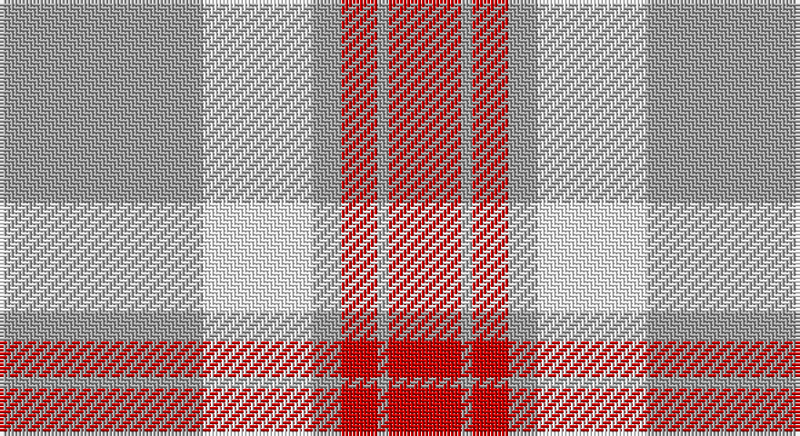

This page is one **sett** — a single exact thread-count. It belongs to the [tartan](/setts/lr56w30lr8r10lr3r20/)
(the same proportion at any scale), whose colour order is pattern [RYRYWY](/stripes/ryrywy/).

Sourced from register-of-tartans.  It is a [6 stripe tartan](/stripes/stripes6/).

Original link https://www.tartanregister.gov.uk/tartanDetails.aspx?ref=11204

## Register references

External register numbers recorded for this tartan.

- Scottish Register of Tartans: [11204](https://www.tartanregister.gov.uk/tartanDetails.aspx?ref=11204)

## Thread count
N/56 W30 N8 R10 N3 R/20

One full sett is **178 threads**.

## Palette

Palette: <strong>Tartan Register</strong>
<table><thead><tr><th>Colour</th><th>Threads</th><th>Shade</th><th>Base</th><th>OKLCh</th></tr></thead><tbody><tr><td>N/</td><td style="text-align:right;font-variant-numeric:tabular-nums">56</td><td><code style="background-color:#A0A0A0;">#A0A0A0</code> <small style="color:#888">#A0A0A0</small></td><td>Y <code style="background-color:#F2BF00;">#F2BF00</code></td><td><small style="color:#888">oklch(70.6% 0.000 89.9)</small></td></tr><tr><td>W</td><td style="text-align:right;font-variant-numeric:tabular-nums">30</td><td><code style="background-color:#FFFFFF;">#FFFFFF</code> <small style="color:#888">#FFFFFF</small></td><td>W <code style="background-color:#F7F7F7;">#F7F7F7</code></td><td><small style="color:#888">oklch(100.0% 0.000 89.9)</small></td></tr><tr><td>N</td><td style="text-align:right;font-variant-numeric:tabular-nums">8</td><td><code style="background-color:#A0A0A0;">#A0A0A0</code> <small style="color:#888">#A0A0A0</small></td><td>Y <code style="background-color:#F2BF00;">#F2BF00</code></td><td><small style="color:#888">oklch(70.6% 0.000 89.9)</small></td></tr><tr><td>R</td><td style="text-align:right;font-variant-numeric:tabular-nums">10</td><td><code style="background-color:#C80000;">#C80000</code> <small style="color:#888">#C80000</small></td><td>R <code style="background-color:#CC0000;">#CC0000</code></td><td><small style="color:#888">oklch(52.3% 0.215 29.2)</small></td></tr><tr><td>N</td><td style="text-align:right;font-variant-numeric:tabular-nums">3</td><td><code style="background-color:#A0A0A0;">#A0A0A0</code> <small style="color:#888">#A0A0A0</small></td><td>Y <code style="background-color:#F2BF00;">#F2BF00</code></td><td><small style="color:#888">oklch(70.6% 0.000 89.9)</small></td></tr><tr><td>R/</td><td style="text-align:right;font-variant-numeric:tabular-nums">20</td><td><code style="background-color:#C80000;">#C80000</code> <small style="color:#888">#C80000</small></td><td>R <code style="background-color:#CC0000;">#CC0000</code></td><td><small style="color:#888">oklch(52.3% 0.215 29.2)</small></td></tr></tbody></table>

# Sample pattern

## Nearest tartans

The nearest existing variants by ΔTartan distance, with this tartan at the top so the swatches line up against it.

ΔTartan

Tartan

Sett

—

<a href="/ttd/edit/#slug=lr56w30lr8r10lr3r20">Walsh, Michael Edward (Personal)</a> <a class="nn-out" href="/variants/s6/lr56w30lr8r10lr3r20/" title="open its dictionary page">↗</a>

0.39

<a href="/ttd/edit/#slug=o56w30o8r10o3r20&amp;base=lr56w30lr8r10lr3r20">Walsh, Michael Edward (Personal)</a> <a class="nn-out" href="/variants/s6/o56w30o8r10o3r20/" title="open its dictionary page">↗</a>

1.27

<a href="/ttd/edit/#slug=dy5r5lb11r1dy1~x4&amp;base=lr56w30lr8r10lr3r20">O'Connor Dress</a> <a class="nn-out" href="/variants/s5/dy5r5lb11r1dy1~x4/" title="open its dictionary page">↗</a>

1.42

<a href="/ttd/edit/#slug=r8w3r28w32k3w4~x2&amp;base=lr56w30lr8r10lr3r20">Ailsa, Pink (Dance)</a> <a class="nn-out" href="/variants/s6/r8w3r28w32k3w4~x2/" title="open its dictionary page">↗</a>

1.52

<a href="/ttd/edit/#slug=lb45r2g9lb2r30~x2&amp;base=lr56w30lr8r10lr3r20">Malaysian Unknown (Artefact)</a> <a class="nn-out" href="/variants/s5/lb45r2g9lb2r30~x2/" title="open its dictionary page">↗</a>

1.53

<a href="/ttd/edit/#slug=dy8lr29dy8lo3dy8lr8lo3~x2&amp;base=lr56w30lr8r10lr3r20">Lister (Misty Mountain)</a> <a class="nn-out" href="/variants/s7/dy8lr29dy8lo3dy8lr8lo3~x2/" title="open its dictionary page">↗</a>

1.65

<a href="/ttd/edit/#slug=w2r1w2g6w10r6w2g1w2~x4&amp;base=lr56w30lr8r10lr3r20">O'Neill Pipe Band 1999/ Oliver dress</a> <a class="nn-out" href="/variants/s9/w2r1w2g6w10r6w2g1w2~x4/" title="open its dictionary page">↗</a>

1.70

<a href="/ttd/edit/#slug=k2w28r13w2r13w2~x2&amp;base=lr56w30lr8r10lr3r20">Buchanan #5</a> <a class="nn-out" href="/variants/s6/k2w28r13w2r13w2~x2/" title="open its dictionary page">↗</a>

1.78

<a href="/ttd/edit/#slug=r4lyi1r3ly1lyi8ly2~x4&amp;base=lr56w30lr8r10lr3r20">Buchele Check (Fashion?)</a> <a class="nn-out" href="/variants/s6/r4lyi1r3ly1lyi8ly2~x4/" title="open its dictionary page">↗</a>

1.83

<a href="/ttd/edit/#slug=w4ri2w25r21w3r8ly3~x2&amp;base=lr56w30lr8r10lr3r20">MacPherson Dress Red</a> <a class="nn-out" href="/variants/s7/w4ri2w25r21w3r8ly3~x2/" title="open its dictionary page">↗</a>

1.84

<a href="/ttd/edit/#slug=w5k2w30r24w3r8dt3~x2&amp;base=lr56w30lr8r10lr3r20">Arduaine, Red (Dance)</a> <a class="nn-out" href="/variants/s7/w5k2w30r24w3r8dt3~x2/" title="open its dictionary page">↗</a>

## Neighbour map

Every grey dot is one of 14360 variants placed by the first two principal components of the ΔTartan feature space (44% of its variance). Red is this tartan; blue dots are its nearest — click one to open its page.

<svg viewBox="0 0 640 380" role="img" style="max-width:100%;height:auto;border:1px solid #e0e0e0;border-radius:4px;display:block" xmlns="http://www.w3.org/2000/svg"><image href="/nn/cloud.v1.png" width="640" height="380"/><a href="/variants/s6/o56w30o8r10o3r20/"><circle cx="317.6" cy="183.5" r="4" fill="#3465a4"><title>Walsh, Michael Edward (Personal)</title></circle></a><a href="/variants/s5/dy5r5lb11r1dy1~x4/"><circle cx="272.2" cy="218.6" r="4" fill="#3465a4"><title>O'Connor Dress</title></circle></a><a href="/variants/s6/r8w3r28w32k3w4~x2/"><circle cx="339.5" cy="198.2" r="4" fill="#3465a4"><title>Ailsa, Pink (Dance)</title></circle></a><a href="/variants/s5/lb45r2g9lb2r30~x2/"><circle cx="334.3" cy="164.6" r="4" fill="#3465a4"><title>Malaysian Unknown (Artefact)</title></circle></a><a href="/variants/s7/dy8lr29dy8lo3dy8lr8lo3~x2/"><circle cx="311.1" cy="200.8" r="4" fill="#3465a4"><title>Lister (Misty Mountain)</title></circle></a><a href="/variants/s9/w2r1w2g6w10r6w2g1w2~x4/"><circle cx="286.0" cy="184.7" r="4" fill="#3465a4"><title>O'Neill Pipe Band 1999/ Oliver dress</title></circle></a><a href="/variants/s6/k2w28r13w2r13w2~x2/"><circle cx="321.5" cy="171.3" r="4" fill="#3465a4"><title>Buchanan #5</title></circle></a><a href="/variants/s6/r4lyi1r3ly1lyi8ly2~x4/"><circle cx="259.3" cy="217.0" r="4" fill="#3465a4"><title>Buchele Check (Fashion?)</title></circle></a><a href="/variants/s7/w4ri2w25r21w3r8ly3~x2/"><circle cx="287.8" cy="154.9" r="4" fill="#3465a4"><title>MacPherson Dress Red</title></circle></a><a href="/variants/s7/w5k2w30r24w3r8dt3~x2/"><circle cx="295.3" cy="141.5" r="4" fill="#3465a4"><title>Arduaine, Red (Dance)</title></circle></a><circle cx="319.6" cy="182.6" r="5" fill="#c00000"/></svg>

ID: /variants/s6/lr56w30lr8r10lr3r20/
