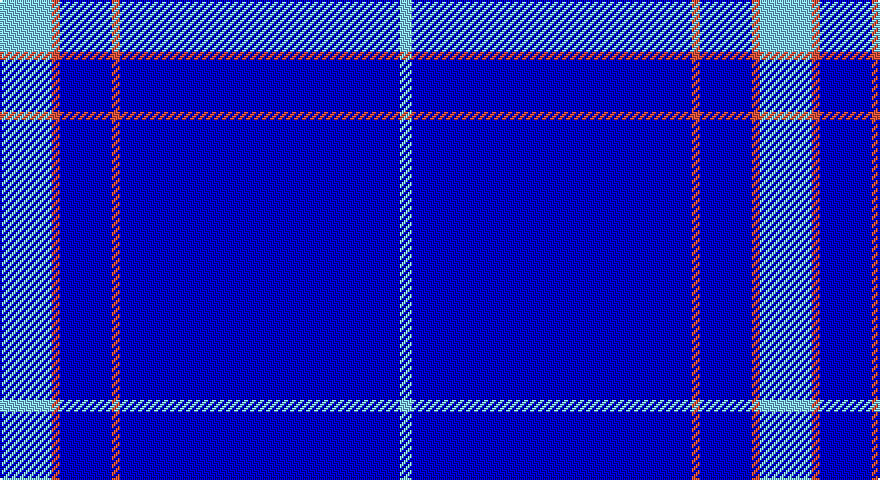

This page is one **sett** — a single exact thread-count. It belongs to the [tartan](/setts/lt13r2db13r2db70lt3/)
(the same proportion at any scale), whose colour order is pattern [WBRBRW](/stripes/wbrbrw/).

Sourced from register-of-tartans.  It is a [6 stripe tartan](/stripes/stripes6/).

Original link https://www.tartanregister.gov.uk/tartanDetails.aspx?ref=10620

## Register references

External register numbers recorded for this tartan.

- Scottish Register of Tartans: [10620](https://www.tartanregister.gov.uk/tartanDetails.aspx?ref=10620)

## Thread count
LB/26 O4 B26 O4 B140 LB/6

One full sett is **380 threads**.

## Palette

Palette: <strong>Tartan Register</strong> <small style="color:#888">(2 of 3 colours)</small>
<table><thead><tr><th>Colour</th><th>Threads</th><th>Shade</th><th>Base</th><th>OKLCh</th></tr></thead><tbody><tr><td>LB/</td><td style="text-align:right;font-variant-numeric:tabular-nums">26</td><td><code style="background-color:#82CFFD;">#82CFFD</code> <small style="color:#888">#82CFFD</small></td><td>W <code style="background-color:#F7F7F7;">#F7F7F7</code></td><td><small style="color:#888">oklch(82.2% 0.100 236.0)</small></td></tr><tr><td>O</td><td style="text-align:right;font-variant-numeric:tabular-nums">4</td><td><code style="background-color:#E1523D;">#E1523D</code> <small style="color:#888">#E1523D</small></td><td>R <code style="background-color:#CC0000;">#CC0000</code></td><td><small style="color:#888">oklch(62.8% 0.182 31.0)</small></td></tr><tr><td>B</td><td style="text-align:right;font-variant-numeric:tabular-nums">26</td><td><code style="background-color:#0000CD;">#0000CD</code> <small style="color:#888">#0000CD</small></td><td>B <code style="background-color:#2A418A;">#2A418A</code></td><td><small style="color:#888">oklch(38.3% 0.266 264.1)</small></td></tr><tr><td>O</td><td style="text-align:right;font-variant-numeric:tabular-nums">4</td><td><code style="background-color:#E1523D;">#E1523D</code> <small style="color:#888">#E1523D</small></td><td>R <code style="background-color:#CC0000;">#CC0000</code></td><td><small style="color:#888">oklch(62.8% 0.182 31.0)</small></td></tr><tr><td>B</td><td style="text-align:right;font-variant-numeric:tabular-nums">140</td><td><code style="background-color:#0000CD;">#0000CD</code> <small style="color:#888">#0000CD</small></td><td>B <code style="background-color:#2A418A;">#2A418A</code></td><td><small style="color:#888">oklch(38.3% 0.266 264.1)</small></td></tr><tr><td>LB/</td><td style="text-align:right;font-variant-numeric:tabular-nums">6</td><td><code style="background-color:#82CFFD;">#82CFFD</code> <small style="color:#888">#82CFFD</small></td><td>W <code style="background-color:#F7F7F7;">#F7F7F7</code></td><td><small style="color:#888">oklch(82.2% 0.100 236.0)</small></td></tr></tbody></table>

# Sample pattern

## Nearest tartans

The nearest existing variants by ΔTartan distance, with this tartan at the top so the swatches line up against it.

ΔTartan

Tartan

Sett

—

<a href="/ttd/edit/#slug=lt13r2db13r2db70lt3~x2">Agua</a> <a class="nn-out" href="/variants/s6/lt13r2db13r2db70lt3~x2/" title="open its dictionary page">↗</a>

1.52

<a href="/ttd/edit/#slug=k1db18lt5db1lt3db18k1~x4&amp;base=lt13r2db13r2db70lt3~x2">Blueheart</a> <a class="nn-out" href="/variants/s7/k1db18lt5db1lt3db18k1~x4/" title="open its dictionary page">↗</a>

1.66

<a href="/ttd/edit/#slug=b61ly3db2w2b20w2b4ly4~x2&amp;base=lt13r2db13r2db70lt3~x2">Royal Warrant Holders</a> <a class="nn-out" href="/variants/s8/b61ly3db2w2b20w2b4ly4~x2/" title="open its dictionary page">↗</a>

2.34

<a href="/ttd/edit/#slug=db61r6w2r8lo2db3lo2db15~x2&amp;base=lt13r2db13r2db70lt3~x2">Duke of York (Royal)</a> <a class="nn-out" href="/variants/s8/db61r6w2r8lo2db3lo2db15~x2/" title="open its dictionary page">↗</a>

2.51

<a href="/ttd/edit/#slug=db35w4db10m3r3m3~x4&amp;base=lt13r2db13r2db70lt3~x2">Steffen, Markus (Personal)</a> <a class="nn-out" href="/variants/s6/db35w4db10m3r3m3~x4/" title="open its dictionary page">↗</a>

2.59

<a href="/ttd/edit/#slug=db100y10k5y10r8&amp;base=lt13r2db13r2db70lt3~x2">Waugh</a> <a class="nn-out" href="/variants/s5/db100y10k5y10r8/" title="open its dictionary page">↗</a>

2.62

<a href="/ttd/edit/#slug=b10db6b3db62w4db5~x2&amp;base=lt13r2db13r2db70lt3~x2">Auchairne</a> <a class="nn-out" href="/variants/s6/b10db6b3db62w4db5~x2/" title="open its dictionary page">↗</a>

2.70

<a href="/ttd/edit/#slug=db66w2db10w2db10w2db12r3t24~x2&amp;base=lt13r2db13r2db70lt3~x2">RAAF</a> <a class="nn-out" href="/variants/s9/db66w2db10w2db10w2db12r3t24~x2/" title="open its dictionary page">↗</a>

2.71

<a href="/ttd/edit/#slug=r5w4k4db80w4~x2&amp;base=lt13r2db13r2db70lt3~x2">Volunteer Lifesaving Corps (Corp.)</a> <a class="nn-out" href="/variants/s5/r5w4k4db80w4~x2/" title="open its dictionary page">↗</a>

2.75

<a href="/ttd/edit/#slug=db80r1db2r1db6r10db1r7~x2&amp;base=lt13r2db13r2db70lt3~x2">Mack of Stoneywood Dress (Personal)</a> <a class="nn-out" href="/variants/s8/db80r1db2r1db6r10db1r7~x2/" title="open its dictionary page">↗</a>

2.80

<a href="/ttd/edit/#slug=db32r3db4k1ly3&amp;base=lt13r2db13r2db70lt3~x2">MacLaine of Lochbuie Hunting</a> <a class="nn-out" href="/variants/s5/db32r3db4k1ly3/" title="open its dictionary page">↗</a>

## Neighbour map

Every grey dot is one of 14360 variants placed by the first two principal components of the ΔTartan feature space (44% of its variance). Red is this tartan; blue dots are its nearest — click one to open its page.

<svg viewBox="0 0 640 380" role="img" style="max-width:100%;height:auto;border:1px solid #e0e0e0;border-radius:4px;display:block" xmlns="http://www.w3.org/2000/svg"><image href="/nn/cloud.v1.png" width="640" height="380"/><a href="/variants/s7/k1db18lt5db1lt3db18k1~x4/"><circle cx="483.2" cy="194.6" r="4" fill="#3465a4"><title>Blueheart</title></circle></a><a href="/variants/s8/b61ly3db2w2b20w2b4ly4~x2/"><circle cx="591.0" cy="137.8" r="4" fill="#3465a4"><title>Royal Warrant Holders</title></circle></a><a href="/variants/s8/db61r6w2r8lo2db3lo2db15~x2/"><circle cx="550.3" cy="141.9" r="4" fill="#3465a4"><title>Duke of York (Royal)</title></circle></a><a href="/variants/s6/db35w4db10m3r3m3~x4/"><circle cx="466.0" cy="193.7" r="4" fill="#3465a4"><title>Steffen, Markus (Personal)</title></circle></a><a href="/variants/s5/db100y10k5y10r8/"><circle cx="500.7" cy="185.1" r="4" fill="#3465a4"><title>Waugh</title></circle></a><a href="/variants/s6/b10db6b3db62w4db5~x2/"><circle cx="552.3" cy="185.8" r="4" fill="#3465a4"><title>Auchairne</title></circle></a><a href="/variants/s9/db66w2db10w2db10w2db12r3t24~x2/"><circle cx="494.1" cy="134.1" r="4" fill="#3465a4"><title>RAAF</title></circle></a><a href="/variants/s5/r5w4k4db80w4~x2/"><circle cx="560.8" cy="163.3" r="4" fill="#3465a4"><title>Volunteer Lifesaving Corps (Corp.)</title></circle></a><a href="/variants/s8/db80r1db2r1db6r10db1r7~x2/"><circle cx="626.0" cy="139.1" r="4" fill="#3465a4"><title>Mack of Stoneywood Dress (Personal)</title></circle></a><a href="/variants/s5/db32r3db4k1ly3/"><circle cx="574.8" cy="166.1" r="4" fill="#3465a4"><title>MacLaine of Lochbuie Hunting</title></circle></a><circle cx="563.2" cy="165.5" r="5" fill="#c00000"/></svg>

ID: /variants/s6/lt13r2db13r2db70lt3~x2/
