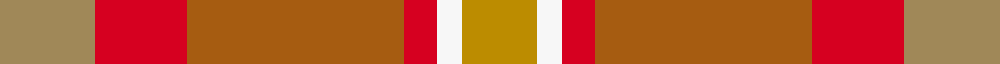

This is one **variant** — a specific cloth: this exact thread count and colourway, with its own
provenance below. It is one weaving of the [sett](/setts/ly23r22o52r8w6lyi18/) (the scale-free proportion — the
same cloth at any scale or shade), whose colour order is pattern [YRRRWY](/stripes/yrrrwy/).

Part of the [Lady Boys of Bangkok](/tartans/l/la/lady-boys-of-bangkok/) tartan — the named design grouping this sett with its other cloths.

Sourced from tartans-authority.  It is a [6 stripe tartan](/stripes/stripes6/).

Original link [https://www.tartanregister.gov.uk/tartanDetails.aspx?ref=7142](https://www.tartanregister.gov.uk/tartanDetails.aspx?ref=7142)

2 attestations — the source records this cloth was collapsed from (oldest owns this page)

<ul>
<li>pre 2005 — Lady Boys of Bangkok (Corporate) (tartans-authority, <a href="https://www.tartanregister.gov.uk/tartanDetails.aspx?ref=7142">record</a>)  <em>Despite the dubious name this is a dance troupe that performed in kilts of this tartan at the Edinburgh Fringe in 2005.</em></li>
<li>undated — Lady Boys of Bangkok (register-of-tartans, <a href="https://www.tartanregister.gov.uk/tartanDetails.aspx?ref=5075">record</a>)  <em>Despite the dubious name this is a dance troupe that performed in kilts of this tartan at the Edinburgh Fringe in 2005.</em></li>
</ul>

Dataset <small>— provenance for this record, inherited from the source manifest</small>

<dl class="dataset-prov">
<dt>source</dt><dd><a href="/sources/tartans-authority/">Scottish Tartans Authority</a></dd>
<dt>data captured from</dt><dd><a href="https://github.com/thetartan/tartan-database/blob/master/data/tartans-authority/data.csv">https://github.com/thetartan/tartan-database/blob/master/data/tartans-authority/data.csv</a></dd>
<dt>data date</dt><dd>pre 2005 <small>(this record)</small></dd>
<dt>licence</dt><dd><a href="https://creativecommons.org/licenses/by-nc-nd/4.0/">CC BY-NC-ND 4.0</a></dd>
</dl>

Capture chain <small>— the hands this data passed through, oldest first; each capture carries its own licence</small>

<ol class="capture-chain">
<li><a href="https://www.tartansauthority.com/">Scottish Tartans Authority</a> <small>the heritage body's archive — its tartan-ferret record browser is retired (links repaired to the SRT, above)</small></li>
<li><a href="https://github.com/thetartan/tartan-database">thetartan/tartan-database</a> <small>2016-2017</small> · <a href="https://creativecommons.org/licenses/by-nc-nd/4.0/">CC BY-NC-ND 4.0</a> <small>Levko Kravets's frozen compilation — the capture we vendored, and where its CC licence text came from</small></li>
<li>this dictionary <small>captured 2026-06-10 · commit 5bf86c7566</small> <small>each re-capture is a git commit to data/sources</small></li>
</ol>

## Register references

External register numbers recorded for this tartan.

- Scottish Register of Tartans: [5075](https://www.tartanregister.gov.uk/tartanDetails.aspx?ref=5075)
- Scottish Tartans Authority (ITI): 7142
- Scottish Tartans World Register: 3069

## Thread count
LY/23 R22 O52 R8 W6 LYi/18

One full sett is **217 threads**.

## Palette
<table><thead><tr><th>Colour</th><th>Shade</th><th>OKLCh</th></tr></thead><tbody><tr><td>LY</td><td><code style="background-color:#BC8C00;">#BC8C00</code> <small style="color:#888">#BC8C00</small></td><td><small style="color:#888">oklch(66.8% 0.137 84.1)</small></td></tr><tr><td>W</td><td><code style="background-color:#F7F7F7;">#F7F7F7</code> <small style="color:#888">#F7F7F7</small></td><td><small style="color:#888">oklch(97.6% 0.000 89.9)</small></td></tr><tr><td>LY</td><td><code style="background-color:#A08858;">#A08858</code> <small style="color:#888">#A08858</small></td><td><small style="color:#888">oklch(63.7% 0.071 84.0)</small></td></tr><tr><td>O</td><td><code style="background-color:#A65C11;">#A65C11</code> <small style="color:#888">#A65C11</small></td><td><small style="color:#888">oklch(55.0% 0.125 58.3)</small></td></tr><tr><td>R</td><td><code style="background-color:#D60020;">#D60020</code> <small style="color:#888">#D60020</small></td><td><small style="color:#888">oklch(55.2% 0.224 25.5)</small></td></tr></tbody></table>

# Sample pattern

## Nearest tartan variants

The nearest existing variants by ΔTartan distance, with this cloth at the top so the swatches line up against it.

ΔTartan

Threads

Variant

Sett

—

217

<a href="/variants/s6/ly23r22o52r8w6lyi18~ly2503076-lyi2705081/">Lady Boys of Bangkok (Corporate)</a>

<a href="/ttd/edit/#slug=y1o5r5w1~x4&amp;base=ly23r22o52r8w6lyi18~ly2503076-lyi2705081" title="compare in the TTD">2.12</a>

88

<a href="/variants/s4/y1o5r5w1~x4/">Manx, Mannin Plaid</a>

<a href="/ttd/edit/#slug=g3dy4g2dy22n5r16ly3~x2~dy1603076-ly3307090&amp;base=ly23r22o52r8w6lyi18~ly2503076-lyi2705081" title="compare in the TTD">3.70</a>

208

<a href="/variants/s7/g3dy4g2dy22n5r16ly3~x2~dy1603076-ly3307090/">Pubcrawlers (Corporate)</a>

<a href="/ttd/edit/#slug=o62n17ly12y8dg8~x2&amp;base=ly23r22o52r8w6lyi18~ly2503076-lyi2705081" title="compare in the TTD">3.73</a>

288

<a href="/variants/s5/o62n17ly12y8dg8~x2/">Dundhuin Dress (Personal)</a>

<a href="/ttd/edit/#slug=do9dy9n9r1db1dy9db1r1~x4&amp;base=ly23r22o52r8w6lyi18~ly2503076-lyi2705081" title="compare in the TTD">3.97</a>

280

<a href="/variants/s8/do9dy9n9r1db1dy9db1r1~x4/">Jardine of Castlemilk Family Tartan</a>

## Neighbour map

Every grey dot is one of 13621 variants placed by the first two principal components of the ΔTartan feature space (42% of its variance). Red is this tartan; blue dots are its nearest — click one to open its page. The map is a flat projection of a many-dimensional space — [how to read it](/posts/neighbourhood-maps/).

<svg viewBox="0 0 640 380" role="img" style="max-width:100%;height:auto;border:1px solid #e0e0e0;border-radius:4px;display:block" xmlns="http://www.w3.org/2000/svg"><image href="/nn/cloud.v1.png" width="640" height="380"/><a href="/variants/s4/y1o5r5w1~x4/"><circle cx="322.8" cy="297.0" r="4" fill="#3465a4"><title>Manx, Mannin Plaid</title></circle></a><a href="/variants/s7/g3dy4g2dy22n5r16ly3~x2~dy1603076-ly3307090/"><circle cx="315.4" cy="205.4" r="4" fill="#3465a4"><title>Pubcrawlers (Corporate)</title></circle></a><a href="/variants/s5/o62n17ly12y8dg8~x2/"><circle cx="411.8" cy="245.3" r="4" fill="#3465a4"><title>Dundhuin Dress (Personal)</title></circle></a><a href="/variants/s8/do9dy9n9r1db1dy9db1r1~x4/"><circle cx="380.4" cy="258.5" r="4" fill="#3465a4"><title>Jardine of Castlemilk Family Tartan</title></circle></a><circle cx="325.5" cy="265.1" r="5" fill="#c00000"/><text x="320" y="376" text-anchor="middle" font-size="11" fill="#999">ground</text><text x="11" y="190" text-anchor="middle" font-size="11" fill="#999" transform="rotate(-90 11 190)">complexity</text></svg>

ID: /variants/s6/ly23r22o52r8w6lyi18~ly2503076-lyi2705081/
