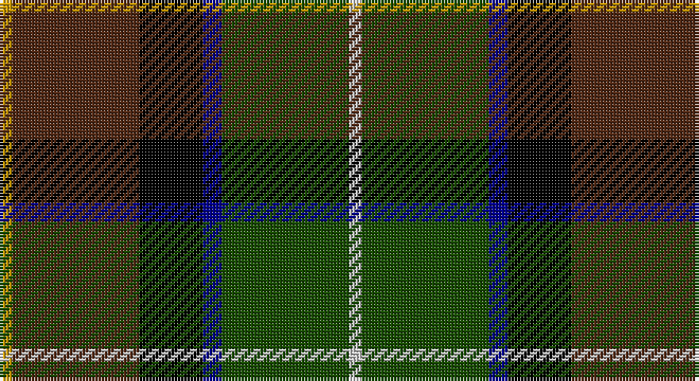

This page is one **sett** — a single exact thread-count. It belongs to the [tartan](/setts/ly2dy20k10db3dg20lb2/)
(the same proportion at any scale), whose colour order is pattern [WGBKGY](/stripes/wgbkgy/).

Sourced from tartans-authority.  It is a [6 stripe tartan](/stripes/stripes6/).

Original link http://www.tartansauthority.com/tartan-ferret/display/5658/

## Also known as

This cloth is also recorded under:

- Morris of Balgonie Htg

## Register references

External register numbers recorded for this tartan.

- Scottish Tartans Authority (ITI): 5658

## Thread count
DY/4 T40 K20 DB6 G40 N/4

One full sett is **220 threads**.

## Palette

Palette: <strong>Tartan Register</strong> <small style="color:#888">(4 of 6 colours)</small>
<table><thead><tr><th>Colour</th><th>Threads</th><th>Shade</th><th>Base</th><th>OKLCh</th></tr></thead><tbody><tr><td>DY/</td><td style="text-align:right;font-variant-numeric:tabular-nums">4</td><td><code style="background-color:#C89800;">#C89800</code> <small style="color:#888">#C89800</small></td><td>Y <code style="background-color:#F2BF00;">#F2BF00</code></td><td><small style="color:#888">oklch(70.6% 0.144 85.9)</small></td></tr><tr><td>T</td><td style="text-align:right;font-variant-numeric:tabular-nums">40</td><td><code style="background-color:#502814;">#502814</code> <small style="color:#888">#502814</small></td><td>G <code style="background-color:#006100;">#006100</code></td><td><small style="color:#888">oklch(32.6% 0.067 45.9)</small></td></tr><tr><td>K</td><td style="text-align:right;font-variant-numeric:tabular-nums">20</td><td><code style="background-color:#000000;">#000000</code> <small style="color:#888">#000000</small></td><td>K <code style="background-color:#000000;">#000000</code></td><td><small style="color:#888">oklch(0.0% 0.000 0.0)</small></td></tr><tr><td>DB</td><td style="text-align:right;font-variant-numeric:tabular-nums">6</td><td><code style="background-color:#00008C;">#00008C</code> <small style="color:#888">#00008C</small></td><td>B <code style="background-color:#2A418A;">#2A418A</code></td><td><small style="color:#888">oklch(28.9% 0.200 264.1)</small></td></tr><tr><td>G</td><td style="text-align:right;font-variant-numeric:tabular-nums">40</td><td><code style="background-color:#184C00;">#184C00</code> <small style="color:#888">#184C00</small></td><td>G <code style="background-color:#006100;">#006100</code></td><td><small style="color:#888">oklch(36.7% 0.115 138.7)</small></td></tr><tr><td>N/</td><td style="text-align:right;font-variant-numeric:tabular-nums">4</td><td><code style="background-color:#C8C8C8;">#C8C8C8</code> <small style="color:#888">#C8C8C8</small></td><td>W <code style="background-color:#F7F7F7;">#F7F7F7</code></td><td><small style="color:#888">oklch(83.3% 0.000 89.9)</small></td></tr></tbody></table>

# Sample pattern

## Nearest tartans

The nearest existing variants by ΔTartan distance, with this tartan at the top so the swatches line up against it.

ΔTartan

Tartan

Sett

—

<a href="/ttd/edit/#slug=ly2dy20k10db3dg20lb2~x2">Morris of Balgonie Htg (Personal)</a> <a class="nn-out" href="/variants/s6/ly2dy20k10db3dg20lb2~x2/" title="open its dictionary page">↗</a>

1.00

<a href="/ttd/edit/#slug=r3g3db4g17k13dt26w3~x2&amp;base=ly2dy20k10db3dg20lb2~x2">Royal Burgh of Peebles (District)</a> <a class="nn-out" href="/variants/s7/r3g3db4g17k13dt26w3~x2/" title="open its dictionary page">↗</a>

1.06

<a href="/ttd/edit/#slug=y4ly2y21do11w2k20r3~x2&amp;base=ly2dy20k10db3dg20lb2~x2">Barbour Corporate Tartan</a> <a class="nn-out" href="/variants/s7/y4ly2y21do11w2k20r3~x2/" title="open its dictionary page">↗</a>

1.06

<a href="/ttd/edit/#slug=dr6k1lo1k2db2dr4g8k1r2~x4&amp;base=ly2dy20k10db3dg20lb2~x2">Bicentenary (Commemorative)</a> <a class="nn-out" href="/variants/s9/dr6k1lo1k2db2dr4g8k1r2~x4/" title="open its dictionary page">↗</a>

1.06

<a href="/ttd/edit/#slug=w5k26ly2dg24dt7k3r3~x2&amp;base=ly2dy20k10db3dg20lb2~x2">Cornish Hunting District Tartan</a> <a class="nn-out" href="/variants/s7/w5k26ly2dg24dt7k3r3~x2/" title="open its dictionary page">↗</a>

1.07

<a href="/variants/s6/g36ly3dy5db18ki10k18~x2/">Dobson Name Tartan</a>

1.07

<a href="/ttd/edit/#slug=w2dp20r3k10g20lo2~x2&amp;base=ly2dy20k10db3dg20lb2~x2">Morris of Balgonie (Personal)</a> <a class="nn-out" href="/variants/s6/w2dp20r3k10g20lo2~x2/" title="open its dictionary page">↗</a>

1.10

<a href="/ttd/edit/#slug=r5dg18ly2k14t5k4~x2&amp;base=ly2dy20k10db3dg20lb2~x2">Unidentified No 79</a> <a class="nn-out" href="/variants/s6/r5dg18ly2k14t5k4~x2/" title="open its dictionary page">↗</a>

1.10

<a href="/ttd/edit/#slug=r2k6ly1dg12ly1db6lr2~x4&amp;base=ly2dy20k10db3dg20lb2~x2">James (Personal)</a> <a class="nn-out" href="/variants/s7/r2k6ly1dg12ly1db6lr2~x4/" title="open its dictionary page">↗</a>

1.13

<a href="/ttd/edit/#slug=r2k8ly1k8g13db13lo1r2~x2&amp;base=ly2dy20k10db3dg20lb2~x2">Sey (Name)</a> <a class="nn-out" href="/variants/s8/r2k8ly1k8g13db13lo1r2~x2/" title="open its dictionary page">↗</a>

1.19

<a href="/ttd/edit/#slug=db3r2db18k6dg18ly2g3~x2&amp;base=ly2dy20k10db3dg20lb2~x2">McComb</a> <a class="nn-out" href="/variants/s7/db3r2db18k6dg18ly2g3~x2/" title="open its dictionary page">↗</a>

## Neighbour map

Every grey dot is one of 14360 variants placed by the first two principal components of the ΔTartan feature space (44% of its variance). Red is this tartan; blue dots are its nearest — click one to open its page.

<svg viewBox="0 0 640 380" role="img" style="max-width:100%;height:auto;border:1px solid #e0e0e0;border-radius:4px;display:block" xmlns="http://www.w3.org/2000/svg"><image href="/nn/cloud.v1.png" width="640" height="380"/><a href="/variants/s7/r3g3db4g17k13dt26w3~x2/"><circle cx="155.6" cy="191.2" r="4" fill="#3465a4"><title>Royal Burgh of Peebles (District)</title></circle></a><a href="/variants/s7/y4ly2y21do11w2k20r3~x2/"><circle cx="175.8" cy="169.4" r="4" fill="#3465a4"><title>Barbour Corporate Tartan</title></circle></a><a href="/variants/s9/dr6k1lo1k2db2dr4g8k1r2~x4/"><circle cx="139.2" cy="182.2" r="4" fill="#3465a4"><title>Bicentenary (Commemorative)</title></circle></a><a href="/variants/s7/w5k26ly2dg24dt7k3r3~x2/"><circle cx="196.0" cy="164.1" r="4" fill="#3465a4"><title>Cornish Hunting District Tartan</title></circle></a><a href="/variants/s6/g36ly3dy5db18ki10k18~x2/"><circle cx="148.6" cy="191.5" r="4" fill="#3465a4"><title>Dobson Name Tartan</title></circle></a><a href="/variants/s6/w2dp20r3k10g20lo2~x2/"><circle cx="151.3" cy="179.8" r="4" fill="#3465a4"><title>Morris of Balgonie (Personal)</title></circle></a><a href="/variants/s6/r5dg18ly2k14t5k4~x2/"><circle cx="170.8" cy="214.0" r="4" fill="#3465a4"><title>Unidentified No 79</title></circle></a><a href="/variants/s7/r2k6ly1dg12ly1db6lr2~x4/"><circle cx="163.3" cy="170.6" r="4" fill="#3465a4"><title>James (Personal)</title></circle></a><a href="/variants/s8/r2k8ly1k8g13db13lo1r2~x2/"><circle cx="147.9" cy="170.0" r="4" fill="#3465a4"><title>Sey (Name)</title></circle></a><a href="/variants/s7/db3r2db18k6dg18ly2g3~x2/"><circle cx="177.1" cy="182.7" r="4" fill="#3465a4"><title>McComb</title></circle></a><circle cx="157.8" cy="190.6" r="5" fill="#c00000"/></svg>

ID: /variants/s6/ly2dy20k10db3dg20lb2~x2/
