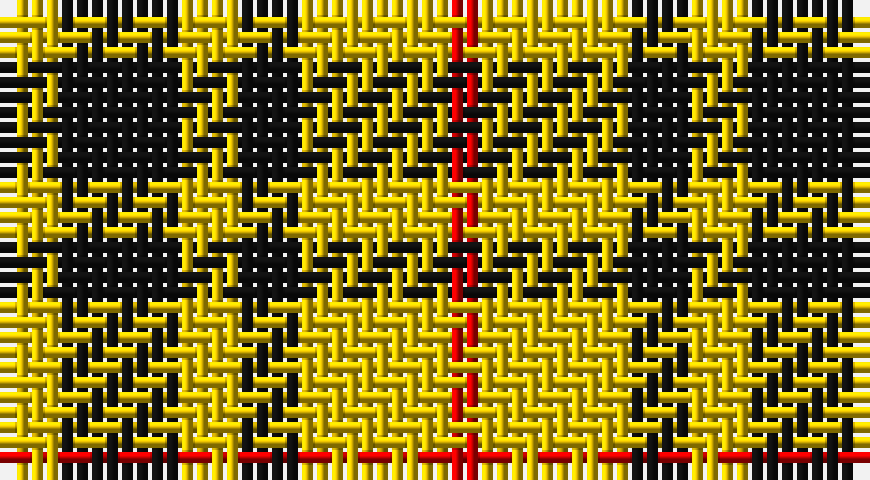

This page is one **sett** — a single exact thread-count. It belongs to the [tartan](/setts/ly2k4ly2k2ly5r1/)
(the same proportion at any scale), whose colour order is pattern [RYKYKY](/stripes/rykyky/).

Part of the [Lauder](/tartans/lauder/) tartan — the named design grouping this sett with its other cloths.

Sourced from register-of-tartans.  It is a [6 stripe tartan](/stripes/stripes6/).

Original link https://www.tartanregister.gov.uk/tartanDetails.aspx?ref=2056

2 attestations — the source records this cloth was collapsed from (oldest owns this page)

<ul>
<li>undated — Lauder (register-of-tartans, <a href="https://www.tartanregister.gov.uk/tartanDetails.aspx?ref=2056">record</a>)</li>
<li>undated — Lauder (weddslist, <a href="http://www.weddslist.com/cgi-bin/tartans/pg.pl?source=sts">record</a>)</li>
</ul>

## Register references

External register numbers recorded for this tartan.

- Scottish Register of Tartans: [2056](https://www.tartanregister.gov.uk/tartanDetails.aspx?ref=2056)
- Scottish Tartans World Register: 1718

## Thread count
Y/4 K8 Y4 K4 Y10 R/2

One full sett is **58 threads**.

## Palette

Palette: <strong>Logan (The Scottish Gael, 1831)</strong>
<table><thead><tr><th>Colour</th><th>Threads</th><th>Shade</th><th>Base</th><th>OKLCh</th></tr></thead><tbody><tr><td>Y/</td><td style="text-align:right;font-variant-numeric:tabular-nums">4</td><td><code style="background-color:#E8C000;">#E8C000</code> <small style="color:#888">#E8C000</small></td><td>Y <code style="background-color:#F2BF00;">#F2BF00</code></td><td><small style="color:#888">oklch(81.9% 0.168 93.7)</small></td></tr><tr><td>K</td><td style="text-align:right;font-variant-numeric:tabular-nums">8</td><td><code style="background-color:#101010;">#101010</code> <small style="color:#888">#101010</small></td><td>K <code style="background-color:#000000;">#000000</code></td><td><small style="color:#888">oklch(17.3% 0.000 89.9)</small></td></tr><tr><td>Y</td><td style="text-align:right;font-variant-numeric:tabular-nums">4</td><td><code style="background-color:#E8C000;">#E8C000</code> <small style="color:#888">#E8C000</small></td><td>Y <code style="background-color:#F2BF00;">#F2BF00</code></td><td><small style="color:#888">oklch(81.9% 0.168 93.7)</small></td></tr><tr><td>K</td><td style="text-align:right;font-variant-numeric:tabular-nums">4</td><td><code style="background-color:#101010;">#101010</code> <small style="color:#888">#101010</small></td><td>K <code style="background-color:#000000;">#000000</code></td><td><small style="color:#888">oklch(17.3% 0.000 89.9)</small></td></tr><tr><td>Y</td><td style="text-align:right;font-variant-numeric:tabular-nums">10</td><td><code style="background-color:#E8C000;">#E8C000</code> <small style="color:#888">#E8C000</small></td><td>Y <code style="background-color:#F2BF00;">#F2BF00</code></td><td><small style="color:#888">oklch(81.9% 0.168 93.7)</small></td></tr><tr><td>R/</td><td style="text-align:right;font-variant-numeric:tabular-nums">2</td><td><code style="background-color:#DC0000;">#DC0000</code> <small style="color:#888">#DC0000</small></td><td>R <code style="background-color:#CC0000;">#CC0000</code></td><td><small style="color:#888">oklch(56.2% 0.230 29.2)</small></td></tr></tbody></table>

# Sample pattern

## Compared to the master

This cloth is one sett of its design; the master sett (the exemplar the design is anchored on) is below for comparison.

<figure style="margin:0"><figcaption style="color:#888;font-size:smaller">this sett</figcaption></figure>
<figure style="margin:0"><figcaption style="color:#888;font-size:smaller"><a href="/setts/g3db8g3k4g15r2/">master sett →</a></figcaption></figure>

## Nearest tartans

The nearest existing variants by ΔTartan distance, with this tartan at the top so the swatches line up against it.

ΔTartan

Tartan

Sett

—

<a href="/ttd/edit/#slug=ly2k4ly2k2ly5r1~x2">Lauder</a> <a class="nn-out" href="/variants/s6/ly2k4ly2k2ly5r1~x2/" title="open its dictionary page">↗</a>

1.16

<a href="/ttd/edit/#slug=k4ly1k4ly6r1~x4&amp;base=ly2k4ly2k2ly5r1~x2">MacLeod Dress Clan Tartan</a> <a class="nn-out" href="/variants/s5/k4ly1k4ly6r1~x4/" title="open its dictionary page">↗</a>

1.42

<a href="/ttd/edit/#slug=w1ly6k6ly1~x8&amp;base=ly2k4ly2k2ly5r1~x2">Barclay Dress Clan Tartan</a> <a class="nn-out" href="/variants/s4/w1ly6k6ly1~x8/" title="open its dictionary page">↗</a>

1.47

<a href="/ttd/edit/#slug=w5ly32dt32ly5~x2&amp;base=ly2k4ly2k2ly5r1~x2">Barclay Dress</a> <a class="nn-out" href="/variants/s4/w5ly32dt32ly5~x2/" title="open its dictionary page">↗</a>

1.55

<a href="/ttd/edit/#slug=k2ly6k2ly11k9r1~x2&amp;base=ly2k4ly2k2ly5r1~x2">Porter Drinkers', The</a> <a class="nn-out" href="/variants/s6/k2ly6k2ly11k9r1~x2/" title="open its dictionary page">↗</a>

1.58

<a href="/ttd/edit/#slug=k15ly20w3~x2&amp;base=ly2k4ly2k2ly5r1~x2">Silvicola (Corporate)</a> <a class="nn-out" href="/variants/s3/k15ly20w3~x2/" title="open its dictionary page">↗</a>

1.59

<a href="/ttd/edit/#slug=k6ly1k6ly9r1ly2~x2&amp;base=ly2k4ly2k2ly5r1~x2">MacLeod #3</a> <a class="nn-out" href="/variants/s6/k6ly1k6ly9r1ly2~x2/" title="open its dictionary page">↗</a>

1.61

<a href="/ttd/edit/#slug=k10ly2k10w2k2ly13w3~x2&amp;base=ly2k4ly2k2ly5r1~x2">Nooten-Boom (Personal)</a> <a class="nn-out" href="/variants/s7/k10ly2k10w2k2ly13w3~x2/" title="open its dictionary page">↗</a>

1.75

<a href="/ttd/edit/#slug=w7k6lo15k16k8w3~x2&amp;base=ly2k4ly2k2ly5r1~x2">Longford County, Crest Range</a> <a class="nn-out" href="/variants/s6/w7k6lo15k16k8w3~x2/" title="open its dictionary page">↗</a>

1.79

<a href="/ttd/edit/#slug=w1ly6k6ly1~x2&amp;base=ly2k4ly2k2ly5r1~x2">Barclay Dress</a> <a class="nn-out" href="/variants/s4/w1ly6k6ly1~x2/" title="open its dictionary page">↗</a>

1.82

<a href="/ttd/edit/#slug=ly1r3dg7r3dg7r3ly1~x4&amp;base=ly2k4ly2k2ly5r1~x2">Unidentified #42</a> <a class="nn-out" href="/variants/s7/ly1r3dg7r3dg7r3ly1~x4/" title="open its dictionary page">↗</a>

## Neighbour map

Every grey dot is one of 14360 variants placed by the first two principal components of the ΔTartan feature space (44% of its variance). Red is this tartan; blue dots are its nearest — click one to open its page.

<svg viewBox="0 0 640 380" role="img" style="max-width:100%;height:auto;border:1px solid #e0e0e0;border-radius:4px;display:block" xmlns="http://www.w3.org/2000/svg"><image href="/nn/cloud.v1.png" width="640" height="380"/><a href="/variants/s5/k4ly1k4ly6r1~x4/"><circle cx="233.8" cy="251.7" r="4" fill="#3465a4"><title>MacLeod Dress Clan Tartan</title></circle></a><a href="/variants/s4/w1ly6k6ly1~x8/"><circle cx="240.6" cy="245.8" r="4" fill="#3465a4"><title>Barclay Dress Clan Tartan</title></circle></a><a href="/variants/s4/w5ly32dt32ly5~x2/"><circle cx="248.2" cy="242.4" r="4" fill="#3465a4"><title>Barclay Dress</title></circle></a><a href="/variants/s6/k2ly6k2ly11k9r1~x2/"><circle cx="286.5" cy="202.7" r="4" fill="#3465a4"><title>Porter Drinkers', The</title></circle></a><a href="/variants/s3/k15ly20w3~x2/"><circle cx="242.7" cy="268.6" r="4" fill="#3465a4"><title>Silvicola (Corporate)</title></circle></a><a href="/variants/s6/k6ly1k6ly9r1ly2~x2/"><circle cx="255.3" cy="217.7" r="4" fill="#3465a4"><title>MacLeod #3</title></circle></a><a href="/variants/s7/k10ly2k10w2k2ly13w3~x2/"><circle cx="234.8" cy="220.3" r="4" fill="#3465a4"><title>Nooten-Boom (Personal)</title></circle></a><a href="/variants/s6/w7k6lo15k16k8w3~x2/"><circle cx="217.3" cy="262.4" r="4" fill="#3465a4"><title>Longford County, Crest Range</title></circle></a><a href="/variants/s4/w1ly6k6ly1~x2/"><circle cx="233.8" cy="250.5" r="4" fill="#3465a4"><title>Barclay Dress</title></circle></a><a href="/variants/s7/ly1r3dg7r3dg7r3ly1~x4/"><circle cx="300.3" cy="245.0" r="4" fill="#3465a4"><title>Unidentified #42</title></circle></a><circle cx="236.3" cy="255.6" r="5" fill="#c00000"/></svg>

ID: /variants/s6/ly2k4ly2k2ly5r1~x2/
