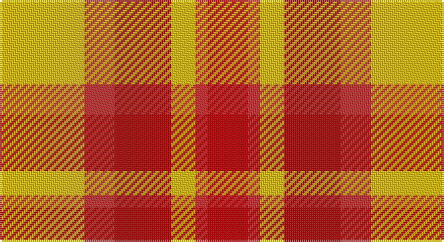

This page is one **sett** — a single exact thread-count. It belongs to the [tartan](/setts/ly42r15ri28ly12r6ri20/)
(the same proportion at any scale), whose colour order is pattern [RRYRRY](/stripes/rryrry/).

Part of the [Kozlosky](/tartans/kozlosky/) tartan — the named design grouping this sett with its other cloths.

Sourced from weddslist.  It is a [6 stripe tartan](/stripes/stripes6/).

Original link http://www.weddslist.com/cgi-bin/tartans/pg.pl?source=sts

## Also known as

This cloth is also recorded under:

- Kozlosky, Kilt

## Thread count
Y/42 R15 Ra28 Y12 R6 Ra/20

One full sett is **184 threads**.

## Palette

Palette: <strong>custom</strong>
<table><thead><tr><th>Colour</th><th>Threads</th><th>Shade</th><th>Base</th><th>OKLCh</th></tr></thead><tbody><tr><td>Y/</td><td style="text-align:right;font-variant-numeric:tabular-nums">42</td><td><code style="background-color:#F0C000;">#F0C000</code> <small style="color:#888">#F0C000</small></td><td>Y <code style="background-color:#F2BF00;">#F2BF00</code></td><td><small style="color:#888">oklch(82.7% 0.169 90.5)</small></td></tr><tr><td>R</td><td style="text-align:right;font-variant-numeric:tabular-nums">15</td><td><code style="background-color:#D03030;">#D03030</code> <small style="color:#888">#D03030</small></td><td>R <code style="background-color:#CC0000;">#CC0000</code></td><td><small style="color:#888">oklch(56.4% 0.196 26.2)</small></td></tr><tr><td>Ra</td><td style="text-align:right;font-variant-numeric:tabular-nums">28</td><td><code style="background-color:#C00000;">#C00000</code> <small style="color:#888">#C00000</small></td><td>R <code style="background-color:#CC0000;">#CC0000</code></td><td><small style="color:#888">oklch(50.7% 0.208 29.2)</small></td></tr><tr><td>Y</td><td style="text-align:right;font-variant-numeric:tabular-nums">12</td><td><code style="background-color:#F0C000;">#F0C000</code> <small style="color:#888">#F0C000</small></td><td>Y <code style="background-color:#F2BF00;">#F2BF00</code></td><td><small style="color:#888">oklch(82.7% 0.169 90.5)</small></td></tr><tr><td>R</td><td style="text-align:right;font-variant-numeric:tabular-nums">6</td><td><code style="background-color:#D03030;">#D03030</code> <small style="color:#888">#D03030</small></td><td>R <code style="background-color:#CC0000;">#CC0000</code></td><td><small style="color:#888">oklch(56.4% 0.196 26.2)</small></td></tr><tr><td>Ra/</td><td style="text-align:right;font-variant-numeric:tabular-nums">20</td><td><code style="background-color:#C00000;">#C00000</code> <small style="color:#888">#C00000</small></td><td>R <code style="background-color:#CC0000;">#CC0000</code></td><td><small style="color:#888">oklch(50.7% 0.208 29.2)</small></td></tr></tbody></table>

# Sample pattern

## Compared to the master

This cloth is one sett of its design; the master sett (the exemplar the design is anchored on) is below for comparison.

<figure style="margin:0"><figcaption style="color:#888;font-size:smaller">this sett</figcaption></figure>
<figure style="margin:0"><figcaption style="color:#888;font-size:smaller"><a href="/setts/ly21ri8r14ly6ri3r10/">master sett →</a></figcaption></figure>

## Nearest tartans

The nearest existing variants by ΔTartan distance, with this tartan at the top so the swatches line up against it.

ΔTartan

Tartan

Sett

—

<a href="/ttd/edit/#slug=ly42r15ri28ly12r6ri20">Kozlosky, Kilt</a> <a class="nn-out" href="/variants/s6/ly42r15ri28ly12r6ri20/" title="open its dictionary page">↗</a>

0.42

<a href="/ttd/edit/#slug=ly21ri8r14ly6ri3r10~x2&amp;base=ly42r15ri28ly12r6ri20">Kozlosky (Personal)</a> <a class="nn-out" href="/variants/s6/ly21ri8r14ly6ri3r10~x2/" title="open its dictionary page">↗</a>

1.12

<a href="/ttd/edit/#slug=o2ly10r15o10ly2~x4&amp;base=ly42r15ri28ly12r6ri20">Harmony, 9</a> <a class="nn-out" href="/variants/s5/o2ly10r15o10ly2~x4/" title="open its dictionary page">↗</a>

1.23

<a href="/variants/s10/ly21ri8r14ly6ri3r10~x2/">Kozlosky (Personal)</a>

1.34

<a href="/ttd/edit/#slug=dy2ly10r15dy10ly2~x4&amp;base=ly42r15ri28ly12r6ri20">Harmony 9</a> <a class="nn-out" href="/variants/s5/dy2ly10r15dy10ly2~x4/" title="open its dictionary page">↗</a>

1.89

<a href="/ttd/edit/#slug=r18ly3r18ly30k4~x2&amp;base=ly42r15ri28ly12r6ri20">Shire of Hornwood (USA)</a> <a class="nn-out" href="/variants/s5/r18ly3r18ly30k4~x2/" title="open its dictionary page">↗</a>

1.90

<a href="/ttd/edit/#slug=r4lyi1r3ly1lyi8ly2~x4&amp;base=ly42r15ri28ly12r6ri20">Buchele Check (Fashion?)</a> <a class="nn-out" href="/variants/s6/r4lyi1r3ly1lyi8ly2~x4/" title="open its dictionary page">↗</a>

2.05

<a href="/ttd/edit/#slug=w1r5dy5ly1~x4&amp;base=ly42r15ri28ly12r6ri20">Manx Mannin Plaid</a> <a class="nn-out" href="/variants/s4/w1r5dy5ly1~x4/" title="open its dictionary page">↗</a>

2.05

<a href="/ttd/edit/#slug=w1r5o5ly1~x4&amp;base=ly42r15ri28ly12r6ri20">Manx, Mannin Plaid</a> <a class="nn-out" href="/variants/s4/w1r5o5ly1~x4/" title="open its dictionary page">↗</a>

2.09

<a href="/ttd/edit/#slug=w11r32g12r5g12r5~x2&amp;base=ly42r15ri28ly12r6ri20">Al-Maktoum</a> <a class="nn-out" href="/variants/s6/w11r32g12r5g12r5~x2/" title="open its dictionary page">↗</a>

2.13

<a href="/ttd/edit/#slug=db4ly1r12ly2r2ly12r1ly4~x4&amp;base=ly42r15ri28ly12r6ri20">Glassary #3</a> <a class="nn-out" href="/variants/s8/db4ly1r12ly2r2ly12r1ly4~x4/" title="open its dictionary page">↗</a>

## Neighbour map

Every grey dot is one of 14360 variants placed by the first two principal components of the ΔTartan feature space (44% of its variance). Red is this tartan; blue dots are its nearest — click one to open its page.

<svg viewBox="0 0 640 380" role="img" style="max-width:100%;height:auto;border:1px solid #e0e0e0;border-radius:4px;display:block" xmlns="http://www.w3.org/2000/svg"><image href="/nn/cloud.v1.png" width="640" height="380"/><a href="/variants/s6/ly21ri8r14ly6ri3r10~x2/"><circle cx="248.7" cy="246.8" r="4" fill="#3465a4"><title>Kozlosky (Personal)</title></circle></a><a href="/variants/s5/o2ly10r15o10ly2~x4/"><circle cx="232.7" cy="246.9" r="4" fill="#3465a4"><title>Harmony, 9</title></circle></a><a href="/variants/s10/ly21ri8r14ly6ri3r10~x2/"><circle cx="230.3" cy="226.6" r="4" fill="#3465a4"><title>Kozlosky (Personal)</title></circle></a><a href="/variants/s5/dy2ly10r15dy10ly2~x4/"><circle cx="210.7" cy="236.3" r="4" fill="#3465a4"><title>Harmony 9</title></circle></a><a href="/variants/s5/r18ly3r18ly30k4~x2/"><circle cx="282.7" cy="204.7" r="4" fill="#3465a4"><title>Shire of Hornwood (USA)</title></circle></a><a href="/variants/s6/r4lyi1r3ly1lyi8ly2~x4/"><circle cx="259.3" cy="217.0" r="4" fill="#3465a4"><title>Buchele Check (Fashion?)</title></circle></a><a href="/variants/s4/w1r5dy5ly1~x4/"><circle cx="209.4" cy="248.1" r="4" fill="#3465a4"><title>Manx Mannin Plaid</title></circle></a><a href="/variants/s4/w1r5o5ly1~x4/"><circle cx="241.6" cy="264.2" r="4" fill="#3465a4"><title>Manx, Mannin Plaid</title></circle></a><a href="/variants/s6/w11r32g12r5g12r5~x2/"><circle cx="274.8" cy="229.0" r="4" fill="#3465a4"><title>Al-Maktoum</title></circle></a><a href="/variants/s8/db4ly1r12ly2r2ly12r1ly4~x4/"><circle cx="296.7" cy="172.1" r="4" fill="#3465a4"><title>Glassary #3</title></circle></a><circle cx="247.1" cy="242.8" r="5" fill="#c00000"/></svg>

ID: /variants/s6/ly42r15ri28ly12r6ri20/
