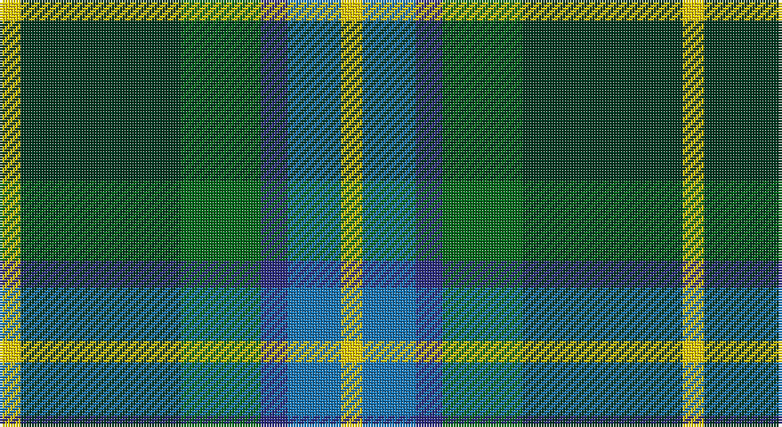

This page is one **sett** — a single exact thread-count. It belongs to the [tartan](/setts/ly4dg30g15db5b10ly4/)
(the same proportion at any scale), whose colour order is pattern [YBBGGY](/stripes/ybbggy/).

Sourced from tartans-authority.  It is a [6 stripe tartan](/stripes/stripes6/).

Original link http://www.tartansauthority.com/tartan-ferret/display/10711/

## Register references

External register numbers recorded for this tartan.

- Scottish Register of Tartans: [10711](https://www.tartanregister.gov.uk/tartanDetails?ref=10711)
- Scottish Tartans Authority (ITI): 10711

## Thread count
Y/8 DG60 G30 DB10 B20 Y/8

One full sett is **256 threads**.

## Palette

Palette: <strong>Tartan Register</strong>
<table><thead><tr><th>Colour</th><th>Threads</th><th>Shade</th><th>Base</th><th>OKLCh</th></tr></thead><tbody><tr><td>Y/</td><td style="text-align:right;font-variant-numeric:tabular-nums">8</td><td><code style="background-color:#FCCC00;">#FCCC00</code> <small style="color:#888">#FCCC00</small></td><td>Y <code style="background-color:#F2BF00;">#F2BF00</code></td><td><small style="color:#888">oklch(86.2% 0.176 91.5)</small></td></tr><tr><td>DG</td><td style="text-align:right;font-variant-numeric:tabular-nums">60</td><td><code style="background-color:#003820;">#003820</code> <small style="color:#888">#003820</small></td><td>G <code style="background-color:#006100;">#006100</code></td><td><small style="color:#888">oklch(30.0% 0.070 158.3)</small></td></tr><tr><td>G</td><td style="text-align:right;font-variant-numeric:tabular-nums">30</td><td><code style="background-color:#006818;">#006818</code> <small style="color:#888">#006818</small></td><td>G <code style="background-color:#006100;">#006100</code></td><td><small style="color:#888">oklch(45.0% 0.142 145.0)</small></td></tr><tr><td>DB</td><td style="text-align:right;font-variant-numeric:tabular-nums">10</td><td><code style="background-color:#2C2C80;">#2C2C80</code> <small style="color:#888">#2C2C80</small></td><td>B <code style="background-color:#2A418A;">#2A418A</code></td><td><small style="color:#888">oklch(35.0% 0.138 276.6)</small></td></tr><tr><td>B</td><td style="text-align:right;font-variant-numeric:tabular-nums">20</td><td><code style="background-color:#1474B4;">#1474B4</code> <small style="color:#888">#1474B4</small></td><td>B <code style="background-color:#2A418A;">#2A418A</code></td><td><small style="color:#888">oklch(54.0% 0.129 245.1)</small></td></tr><tr><td>Y/</td><td style="text-align:right;font-variant-numeric:tabular-nums">8</td><td><code style="background-color:#FCCC00;">#FCCC00</code> <small style="color:#888">#FCCC00</small></td><td>Y <code style="background-color:#F2BF00;">#F2BF00</code></td><td><small style="color:#888">oklch(86.2% 0.176 91.5)</small></td></tr></tbody></table>

# Sample pattern

## Nearest tartans

The nearest existing variants by ΔTartan distance, with this tartan at the top so the swatches line up against it.

ΔTartan

Tartan

Sett

—

<a href="/ttd/edit/#slug=ly4dg30g15db5b10ly4~x2">MPS Emerald Society</a> <a class="nn-out" href="/variants/s6/ly4dg30g15db5b10ly4~x2/" title="open its dictionary page">↗</a>

0.18

<a href="/ttd/edit/#slug=ly4dg30g15db5t10ly4~x2&amp;base=ly4dg30g15db5b10ly4~x2">MPS Emerald Society NCLEES 2012</a> <a class="nn-out" href="/variants/s6/ly4dg30g15db5t10ly4~x2/" title="open its dictionary page">↗</a>

0.86

<a href="/ttd/edit/#slug=g31ly4g6k19db18t9~x2&amp;base=ly4dg30g15db5b10ly4~x2">Lanarkshire</a> <a class="nn-out" href="/variants/s6/g31ly4g6k19db18t9~x2/" title="open its dictionary page">↗</a>

0.90

<a href="/ttd/edit/#slug=g10db42r5dg42g42ly5g10&amp;base=ly4dg30g15db5b10ly4~x2">New Mexico</a> <a class="nn-out" href="/variants/s7/g10db42r5dg42g42ly5g10/" title="open its dictionary page">↗</a>

0.92

<a href="/ttd/edit/#slug=k5g30ly3b15k15b7w3~x2&amp;base=ly4dg30g15db5b10ly4~x2">Dick (Personal)</a> <a class="nn-out" href="/variants/s7/k5g30ly3b15k15b7w3~x2/" title="open its dictionary page">↗</a>

0.97

<a href="/ttd/edit/#slug=k22g21k5g12t12o3w4~x2&amp;base=ly4dg30g15db5b10ly4~x2">Disciples of Christ Motorcycle Ministry (Switzerland)</a> <a class="nn-out" href="/variants/s7/k22g21k5g12t12o3w4~x2/" title="open its dictionary page">↗</a>

0.99

<a href="/ttd/edit/#slug=gi9g1p2g1db4r1~x12&amp;base=ly4dg30g15db5b10ly4~x2">Gorman, George (Personal)</a> <a class="nn-out" href="/variants/s6/gi9g1p2g1db4r1~x12/" title="open its dictionary page">↗</a>

1.02

<a href="/ttd/edit/#slug=r3k2g20k10b20ly2~x2&amp;base=ly4dg30g15db5b10ly4~x2">MacLeod of Assynt</a> <a class="nn-out" href="/variants/s6/r3k2g20k10b20ly2~x2/" title="open its dictionary page">↗</a>

1.03

<a href="/ttd/edit/#slug=r7ly3g28db28w3~x2&amp;base=ly4dg30g15db5b10ly4~x2">Turnbull, hunting</a> <a class="nn-out" href="/variants/s5/r7ly3g28db28w3~x2/" title="open its dictionary page">↗</a>

1.05

<a href="/ttd/edit/#slug=db18r3k9r3g23ly3~x2&amp;base=ly4dg30g15db5b10ly4~x2">Royal College of Physicians (Corp)</a> <a class="nn-out" href="/variants/s6/db18r3k9r3g23ly3~x2/" title="open its dictionary page">↗</a>

1.10

<a href="/ttd/edit/#slug=r3db22k11g32ly3~x2&amp;base=ly4dg30g15db5b10ly4~x2">Cultoquhey Hotel</a> <a class="nn-out" href="/variants/s5/r3db22k11g32ly3~x2/" title="open its dictionary page">↗</a>

## Neighbour map

Every grey dot is one of 14360 variants placed by the first two principal components of the ΔTartan feature space (44% of its variance). Red is this tartan; blue dots are its nearest — click one to open its page.

<svg viewBox="0 0 640 380" role="img" style="max-width:100%;height:auto;border:1px solid #e0e0e0;border-radius:4px;display:block" xmlns="http://www.w3.org/2000/svg"><image href="/nn/cloud.v1.png" width="640" height="380"/><a href="/variants/s6/ly4dg30g15db5t10ly4~x2/"><circle cx="174.5" cy="213.8" r="4" fill="#3465a4"><title>MPS Emerald Society NCLEES 2012</title></circle></a><a href="/variants/s6/g31ly4g6k19db18t9~x2/"><circle cx="165.1" cy="233.2" r="4" fill="#3465a4"><title>Lanarkshire</title></circle></a><a href="/variants/s7/g10db42r5dg42g42ly5g10/"><circle cx="187.8" cy="219.0" r="4" fill="#3465a4"><title>New Mexico</title></circle></a><a href="/variants/s7/k5g30ly3b15k15b7w3~x2/"><circle cx="159.9" cy="191.6" r="4" fill="#3465a4"><title>Dick (Personal)</title></circle></a><a href="/variants/s7/k22g21k5g12t12o3w4~x2/"><circle cx="156.0" cy="222.3" r="4" fill="#3465a4"><title>Disciples of Christ Motorcycle Ministry (Switzerland)</title></circle></a><a href="/variants/s6/gi9g1p2g1db4r1~x12/"><circle cx="246.8" cy="203.5" r="4" fill="#3465a4"><title>Gorman, George (Personal)</title></circle></a><a href="/variants/s6/r3k2g20k10b20ly2~x2/"><circle cx="169.4" cy="203.8" r="4" fill="#3465a4"><title>MacLeod of Assynt</title></circle></a><a href="/variants/s5/r7ly3g28db28w3~x2/"><circle cx="206.8" cy="209.7" r="4" fill="#3465a4"><title>Turnbull, hunting</title></circle></a><a href="/variants/s6/db18r3k9r3g23ly3~x2/"><circle cx="168.5" cy="211.9" r="4" fill="#3465a4"><title>Royal College of Physicians (Corp)</title></circle></a><a href="/variants/s5/r3db22k11g32ly3~x2/"><circle cx="226.3" cy="218.7" r="4" fill="#3465a4"><title>Cultoquhey Hotel</title></circle></a><circle cx="178.3" cy="214.8" r="5" fill="#c00000"/></svg>

ID: /variants/s6/ly4dg30g15db5b10ly4~x2/
