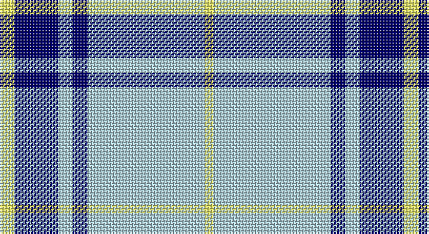

This page is one **sett** — a single exact thread-count. It belongs to the [tartan](/setts/ly5db15lb5db5lb40ly3/)
(the same proportion at any scale), whose colour order is pattern [YBWBWY](/stripes/ybwbwy/).

Sourced from register-of-tartans.  It is a [6 stripe tartan](/stripes/stripes6/).

Original link https://www.tartanregister.gov.uk/tartanDetails.aspx?ref=10041

2 attestations — the source records this cloth was collapsed from (oldest owns this page)

<ul>
<li>27/05/2009 — Legary (register-of-tartans, <a href="https://www.tartanregister.gov.uk/tartanDetails.aspx?ref=10041">record</a>)</li>
<li>27th May 2009 — Legary (Name) (tartans-authority, <a href="http://www.tartansauthority.com/tartan-ferret/display/10041/">record</a>)</li>
</ul>

## Register references

External register numbers recorded for this tartan.

- Scottish Register of Tartans: [10041](https://www.tartanregister.gov.uk/tartanDetails?ref=10041)
- Scottish Tartans Authority (ITI): 10041

## Thread count
LY/10 DB30 LB10 DB10 LB80 LY/6

One full sett is **276 threads**.

## Palette

Palette: <strong>custom</strong>
<table><thead><tr><th>Colour</th><th>Threads</th><th>Shade</th><th>Base</th><th>OKLCh</th></tr></thead><tbody><tr><td>LY/</td><td style="text-align:right;font-variant-numeric:tabular-nums">10</td><td><code style="background-color:#EFF265;">#EFF265</code> <small style="color:#888">#EFF265</small></td><td>Y <code style="background-color:#F2BF00;">#F2BF00</code></td><td><small style="color:#888">oklch(93.3% 0.162 110.3)</small></td></tr><tr><td>DB</td><td style="text-align:right;font-variant-numeric:tabular-nums">30</td><td><code style="background-color:#00006B;">#00006B</code> <small style="color:#888">#00006B</small></td><td>B <code style="background-color:#2A418A;">#2A418A</code></td><td><small style="color:#888">oklch(23.9% 0.165 264.1)</small></td></tr><tr><td>LB</td><td style="text-align:right;font-variant-numeric:tabular-nums">10</td><td><code style="background-color:#ABCDD9;">#ABCDD9</code> <small style="color:#888">#ABCDD9</small></td><td>W <code style="background-color:#F7F7F7;">#F7F7F7</code></td><td><small style="color:#888">oklch(82.7% 0.040 221.2)</small></td></tr><tr><td>DB</td><td style="text-align:right;font-variant-numeric:tabular-nums">10</td><td><code style="background-color:#00006B;">#00006B</code> <small style="color:#888">#00006B</small></td><td>B <code style="background-color:#2A418A;">#2A418A</code></td><td><small style="color:#888">oklch(23.9% 0.165 264.1)</small></td></tr><tr><td>LB</td><td style="text-align:right;font-variant-numeric:tabular-nums">80</td><td><code style="background-color:#ABCDD9;">#ABCDD9</code> <small style="color:#888">#ABCDD9</small></td><td>W <code style="background-color:#F7F7F7;">#F7F7F7</code></td><td><small style="color:#888">oklch(82.7% 0.040 221.2)</small></td></tr><tr><td>LY/</td><td style="text-align:right;font-variant-numeric:tabular-nums">6</td><td><code style="background-color:#EFF265;">#EFF265</code> <small style="color:#888">#EFF265</small></td><td>Y <code style="background-color:#F2BF00;">#F2BF00</code></td><td><small style="color:#888">oklch(93.3% 0.162 110.3)</small></td></tr></tbody></table>

# Sample pattern

## Nearest tartans

The nearest existing variants by ΔTartan distance, with this tartan at the top so the swatches line up against it.

ΔTartan

Tartan

Sett

—

<a href="/ttd/edit/#slug=ly5db15lb5db5lb40ly3~x2">Legary</a> <a class="nn-out" href="/variants/s6/ly5db15lb5db5lb40ly3~x2/" title="open its dictionary page">↗</a>

1.12

<a href="/ttd/edit/#slug=lb1lg11k6lg3lb1lg1lb1~x4&amp;base=ly5db15lb5db5lb40ly3~x2">Angle, Blue (Fashion)</a> <a class="nn-out" href="/variants/s7/lb1lg11k6lg3lb1lg1lb1~x4/" title="open its dictionary page">↗</a>

1.22

<a href="/ttd/edit/#slug=db9lb27db2k4db2lb10db2w3~x2&amp;base=ly5db15lb5db5lb40ly3~x2">Alaska Highlanders Pipes &amp; Drums Corporate Tartan</a> <a class="nn-out" href="/variants/s8/db9lb27db2k4db2lb10db2w3~x2/" title="open its dictionary page">↗</a>

1.29

<a href="/ttd/edit/#slug=db9lb27db2ly4db2lb10db2w3~x2&amp;base=ly5db15lb5db5lb40ly3~x2">Alaska Highlanders P &amp; D (Corporate)</a> <a class="nn-out" href="/variants/s8/db9lb27db2ly4db2lb10db2w3~x2/" title="open its dictionary page">↗</a>

1.39

<a href="/ttd/edit/#slug=t37w9t3db9w3~x2&amp;base=ly5db15lb5db5lb40ly3~x2">Loch Lomond</a> <a class="nn-out" href="/variants/s5/t37w9t3db9w3~x2/" title="open its dictionary page">↗</a>

1.41

<a href="/ttd/edit/#slug=db23w8lb2k5w44db4~x2&amp;base=ly5db15lb5db5lb40ly3~x2">WaterAid</a> <a class="nn-out" href="/variants/s6/db23w8lb2k5w44db4~x2/" title="open its dictionary page">↗</a>

1.49

<a href="/ttd/edit/#slug=w5db16w5db16w33r3~x2&amp;base=ly5db15lb5db5lb40ly3~x2">Buchanan Dress Blue (Dance)</a> <a class="nn-out" href="/variants/s6/w5db16w5db16w33r3~x2/" title="open its dictionary page">↗</a>

1.51

<a href="/ttd/edit/#slug=w6b3w20k2w3k25w3~x2&amp;base=ly5db15lb5db5lb40ly3~x2">Forbes Dress (Clans Originaux)</a> <a class="nn-out" href="/variants/s7/w6b3w20k2w3k25w3~x2/" title="open its dictionary page">↗</a>

1.52

<a href="/ttd/edit/#slug=b12ly1w16b1w1b14w3b14r2~x4&amp;base=ly5db15lb5db5lb40ly3~x2">Orlando Dress, City of (District)</a> <a class="nn-out" href="/variants/s9/b12ly1w16b1w1b14w3b14r2~x4/" title="open its dictionary page">↗</a>

1.56

<a href="/ttd/edit/#slug=dt3n2w2n30w30r2w3~x2&amp;base=ly5db15lb5db5lb40ly3~x2">Torridon, Royal Blue (Dance)</a> <a class="nn-out" href="/variants/s7/dt3n2w2n30w30r2w3~x2/" title="open its dictionary page">↗</a>

1.59

<a href="/ttd/edit/#slug=w7db16w20db3w3ly3~x2&amp;base=ly5db15lb5db5lb40ly3~x2">Unidentified (Shirt)</a> <a class="nn-out" href="/variants/s6/w7db16w20db3w3ly3~x2/" title="open its dictionary page">↗</a>

## Neighbour map

Every grey dot is one of 14360 variants placed by the first two principal components of the ΔTartan feature space (44% of its variance). Red is this tartan; blue dots are its nearest — click one to open its page.

<svg viewBox="0 0 640 380" role="img" style="max-width:100%;height:auto;border:1px solid #e0e0e0;border-radius:4px;display:block" xmlns="http://www.w3.org/2000/svg"><image href="/nn/cloud.v1.png" width="640" height="380"/><a href="/variants/s7/lb1lg11k6lg3lb1lg1lb1~x4/"><circle cx="337.9" cy="192.6" r="4" fill="#3465a4"><title>Angle, Blue (Fashion)</title></circle></a><a href="/variants/s8/db9lb27db2k4db2lb10db2w3~x2/"><circle cx="319.0" cy="150.7" r="4" fill="#3465a4"><title>Alaska Highlanders Pipes &amp; Drums Corporate Tartan</title></circle></a><a href="/variants/s8/db9lb27db2ly4db2lb10db2w3~x2/"><circle cx="332.5" cy="153.9" r="4" fill="#3465a4"><title>Alaska Highlanders P &amp; D (Corporate)</title></circle></a><a href="/variants/s5/t37w9t3db9w3~x2/"><circle cx="381.7" cy="206.8" r="4" fill="#3465a4"><title>Loch Lomond</title></circle></a><a href="/variants/s6/db23w8lb2k5w44db4~x2/"><circle cx="318.6" cy="135.4" r="4" fill="#3465a4"><title>WaterAid</title></circle></a><a href="/variants/s6/w5db16w5db16w33r3~x2/"><circle cx="282.6" cy="195.7" r="4" fill="#3465a4"><title>Buchanan Dress Blue (Dance)</title></circle></a><a href="/variants/s7/w6b3w20k2w3k25w3~x2/"><circle cx="281.1" cy="170.5" r="4" fill="#3465a4"><title>Forbes Dress (Clans Originaux)</title></circle></a><a href="/variants/s9/b12ly1w16b1w1b14w3b14r2~x4/"><circle cx="339.5" cy="160.7" r="4" fill="#3465a4"><title>Orlando Dress, City of (District)</title></circle></a><a href="/variants/s7/dt3n2w2n30w30r2w3~x2/"><circle cx="284.2" cy="142.4" r="4" fill="#3465a4"><title>Torridon, Royal Blue (Dance)</title></circle></a><a href="/variants/s6/w7db16w20db3w3ly3~x2/"><circle cx="285.1" cy="219.6" r="4" fill="#3465a4"><title>Unidentified (Shirt)</title></circle></a><circle cx="332.9" cy="176.2" r="5" fill="#c00000"/></svg>

ID: /variants/s6/ly5db15lb5db5lb40ly3~x2/
