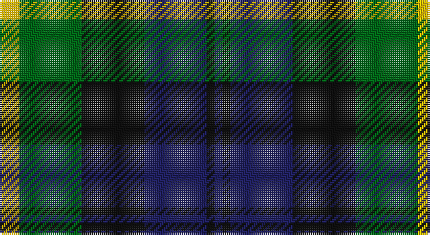

This page is one **sett** — a single exact thread-count. It belongs to the [tartan](/setts/ly5g16k16db16k2db2/)
(the same proportion at any scale), whose colour order is pattern [BKBKGY](/stripes/bkbkgy/).

Sourced from tartans-authority.  It is a [6 stripe tartan](/stripes/stripes6/).

Original link http://www.tartansauthority.com/tartan-ferret/display/8389/

## Register references

External register numbers recorded for this tartan.

- Scottish Tartans Authority (ITI): 8389

## Thread count
Y/10 G32 K32 DB32 K4 DB/4

One full sett is **214 threads**.

## Palette

Palette: <strong>Tartan Register</strong>
<table><thead><tr><th>Colour</th><th>Threads</th><th>Shade</th><th>Base</th><th>OKLCh</th></tr></thead><tbody><tr><td>Y/</td><td style="text-align:right;font-variant-numeric:tabular-nums">10</td><td><code style="background-color:#E8C000;">#E8C000</code> <small style="color:#888">#E8C000</small></td><td>Y <code style="background-color:#F2BF00;">#F2BF00</code></td><td><small style="color:#888">oklch(81.9% 0.168 93.7)</small></td></tr><tr><td>G</td><td style="text-align:right;font-variant-numeric:tabular-nums">32</td><td><code style="background-color:#006818;">#006818</code> <small style="color:#888">#006818</small></td><td>G <code style="background-color:#006100;">#006100</code></td><td><small style="color:#888">oklch(45.0% 0.142 145.0)</small></td></tr><tr><td>K</td><td style="text-align:right;font-variant-numeric:tabular-nums">32</td><td><code style="background-color:#101010;">#101010</code> <small style="color:#888">#101010</small></td><td>K <code style="background-color:#000000;">#000000</code></td><td><small style="color:#888">oklch(17.3% 0.000 89.9)</small></td></tr><tr><td>DB</td><td style="text-align:right;font-variant-numeric:tabular-nums">32</td><td><code style="background-color:#202060;">#202060</code> <small style="color:#888">#202060</small></td><td>B <code style="background-color:#2A418A;">#2A418A</code></td><td><small style="color:#888">oklch(28.9% 0.111 276.9)</small></td></tr><tr><td>K</td><td style="text-align:right;font-variant-numeric:tabular-nums">4</td><td><code style="background-color:#101010;">#101010</code> <small style="color:#888">#101010</small></td><td>K <code style="background-color:#000000;">#000000</code></td><td><small style="color:#888">oklch(17.3% 0.000 89.9)</small></td></tr><tr><td>DB/</td><td style="text-align:right;font-variant-numeric:tabular-nums">4</td><td><code style="background-color:#202060;">#202060</code> <small style="color:#888">#202060</small></td><td>B <code style="background-color:#2A418A;">#2A418A</code></td><td><small style="color:#888">oklch(28.9% 0.111 276.9)</small></td></tr></tbody></table>

# Sample pattern

## Nearest tartans

The nearest existing variants by ΔTartan distance, with this tartan at the top so the swatches line up against it.

ΔTartan

Tartan

Sett

—

<a href="/ttd/edit/#slug=ly5g16k16db16k2db2~x2">Hudson Valley Reg. Police P &amp; D (Cor</a> <a class="nn-out" href="/variants/s6/ly5g16k16db16k2db2~x2/" title="open its dictionary page">↗</a>

0.62

<a href="/ttd/edit/#slug=w4db4dg22k20db20w3&amp;base=ly5g16k16db16k2db2~x2">Unidentified No 26</a> <a class="nn-out" href="/variants/s6/w4db4dg22k20db20w3/" title="open its dictionary page">↗</a>

0.62

<a href="/ttd/edit/#slug=k3g14k14g2b14r3~x2&amp;base=ly5g16k16db16k2db2~x2">Morrison Society</a> <a class="nn-out" href="/variants/s6/k3g14k14g2b14r3~x2/" title="open its dictionary page">↗</a>

0.66

<a href="/ttd/edit/#slug=db2k2db12k11g16w2~x2&amp;base=ly5g16k16db16k2db2~x2">Campbell of Argyll (Smiths)</a> <a class="nn-out" href="/variants/s6/db2k2db12k11g16w2~x2/" title="open its dictionary page">↗</a>

0.89

<a href="/ttd/edit/#slug=r4g12k12g2db12g3~x2&amp;base=ly5g16k16db16k2db2~x2">Gunn - 1810 (Clan)</a> <a class="nn-out" href="/variants/s6/r4g12k12g2db12g3~x2/" title="open its dictionary page">↗</a>

0.92

<a href="/ttd/edit/#slug=ly6dg3ly3dg22k23dp23k4~x2&amp;base=ly5g16k16db16k2db2~x2">Gordon of Esslemont</a> <a class="nn-out" href="/variants/s7/ly6dg3ly3dg22k23dp23k4~x2/" title="open its dictionary page">↗</a>

0.93

<a href="/ttd/edit/#slug=db3r1db10k8g10r1g3~x4&amp;base=ly5g16k16db16k2db2~x2">Blair</a> <a class="nn-out" href="/variants/s7/db3r1db10k8g10r1g3~x4/" title="open its dictionary page">↗</a>

0.95

<a href="/ttd/edit/#slug=b10k3b10k14r2g14r5~x2&amp;base=ly5g16k16db16k2db2~x2">Fletcher of Dunans</a> <a class="nn-out" href="/variants/s7/b10k3b10k14r2g14r5~x2/" title="open its dictionary page">↗</a>

0.95

<a href="/ttd/edit/#slug=ly8k4o39k37dt36k6dt7&amp;base=ly5g16k16db16k2db2~x2">Oceanic (Corporate?)</a> <a class="nn-out" href="/variants/s7/ly8k4o39k37dt36k6dt7/" title="open its dictionary page">↗</a>

0.95

<a href="/ttd/edit/#slug=k3g14k14g2db14r3~x2&amp;base=ly5g16k16db16k2db2~x2">Morrison</a> <a class="nn-out" href="/variants/s6/k3g14k14g2db14r3~x2/" title="open its dictionary page">↗</a>

0.97

<a href="/ttd/edit/#slug=db2k2db12k8g11r2~x2&amp;base=ly5g16k16db16k2db2~x2">Murray</a> <a class="nn-out" href="/variants/s6/db2k2db12k8g11r2~x2/" title="open its dictionary page">↗</a>

## Neighbour map

Every grey dot is one of 14360 variants placed by the first two principal components of the ΔTartan feature space (44% of its variance). Red is this tartan; blue dots are its nearest — click one to open its page.

<svg viewBox="0 0 640 380" role="img" style="max-width:100%;height:auto;border:1px solid #e0e0e0;border-radius:4px;display:block" xmlns="http://www.w3.org/2000/svg"><image href="/nn/cloud.v1.png" width="640" height="380"/><a href="/variants/s6/w4db4dg22k20db20w3/"><circle cx="150.1" cy="240.9" r="4" fill="#3465a4"><title>Unidentified No 26</title></circle></a><a href="/variants/s6/k3g14k14g2b14r3~x2/"><circle cx="163.0" cy="248.5" r="4" fill="#3465a4"><title>Morrison Society</title></circle></a><a href="/variants/s6/db2k2db12k11g16w2~x2/"><circle cx="184.6" cy="238.2" r="4" fill="#3465a4"><title>Campbell of Argyll (Smiths)</title></circle></a><a href="/variants/s6/r4g12k12g2db12g3~x2/"><circle cx="167.6" cy="264.9" r="4" fill="#3465a4"><title>Gunn - 1810 (Clan)</title></circle></a><a href="/variants/s7/ly6dg3ly3dg22k23dp23k4~x2/"><circle cx="148.6" cy="218.3" r="4" fill="#3465a4"><title>Gordon of Esslemont</title></circle></a><a href="/variants/s7/db3r1db10k8g10r1g3~x4/"><circle cx="167.2" cy="214.6" r="4" fill="#3465a4"><title>Blair</title></circle></a><a href="/variants/s7/b10k3b10k14r2g14r5~x2/"><circle cx="141.7" cy="251.8" r="4" fill="#3465a4"><title>Fletcher of Dunans</title></circle></a><a href="/variants/s7/ly8k4o39k37dt36k6dt7/"><circle cx="172.9" cy="210.3" r="4" fill="#3465a4"><title>Oceanic (Corporate?)</title></circle></a><a href="/variants/s6/k3g14k14g2db14r3~x2/"><circle cx="137.1" cy="236.8" r="4" fill="#3465a4"><title>Morrison</title></circle></a><a href="/variants/s6/db2k2db12k8g11r2~x2/"><circle cx="152.3" cy="241.4" r="4" fill="#3465a4"><title>Murray</title></circle></a><circle cx="151.4" cy="240.0" r="5" fill="#c00000"/></svg>

ID: /variants/s6/ly5g16k16db16k2db2~x2/
