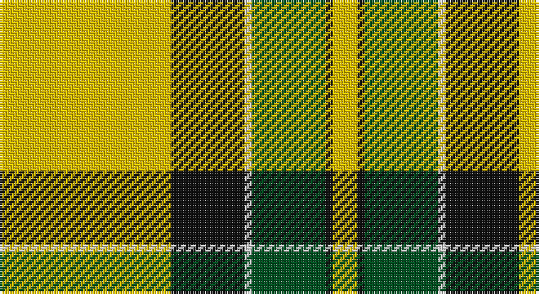

This page is one **sett** — a single exact thread-count. It belongs to the [tartan](/setts/ly70k30w3dg30k3ly10/)
(the same proportion at any scale), whose colour order is pattern [YKGWKY](/stripes/ykgwky/).

Part of the [Jacobite](/tartans/jacobite/) tartan — the named design grouping this sett with its other cloths.

Sourced from register-of-tartans.  It is a [6 stripe tartan](/stripes/stripes6/).

Original link https://www.tartanregister.gov.uk/tartanDetails.aspx?ref=1874

## Also known as

This cloth is also recorded under:

- Jacobite #2
- Jacobite General

## Register references

External register numbers recorded for this tartan.

- Scottish Register of Tartans: [1874](https://www.tartanregister.gov.uk/tartanDetails.aspx?ref=1874)
- Scottish Tartans World Register: 1885

## Thread count
Y/70 K30 LN3 G30 K3 Y/10

One full sett is **212 threads**.

## Palette

Palette: <strong>Tartan Register</strong>
<table><thead><tr><th>Colour</th><th>Threads</th><th>Shade</th><th>Base</th><th>OKLCh</th></tr></thead><tbody><tr><td>Y/</td><td style="text-align:right;font-variant-numeric:tabular-nums">70</td><td><code style="background-color:#E8C000;">#E8C000</code> <small style="color:#888">#E8C000</small></td><td>Y <code style="background-color:#F2BF00;">#F2BF00</code></td><td><small style="color:#888">oklch(81.9% 0.168 93.7)</small></td></tr><tr><td>K</td><td style="text-align:right;font-variant-numeric:tabular-nums">30</td><td><code style="background-color:#101010;">#101010</code> <small style="color:#888">#101010</small></td><td>K <code style="background-color:#000000;">#000000</code></td><td><small style="color:#888">oklch(17.3% 0.000 89.9)</small></td></tr><tr><td>LN</td><td style="text-align:right;font-variant-numeric:tabular-nums">3</td><td><code style="background-color:#E0E0E0;">#E0E0E0</code> <small style="color:#888">#E0E0E0</small></td><td>W <code style="background-color:#F7F7F7;">#F7F7F7</code></td><td><small style="color:#888">oklch(90.7% 0.000 89.9)</small></td></tr><tr><td>G</td><td style="text-align:right;font-variant-numeric:tabular-nums">30</td><td><code style="background-color:#005020;">#005020</code> <small style="color:#888">#005020</small></td><td>G <code style="background-color:#006100;">#006100</code></td><td><small style="color:#888">oklch(37.7% 0.105 149.6)</small></td></tr><tr><td>K</td><td style="text-align:right;font-variant-numeric:tabular-nums">3</td><td><code style="background-color:#101010;">#101010</code> <small style="color:#888">#101010</small></td><td>K <code style="background-color:#000000;">#000000</code></td><td><small style="color:#888">oklch(17.3% 0.000 89.9)</small></td></tr><tr><td>Y/</td><td style="text-align:right;font-variant-numeric:tabular-nums">10</td><td><code style="background-color:#E8C000;">#E8C000</code> <small style="color:#888">#E8C000</small></td><td>Y <code style="background-color:#F2BF00;">#F2BF00</code></td><td><small style="color:#888">oklch(81.9% 0.168 93.7)</small></td></tr></tbody></table>

# Sample pattern

## Compared to the master

This cloth is one sett of its design; the master sett (the exemplar the design is anchored on) is below for comparison.

<figure style="margin:0"><figcaption style="color:#888;font-size:smaller">this sett</figcaption></figure>
<figure style="margin:0"><figcaption style="color:#888;font-size:smaller"><a href="/setts/w1r2db2w1g9w1db2r2w1r2db2w1lo9w1db2r2w1/">master sett →</a></figcaption></figure>

## Nearest tartans

The nearest existing variants by ΔTartan distance, with this tartan at the top so the swatches line up against it.

ΔTartan

Tartan

Sett

—

<a href="/ttd/edit/#slug=ly70k30w3dg30k3ly10">Jacobite #2</a> <a class="nn-out" href="/variants/s6/ly70k30w3dg30k3ly10/" title="open its dictionary page">↗</a>

0.40

<a href="/ttd/edit/#slug=ly70k30w3g30k3ly10&amp;base=ly70k30w3dg30k3ly10">Jacobite</a> <a class="nn-out" href="/variants/s6/ly70k30w3g30k3ly10/" title="open its dictionary page">↗</a>

1.11

<a href="/ttd/edit/#slug=g3r16w4k6g28r1g3~x2&amp;base=ly70k30w3dg30k3ly10">Pollock</a> <a class="nn-out" href="/variants/s7/g3r16w4k6g28r1g3~x2/" title="open its dictionary page">↗</a>

1.15

<a href="/ttd/edit/#slug=ly83k35w3g35k3ly10&amp;base=ly70k30w3dg30k3ly10">Brandon Manitoba Trade Tartan</a> <a class="nn-out" href="/variants/s6/ly83k35w3g35k3ly10/" title="open its dictionary page">↗</a>

1.43

<a href="/ttd/edit/#slug=r1ly13k8g1~x6&amp;base=ly70k30w3dg30k3ly10">Billy Apple® Yellow</a> <a class="nn-out" href="/variants/s4/r1ly13k8g1~x6/" title="open its dictionary page">↗</a>

1.45

<a href="/ttd/edit/#slug=k4r5k2ly21g8k2~x2&amp;base=ly70k30w3dg30k3ly10">MacDuck (Corporate)</a> <a class="nn-out" href="/variants/s6/k4r5k2ly21g8k2~x2/" title="open its dictionary page">↗</a>

1.57

<a href="/ttd/edit/#slug=y83k35w3g35k3ly10&amp;base=ly70k30w3dg30k3ly10">Brandon, Manitoba</a> <a class="nn-out" href="/variants/s6/y83k35w3g35k3ly10/" title="open its dictionary page">↗</a>

1.61

<a href="/ttd/edit/#slug=r2w2ly27dg14ly2db14ly2~x2&amp;base=ly70k30w3dg30k3ly10">Fraser Yellow</a> <a class="nn-out" href="/variants/s7/r2w2ly27dg14ly2db14ly2~x2/" title="open its dictionary page">↗</a>

1.63

<a href="/ttd/edit/#slug=g26r5k1r2k1r5g16r5w16g2w8~x2&amp;base=ly70k30w3dg30k3ly10">Livingston (Personal)</a> <a class="nn-out" href="/variants/s11/g26r5k1r2k1r5g16r5w16g2w8~x2/" title="open its dictionary page">↗</a>

1.68

<a href="/ttd/edit/#slug=r2w2ly27g14ly2db14ly2~x2&amp;base=ly70k30w3dg30k3ly10">Fraser, Yellow</a> <a class="nn-out" href="/variants/s7/r2w2ly27g14ly2db14ly2~x2/" title="open its dictionary page">↗</a>

1.69

<a href="/ttd/edit/#slug=dg4do10dg10o6do1w26dg2do1~x4&amp;base=ly70k30w3dg30k3ly10">Dogwood</a> <a class="nn-out" href="/variants/s8/dg4do10dg10o6do1w26dg2do1~x4/" title="open its dictionary page">↗</a>

## Neighbour map

Every grey dot is one of 14360 variants placed by the first two principal components of the ΔTartan feature space (44% of its variance). Red is this tartan; blue dots are its nearest — click one to open its page.

<svg viewBox="0 0 640 380" role="img" style="max-width:100%;height:auto;border:1px solid #e0e0e0;border-radius:4px;display:block" xmlns="http://www.w3.org/2000/svg"><image href="/nn/cloud.v1.png" width="640" height="380"/><a href="/variants/s6/ly70k30w3g30k3ly10/"><circle cx="278.7" cy="142.8" r="4" fill="#3465a4"><title>Jacobite</title></circle></a><a href="/variants/s7/g3r16w4k6g28r1g3~x2/"><circle cx="321.3" cy="141.9" r="4" fill="#3465a4"><title>Pollock</title></circle></a><a href="/variants/s6/ly83k35w3g35k3ly10/"><circle cx="241.5" cy="121.5" r="4" fill="#3465a4"><title>Brandon Manitoba Trade Tartan</title></circle></a><a href="/variants/s4/r1ly13k8g1~x6/"><circle cx="282.1" cy="183.0" r="4" fill="#3465a4"><title>Billy Apple® Yellow</title></circle></a><a href="/variants/s6/k4r5k2ly21g8k2~x2/"><circle cx="226.9" cy="172.7" r="4" fill="#3465a4"><title>MacDuck (Corporate)</title></circle></a><a href="/variants/s6/y83k35w3g35k3ly10/"><circle cx="249.1" cy="134.0" r="4" fill="#3465a4"><title>Brandon, Manitoba</title></circle></a><a href="/variants/s7/r2w2ly27dg14ly2db14ly2~x2/"><circle cx="223.1" cy="142.7" r="4" fill="#3465a4"><title>Fraser Yellow</title></circle></a><a href="/variants/s11/g26r5k1r2k1r5g16r5w16g2w8~x2/"><circle cx="271.4" cy="123.6" r="4" fill="#3465a4"><title>Livingston (Personal)</title></circle></a><a href="/variants/s7/r2w2ly27g14ly2db14ly2~x2/"><circle cx="227.8" cy="143.9" r="4" fill="#3465a4"><title>Fraser, Yellow</title></circle></a><a href="/variants/s8/dg4do10dg10o6do1w26dg2do1~x4/"><circle cx="216.7" cy="118.6" r="4" fill="#3465a4"><title>Dogwood</title></circle></a><circle cx="287.0" cy="146.1" r="5" fill="#c00000"/></svg>

ID: /variants/s6/ly70k30w3dg30k3ly10/
