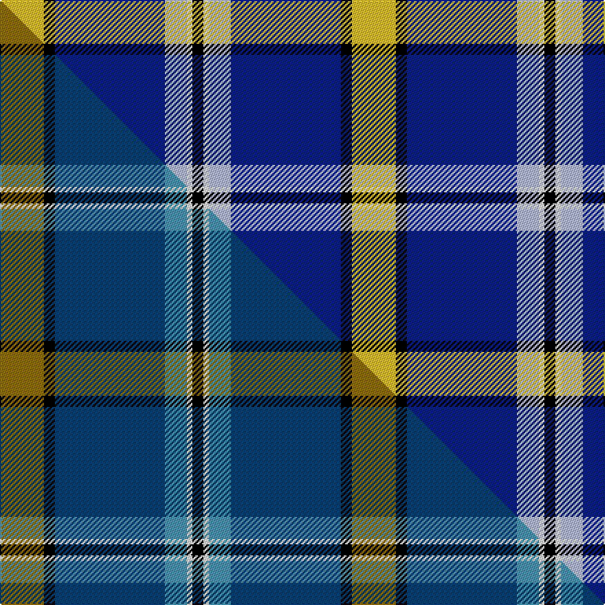

This page is one **sett** — a single exact thread-count. It belongs to the [tartan](/setts/ly8k2db20lb4w1k2/)
(the same proportion at any scale), whose colour order is pattern [KWWBKY](/stripes/kwwbky/).

Part of the [Solberg-Bell](/tartans/solberg-bell/) tartan — the named design grouping this sett with its other cloths.

Sourced from tartans-authority.  It is a [6 stripe tartan](/stripes/stripes6/).

Original link http://www.tartansauthority.com/tartan-ferret/display/11124/

## Register references

External register numbers recorded for this tartan.

- Scottish Register of Tartans: [11124](https://www.tartanregister.gov.uk/tartanDetails?ref=11124)
- Scottish Tartans Authority (ITI): 11124

## Thread count
LY/32 K8 DB80 LB16 W4 K/8

One full sett is **256 threads**.

## Palette
<table><thead><tr><th>Colour</th><th>Shade</th><th>OKLCh</th></tr></thead><tbody><tr><td>LB</td><td><code style="background-color:#B5BBDE;">#B5BBDE</code> <small style="color:#888">#B5BBDE</small></td><td><small style="color:#888">oklch(79.9% 0.050 277.6)</small></td></tr><tr><td>DB</td><td><code style="background-color:#082077;">#082077</code> <small style="color:#888">#082077</small></td><td><small style="color:#888">oklch(30.0% 0.149 265.1)</small></td></tr><tr><td>K</td><td><code style="background-color:#000000;">#000000</code> <small style="color:#888">#000000</small></td><td><small style="color:#888">oklch(0.0% 0.000 0.0)</small></td></tr><tr><td>W</td><td><code style="background-color:#F7F7F7;">#F7F7F7</code> <small style="color:#888">#F7F7F7</small></td><td><small style="color:#888">oklch(97.6% 0.000 89.9)</small></td></tr><tr><td>LY</td><td><code style="background-color:#DCBC32;">#DCBC32</code> <small style="color:#888">#DCBC32</small></td><td><small style="color:#888">oklch(80.0% 0.150 95.2)</small></td></tr></tbody></table>

# Sample pattern

## Compared to the master

This cloth is one sett of its design; the master sett (the exemplar the design is anchored on) is below for comparison.

Its **ΔTartan distance** from the master is **1.45** — the same measure the nearest-tartans table ranks by (0 is identical; a re-scale of the same cloth is near 0, a recolour or a different proportion further).

<figure class="master-compare" style="margin:0">

this sett
master sett ★

<figcaption style="color:#888;font-size:smaller">One weave of this sett against the <a href="/setts/y8k2db20t4w1k2/">master sett ★</a>, split on the diagonal: a shared proportion runs seamlessly across it with only the shades shifting; a different proportion breaks on it.</figcaption>
</figure>

## Nearest variants

The nearest existing variants by ΔTartan distance, with this cloth at the top so the swatches line up against it.

ΔTartan

Threads

Variant

Sett

—

256

<a href="/variants/s6/ly8k2db20lb4w1k2~x4/">Solberg-Bell</a>

<a href="/ttd/edit/#slug=y8k2db20t4w1k2~x4~db1404245-t2503227&amp;base=ly8k2db20lb4w1k2~x4" title="compare in the TTD">0.00</a>

256

<a href="/variants/s6/y8k2db20t4w1k2~x4~db1404245-t2503227/">Solberg-Bell (Personal)</a>

<a href="/ttd/edit/#slug=k8y2t21w3r2~x4~t2205244&amp;base=ly8k2db20lb4w1k2~x4" title="compare in the TTD">1.85</a>

248

<a href="/variants/s5/k8y2t21w3r2~x4~t2205244/">Oklahoma State American District Tartan</a>

<a href="/ttd/edit/#slug=k8dy2t21w3r2~x4~t2205244&amp;base=ly8k2db20lb4w1k2~x4" title="compare in the TTD">1.85</a>

248

<a href="/variants/s5/k8dy2t21w3r2~x4~t2205244/">Oklahoma</a>

<a href="/ttd/edit/#slug=k8dy2t21w3r2~x4&amp;base=ly8k2db20lb4w1k2~x4" title="compare in the TTD">1.85</a>

248

<a href="/variants/s5/k8dy2t21w3r2~x4/">Oklahoma (US State)</a>

<a href="/ttd/edit/#slug=r2w6k12db36n12y1~x2&amp;base=ly8k2db20lb4w1k2~x4" title="compare in the TTD">2.16</a>

270

<a href="/variants/s6/r2w6k12db36n12y1~x2/">Alan Stone Family (Personal)</a>

<a href="/ttd/edit/#slug=w12db48k13n22k3y6&amp;base=ly8k2db20lb4w1k2~x4" title="compare in the TTD">2.17</a>

190

<a href="/variants/s6/w12db48k13n22k3y6/">Clunie (Personal)</a>

<a href="/ttd/edit/#slug=k1w7lo7db16dy1~x4&amp;base=ly8k2db20lb4w1k2~x4" title="compare in the TTD">2.22</a>

248

<a href="/variants/s5/k1w7lo7db16dy1~x4/">Prehospital EMS Tartan (USA)</a>

<a href="/ttd/edit/#slug=k1w7lo7db16y1~x4&amp;base=ly8k2db20lb4w1k2~x4" title="compare in the TTD">2.22</a>

248

<a href="/variants/s5/k1w7lo7db16y1~x4/">Prehospital EMS (Corporate)</a>

<a href="/ttd/edit/#slug=lb3k3lb3k3n15dr1~x4&amp;base=ly8k2db20lb4w1k2~x4" title="compare in the TTD">2.29</a>

208

<a href="/variants/s6/lb3k3lb3k3n15dr1~x4/">Tiree Grey</a>

<a href="/ttd/edit/#slug=k5w7k5n20db1~x4&amp;base=ly8k2db20lb4w1k2~x4" title="compare in the TTD">2.30</a>

280

<a href="/variants/s5/k5w7k5n20db1~x4/">Burberry Grey (Original)</a>

## Neighbour map

Every grey dot is one of 13620 variants placed by the first two principal components of the ΔTartan feature space (42% of its variance). Red is this tartan; blue dots are its nearest — click one to open its page.

<svg viewBox="0 0 640 380" role="img" style="max-width:100%;height:auto;border:1px solid #e0e0e0;border-radius:4px;display:block" xmlns="http://www.w3.org/2000/svg"><image href="/nn/cloud.v1.png" width="640" height="380"/><a href="/variants/s6/y8k2db20t4w1k2~x4~db1404245-t2503227/"><circle cx="283.5" cy="145.8" r="4" fill="#3465a4"><title>Solberg-Bell (Personal)</title></circle></a><a href="/variants/s5/k8y2t21w3r2~x4~t2205244/"><circle cx="251.5" cy="166.7" r="4" fill="#3465a4"><title>Oklahoma State American District Tartan</title></circle></a><a href="/variants/s5/k8dy2t21w3r2~x4~t2205244/"><circle cx="251.7" cy="166.5" r="4" fill="#3465a4"><title>Oklahoma</title></circle></a><a href="/variants/s5/k8dy2t21w3r2~x4/"><circle cx="248.7" cy="167.6" r="4" fill="#3465a4"><title>Oklahoma (US State)</title></circle></a><a href="/variants/s6/r2w6k12db36n12y1~x2/"><circle cx="247.8" cy="105.8" r="4" fill="#3465a4"><title>Alan Stone Family (Personal)</title></circle></a><a href="/variants/s6/w12db48k13n22k3y6/"><circle cx="189.4" cy="160.6" r="4" fill="#3465a4"><title>Clunie (Personal)</title></circle></a><a href="/variants/s5/k1w7lo7db16dy1~x4/"><circle cx="207.3" cy="161.4" r="4" fill="#3465a4"><title>Prehospital EMS Tartan (USA)</title></circle></a><a href="/variants/s5/k1w7lo7db16y1~x4/"><circle cx="207.6" cy="161.6" r="4" fill="#3465a4"><title>Prehospital EMS (Corporate)</title></circle></a><a href="/variants/s6/lb3k3lb3k3n15dr1~x4/"><circle cx="267.3" cy="165.0" r="4" fill="#3465a4"><title>Tiree Grey</title></circle></a><a href="/variants/s5/k5w7k5n20db1~x4/"><circle cx="252.2" cy="168.4" r="4" fill="#3465a4"><title>Burberry Grey (Original)</title></circle></a><circle cx="247.0" cy="134.6" r="5" fill="#c00000"/><text x="320" y="376" text-anchor="middle" font-size="11" fill="#999">ground</text><text x="11" y="190" text-anchor="middle" font-size="11" fill="#999" transform="rotate(-90 11 190)">complexity</text></svg>

ID: /variants/s6/ly8k2db20lb4w1k2~x4/
