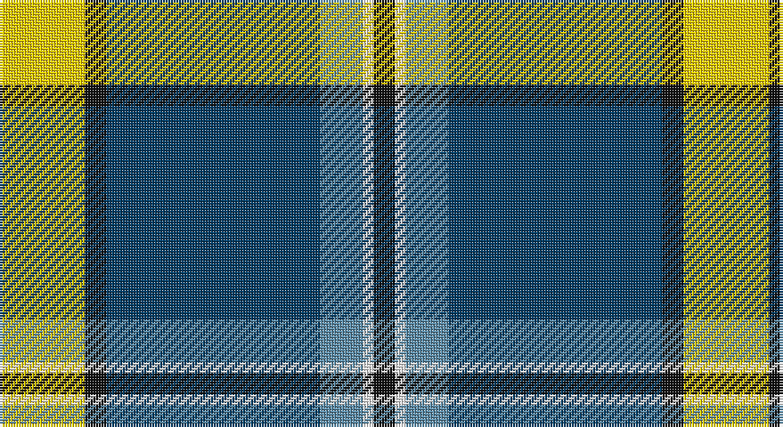

This page is one **sett** — a single exact thread-count. It belongs to the [tartan](/setts/ly8k2dt20t4w1k2/)
(the same proportion at any scale), whose colour order is pattern [KWBBKY](/stripes/kwbbky/).

Sourced from tartans-authority.  It is a [6 stripe tartan](/stripes/stripes6/).

Original link http://www.tartansauthority.com/tartan-ferret/display/11124/

## Register references

External register numbers recorded for this tartan.

- Scottish Register of Tartans: [11124](https://www.tartanregister.gov.uk/tartanDetails?ref=11124)
- Scottish Tartans Authority (ITI): 11124

## Thread count
Y/32 K8 DB80 B16 W4 K/8

One full sett is **256 threads**.

## Palette

Palette: <strong>Tartan Register</strong>
<table><thead><tr><th>Colour</th><th>Threads</th><th>Shade</th><th>Base</th><th>OKLCh</th></tr></thead><tbody><tr><td>Y/</td><td style="text-align:right;font-variant-numeric:tabular-nums">32</td><td><code style="background-color:#FCCC00;">#FCCC00</code> <small style="color:#888">#FCCC00</small></td><td>Y <code style="background-color:#F2BF00;">#F2BF00</code></td><td><small style="color:#888">oklch(86.2% 0.176 91.5)</small></td></tr><tr><td>K</td><td style="text-align:right;font-variant-numeric:tabular-nums">8</td><td><code style="background-color:#101010;">#101010</code> <small style="color:#888">#101010</small></td><td>K <code style="background-color:#000000;">#000000</code></td><td><small style="color:#888">oklch(17.3% 0.000 89.9)</small></td></tr><tr><td>DB</td><td style="text-align:right;font-variant-numeric:tabular-nums">80</td><td><code style="background-color:#003C64;">#003C64</code> <small style="color:#888">#003C64</small></td><td>B <code style="background-color:#2A418A;">#2A418A</code></td><td><small style="color:#888">oklch(34.5% 0.089 246.0)</small></td></tr><tr><td>B</td><td style="text-align:right;font-variant-numeric:tabular-nums">16</td><td><code style="background-color:#5C8CA8;">#5C8CA8</code> <small style="color:#888">#5C8CA8</small></td><td>B <code style="background-color:#2A418A;">#2A418A</code></td><td><small style="color:#888">oklch(61.7% 0.067 235.0)</small></td></tr><tr><td>W</td><td style="text-align:right;font-variant-numeric:tabular-nums">4</td><td><code style="background-color:#FCFCFC;">#FCFCFC</code> <small style="color:#888">#FCFCFC</small></td><td>W <code style="background-color:#F7F7F7;">#F7F7F7</code></td><td><small style="color:#888">oklch(99.1% 0.000 89.9)</small></td></tr><tr><td>K/</td><td style="text-align:right;font-variant-numeric:tabular-nums">8</td><td><code style="background-color:#101010;">#101010</code> <small style="color:#888">#101010</small></td><td>K <code style="background-color:#000000;">#000000</code></td><td><small style="color:#888">oklch(17.3% 0.000 89.9)</small></td></tr></tbody></table>

# Sample pattern

## Nearest tartans

The nearest existing variants by ΔTartan distance, with this tartan at the top so the swatches line up against it.

ΔTartan

Tartan

Sett

—

<a href="/ttd/edit/#slug=ly8k2dt20t4w1k2~x4">Solberg-Bell</a> <a class="nn-out" href="/variants/s6/ly8k2dt20t4w1k2~x4/" title="open its dictionary page">↗</a>

0.51

<a href="/ttd/edit/#slug=lo8k2dt20t4w1k2~x4&amp;base=ly8k2dt20t4w1k2~x4">Solberg-Bell (Personal)</a> <a class="nn-out" href="/variants/s6/lo8k2dt20t4w1k2~x4/" title="open its dictionary page">↗</a>

0.81

<a href="/ttd/edit/#slug=ly21g26db62w2dg2w2&amp;base=ly8k2dt20t4w1k2~x4">Nynashamn Whisky Society (Corporate)</a> <a class="nn-out" href="/variants/s6/ly21g26db62w2dg2w2/" title="open its dictionary page">↗</a>

1.07

<a href="/ttd/edit/#slug=r2w7db30g36ly2~x2&amp;base=ly8k2dt20t4w1k2~x4">Centennial-King George Lodge No.171</a> <a class="nn-out" href="/variants/s5/r2w7db30g36ly2~x2/" title="open its dictionary page">↗</a>

1.10

<a href="/ttd/edit/#slug=dt42t2w2t2dt5k12w32db4~x2&amp;base=ly8k2dt20t4w1k2~x4">Comrie, Navy Blue (Dance)</a> <a class="nn-out" href="/variants/s8/dt42t2w2t2dt5k12w32db4~x2/" title="open its dictionary page">↗</a>

1.11

<a href="/ttd/edit/#slug=db2r1db16k5g2w11g1~x4&amp;base=ly8k2dt20t4w1k2~x4">Sinclair dress</a> <a class="nn-out" href="/variants/s7/db2r1db16k5g2w11g1~x4/" title="open its dictionary page">↗</a>

1.13

<a href="/ttd/edit/#slug=r2w7b30dg36ly2~x2&amp;base=ly8k2dt20t4w1k2~x4">Centennial-King George Lodge No.171</a> <a class="nn-out" href="/variants/s5/r2w7b30dg36ly2~x2/" title="open its dictionary page">↗</a>

1.18

<a href="/ttd/edit/#slug=lr2dg17w6b5r1~x4&amp;base=ly8k2dt20t4w1k2~x4">Scotstown</a> <a class="nn-out" href="/variants/s5/lr2dg17w6b5r1~x4/" title="open its dictionary page">↗</a>

1.22

<a href="/ttd/edit/#slug=r3dt4w10dg2w2dg5dt34ly3~x2&amp;base=ly8k2dt20t4w1k2~x4">Royal Troon Golf Club, The</a> <a class="nn-out" href="/variants/s8/r3dt4w10dg2w2dg5dt34ly3~x2/" title="open its dictionary page">↗</a>

1.24

<a href="/ttd/edit/#slug=r4db24w2g13db2k3~x4&amp;base=ly8k2dt20t4w1k2~x4">Vance (Family Association)</a> <a class="nn-out" href="/variants/s6/r4db24w2g13db2k3~x4/" title="open its dictionary page">↗</a>

1.24

<a href="/ttd/edit/#slug=db4r2db39k11g2w16r2~x2&amp;base=ly8k2dt20t4w1k2~x4">Sinclair, The Jack</a> <a class="nn-out" href="/variants/s7/db4r2db39k11g2w16r2~x2/" title="open its dictionary page">↗</a>

## Neighbour map

Every grey dot is one of 14360 variants placed by the first two principal components of the ΔTartan feature space (44% of its variance). Red is this tartan; blue dots are its nearest — click one to open its page.

<svg viewBox="0 0 640 380" role="img" style="max-width:100%;height:auto;border:1px solid #e0e0e0;border-radius:4px;display:block" xmlns="http://www.w3.org/2000/svg"><image href="/nn/cloud.v1.png" width="640" height="380"/><a href="/variants/s6/lo8k2dt20t4w1k2~x4/"><circle cx="280.4" cy="148.7" r="4" fill="#3465a4"><title>Solberg-Bell (Personal)</title></circle></a><a href="/variants/s6/ly21g26db62w2dg2w2/"><circle cx="300.4" cy="128.7" r="4" fill="#3465a4"><title>Nynashamn Whisky Society (Corporate)</title></circle></a><a href="/variants/s5/r2w7db30g36ly2~x2/"><circle cx="252.0" cy="172.2" r="4" fill="#3465a4"><title>Centennial-King George Lodge No.171</title></circle></a><a href="/variants/s8/dt42t2w2t2dt5k12w32db4~x2/"><circle cx="229.9" cy="116.0" r="4" fill="#3465a4"><title>Comrie, Navy Blue (Dance)</title></circle></a><a href="/variants/s7/db2r1db16k5g2w11g1~x4/"><circle cx="209.3" cy="140.1" r="4" fill="#3465a4"><title>Sinclair dress</title></circle></a><a href="/variants/s5/r2w7b30dg36ly2~x2/"><circle cx="255.3" cy="174.2" r="4" fill="#3465a4"><title>Centennial-King George Lodge No.171</title></circle></a><a href="/variants/s5/lr2dg17w6b5r1~x4/"><circle cx="256.0" cy="165.5" r="4" fill="#3465a4"><title>Scotstown</title></circle></a><a href="/variants/s8/r3dt4w10dg2w2dg5dt34ly3~x2/"><circle cx="302.0" cy="119.4" r="4" fill="#3465a4"><title>Royal Troon Golf Club, The</title></circle></a><a href="/variants/s6/r4db24w2g13db2k3~x4/"><circle cx="276.8" cy="179.4" r="4" fill="#3465a4"><title>Vance (Family Association)</title></circle></a><a href="/variants/s7/db4r2db39k11g2w16r2~x2/"><circle cx="284.1" cy="128.7" r="4" fill="#3465a4"><title>Sinclair, The Jack</title></circle></a><circle cx="266.2" cy="141.7" r="5" fill="#c00000"/></svg>

ID: /variants/s6/ly8k2dt20t4w1k2~x4/
