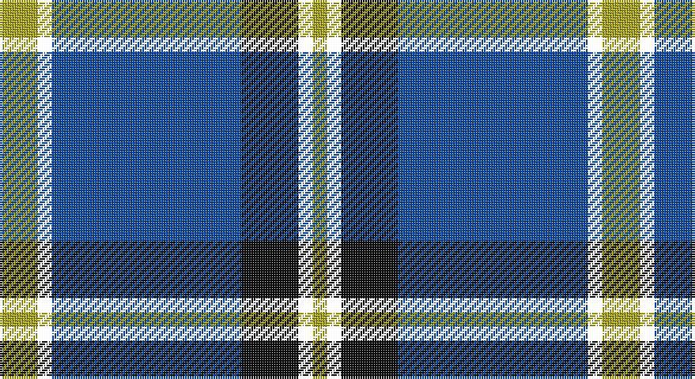

This page is one **sett** — a single exact thread-count. It belongs to the [tartan](/setts/ly8k3b40ki12k3ly3/)
(the same proportion at any scale), whose colour order is pattern [YKBKKY](/stripes/ykbkky/).

Part of the [Wolverine](/tartans/wolverine/) tartan — the named design grouping this sett with its other cloths.

Sourced from house-of-tartan.  It is a [6 stripe tartan](/stripes/stripes6/).

Original link http://www.house-of-tartan.scotland.net/house/TartanViewjs.asp?colr=Def&tnam=10748

## Provenance

Earliest known date: 03/12/2012 Created by the designer to celebrate an exclusive group of work colleagues known affectionately as the 'Wolverines'. Many within this close group share a proud Scottish heritage and wished to acknowledge this strong affiliation by commissioning a tartan. Yes. The Wolverine tartan has been created for the exclusive use of the 'Wolverines'. No commercial use of this tartan is permitted without expressed permission from the designer, and any party wishing to use or reproduce this tartan should first seek permission by email from the designer.

## Thread count
LG/16 W6 B80 K24 W6 LG/6

One full sett is **254 threads**.

## Palette

Palette: <strong>Logan (The Scottish Gael, 1831)</strong> <small style="color:#888">(1 of 3 colours)</small>
<table><thead><tr><th>Colour</th><th>Threads</th><th>Shade</th><th>Base</th><th>OKLCh</th></tr></thead><tbody><tr><td>LG/</td><td style="text-align:right;font-variant-numeric:tabular-nums">16</td><td><code style="background-color:#ABA712;">#ABA712</code> <small style="color:#888">#ABA712</small></td><td>Y <code style="background-color:#F2BF00;">#F2BF00</code></td><td><small style="color:#888">oklch(70.9% 0.149 107.9)</small></td></tr><tr><td></td><td style="text-align:right;font-variant-numeric:tabular-nums">6</td><td><code style="background-color:;"></code> <small style="color:#888"></small></td><td> <code style="background-color:;"></code></td><td><small style="color:#888"></small></td></tr><tr><td>B</td><td style="text-align:right;font-variant-numeric:tabular-nums">80</td><td><code style="background-color:#0C4BA8;">#0C4BA8</code> <small style="color:#888">#0C4BA8</small></td><td>B <code style="background-color:#2A418A;">#2A418A</code></td><td><small style="color:#888">oklch(43.6% 0.161 259.5)</small></td></tr><tr><td>K</td><td style="text-align:right;font-variant-numeric:tabular-nums">24</td><td><code style="background-color:#101010;">#101010</code> <small style="color:#888">#101010</small></td><td>K <code style="background-color:#000000;">#000000</code></td><td><small style="color:#888">oklch(17.3% 0.000 89.9)</small></td></tr><tr><td></td><td style="text-align:right;font-variant-numeric:tabular-nums">6</td><td><code style="background-color:;"></code> <small style="color:#888"></small></td><td> <code style="background-color:;"></code></td><td><small style="color:#888"></small></td></tr><tr><td>LG/</td><td style="text-align:right;font-variant-numeric:tabular-nums">6</td><td><code style="background-color:#ABA712;">#ABA712</code> <small style="color:#888">#ABA712</small></td><td>Y <code style="background-color:#F2BF00;">#F2BF00</code></td><td><small style="color:#888">oklch(70.9% 0.149 107.9)</small></td></tr></tbody></table>

# Sample pattern

## Compared to the master

This cloth is one sett of its design; the master sett (the exemplar the design is anchored on) is below for comparison.

<figure style="margin:0"><figcaption style="color:#888;font-size:smaller">this sett</figcaption></figure>
<figure style="margin:0"><figcaption style="color:#888;font-size:smaller"><a href="/setts/ly8w3b40k12w3ly3/">master sett →</a></figcaption></figure>

## Nearest tartans

The nearest existing variants by ΔTartan distance, with this tartan at the top so the swatches line up against it.

ΔTartan

Tartan

Sett

—

<a href="/ttd/edit/#slug=ly8k3b40ki12k3ly3~x2">Wolverine Corporate Tartan</a> <a class="nn-out" href="/variants/s6/ly8k3b40ki12k3ly3~x2/" title="open its dictionary page">↗</a>

0.78

<a href="/ttd/edit/#slug=ly8w3b40k12w3ly3~x2&amp;base=ly8k3b40ki12k3ly3~x2">Wolverine (Corporate)</a> <a class="nn-out" href="/variants/s6/ly8w3b40k12w3ly3~x2/" title="open its dictionary page">↗</a>

0.97

<a href="/ttd/edit/#slug=w2db35k9w3k9ly2~x2&amp;base=ly8k3b40ki12k3ly3~x2">Hannah (Personal)</a> <a class="nn-out" href="/variants/s6/w2db35k9w3k9ly2~x2/" title="open its dictionary page">↗</a>

1.05

<a href="/ttd/edit/#slug=k30b40ly3b5w2b6~x2&amp;base=ly8k3b40ki12k3ly3~x2">Micron</a> <a class="nn-out" href="/variants/s6/k30b40ly3b5w2b6~x2/" title="open its dictionary page">↗</a>

1.07

<a href="/ttd/edit/#slug=k3db30k8w8k2r3~x2&amp;base=ly8k3b40ki12k3ly3~x2">Hydro-Electric</a> <a class="nn-out" href="/variants/s6/k3db30k8w8k2r3~x2/" title="open its dictionary page">↗</a>

1.07

<a href="/ttd/edit/#slug=lo8w3db40k12w3lo3~x2&amp;base=ly8k3b40ki12k3ly3~x2">Wolverines (Corporate)</a> <a class="nn-out" href="/variants/s6/lo8w3db40k12w3lo3~x2/" title="open its dictionary page">↗</a>

1.10

<a href="/ttd/edit/#slug=r1b1k17b17k1w1~x4&amp;base=ly8k3b40ki12k3ly3~x2">Sorbie (Name)</a> <a class="nn-out" href="/variants/s6/r1b1k17b17k1w1~x4/" title="open its dictionary page">↗</a>

1.13

<a href="/ttd/edit/#slug=db30lb2k9w3db6w4k3lb6~x2&amp;base=ly8k3b40ki12k3ly3~x2">Detroit Lions</a> <a class="nn-out" href="/variants/s8/db30lb2k9w3db6w4k3lb6~x2/" title="open its dictionary page">↗</a>

1.14

<a href="/ttd/edit/#slug=db7r3db26t2db2t26ly4~x2&amp;base=ly8k3b40ki12k3ly3~x2">Int. Police Association (Official)</a> <a class="nn-out" href="/variants/s7/db7r3db26t2db2t26ly4~x2/" title="open its dictionary page">↗</a>

1.15

<a href="/ttd/edit/#slug=k1ly2k3n12k18w1~x2&amp;base=ly8k3b40ki12k3ly3~x2">Jon's Theme</a> <a class="nn-out" href="/variants/s6/k1ly2k3n12k18w1~x2/" title="open its dictionary page">↗</a>

1.20

<a href="/ttd/edit/#slug=y12db2y2db30dbi3db2dbi13w4~x2&amp;base=ly8k3b40ki12k3ly3~x2">Highlands School, (North Carolina)</a> <a class="nn-out" href="/variants/s8/y12db2y2db30dbi3db2dbi13w4~x2/" title="open its dictionary page">↗</a>

## Neighbour map

Every grey dot is one of 14360 variants placed by the first two principal components of the ΔTartan feature space (44% of its variance). Red is this tartan; blue dots are its nearest — click one to open its page.

<svg viewBox="0 0 640 380" role="img" style="max-width:100%;height:auto;border:1px solid #e0e0e0;border-radius:4px;display:block" xmlns="http://www.w3.org/2000/svg"><image href="/nn/cloud.v1.png" width="640" height="380"/><a href="/variants/s6/ly8w3b40k12w3ly3~x2/"><circle cx="302.0" cy="171.7" r="4" fill="#3465a4"><title>Wolverine (Corporate)</title></circle></a><a href="/variants/s6/w2db35k9w3k9ly2~x2/"><circle cx="349.3" cy="172.4" r="4" fill="#3465a4"><title>Hannah (Personal)</title></circle></a><a href="/variants/s6/k30b40ly3b5w2b6~x2/"><circle cx="354.9" cy="175.7" r="4" fill="#3465a4"><title>Micron</title></circle></a><a href="/variants/s6/k3db30k8w8k2r3~x2/"><circle cx="291.1" cy="168.8" r="4" fill="#3465a4"><title>Hydro-Electric</title></circle></a><a href="/variants/s6/lo8w3db40k12w3lo3~x2/"><circle cx="306.2" cy="167.4" r="4" fill="#3465a4"><title>Wolverines (Corporate)</title></circle></a><a href="/variants/s6/r1b1k17b17k1w1~x4/"><circle cx="315.5" cy="173.3" r="4" fill="#3465a4"><title>Sorbie (Name)</title></circle></a><a href="/variants/s8/db30lb2k9w3db6w4k3lb6~x2/"><circle cx="290.8" cy="154.2" r="4" fill="#3465a4"><title>Detroit Lions</title></circle></a><a href="/variants/s7/db7r3db26t2db2t26ly4~x2/"><circle cx="288.1" cy="180.6" r="4" fill="#3465a4"><title>Int. Police Association (Official)</title></circle></a><a href="/variants/s6/k1ly2k3n12k18w1~x2/"><circle cx="366.0" cy="187.5" r="4" fill="#3465a4"><title>Jon's Theme</title></circle></a><a href="/variants/s8/y12db2y2db30dbi3db2dbi13w4~x2/"><circle cx="279.9" cy="171.4" r="4" fill="#3465a4"><title>Highlands School, (North Carolina)</title></circle></a><circle cx="314.0" cy="181.3" r="5" fill="#c00000"/></svg>

ID: /variants/s6/ly8k3b40ki12k3ly3~x2/
