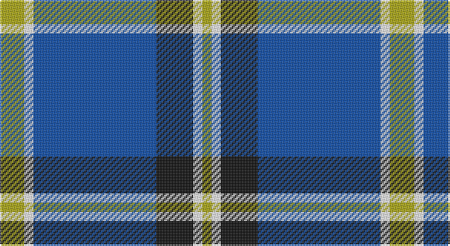

This page is one **sett** — a single exact thread-count. It belongs to the [tartan](/setts/ly8w3b40k12w3ly3/)
(the same proportion at any scale), whose colour order is pattern [YWBKWY](/stripes/ywbkwy/).

Part of the [Wolverine](/tartans/wolverine/) tartan — the named design grouping this sett with its other cloths.

Sourced from register-of-tartans.  It is a [6 stripe tartan](/stripes/stripes6/).

Original link https://www.tartanregister.gov.uk/tartanDetails.aspx?ref=10748

## Register references

External register numbers recorded for this tartan.

- Scottish Register of Tartans: [10748](https://www.tartanregister.gov.uk/tartanDetails.aspx?ref=10748)

## Thread count
LG/16 W6 B80 K24 W6 LG/6

One full sett is **254 threads**.

## Palette

Palette: <strong>Tartan Register</strong> <small style="color:#888">(2 of 4 colours)</small>
<table><thead><tr><th>Colour</th><th>Threads</th><th>Shade</th><th>Base</th><th>OKLCh</th></tr></thead><tbody><tr><td>LG/</td><td style="text-align:right;font-variant-numeric:tabular-nums">16</td><td><code style="background-color:#ABA712;">#ABA712</code> <small style="color:#888">#ABA712</small></td><td>Y <code style="background-color:#F2BF00;">#F2BF00</code></td><td><small style="color:#888">oklch(70.9% 0.149 107.9)</small></td></tr><tr><td>W</td><td style="text-align:right;font-variant-numeric:tabular-nums">6</td><td><code style="background-color:#FFFFFF;">#FFFFFF</code> <small style="color:#888">#FFFFFF</small></td><td>W <code style="background-color:#F7F7F7;">#F7F7F7</code></td><td><small style="color:#888">oklch(100.0% 0.000 89.9)</small></td></tr><tr><td>B</td><td style="text-align:right;font-variant-numeric:tabular-nums">80</td><td><code style="background-color:#0C4BA8;">#0C4BA8</code> <small style="color:#888">#0C4BA8</small></td><td>B <code style="background-color:#2A418A;">#2A418A</code></td><td><small style="color:#888">oklch(43.6% 0.161 259.5)</small></td></tr><tr><td>K</td><td style="text-align:right;font-variant-numeric:tabular-nums">24</td><td><code style="background-color:#101010;">#101010</code> <small style="color:#888">#101010</small></td><td>K <code style="background-color:#000000;">#000000</code></td><td><small style="color:#888">oklch(17.3% 0.000 89.9)</small></td></tr><tr><td>W</td><td style="text-align:right;font-variant-numeric:tabular-nums">6</td><td><code style="background-color:#FFFFFF;">#FFFFFF</code> <small style="color:#888">#FFFFFF</small></td><td>W <code style="background-color:#F7F7F7;">#F7F7F7</code></td><td><small style="color:#888">oklch(100.0% 0.000 89.9)</small></td></tr><tr><td>LG/</td><td style="text-align:right;font-variant-numeric:tabular-nums">6</td><td><code style="background-color:#ABA712;">#ABA712</code> <small style="color:#888">#ABA712</small></td><td>Y <code style="background-color:#F2BF00;">#F2BF00</code></td><td><small style="color:#888">oklch(70.9% 0.149 107.9)</small></td></tr></tbody></table>

# Sample pattern

## Nearest tartans

The nearest existing variants by ΔTartan distance, with this tartan at the top so the swatches line up against it.

ΔTartan

Tartan

Sett

—

<a href="/ttd/edit/#slug=ly8w3b40k12w3ly3~x2">Wolverine (Corporate)</a> <a class="nn-out" href="/variants/s6/ly8w3b40k12w3ly3~x2/" title="open its dictionary page">↗</a>

0.78

<a href="/variants/s6/ly8k3b40ki12k3ly3~x2/">Wolverine Corporate Tartan</a>

0.82

<a href="/ttd/edit/#slug=db30lb2k9w3db6w4k3lb6~x2&amp;base=ly8w3b40k12w3ly3~x2">Detroit Lions</a> <a class="nn-out" href="/variants/s8/db30lb2k9w3db6w4k3lb6~x2/" title="open its dictionary page">↗</a>

0.98

<a href="/ttd/edit/#slug=lo8w3db40k12w3lo3~x2&amp;base=ly8w3b40k12w3ly3~x2">Wolverines (Corporate)</a> <a class="nn-out" href="/variants/s6/lo8w3db40k12w3lo3~x2/" title="open its dictionary page">↗</a>

1.14

<a href="/ttd/edit/#slug=k8ly2b21w3r2~x4&amp;base=ly8w3b40k12w3ly3~x2">Oklahoma</a> <a class="nn-out" href="/variants/s5/k8ly2b21w3r2~x4/" title="open its dictionary page">↗</a>

1.14

<a href="/ttd/edit/#slug=k30b40ly3b5w2b6~x2&amp;base=ly8w3b40k12w3ly3~x2">Micron</a> <a class="nn-out" href="/variants/s6/k30b40ly3b5w2b6~x2/" title="open its dictionary page">↗</a>

1.16

<a href="/ttd/edit/#slug=db7r3db26t2db2t26ly4~x2&amp;base=ly8w3b40k12w3ly3~x2">Int. Police Association (Official)</a> <a class="nn-out" href="/variants/s7/db7r3db26t2db2t26ly4~x2/" title="open its dictionary page">↗</a>

1.22

<a href="/ttd/edit/#slug=n3b2w10b2n6b26k2~x2&amp;base=ly8w3b40k12w3ly3~x2">MacLintock #2</a> <a class="nn-out" href="/variants/s7/n3b2w10b2n6b26k2~x2/" title="open its dictionary page">↗</a>

1.24

<a href="/ttd/edit/#slug=db42lbi2lb2lbi2db5dt12lb32db4~x2&amp;base=ly8w3b40k12w3ly3~x2">Longniddry Eildon Blue Dress Fancy Tartan</a> <a class="nn-out" href="/variants/s8/db42lbi2lb2lbi2db5dt12lb32db4~x2/" title="open its dictionary page">↗</a>

1.27

<a href="/ttd/edit/#slug=k3db30k8w8k2r3~x2&amp;base=ly8w3b40k12w3ly3~x2">Hydro-Electric</a> <a class="nn-out" href="/variants/s6/k3db30k8w8k2r3~x2/" title="open its dictionary page">↗</a>

1.27

<a href="/ttd/edit/#slug=ly12dbi2ly2dbi30db3dbi2db13w4~x2&amp;base=ly8w3b40k12w3ly3~x2">Highlands School (N. Carolina) Corporate Tartan</a> <a class="nn-out" href="/variants/s8/ly12dbi2ly2dbi30db3dbi2db13w4~x2/" title="open its dictionary page">↗</a>

## Neighbour map

Every grey dot is one of 14360 variants placed by the first two principal components of the ΔTartan feature space (44% of its variance). Red is this tartan; blue dots are its nearest — click one to open its page.

<svg viewBox="0 0 640 380" role="img" style="max-width:100%;height:auto;border:1px solid #e0e0e0;border-radius:4px;display:block" xmlns="http://www.w3.org/2000/svg"><image href="/nn/cloud.v1.png" width="640" height="380"/><a href="/variants/s6/ly8k3b40ki12k3ly3~x2/"><circle cx="314.0" cy="181.3" r="4" fill="#3465a4"><title>Wolverine Corporate Tartan</title></circle></a><a href="/variants/s8/db30lb2k9w3db6w4k3lb6~x2/"><circle cx="290.8" cy="154.2" r="4" fill="#3465a4"><title>Detroit Lions</title></circle></a><a href="/variants/s6/lo8w3db40k12w3lo3~x2/"><circle cx="306.2" cy="167.4" r="4" fill="#3465a4"><title>Wolverines (Corporate)</title></circle></a><a href="/variants/s5/k8ly2b21w3r2~x4/"><circle cx="279.0" cy="182.1" r="4" fill="#3465a4"><title>Oklahoma</title></circle></a><a href="/variants/s6/k30b40ly3b5w2b6~x2/"><circle cx="354.9" cy="175.7" r="4" fill="#3465a4"><title>Micron</title></circle></a><a href="/variants/s7/db7r3db26t2db2t26ly4~x2/"><circle cx="288.1" cy="180.6" r="4" fill="#3465a4"><title>Int. Police Association (Official)</title></circle></a><a href="/variants/s7/n3b2w10b2n6b26k2~x2/"><circle cx="315.1" cy="170.1" r="4" fill="#3465a4"><title>MacLintock #2</title></circle></a><a href="/variants/s8/db42lbi2lb2lbi2db5dt12lb32db4~x2/"><circle cx="288.7" cy="139.6" r="4" fill="#3465a4"><title>Longniddry Eildon Blue Dress Fancy Tartan</title></circle></a><a href="/variants/s6/k3db30k8w8k2r3~x2/"><circle cx="291.1" cy="168.8" r="4" fill="#3465a4"><title>Hydro-Electric</title></circle></a><a href="/variants/s8/ly12dbi2ly2dbi30db3dbi2db13w4~x2/"><circle cx="259.8" cy="156.5" r="4" fill="#3465a4"><title>Highlands School (N. Carolina) Corporate Tartan</title></circle></a><circle cx="302.0" cy="171.7" r="5" fill="#c00000"/></svg>

ID: /variants/s6/ly8w3b40k12w3ly3~x2/
