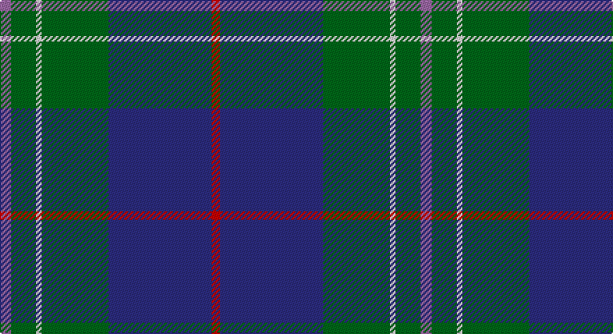

This page is one **sett** — a single exact thread-count. It belongs to the [tartan](/setts/m4g9w2g24db37r3/)
(the same proportion at any scale), whose colour order is pattern [RBGWGR](/stripes/rbgwgr/).

Sourced from house-of-tartan.  It is a [6 stripe tartan](/stripes/stripes6/).

Original link http://www.house-of-tartan.scotland.net/house/TartanViewjs.asp?colr=Def&tnam=3903

## Provenance

Earliest known date: 2001 Designed by Paul Hardie of Ecclesmachan, West Lothian so that the Hardie family could have their own tartan. Hardie's have worn the MacHardie tartan till now.

## Thread count
LP/8 G18 LN4 G48 DB74 R/6

One full sett is **302 threads**.

## Palette

Palette: <strong>Tartan Register</strong> <small style="color:#888">(5 of 6 colours)</small>
<table><thead><tr><th>Colour</th><th>Threads</th><th>Shade</th><th>Base</th><th>OKLCh</th></tr></thead><tbody><tr><td>LP/</td><td style="text-align:right;font-variant-numeric:tabular-nums">8</td><td><code style="background-color:#9C68A4;">#9C68A4</code> <small style="color:#888">#9C68A4</small></td><td>R <code style="background-color:#CC0000;">#CC0000</code></td><td><small style="color:#888">oklch(59.4% 0.107 322.0)</small></td></tr><tr><td>G</td><td style="text-align:right;font-variant-numeric:tabular-nums">18</td><td><code style="background-color:#006818;">#006818</code> <small style="color:#888">#006818</small></td><td>G <code style="background-color:#006100;">#006100</code></td><td><small style="color:#888">oklch(45.0% 0.142 145.0)</small></td></tr><tr><td>LN</td><td style="text-align:right;font-variant-numeric:tabular-nums">4</td><td><code style="background-color:#E0E0E0;">#E0E0E0</code> <small style="color:#888">#E0E0E0</small></td><td>W <code style="background-color:#F7F7F7;">#F7F7F7</code></td><td><small style="color:#888">oklch(90.7% 0.000 89.9)</small></td></tr><tr><td>G</td><td style="text-align:right;font-variant-numeric:tabular-nums">48</td><td><code style="background-color:#006818;">#006818</code> <small style="color:#888">#006818</small></td><td>G <code style="background-color:#006100;">#006100</code></td><td><small style="color:#888">oklch(45.0% 0.142 145.0)</small></td></tr><tr><td>DB</td><td style="text-align:right;font-variant-numeric:tabular-nums">74</td><td><code style="background-color:#2C2C80;">#2C2C80</code> <small style="color:#888">#2C2C80</small></td><td>B <code style="background-color:#2A418A;">#2A418A</code></td><td><small style="color:#888">oklch(35.0% 0.138 276.6)</small></td></tr><tr><td>R/</td><td style="text-align:right;font-variant-numeric:tabular-nums">6</td><td><code style="background-color:#C80000;">#C80000</code> <small style="color:#888">#C80000</small></td><td>R <code style="background-color:#CC0000;">#CC0000</code></td><td><small style="color:#888">oklch(52.3% 0.215 29.2)</small></td></tr></tbody></table>

# Sample pattern

## Nearest tartans

The nearest existing variants by ΔTartan distance, with this tartan at the top so the swatches line up against it.

ΔTartan

Tartan

Sett

—

<a href="/ttd/edit/#slug=m4g9w2g24db37r3~x2">Hardie Clan Tartan</a> <a class="nn-out" href="/variants/s6/m4g9w2g24db37r3~x2/" title="open its dictionary page">↗</a>

1.00

<a href="/ttd/edit/#slug=k3db3g23db21w2~x2&amp;base=m4g9w2g24db37r3~x2">Douglas Clan Tartan</a> <a class="nn-out" href="/variants/s5/k3db3g23db21w2~x2/" title="open its dictionary page">↗</a>

1.02

<a href="/ttd/edit/#slug=w2dbi19k4dbi4k4g9db2k1~x4&amp;base=m4g9w2g24db37r3~x2">Dollar Academy (1999) (Corporate)</a> <a class="nn-out" href="/variants/s8/w2dbi19k4dbi4k4g9db2k1~x4/" title="open its dictionary page">↗</a>

1.03

<a href="/ttd/edit/#slug=dp6r2dp1g25db16k2db4~x2&amp;base=m4g9w2g24db37r3~x2">Laurie Clan Tartan</a> <a class="nn-out" href="/variants/s7/dp6r2dp1g25db16k2db4~x2/" title="open its dictionary page">↗</a>

1.05

<a href="/ttd/edit/#slug=db3g13t1r3t1db10ly1~x2&amp;base=m4g9w2g24db37r3~x2">Heckenberg Htg (Personal)</a> <a class="nn-out" href="/variants/s7/db3g13t1r3t1db10ly1~x2/" title="open its dictionary page">↗</a>

1.06

<a href="/ttd/edit/#slug=db10k3t65dg56ly6&amp;base=m4g9w2g24db37r3~x2">Phoenix Police Honor Guard</a> <a class="nn-out" href="/variants/s5/db10k3t65dg56ly6/" title="open its dictionary page">↗</a>

1.07

<a href="/ttd/edit/#slug=b24k8g8r2g8k1w2~x2&amp;base=m4g9w2g24db37r3~x2">Ferguson of Atholl Clan</a> <a class="nn-out" href="/variants/s7/b24k8g8r2g8k1w2~x2/" title="open its dictionary page">↗</a>

1.08

<a href="/ttd/edit/#slug=dy2g12k10r1b16r2b16r1~x4&amp;base=m4g9w2g24db37r3~x2">MacWilliam</a> <a class="nn-out" href="/variants/s8/dy2g12k10r1b16r2b16r1~x4/" title="open its dictionary page">↗</a>

1.08

<a href="/ttd/edit/#slug=g35k3dbi26k4db4w3~x2&amp;base=m4g9w2g24db37r3~x2">Pride of Yorkland (Fashion)</a> <a class="nn-out" href="/variants/s6/g35k3dbi26k4db4w3~x2/" title="open its dictionary page">↗</a>

1.13

<a href="/ttd/edit/#slug=dp6ly2dp1g25db16k2db4~x2&amp;base=m4g9w2g24db37r3~x2">Lowry</a> <a class="nn-out" href="/variants/s7/dp6ly2dp1g25db16k2db4~x2/" title="open its dictionary page">↗</a>

1.13

<a href="/ttd/edit/#slug=db18dp2db16k13g3k2g42lo3~x2&amp;base=m4g9w2g24db37r3~x2">McFadden (Personal)</a> <a class="nn-out" href="/variants/s8/db18dp2db16k13g3k2g42lo3~x2/" title="open its dictionary page">↗</a>

## Neighbour map

Every grey dot is one of 14360 variants placed by the first two principal components of the ΔTartan feature space (44% of its variance). Red is this tartan; blue dots are its nearest — click one to open its page.

<svg viewBox="0 0 640 380" role="img" style="max-width:100%;height:auto;border:1px solid #e0e0e0;border-radius:4px;display:block" xmlns="http://www.w3.org/2000/svg"><image href="/nn/cloud.v1.png" width="640" height="380"/><a href="/variants/s5/k3db3g23db21w2~x2/"><circle cx="258.5" cy="213.5" r="4" fill="#3465a4"><title>Douglas Clan Tartan</title></circle></a><a href="/variants/s8/w2dbi19k4dbi4k4g9db2k1~x4/"><circle cx="284.1" cy="170.4" r="4" fill="#3465a4"><title>Dollar Academy (1999) (Corporate)</title></circle></a><a href="/variants/s7/dp6r2dp1g25db16k2db4~x2/"><circle cx="299.5" cy="166.8" r="4" fill="#3465a4"><title>Laurie Clan Tartan</title></circle></a><a href="/variants/s7/db3g13t1r3t1db10ly1~x2/"><circle cx="236.2" cy="179.4" r="4" fill="#3465a4"><title>Heckenberg Htg (Personal)</title></circle></a><a href="/variants/s5/db10k3t65dg56ly6/"><circle cx="284.8" cy="181.9" r="4" fill="#3465a4"><title>Phoenix Police Honor Guard</title></circle></a><a href="/variants/s7/b24k8g8r2g8k1w2~x2/"><circle cx="253.3" cy="157.6" r="4" fill="#3465a4"><title>Ferguson of Atholl Clan</title></circle></a><a href="/variants/s8/dy2g12k10r1b16r2b16r1~x4/"><circle cx="274.1" cy="181.4" r="4" fill="#3465a4"><title>MacWilliam</title></circle></a><a href="/variants/s6/g35k3dbi26k4db4w3~x2/"><circle cx="252.4" cy="188.9" r="4" fill="#3465a4"><title>Pride of Yorkland (Fashion)</title></circle></a><a href="/variants/s7/dp6ly2dp1g25db16k2db4~x2/"><circle cx="303.8" cy="170.1" r="4" fill="#3465a4"><title>Lowry</title></circle></a><a href="/variants/s8/db18dp2db16k13g3k2g42lo3~x2/"><circle cx="270.3" cy="160.7" r="4" fill="#3465a4"><title>McFadden (Personal)</title></circle></a><circle cx="299.0" cy="181.1" r="5" fill="#c00000"/></svg>

ID: /variants/s6/m4g9w2g24db37r3~x2/
