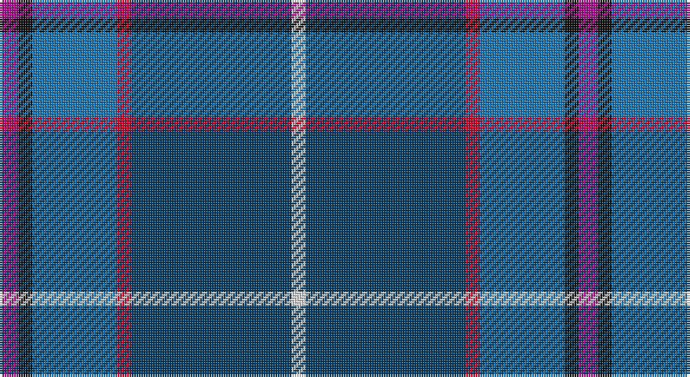

This page is one **sett** — a single exact thread-count. It belongs to the [tartan](/setts/m4k3b18r3dt34w3/)
(the same proportion at any scale), whose colour order is pattern [RKBRBW](/stripes/rkbrbw/).

Part of the [Margach, William](/tartans/margach-william/) tartan — the named design grouping this sett with its other cloths.

Sourced from tartans-authority.  It is a [6 stripe tartan](/stripes/stripes6/).

Original link http://www.tartansauthority.com/tartan-ferret/display/10319/

## Register references

External register numbers recorded for this tartan.

- Scottish Register of Tartans: [10319](https://www.tartanregister.gov.uk/tartanDetails?ref=10319)
- Scottish Tartans Authority (ITI): 10319

## Thread count
P/8 K6 B36 R6 DB68 LN/6

One full sett is **246 threads**.

## Palette

Palette: <strong>Tartan Register</strong> <small style="color:#888">(5 of 6 colours)</small>
<table><thead><tr><th>Colour</th><th>Threads</th><th>Shade</th><th>Base</th><th>OKLCh</th></tr></thead><tbody><tr><td>P/</td><td style="text-align:right;font-variant-numeric:tabular-nums">8</td><td><code style="background-color:#A8088C;">#A8088C</code> <small style="color:#888">#A8088C</small></td><td>R <code style="background-color:#CC0000;">#CC0000</code></td><td><small style="color:#888">oklch(49.9% 0.215 338.0)</small></td></tr><tr><td>K</td><td style="text-align:right;font-variant-numeric:tabular-nums">6</td><td><code style="background-color:#101010;">#101010</code> <small style="color:#888">#101010</small></td><td>K <code style="background-color:#000000;">#000000</code></td><td><small style="color:#888">oklch(17.3% 0.000 89.9)</small></td></tr><tr><td>B</td><td style="text-align:right;font-variant-numeric:tabular-nums">36</td><td><code style="background-color:#1474B4;">#1474B4</code> <small style="color:#888">#1474B4</small></td><td>B <code style="background-color:#2A418A;">#2A418A</code></td><td><small style="color:#888">oklch(54.0% 0.129 245.1)</small></td></tr><tr><td>R</td><td style="text-align:right;font-variant-numeric:tabular-nums">6</td><td><code style="background-color:#C8002C;">#C8002C</code> <small style="color:#888">#C8002C</small></td><td>R <code style="background-color:#CC0000;">#CC0000</code></td><td><small style="color:#888">oklch(52.6% 0.212 22.0)</small></td></tr><tr><td>DB</td><td style="text-align:right;font-variant-numeric:tabular-nums">68</td><td><code style="background-color:#003C64;">#003C64</code> <small style="color:#888">#003C64</small></td><td>B <code style="background-color:#2A418A;">#2A418A</code></td><td><small style="color:#888">oklch(34.5% 0.089 246.0)</small></td></tr><tr><td>LN/</td><td style="text-align:right;font-variant-numeric:tabular-nums">6</td><td><code style="background-color:#E0E0E0;">#E0E0E0</code> <small style="color:#888">#E0E0E0</small></td><td>W <code style="background-color:#F7F7F7;">#F7F7F7</code></td><td><small style="color:#888">oklch(90.7% 0.000 89.9)</small></td></tr></tbody></table>

# Sample pattern

## Compared to the master

This cloth is one sett of its design; the master sett (the exemplar the design is anchored on) is below for comparison.

<figure style="margin:0"><figcaption style="color:#888;font-size:smaller">this sett</figcaption></figure>
<figure style="margin:0"><figcaption style="color:#888;font-size:smaller"><a href="/setts/m4k3t18r3dp34w3/">master sett →</a></figcaption></figure>

## Nearest tartans

The nearest existing variants by ΔTartan distance, with this tartan at the top so the swatches line up against it.

ΔTartan

Tartan

Sett

—

<a href="/ttd/edit/#slug=m4k3b18r3dt34w3~x2">Margach, William (Personal)</a> <a class="nn-out" href="/variants/s6/m4k3b18r3dt34w3~x2/" title="open its dictionary page">↗</a>

0.88

<a href="/ttd/edit/#slug=db30n10y10db5r3ly3g3~x2&amp;base=m4k3b18r3dt34w3~x2">Wrigglesworth Family Canada (Personal)</a> <a class="nn-out" href="/variants/s7/db30n10y10db5r3ly3g3~x2/" title="open its dictionary page">↗</a>

0.97

<a href="/ttd/edit/#slug=t27db9lb3g6db33lb3dr3ly2~x2&amp;base=m4k3b18r3dt34w3~x2">Blue Ridge Highlands Heritage</a> <a class="nn-out" href="/variants/s8/t27db9lb3g6db33lb3dr3ly2~x2/" title="open its dictionary page">↗</a>

0.99

<a href="/ttd/edit/#slug=dg10w2dt3g2m14dti26dg2dti6~x2&amp;base=m4k3b18r3dt34w3~x2">Spirit of Fife (Corporate)</a> <a class="nn-out" href="/variants/s8/dg10w2dt3g2m14dti26dg2dti6~x2/" title="open its dictionary page">↗</a>

1.03

<a href="/ttd/edit/#slug=w1db15r1o10g2lp1~x4&amp;base=m4k3b18r3dt34w3~x2">Peterson, Oren (Name)</a> <a class="nn-out" href="/variants/s6/w1db15r1o10g2lp1~x4/" title="open its dictionary page">↗</a>

1.09

<a href="/ttd/edit/#slug=b12dt35lb4w3k11r5~x2&amp;base=m4k3b18r3dt34w3~x2">Ferster, James Carney (Personal)</a> <a class="nn-out" href="/variants/s6/b12dt35lb4w3k11r5~x2/" title="open its dictionary page">↗</a>

1.18

<a href="/ttd/edit/#slug=k4n4dt32r4t17w2~x2&amp;base=m4k3b18r3dt34w3~x2">Shearer (2016)</a> <a class="nn-out" href="/variants/s6/k4n4dt32r4t17w2~x2/" title="open its dictionary page">↗</a>

1.22

<a href="/ttd/edit/#slug=dbi30w2r3w2db14lr3dg14dbi18r2dbi3~x2&amp;base=m4k3b18r3dt34w3~x2">Kansai St Andrews Society</a> <a class="nn-out" href="/variants/s10/dbi30w2r3w2db14lr3dg14dbi18r2dbi3~x2/" title="open its dictionary page">↗</a>

1.23

<a href="/ttd/edit/#slug=db4p2dp3db24b24w3~x2&amp;base=m4k3b18r3dt34w3~x2">Aberdeen Academy of Performing Arts</a> <a class="nn-out" href="/variants/s6/db4p2dp3db24b24w3~x2/" title="open its dictionary page">↗</a>

1.24

<a href="/ttd/edit/#slug=db30b10lb10db5m3ly3g3~x2&amp;base=m4k3b18r3dt34w3~x2">Wrigglesworth (Name)</a> <a class="nn-out" href="/variants/s7/db30b10lb10db5m3ly3g3~x2/" title="open its dictionary page">↗</a>

1.24

<a href="/ttd/edit/#slug=t12db6t50dbi39p12dp6p6w4&amp;base=m4k3b18r3dt34w3~x2">Pride of the Nation (Fashion)</a> <a class="nn-out" href="/variants/s8/t12db6t50dbi39p12dp6p6w4/" title="open its dictionary page">↗</a>

## Neighbour map

Every grey dot is one of 14360 variants placed by the first two principal components of the ΔTartan feature space (44% of its variance). Red is this tartan; blue dots are its nearest — click one to open its page.

<svg viewBox="0 0 640 380" role="img" style="max-width:100%;height:auto;border:1px solid #e0e0e0;border-radius:4px;display:block" xmlns="http://www.w3.org/2000/svg"><image href="/nn/cloud.v1.png" width="640" height="380"/><a href="/variants/s7/db30n10y10db5r3ly3g3~x2/"><circle cx="275.2" cy="181.9" r="4" fill="#3465a4"><title>Wrigglesworth Family Canada (Personal)</title></circle></a><a href="/variants/s8/t27db9lb3g6db33lb3dr3ly2~x2/"><circle cx="263.2" cy="146.6" r="4" fill="#3465a4"><title>Blue Ridge Highlands Heritage</title></circle></a><a href="/variants/s8/dg10w2dt3g2m14dti26dg2dti6~x2/"><circle cx="252.2" cy="168.3" r="4" fill="#3465a4"><title>Spirit of Fife (Corporate)</title></circle></a><a href="/variants/s6/w1db15r1o10g2lp1~x4/"><circle cx="269.5" cy="150.4" r="4" fill="#3465a4"><title>Peterson, Oren (Name)</title></circle></a><a href="/variants/s6/b12dt35lb4w3k11r5~x2/"><circle cx="220.1" cy="173.4" r="4" fill="#3465a4"><title>Ferster, James Carney (Personal)</title></circle></a><a href="/variants/s6/k4n4dt32r4t17w2~x2/"><circle cx="249.0" cy="151.0" r="4" fill="#3465a4"><title>Shearer (2016)</title></circle></a><a href="/variants/s10/dbi30w2r3w2db14lr3dg14dbi18r2dbi3~x2/"><circle cx="282.3" cy="149.2" r="4" fill="#3465a4"><title>Kansai St Andrews Society</title></circle></a><a href="/variants/s6/db4p2dp3db24b24w3~x2/"><circle cx="264.3" cy="188.9" r="4" fill="#3465a4"><title>Aberdeen Academy of Performing Arts</title></circle></a><a href="/variants/s7/db30b10lb10db5m3ly3g3~x2/"><circle cx="238.1" cy="160.4" r="4" fill="#3465a4"><title>Wrigglesworth (Name)</title></circle></a><a href="/variants/s8/t12db6t50dbi39p12dp6p6w4/"><circle cx="217.0" cy="153.8" r="4" fill="#3465a4"><title>Pride of the Nation (Fashion)</title></circle></a><circle cx="275.8" cy="176.3" r="5" fill="#c00000"/></svg>

ID: /variants/s6/m4k3b18r3dt34w3~x2/
