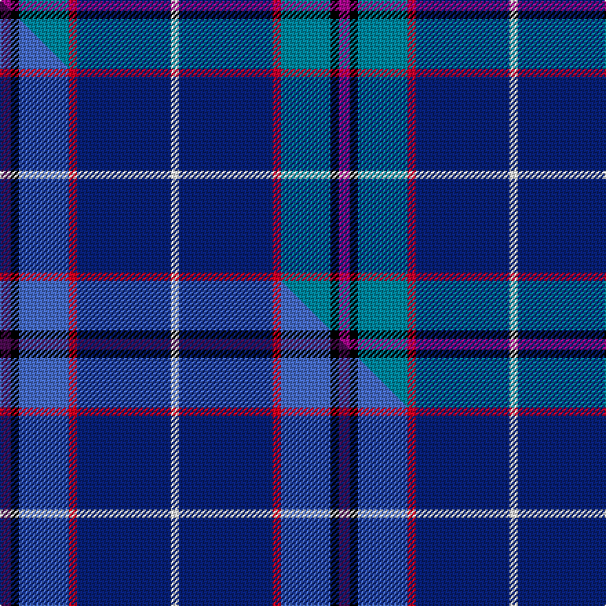

This is one **variant** — a specific cloth: this exact thread count and colourway, with its own
provenance below. It is one weaving of the [sett](/setts/m4k3t18r3db34w3/) (the scale-free proportion — the
same cloth at any scale or shade), whose colour order is pattern [RKBRBW](/stripes/rkbrbw/).

Part of the [Margach, William](/tartans/m/ma/margach-william/) tartan — the named design grouping this sett with its other cloths.

Sourced from tartans-authority.  It is a [6 stripe tartan](/stripes/stripes6/).

Original link [https://www.tartanregister.gov.uk/tartanDetails.aspx?ref=10319](https://www.tartanregister.gov.uk/tartanDetails.aspx?ref=10319)

Dataset <small>— provenance for this record, inherited from the source manifest</small>

<dl class="dataset-prov">
<dt>source</dt><dd><a href="/sources/tartans-authority/">Scottish Tartans Authority</a></dd>
<dt>data captured from</dt><dd><a href="https://github.com/thetartan/tartan-database/blob/master/data/tartans-authority/data.csv">https://github.com/thetartan/tartan-database/blob/master/data/tartans-authority/data.csv</a></dd>
<dt>data date</dt><dd>20th Oct. 2010 <small>(this record)</small></dd>
<dt>licence</dt><dd><a href="https://creativecommons.org/licenses/by-nc-nd/4.0/">CC BY-NC-ND 4.0</a></dd>
</dl>

Capture chain <small>— the hands this data passed through, oldest first; each capture carries its own licence</small>

<ol class="capture-chain">
<li><a href="https://www.tartansauthority.com/">Scottish Tartans Authority</a> <small>the heritage body's archive — its tartan-ferret record browser is retired (links repaired to the SRT, above)</small></li>
<li><a href="https://github.com/thetartan/tartan-database">thetartan/tartan-database</a> <small>2016-2017</small> · <a href="https://creativecommons.org/licenses/by-nc-nd/4.0/">CC BY-NC-ND 4.0</a> <small>Levko Kravets's frozen compilation — the capture we vendored, and where its CC licence text came from</small></li>
<li>this dictionary <small>captured 2026-06-10 · commit 5bf86c7566</small> <small>each re-capture is a git commit to data/sources</small></li>
</ol>

## Register references

External register numbers recorded for this tartan.

- Scottish Register of Tartans: [10319](https://www.tartanregister.gov.uk/tartanDetails?ref=10319)
- Scottish Tartans Authority (ITI): 10319

## Thread count
M/8 K6 T36 R6 DB68 W/6

One full sett is **246 threads**.

## Palette
<table><thead><tr><th>Colour</th><th>Shade</th><th>OKLCh</th></tr></thead><tbody><tr><td>T</td><td><code style="background-color:#00879F;">#00879F</code> <small style="color:#888">#00879F</small></td><td><small style="color:#888">oklch(57.4% 0.102 216.1)</small></td></tr><tr><td>DB</td><td><code style="background-color:#082077;">#082077</code> <small style="color:#888">#082077</small></td><td><small style="color:#888">oklch(30.0% 0.149 265.1)</small></td></tr><tr><td>K</td><td><code style="background-color:#000000;">#000000</code> <small style="color:#888">#000000</small></td><td><small style="color:#888">oklch(0.0% 0.000 0.0)</small></td></tr><tr><td>W</td><td><code style="background-color:#F7F7F7;">#F7F7F7</code> <small style="color:#888">#F7F7F7</small></td><td><small style="color:#888">oklch(97.6% 0.000 89.9)</small></td></tr><tr><td>M</td><td><code style="background-color:#A8088C;">#A8088C</code> <small style="color:#888">#A8088C</small></td><td><small style="color:#888">oklch(49.9% 0.215 338.0)</small></td></tr><tr><td>R</td><td><code style="background-color:#C8002C;">#C8002C</code> <small style="color:#888">#C8002C</small></td><td><small style="color:#888">oklch(52.6% 0.212 22.0)</small></td></tr></tbody></table>

# Sample pattern

## Compared to the master

This cloth is one sett of its design; the master sett (the exemplar the design is anchored on) is below for comparison.

Its **ΔTartan distance** from the master is **0.09** — the same measure the nearest-tartans table ranks by (0 is identical; a re-scale of the same cloth is near 0, a recolour or a different proportion further).

<figure class="master-compare" style="margin:0">

this sett
master sett ★

<figcaption style="color:#888;font-size:smaller">One weave of this sett against the <a href="/setts/dp4k3b18r3db34w3/">master sett ★</a>, split on the diagonal: a shared proportion runs seamlessly across it with only the shades shifting; a different proportion breaks on it.</figcaption>
</figure>

## Nearest tartan variants

The nearest existing variants by ΔTartan distance, with this cloth at the top so the swatches line up against it.

ΔTartan

Threads

Variant

Sett

—

246

<a href="/variants/s6/m4k3t18r3db34w3~x2~m2009341-r2108022/">Margach, William (Personal)</a>

<a href="/ttd/edit/#slug=dp4k3b18r3db34w3~x2&amp;base=m4k3t18r3db34w3~x2~m2009341-r2108022" title="compare in the TTD">0.09</a>

246

<a href="/variants/s6/dp4k3b18r3db34w3~x2/">Margach, William (Dumbarton)</a>

<a href="/ttd/edit/#slug=k4n4db32r4b17w2~x2~db1404245-b2603265&amp;base=m4k3t18r3db34w3~x2~m2009341-r2108022" title="compare in the TTD">0.98</a>

240

<a href="/variants/s6/k4n4db32r4b17w2~x2~db1404245-b2603265/">Shearer (2016)</a>

<a href="/ttd/edit/#slug=r3db15dbi8g5k2w1~x2~db1004274-dbi1406275&amp;base=m4k3t18r3db34w3~x2~m2009341-r2108022" title="compare in the TTD">1.53</a>

128

<a href="/variants/s6/r3db15dbi8g5k2w1~x2~db1004274-dbi1406275/">Nicolson of Harris (Clan?)</a>

<a href="/ttd/edit/#slug=t12db35lb4w3k11dr5~x2&amp;base=m4k3t18r3db34w3~x2~m2009341-r2108022" title="compare in the TTD">1.72</a>

246

<a href="/variants/s6/t12db35lb4w3k11dr5~x2/">Ferster, James Carney (Personal)</a>

<a href="/ttd/edit/#slug=b5g8k5db32w2r2~x2&amp;base=m4k3t18r3db34w3~x2~m2009341-r2108022" title="compare in the TTD">1.80</a>

202

<a href="/variants/s6/b5g8k5db32w2r2~x2/">Marion (Personal)</a>

<a href="/ttd/edit/#slug=w1db15r1n10g2lp1~x4&amp;base=m4k3t18r3db34w3~x2~m2009341-r2108022" title="compare in the TTD">1.98</a>

232

<a href="/variants/s6/w1db15r1n10g2lp1~x4/">Peterson, Oren (Name)</a>

<a href="/ttd/edit/#slug=db46k6g9dy9r4&amp;base=m4k3t18r3db34w3~x2~m2009341-r2108022" title="compare in the TTD">2.14</a>

98

<a href="/variants/s5/db46k6g9dy9r4/">Ayllu Thuban</a>

<a href="/ttd/edit/#slug=lb3k2g2k1db10w1~x8&amp;base=m4k3t18r3db34w3~x2~m2009341-r2108022" title="compare in the TTD">2.25</a>

272

<a href="/variants/s6/lb3k2g2k1db10w1~x8/">Isle of Harris (District)</a>

<a href="/ttd/edit/#slug=k8dy2t21w3r2~x4~t2205244&amp;base=m4k3t18r3db34w3~x2~m2009341-r2108022" title="compare in the TTD">2.40</a>

248

<a href="/variants/s5/k8dy2t21w3r2~x4~t2205244/">Oklahoma</a>

<a href="/ttd/edit/#slug=k8y2t21w3r2~x4~t2205244&amp;base=m4k3t18r3db34w3~x2~m2009341-r2108022" title="compare in the TTD">2.41</a>

248

<a href="/variants/s5/k8y2t21w3r2~x4~t2205244/">Oklahoma State American District Tartan</a>

## Neighbour map

Every grey dot is one of 13621 variants placed by the first two principal components of the ΔTartan feature space (42% of its variance). Red is this tartan; blue dots are its nearest — click one to open its page.

<svg viewBox="0 0 640 380" role="img" style="max-width:100%;height:auto;border:1px solid #e0e0e0;border-radius:4px;display:block" xmlns="http://www.w3.org/2000/svg"><image href="/nn/cloud.v1.png" width="640" height="380"/><a href="/variants/s6/dp4k3b18r3db34w3~x2/"><circle cx="256.0" cy="155.5" r="4" fill="#3465a4"><title>Margach, William (Dumbarton)</title></circle></a><a href="/variants/s6/k4n4db32r4b17w2~x2~db1404245-b2603265/"><circle cx="251.3" cy="147.5" r="4" fill="#3465a4"><title>Shearer (2016)</title></circle></a><a href="/variants/s6/r3db15dbi8g5k2w1~x2~db1004274-dbi1406275/"><circle cx="195.2" cy="162.8" r="4" fill="#3465a4"><title>Nicolson of Harris (Clan?)</title></circle></a><a href="/variants/s6/t12db35lb4w3k11dr5~x2/"><circle cx="196.9" cy="157.0" r="4" fill="#3465a4"><title>Ferster, James Carney (Personal)</title></circle></a><a href="/variants/s6/b5g8k5db32w2r2~x2/"><circle cx="279.2" cy="129.2" r="4" fill="#3465a4"><title>Marion (Personal)</title></circle></a><a href="/variants/s6/w1db15r1n10g2lp1~x4/"><circle cx="292.9" cy="162.9" r="4" fill="#3465a4"><title>Peterson, Oren (Name)</title></circle></a><a href="/variants/s5/db46k6g9dy9r4/"><circle cx="337.8" cy="177.1" r="4" fill="#3465a4"><title>Ayllu Thuban</title></circle></a><a href="/variants/s6/lb3k2g2k1db10w1~x8/"><circle cx="207.3" cy="164.4" r="4" fill="#3465a4"><title>Isle of Harris (District)</title></circle></a><a href="/variants/s5/k8dy2t21w3r2~x4~t2205244/"><circle cx="251.7" cy="166.9" r="4" fill="#3465a4"><title>Oklahoma</title></circle></a><a href="/variants/s5/k8y2t21w3r2~x4~t2205244/"><circle cx="251.5" cy="167.0" r="4" fill="#3465a4"><title>Oklahoma State American District Tartan</title></circle></a><circle cx="239.2" cy="149.8" r="5" fill="#c00000"/><text x="320" y="376" text-anchor="middle" font-size="11" fill="#999">ground</text><text x="11" y="190" text-anchor="middle" font-size="11" fill="#999" transform="rotate(-90 11 190)">complexity</text></svg>

ID: /variants/s6/m4k3t18r3db34w3~x2~m2009341-r2108022/
