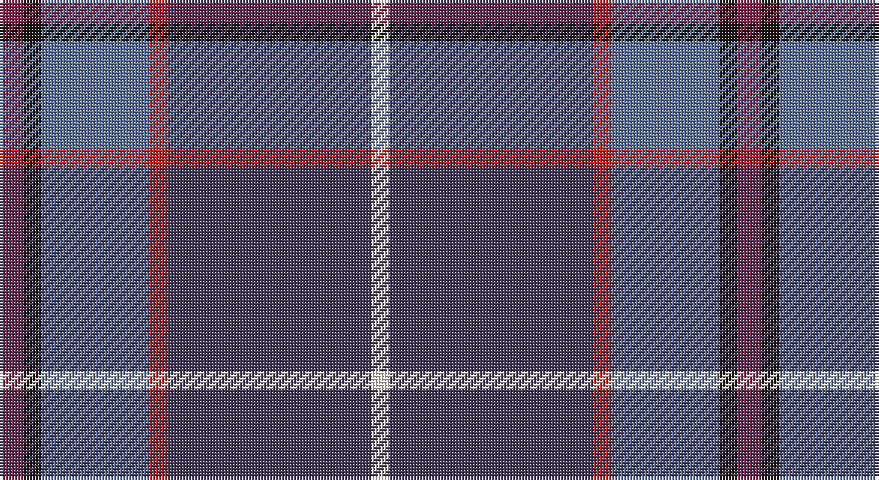

This page is one **sett** — a single exact thread-count. It belongs to the [tartan](/setts/m4k3t18r3dp34w3/)
(the same proportion at any scale), whose colour order is pattern [RKBRBW](/stripes/rkbrbw/).

Part of the [Margach, William](/tartans/margach-william/) tartan — the named design grouping this sett with its other cloths.

Sourced from register-of-tartans.  It is a [6 stripe tartan](/stripes/stripes6/).

Original link https://www.tartanregister.gov.uk/tartanDetails.aspx?ref=10319

## Register references

External register numbers recorded for this tartan.

- Scottish Register of Tartans: [10319](https://www.tartanregister.gov.uk/tartanDetails.aspx?ref=10319)

## Thread count
DR/8 K6 B36 R6 N68 W/6

One full sett is **246 threads**.

## Palette

Palette: <strong>Tartan Register</strong> <small style="color:#888">(2 of 6 colours)</small>
<table><thead><tr><th>Colour</th><th>Threads</th><th>Shade</th><th>Base</th><th>OKLCh</th></tr></thead><tbody><tr><td>DR/</td><td style="text-align:right;font-variant-numeric:tabular-nums">8</td><td><code style="background-color:#86264D;">#86264D</code> <small style="color:#888">#86264D</small></td><td>R <code style="background-color:#CC0000;">#CC0000</code></td><td><small style="color:#888">oklch(43.0% 0.135 359.7)</small></td></tr><tr><td>K</td><td style="text-align:right;font-variant-numeric:tabular-nums">6</td><td><code style="background-color:#1C1714;">#1C1714</code> <small style="color:#888">#1C1714</small></td><td>K <code style="background-color:#000000;">#000000</code></td><td><small style="color:#888">oklch(20.9% 0.010 52.9)</small></td></tr><tr><td>B</td><td style="text-align:right;font-variant-numeric:tabular-nums">36</td><td><code style="background-color:#5F749C;">#5F749C</code> <small style="color:#888">#5F749C</small></td><td>B <code style="background-color:#2A418A;">#2A418A</code></td><td><small style="color:#888">oklch(55.8% 0.067 262.9)</small></td></tr><tr><td>R</td><td style="text-align:right;font-variant-numeric:tabular-nums">6</td><td><code style="background-color:#CA2625;">#CA2625</code> <small style="color:#888">#CA2625</small></td><td>R <code style="background-color:#CC0000;">#CC0000</code></td><td><small style="color:#888">oklch(54.4% 0.199 27.2)</small></td></tr><tr><td>N</td><td style="text-align:right;font-variant-numeric:tabular-nums">68</td><td><code style="background-color:#433A5A;">#433A5A</code> <small style="color:#888">#433A5A</small></td><td>B <code style="background-color:#2A418A;">#2A418A</code></td><td><small style="color:#888">oklch(37.2% 0.055 296.6)</small></td></tr><tr><td>W/</td><td style="text-align:right;font-variant-numeric:tabular-nums">6</td><td><code style="background-color:#F9F5EF;">#F9F5EF</code> <small style="color:#888">#F9F5EF</small></td><td>W <code style="background-color:#F7F7F7;">#F7F7F7</code></td><td><small style="color:#888">oklch(97.2% 0.009 78.3)</small></td></tr></tbody></table>

# Sample pattern

## Nearest tartans

The nearest existing variants by ΔTartan distance, with this tartan at the top so the swatches line up against it.

ΔTartan

Tartan

Sett

—

<a href="/ttd/edit/#slug=m4k3t18r3dp34w3~x2">Margach, William (Dumbarton)</a> <a class="nn-out" href="/variants/s6/m4k3t18r3dp34w3~x2/" title="open its dictionary page">↗</a>

0.91

<a href="/ttd/edit/#slug=db30n10y10db5r3ly3g3~x2&amp;base=m4k3t18r3dp34w3~x2">Wrigglesworth Family Canada (Personal)</a> <a class="nn-out" href="/variants/s7/db30n10y10db5r3ly3g3~x2/" title="open its dictionary page">↗</a>

1.20

<a href="/ttd/edit/#slug=dg10w2dt3g2m14dti26dg2dti6~x2&amp;base=m4k3t18r3dp34w3~x2">Spirit of Fife (Corporate)</a> <a class="nn-out" href="/variants/s8/dg10w2dt3g2m14dti26dg2dti6~x2/" title="open its dictionary page">↗</a>

1.28

<a href="/ttd/edit/#slug=m4k3b18r3dt34w3~x2&amp;base=m4k3t18r3dp34w3~x2">Margach, William (Personal)</a> <a class="nn-out" href="/variants/s6/m4k3b18r3dt34w3~x2/" title="open its dictionary page">↗</a>

1.38

<a href="/ttd/edit/#slug=w1db15r1o10g2lp1~x4&amp;base=m4k3t18r3dp34w3~x2">Peterson, Oren (Name)</a> <a class="nn-out" href="/variants/s6/w1db15r1o10g2lp1~x4/" title="open its dictionary page">↗</a>

1.39

<a href="/ttd/edit/#slug=db1lo1db13loi3y3loi3r1loi1~x4&amp;base=m4k3t18r3dp34w3~x2">Glen Moray</a> <a class="nn-out" href="/variants/s8/db1lo1db13loi3y3loi3r1loi1~x4/" title="open its dictionary page">↗</a>

1.43

<a href="/ttd/edit/#slug=k6dg11w2db22r2k4~x2&amp;base=m4k3t18r3dp34w3~x2">Leslie Hebridean Artifact Tartan</a> <a class="nn-out" href="/variants/s6/k6dg11w2db22r2k4~x2/" title="open its dictionary page">↗</a>

1.49

<a href="/ttd/edit/#slug=k3r3dg4db7k3dt39db15w3~x2&amp;base=m4k3t18r3dp34w3~x2">American National</a> <a class="nn-out" href="/variants/s8/k3r3dg4db7k3dt39db15w3~x2/" title="open its dictionary page">↗</a>

1.51

<a href="/ttd/edit/#slug=k2m1db17m17dt1ly2~x4&amp;base=m4k3t18r3dp34w3~x2">Murdoch</a> <a class="nn-out" href="/variants/s6/k2m1db17m17dt1ly2~x4/" title="open its dictionary page">↗</a>

1.53

<a href="/ttd/edit/#slug=dt5b43dt18lb4b6r5dy25lo5~x2&amp;base=m4k3t18r3dp34w3~x2">State Seal of Iowa (Fashion)</a> <a class="nn-out" href="/variants/s8/dt5b43dt18lb4b6r5dy25lo5~x2/" title="open its dictionary page">↗</a>

1.57

<a href="/ttd/edit/#slug=r30db5r3db33g8k3db8w2~x2&amp;base=m4k3t18r3dp34w3~x2">St. Margaret Youth Group (Corporate)</a> <a class="nn-out" href="/variants/s8/r30db5r3db33g8k3db8w2~x2/" title="open its dictionary page">↗</a>

## Neighbour map

Every grey dot is one of 14360 variants placed by the first two principal components of the ΔTartan feature space (44% of its variance). Red is this tartan; blue dots are its nearest — click one to open its page.

<svg viewBox="0 0 640 380" role="img" style="max-width:100%;height:auto;border:1px solid #e0e0e0;border-radius:4px;display:block" xmlns="http://www.w3.org/2000/svg"><image href="/nn/cloud.v1.png" width="640" height="380"/><a href="/variants/s7/db30n10y10db5r3ly3g3~x2/"><circle cx="275.2" cy="181.9" r="4" fill="#3465a4"><title>Wrigglesworth Family Canada (Personal)</title></circle></a><a href="/variants/s8/dg10w2dt3g2m14dti26dg2dti6~x2/"><circle cx="252.2" cy="168.3" r="4" fill="#3465a4"><title>Spirit of Fife (Corporate)</title></circle></a><a href="/variants/s6/m4k3b18r3dt34w3~x2/"><circle cx="275.8" cy="176.3" r="4" fill="#3465a4"><title>Margach, William (Personal)</title></circle></a><a href="/variants/s6/w1db15r1o10g2lp1~x4/"><circle cx="269.5" cy="150.4" r="4" fill="#3465a4"><title>Peterson, Oren (Name)</title></circle></a><a href="/variants/s8/db1lo1db13loi3y3loi3r1loi1~x4/"><circle cx="306.1" cy="157.9" r="4" fill="#3465a4"><title>Glen Moray</title></circle></a><a href="/variants/s6/k6dg11w2db22r2k4~x2/"><circle cx="261.4" cy="208.8" r="4" fill="#3465a4"><title>Leslie Hebridean Artifact Tartan</title></circle></a><a href="/variants/s8/k3r3dg4db7k3dt39db15w3~x2/"><circle cx="292.9" cy="163.2" r="4" fill="#3465a4"><title>American National</title></circle></a><a href="/variants/s6/k2m1db17m17dt1ly2~x4/"><circle cx="313.9" cy="172.4" r="4" fill="#3465a4"><title>Murdoch</title></circle></a><a href="/variants/s8/dt5b43dt18lb4b6r5dy25lo5~x2/"><circle cx="219.5" cy="176.8" r="4" fill="#3465a4"><title>State Seal of Iowa (Fashion)</title></circle></a><a href="/variants/s8/r30db5r3db33g8k3db8w2~x2/"><circle cx="321.4" cy="171.0" r="4" fill="#3465a4"><title>St. Margaret Youth Group (Corporate)</title></circle></a><circle cx="293.9" cy="176.2" r="5" fill="#c00000"/></svg>

ID: /variants/s6/m4k3t18r3dp34w3~x2/
