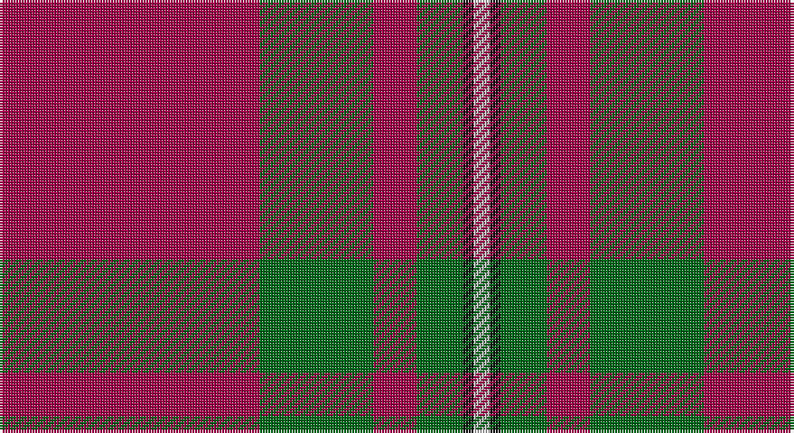

This page is one **sett** — a single exact thread-count. It belongs to the [tartan](/setts/m96g42m16g17k4lb6/)
(the same proportion at any scale), whose colour order is pattern [RGRGKW](/stripes/rgrgkw/).

Sourced from house-of-tartan.  It is a [6 stripe tartan](/stripes/stripes6/).

Original link http://www.house-of-tartan.scotland.net/house/TartanViewjs.asp?colr=Def&tnam=1285

## Provenance

Earliest known date: 1960 This is the usual MacGregor sett but with a darker crimson background colour. The story goes that Alasdair MacGregor of Cardney wanted to make tartan from the wool of his own sheep. His initial dyeing attempt produced a shocking pink colour, so he dyed the wool a second time to get this dark crimson colour. He liked the result so much that he had a bolt of cloth woven and the Cardney MacGregors have worn it ever since. The addition of the term 'Hunting' to the name is, apparently a commercial attribution. Notes from the STA, quoting Sir Malcolm MacGregor of MacGregor (2006)

## Thread count
R/96 G42 R16 G17 K4 N/6

One full sett is **260 threads**.

## Palette

Palette: <strong>Tartan Register</strong>
<table><thead><tr><th>Colour</th><th>Threads</th><th>Shade</th><th>Base</th><th>OKLCh</th></tr></thead><tbody><tr><td>R/</td><td style="text-align:right;font-variant-numeric:tabular-nums">96</td><td><code style="background-color:#A00048;">#A00048</code> <small style="color:#888">#A00048</small></td><td>R <code style="background-color:#CC0000;">#CC0000</code></td><td><small style="color:#888">oklch(45.4% 0.182 5.3)</small></td></tr><tr><td>G</td><td style="text-align:right;font-variant-numeric:tabular-nums">42</td><td><code style="background-color:#006818;">#006818</code> <small style="color:#888">#006818</small></td><td>G <code style="background-color:#006100;">#006100</code></td><td><small style="color:#888">oklch(45.0% 0.142 145.0)</small></td></tr><tr><td>R</td><td style="text-align:right;font-variant-numeric:tabular-nums">16</td><td><code style="background-color:#A00048;">#A00048</code> <small style="color:#888">#A00048</small></td><td>R <code style="background-color:#CC0000;">#CC0000</code></td><td><small style="color:#888">oklch(45.4% 0.182 5.3)</small></td></tr><tr><td>G</td><td style="text-align:right;font-variant-numeric:tabular-nums">17</td><td><code style="background-color:#006818;">#006818</code> <small style="color:#888">#006818</small></td><td>G <code style="background-color:#006100;">#006100</code></td><td><small style="color:#888">oklch(45.0% 0.142 145.0)</small></td></tr><tr><td>K</td><td style="text-align:right;font-variant-numeric:tabular-nums">4</td><td><code style="background-color:#101010;">#101010</code> <small style="color:#888">#101010</small></td><td>K <code style="background-color:#000000;">#000000</code></td><td><small style="color:#888">oklch(17.3% 0.000 89.9)</small></td></tr><tr><td>N/</td><td style="text-align:right;font-variant-numeric:tabular-nums">6</td><td><code style="background-color:#C0C0C0;">#C0C0C0</code> <small style="color:#888">#C0C0C0</small></td><td>W <code style="background-color:#F7F7F7;">#F7F7F7</code></td><td><small style="color:#888">oklch(80.8% 0.000 89.9)</small></td></tr></tbody></table>

# Sample pattern

## Nearest tartans

The nearest existing variants by ΔTartan distance, with this tartan at the top so the swatches line up against it.

ΔTartan

Tartan

Sett

—

<a href="/ttd/edit/#slug=m96g42m16g17k4lb6">MacGregor Hunting Glengyle Clan Tartan</a> <a class="nn-out" href="/variants/s6/m96g42m16g17k4lb6/" title="open its dictionary page">↗</a>

0.61

<a href="/ttd/edit/#slug=m18g9m2g3k1w1~x4&amp;base=m96g42m16g17k4lb6">MacGregor of Cardney</a> <a class="nn-out" href="/variants/s6/m18g9m2g3k1w1~x4/" title="open its dictionary page">↗</a>

0.67

<a href="/ttd/edit/#slug=r96g42r16g17k4y6&amp;base=m96g42m16g17k4lb6">MacGregor, Glengyle</a> <a class="nn-out" href="/variants/s6/r96g42r16g17k4y6/" title="open its dictionary page">↗</a>

1.08

<a href="/ttd/edit/#slug=r60k2w3dg20r10dg20~x2&amp;base=m96g42m16g17k4lb6">Greig (Personal)</a> <a class="nn-out" href="/variants/s6/r60k2w3dg20r10dg20~x2/" title="open its dictionary page">↗</a>

1.10

<a href="/ttd/edit/#slug=k3r48g6r6g12ly3g2k3~x2&amp;base=m96g42m16g17k4lb6">Oakhall (Corporate)</a> <a class="nn-out" href="/variants/s8/k3r48g6r6g12ly3g2k3~x2/" title="open its dictionary page">↗</a>

1.12

<a href="/ttd/edit/#slug=r22db5r2dg11r3db1~x2&amp;base=m96g42m16g17k4lb6">MacKintosh D</a> <a class="nn-out" href="/variants/s6/r22db5r2dg11r3db1~x2/" title="open its dictionary page">↗</a>

1.15

<a href="/ttd/edit/#slug=r24db6r3dg12r4db1~x2&amp;base=m96g42m16g17k4lb6">MacKintosh</a> <a class="nn-out" href="/variants/s6/r24db6r3dg12r4db1~x2/" title="open its dictionary page">↗</a>

1.16

<a href="/ttd/edit/#slug=r36dg18r4dg6k1lr2~x2&amp;base=m96g42m16g17k4lb6">MacGregor</a> <a class="nn-out" href="/variants/s6/r36dg18r4dg6k1lr2~x2/" title="open its dictionary page">↗</a>

1.16

<a href="/ttd/edit/#slug=r36dg18r4dg6k1lr2&amp;base=m96g42m16g17k4lb6">MacGregor</a> <a class="nn-out" href="/variants/s6/r36dg18r4dg6k1lr2/" title="open its dictionary page">↗</a>

1.19

<a href="/ttd/edit/#slug=r80t40k5lo6&amp;base=m96g42m16g17k4lb6">Broberg (Scania) (Personal)</a> <a class="nn-out" href="/variants/s4/r80t40k5lo6/" title="open its dictionary page">↗</a>

1.20

<a href="/ttd/edit/#slug=r3o10r3o4r20lb1~x4&amp;base=m96g42m16g17k4lb6">Monica</a> <a class="nn-out" href="/variants/s6/r3o10r3o4r20lb1~x4/" title="open its dictionary page">↗</a>

## Neighbour map

Every grey dot is one of 14360 variants placed by the first two principal components of the ΔTartan feature space (44% of its variance). Red is this tartan; blue dots are its nearest — click one to open its page.

<svg viewBox="0 0 640 380" role="img" style="max-width:100%;height:auto;border:1px solid #e0e0e0;border-radius:4px;display:block" xmlns="http://www.w3.org/2000/svg"><image href="/nn/cloud.v1.png" width="640" height="380"/><a href="/variants/s6/m18g9m2g3k1w1~x4/"><circle cx="395.4" cy="173.6" r="4" fill="#3465a4"><title>MacGregor of Cardney</title></circle></a><a href="/variants/s6/r96g42r16g17k4y6/"><circle cx="421.5" cy="167.8" r="4" fill="#3465a4"><title>MacGregor, Glengyle</title></circle></a><a href="/variants/s6/r60k2w3dg20r10dg20~x2/"><circle cx="418.3" cy="151.3" r="4" fill="#3465a4"><title>Greig (Personal)</title></circle></a><a href="/variants/s8/k3r48g6r6g12ly3g2k3~x2/"><circle cx="457.7" cy="142.1" r="4" fill="#3465a4"><title>Oakhall (Corporate)</title></circle></a><a href="/variants/s6/r22db5r2dg11r3db1~x2/"><circle cx="427.4" cy="192.1" r="4" fill="#3465a4"><title>MacKintosh D</title></circle></a><a href="/variants/s6/r24db6r3dg12r4db1~x2/"><circle cx="429.5" cy="193.3" r="4" fill="#3465a4"><title>MacKintosh</title></circle></a><a href="/variants/s6/r36dg18r4dg6k1lr2~x2/"><circle cx="450.0" cy="156.5" r="4" fill="#3465a4"><title>MacGregor</title></circle></a><a href="/variants/s6/r36dg18r4dg6k1lr2/"><circle cx="450.0" cy="156.5" r="4" fill="#3465a4"><title>MacGregor</title></circle></a><a href="/variants/s4/r80t40k5lo6/"><circle cx="405.3" cy="204.2" r="4" fill="#3465a4"><title>Broberg (Scania) (Personal)</title></circle></a><a href="/variants/s6/r3o10r3o4r20lb1~x4/"><circle cx="460.8" cy="199.5" r="4" fill="#3465a4"><title>Monica</title></circle></a><circle cx="428.6" cy="168.2" r="5" fill="#c00000"/></svg>

ID: /variants/s6/m96g42m16g17k4lb6/
