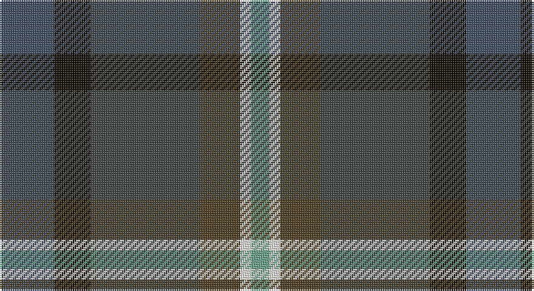

This page is one **sett** — a single exact thread-count. It belongs to the [tartan](/setts/n15k10dt30dy11w3lg5/)
(the same proportion at any scale), whose colour order is pattern [BKBGWY](/stripes/bkbgwy/).

Part of the [McHale, Barry](/tartans/mchale-barry/) tartan — the named design grouping this sett with its other cloths.

Sourced from house-of-tartan.  It is a [6 stripe tartan](/stripes/stripes6/).

Original link http://www.house-of-tartan.scotland.net/house/TartanViewjs.asp?colr=Def&tnam=10708

## Provenance

Earliest known date: 27 September 2012 Barry McHale commissioned the production of this tartan to be worn at his wedding. It may be worn by any of his McHale relatives.

## Thread count
Na/30 K20 N60 T22 W6 LG/10

One full sett is **256 threads**.

## Palette

Palette: <strong>custom</strong>
<table><thead><tr><th>Colour</th><th>Threads</th><th>Shade</th><th>Base</th><th>OKLCh</th></tr></thead><tbody><tr><td>Na/</td><td style="text-align:right;font-variant-numeric:tabular-nums">30</td><td><code style="background-color:#3F4B60;">#3F4B60</code> <small style="color:#888">#3F4B60</small></td><td>B <code style="background-color:#2A418A;">#2A418A</code></td><td><small style="color:#888">oklch(41.1% 0.039 261.5)</small></td></tr><tr><td>K</td><td style="text-align:right;font-variant-numeric:tabular-nums">20</td><td><code style="background-color:#120A01;">#120A01</code> <small style="color:#888">#120A01</small></td><td>K <code style="background-color:#000000;">#000000</code></td><td><small style="color:#888">oklch(15.2% 0.028 78.6)</small></td></tr><tr><td>N</td><td style="text-align:right;font-variant-numeric:tabular-nums">60</td><td><code style="background-color:#3F4441;">#3F4441</code> <small style="color:#888">#3F4441</small></td><td>B <code style="background-color:#2A418A;">#2A418A</code></td><td><small style="color:#888">oklch(38.1% 0.008 159.7)</small></td></tr><tr><td>T</td><td style="text-align:right;font-variant-numeric:tabular-nums">22</td><td><code style="background-color:#4E3D20;">#4E3D20</code> <small style="color:#888">#4E3D20</small></td><td>G <code style="background-color:#006100;">#006100</code></td><td><small style="color:#888">oklch(37.1% 0.050 79.6)</small></td></tr><tr><td>W</td><td style="text-align:right;font-variant-numeric:tabular-nums">6</td><td><code style="background-color:#F7F1E8;">#F7F1E8</code> <small style="color:#888">#F7F1E8</small></td><td>W <code style="background-color:#F7F7F7;">#F7F7F7</code></td><td><small style="color:#888">oklch(96.0% 0.014 78.3)</small></td></tr><tr><td>LG/</td><td style="text-align:right;font-variant-numeric:tabular-nums">10</td><td><code style="background-color:#6AA28C;">#6AA28C</code> <small style="color:#888">#6AA28C</small></td><td>Y <code style="background-color:#F2BF00;">#F2BF00</code></td><td><small style="color:#888">oklch(66.7% 0.068 167.7)</small></td></tr></tbody></table>

# Sample pattern

## Compared to the master

This cloth is one sett of its design; the master sett (the exemplar the design is anchored on) is below for comparison.

<figure style="margin:0"><figcaption style="color:#888;font-size:smaller">this sett</figcaption></figure>
<figure style="margin:0"><figcaption style="color:#888;font-size:smaller"><a href="/setts/t15k10dt30o11w3lg5/">master sett →</a></figcaption></figure>

## Nearest tartans

The nearest existing variants by ΔTartan distance, with this tartan at the top so the swatches line up against it.

ΔTartan

Tartan

Sett

—

<a href="/ttd/edit/#slug=n15k10dt30dy11w3lg5~x2">McHale, Barry Name Tartan</a> <a class="nn-out" href="/variants/s6/n15k10dt30dy11w3lg5~x2/" title="open its dictionary page">↗</a>

1.16

<a href="/ttd/edit/#slug=k26n10dt19r6ly2db9~x2&amp;base=n15k10dt30dy11w3lg5~x2">Meeson Hunting</a> <a class="nn-out" href="/variants/s6/k26n10dt19r6ly2db9~x2/" title="open its dictionary page">↗</a>

1.17

<a href="/ttd/edit/#slug=dg24lo2y16db7do16r5~x2&amp;base=n15k10dt30dy11w3lg5~x2">Waterford, County (District)</a> <a class="nn-out" href="/variants/s6/dg24lo2y16db7do16r5~x2/" title="open its dictionary page">↗</a>

1.20

<a href="/ttd/edit/#slug=r4k15t4dt15dg24y4~x2&amp;base=n15k10dt30dy11w3lg5~x2">Haughfoot (Commemorative)</a> <a class="nn-out" href="/variants/s6/r4k15t4dt15dg24y4~x2/" title="open its dictionary page">↗</a>

1.21

<a href="/ttd/edit/#slug=db9w2dg25do10k15dp4~x2&amp;base=n15k10dt30dy11w3lg5~x2">Staley (2014)</a> <a class="nn-out" href="/variants/s6/db9w2dg25do10k15dp4~x2/" title="open its dictionary page">↗</a>

1.26

<a href="/ttd/edit/#slug=r3dt24k7db11g11ly2~x2&amp;base=n15k10dt30dy11w3lg5~x2">Cowie</a> <a class="nn-out" href="/variants/s6/r3dt24k7db11g11ly2~x2/" title="open its dictionary page">↗</a>

1.41

<a href="/ttd/edit/#slug=db17lb2db2r2db2do12dg16lo3~x4&amp;base=n15k10dt30dy11w3lg5~x2">Blairmore House (Corporate)</a> <a class="nn-out" href="/variants/s8/db17lb2db2r2db2do12dg16lo3~x4/" title="open its dictionary page">↗</a>

1.45

<a href="/ttd/edit/#slug=dt46dpi15k12n8g8dp8~x2&amp;base=n15k10dt30dy11w3lg5~x2">Haut Family (by Dundee)</a> <a class="nn-out" href="/variants/s6/dt46dpi15k12n8g8dp8~x2/" title="open its dictionary page">↗</a>

1.45

<a href="/ttd/edit/#slug=dg5b2dg9dt19r9ly2~x2&amp;base=n15k10dt30dy11w3lg5~x2">Lyle and Scott</a> <a class="nn-out" href="/variants/s6/dg5b2dg9dt19r9ly2~x2/" title="open its dictionary page">↗</a>

1.47

<a href="/ttd/edit/#slug=dg3lo2o10dg10db20dg12r3db10w2~x2&amp;base=n15k10dt30dy11w3lg5~x2">Patel Name Tartan</a> <a class="nn-out" href="/variants/s9/dg3lo2o10dg10db20dg12r3db10w2~x2/" title="open its dictionary page">↗</a>

1.49

<a href="/variants/s5/db6w1dyi6dy12r2~x4/">Vass (Personal)</a>

## Neighbour map

Every grey dot is one of 14360 variants placed by the first two principal components of the ΔTartan feature space (44% of its variance). Red is this tartan; blue dots are its nearest — click one to open its page.

<svg viewBox="0 0 640 380" role="img" style="max-width:100%;height:auto;border:1px solid #e0e0e0;border-radius:4px;display:block" xmlns="http://www.w3.org/2000/svg"><image href="/nn/cloud.v1.png" width="640" height="380"/><a href="/variants/s6/k26n10dt19r6ly2db9~x2/"><circle cx="181.3" cy="215.3" r="4" fill="#3465a4"><title>Meeson Hunting</title></circle></a><a href="/variants/s6/dg24lo2y16db7do16r5~x2/"><circle cx="181.7" cy="223.6" r="4" fill="#3465a4"><title>Waterford, County (District)</title></circle></a><a href="/variants/s6/r4k15t4dt15dg24y4~x2/"><circle cx="157.9" cy="245.8" r="4" fill="#3465a4"><title>Haughfoot (Commemorative)</title></circle></a><a href="/variants/s6/db9w2dg25do10k15dp4~x2/"><circle cx="209.5" cy="229.7" r="4" fill="#3465a4"><title>Staley (2014)</title></circle></a><a href="/variants/s6/r3dt24k7db11g11ly2~x2/"><circle cx="197.2" cy="208.6" r="4" fill="#3465a4"><title>Cowie</title></circle></a><a href="/variants/s8/db17lb2db2r2db2do12dg16lo3~x4/"><circle cx="193.7" cy="199.3" r="4" fill="#3465a4"><title>Blairmore House (Corporate)</title></circle></a><a href="/variants/s6/dt46dpi15k12n8g8dp8~x2/"><circle cx="240.6" cy="239.5" r="4" fill="#3465a4"><title>Haut Family (by Dundee)</title></circle></a><a href="/variants/s6/dg5b2dg9dt19r9ly2~x2/"><circle cx="220.3" cy="226.4" r="4" fill="#3465a4"><title>Lyle and Scott</title></circle></a><a href="/variants/s9/dg3lo2o10dg10db20dg12r3db10w2~x2/"><circle cx="220.1" cy="210.8" r="4" fill="#3465a4"><title>Patel Name Tartan</title></circle></a><a href="/variants/s5/db6w1dyi6dy12r2~x4/"><circle cx="252.8" cy="235.5" r="4" fill="#3465a4"><title>Vass (Personal)</title></circle></a><circle cx="192.6" cy="220.6" r="5" fill="#c00000"/></svg>

ID: /variants/s6/n15k10dt30dy11w3lg5~x2/
