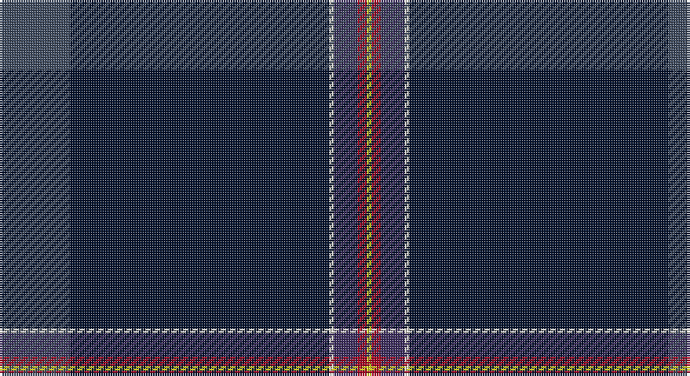

This page is one **sett** — a single exact thread-count. It belongs to the [tartan](/setts/n15k55w1dp5r2ly1/)
(the same proportion at any scale), whose colour order is pattern [BKWBRY](/stripes/bkwbry/).

Part of the [Venters](/tartans/venters/) tartan — the named design grouping this sett with its other cloths.

Sourced from register-of-tartans.  It is a [6 stripe tartan](/stripes/stripes6/).

Original link https://www.tartanregister.gov.uk/tartanDetails.aspx?ref=10349

## Register references

External register numbers recorded for this tartan.

- Scottish Register of Tartans: [10349](https://www.tartanregister.gov.uk/tartanDetails.aspx?ref=10349)

## Thread count
N/30 DN110 W2 DB10 DR4 Y/2

One full sett is **284 threads**.

## Palette

Palette: <strong>custom</strong>
<table><thead><tr><th>Colour</th><th>Threads</th><th>Shade</th><th>Base</th><th>OKLCh</th></tr></thead><tbody><tr><td>N/</td><td style="text-align:right;font-variant-numeric:tabular-nums">30</td><td><code style="background-color:#3F4B60;">#3F4B60</code> <small style="color:#888">#3F4B60</small></td><td>B <code style="background-color:#2A418A;">#2A418A</code></td><td><small style="color:#888">oklch(41.1% 0.039 261.5)</small></td></tr><tr><td>DN</td><td style="text-align:right;font-variant-numeric:tabular-nums">110</td><td><code style="background-color:#05132F;">#05132F</code> <small style="color:#888">#05132F</small></td><td>K <code style="background-color:#000000;">#000000</code></td><td><small style="color:#888">oklch(19.4% 0.060 261.5)</small></td></tr><tr><td>W</td><td style="text-align:right;font-variant-numeric:tabular-nums">2</td><td><code style="background-color:#E5E0D2;">#E5E0D2</code> <small style="color:#888">#E5E0D2</small></td><td>W <code style="background-color:#F7F7F7;">#F7F7F7</code></td><td><small style="color:#888">oklch(90.7% 0.020 90.6)</small></td></tr><tr><td>DB</td><td style="text-align:right;font-variant-numeric:tabular-nums">10</td><td><code style="background-color:#3D2E60;">#3D2E60</code> <small style="color:#888">#3D2E60</small></td><td>B <code style="background-color:#2A418A;">#2A418A</code></td><td><small style="color:#888">oklch(34.4% 0.086 295.4)</small></td></tr><tr><td>DR</td><td style="text-align:right;font-variant-numeric:tabular-nums">4</td><td><code style="background-color:#A90725;">#A90725</code> <small style="color:#888">#A90725</small></td><td>R <code style="background-color:#CC0000;">#CC0000</code></td><td><small style="color:#888">oklch(46.6% 0.185 22.1)</small></td></tr><tr><td>Y/</td><td style="text-align:right;font-variant-numeric:tabular-nums">2</td><td><code style="background-color:#D3CC20;">#D3CC20</code> <small style="color:#888">#D3CC20</small></td><td>Y <code style="background-color:#F2BF00;">#F2BF00</code></td><td><small style="color:#888">oklch(82.5% 0.171 107.0)</small></td></tr></tbody></table>

# Sample pattern

## Nearest tartans

The nearest existing variants by ΔTartan distance, with this tartan at the top so the swatches line up against it.

ΔTartan

Tartan

Sett

—

<a href="/ttd/edit/#slug=n15k55w1dp5r2ly1~x2">Venters (Edinburgh)</a> <a class="nn-out" href="/variants/s6/n15k55w1dp5r2ly1~x2/" title="open its dictionary page">↗</a>

1.08

<a href="/ttd/edit/#slug=w2db45g9r1n9ri1~x2&amp;base=n15k55w1dp5r2ly1~x2">Wilton (Name)</a> <a class="nn-out" href="/variants/s6/w2db45g9r1n9ri1~x2/" title="open its dictionary page">↗</a>

1.29

<a href="/ttd/edit/#slug=g20r10ly2db100w1y10&amp;base=n15k55w1dp5r2ly1~x2">Ravetta (Name)</a> <a class="nn-out" href="/variants/s6/g20r10ly2db100w1y10/" title="open its dictionary page">↗</a>

1.36

<a href="/ttd/edit/#slug=db67w1lo6r5dg25db3k5~x2&amp;base=n15k55w1dp5r2ly1~x2">Guide Dogs (Corporate)</a> <a class="nn-out" href="/variants/s7/db67w1lo6r5dg25db3k5~x2/" title="open its dictionary page">↗</a>

1.63

<a href="/ttd/edit/#slug=g3db16k3dp2k45r1k2lo3~x2&amp;base=n15k55w1dp5r2ly1~x2">Cumnock (District)</a> <a class="nn-out" href="/variants/s8/g3db16k3dp2k45r1k2lo3~x2/" title="open its dictionary page">↗</a>

1.70

<a href="/ttd/edit/#slug=b1k50r1k2n4db7w1~x2&amp;base=n15k55w1dp5r2ly1~x2">Colleges Scotland (Corp)</a> <a class="nn-out" href="/variants/s7/b1k50r1k2n4db7w1~x2/" title="open its dictionary page">↗</a>

1.70

<a href="/ttd/edit/#slug=dt60lr11oi5n5k1o4~x2&amp;base=n15k55w1dp5r2ly1~x2">Christie (London) Hunting</a> <a class="nn-out" href="/variants/s6/dt60lr11oi5n5k1o4~x2/" title="open its dictionary page">↗</a>

1.70

<a href="/ttd/edit/#slug=g5w1r5k5db43r1~x2&amp;base=n15k55w1dp5r2ly1~x2">Michael (John) (Personal)</a> <a class="nn-out" href="/variants/s6/g5w1r5k5db43r1~x2/" title="open its dictionary page">↗</a>

1.74

<a href="/ttd/edit/#slug=r5dt40w1dt13g8k4~x2&amp;base=n15k55w1dp5r2ly1~x2">London Scottish Rugby Club</a> <a class="nn-out" href="/variants/s6/r5dt40w1dt13g8k4~x2/" title="open its dictionary page">↗</a>

1.79

<a href="/ttd/edit/#slug=t6dti3n10db2dti2dt45lr2~x2&amp;base=n15k55w1dp5r2ly1~x2">Vonarb, Alfred (Personal)</a> <a class="nn-out" href="/variants/s7/t6dti3n10db2dti2dt45lr2~x2/" title="open its dictionary page">↗</a>

1.82

<a href="/ttd/edit/#slug=db130k18m6k6m6k6b18db14b5db18lo4&amp;base=n15k55w1dp5r2ly1~x2">Concours of Elegance</a> <a class="nn-out" href="/variants/s11/db130k18m6k6m6k6b18db14b5db18lo4/" title="open its dictionary page">↗</a>

## Neighbour map

Every grey dot is one of 14360 variants placed by the first two principal components of the ΔTartan feature space (44% of its variance). Red is this tartan; blue dots are its nearest — click one to open its page.

<svg viewBox="0 0 640 380" role="img" style="max-width:100%;height:auto;border:1px solid #e0e0e0;border-radius:4px;display:block" xmlns="http://www.w3.org/2000/svg"><image href="/nn/cloud.v1.png" width="640" height="380"/><a href="/variants/s6/w2db45g9r1n9ri1~x2/"><circle cx="453.9" cy="121.7" r="4" fill="#3465a4"><title>Wilton (Name)</title></circle></a><a href="/variants/s6/g20r10ly2db100w1y10/"><circle cx="469.7" cy="109.2" r="4" fill="#3465a4"><title>Ravetta (Name)</title></circle></a><a href="/variants/s7/db67w1lo6r5dg25db3k5~x2/"><circle cx="430.4" cy="113.5" r="4" fill="#3465a4"><title>Guide Dogs (Corporate)</title></circle></a><a href="/variants/s8/g3db16k3dp2k45r1k2lo3~x2/"><circle cx="438.3" cy="96.2" r="4" fill="#3465a4"><title>Cumnock (District)</title></circle></a><a href="/variants/s7/b1k50r1k2n4db7w1~x2/"><circle cx="580.6" cy="111.0" r="4" fill="#3465a4"><title>Colleges Scotland (Corp)</title></circle></a><a href="/variants/s6/dt60lr11oi5n5k1o4~x2/"><circle cx="470.0" cy="109.1" r="4" fill="#3465a4"><title>Christie (London) Hunting</title></circle></a><a href="/variants/s6/g5w1r5k5db43r1~x2/"><circle cx="503.9" cy="129.8" r="4" fill="#3465a4"><title>Michael (John) (Personal)</title></circle></a><a href="/variants/s6/r5dt40w1dt13g8k4~x2/"><circle cx="524.1" cy="170.6" r="4" fill="#3465a4"><title>London Scottish Rugby Club</title></circle></a><a href="/variants/s7/t6dti3n10db2dti2dt45lr2~x2/"><circle cx="434.5" cy="154.3" r="4" fill="#3465a4"><title>Vonarb, Alfred (Personal)</title></circle></a><a href="/variants/s11/db130k18m6k6m6k6b18db14b5db18lo4/"><circle cx="516.3" cy="132.9" r="4" fill="#3465a4"><title>Concours of Elegance</title></circle></a><circle cx="502.9" cy="129.5" r="5" fill="#c00000"/></svg>

ID: /variants/s6/n15k55w1dp5r2ly1~x2/
