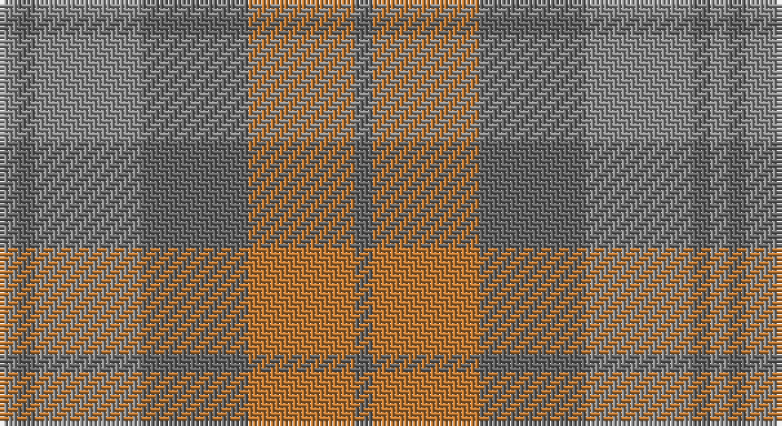

This page is one **sett** — a single exact thread-count. It belongs to the [tartan](/setts/n1o6n6oi6n1oi1/)
(the same proportion at any scale), whose colour order is pattern [BRBRBR](/stripes/brbrbr/).

Sourced from register-of-tartans.  It is a [6 stripe tartan](/stripes/stripes6/).

Original link https://www.tartanregister.gov.uk/tartanDetails.aspx?ref=1368

## Register references

External register numbers recorded for this tartan.

- Scottish Register of Tartans: [1368](https://www.tartanregister.gov.uk/tartanDetails.aspx?ref=1368)
- Scottish Tartans Authority (ITI): 5000

## Thread count
N/4 Na4 N24 Na24 DO24 Na/4

One full sett is **160 threads**.

## Palette

Palette: <strong>Tartan Register</strong> <small style="color:#888">(2 of 3 colours)</small>
<table><thead><tr><th>Colour</th><th>Threads</th><th>Shade</th><th>Base</th><th>OKLCh</th></tr></thead><tbody><tr><td>N/</td><td style="text-align:right;font-variant-numeric:tabular-nums">4</td><td><code style="background-color:#8C8C8C;">#8C8C8C</code> <small style="color:#888">#8C8C8C</small></td><td>R <code style="background-color:#CC0000;">#CC0000</code></td><td><small style="color:#888">oklch(64.0% 0.000 89.9)</small></td></tr><tr><td>Na</td><td style="text-align:right;font-variant-numeric:tabular-nums">4</td><td><code style="background-color:#646464;">#646464</code> <small style="color:#888">#646464</small></td><td>B <code style="background-color:#2A418A;">#2A418A</code></td><td><small style="color:#888">oklch(50.3% 0.000 89.9)</small></td></tr><tr><td>N</td><td style="text-align:right;font-variant-numeric:tabular-nums">24</td><td><code style="background-color:#8C8C8C;">#8C8C8C</code> <small style="color:#888">#8C8C8C</small></td><td>R <code style="background-color:#CC0000;">#CC0000</code></td><td><small style="color:#888">oklch(64.0% 0.000 89.9)</small></td></tr><tr><td>Na</td><td style="text-align:right;font-variant-numeric:tabular-nums">24</td><td><code style="background-color:#646464;">#646464</code> <small style="color:#888">#646464</small></td><td>B <code style="background-color:#2A418A;">#2A418A</code></td><td><small style="color:#888">oklch(50.3% 0.000 89.9)</small></td></tr><tr><td>DO</td><td style="text-align:right;font-variant-numeric:tabular-nums">24</td><td><code style="background-color:#BE7832;">#BE7832</code> <small style="color:#888">#BE7832</small></td><td>R <code style="background-color:#CC0000;">#CC0000</code></td><td><small style="color:#888">oklch(63.5% 0.121 62.2)</small></td></tr><tr><td>Na/</td><td style="text-align:right;font-variant-numeric:tabular-nums">4</td><td><code style="background-color:#646464;">#646464</code> <small style="color:#888">#646464</small></td><td>B <code style="background-color:#2A418A;">#2A418A</code></td><td><small style="color:#888">oklch(50.3% 0.000 89.9)</small></td></tr></tbody></table>

# Sample pattern

## Nearest tartans

The nearest existing variants by ΔTartan distance, with this tartan at the top so the swatches line up against it.

ΔTartan

Tartan

Sett

—

<a href="/ttd/edit/#slug=n1o6n6oi6n1oi1~x4">Glen Burns (WCWM-2)</a> <a class="nn-out" href="/variants/s6/n1o6n6oi6n1oi1~x4/" title="open its dictionary page">↗</a>

1.35

<a href="/ttd/edit/#slug=o24n3o3n3o3n20lr22n4~x2&amp;base=n1o6n6oi6n1oi1~x4">Turnberry (MacArthur)</a> <a class="nn-out" href="/variants/s8/o24n3o3n3o3n20lr22n4~x2/" title="open its dictionary page">↗</a>

1.49

<a href="/ttd/edit/#slug=db5y15o4y4o24y4o4db5&amp;base=n1o6n6oi6n1oi1~x4">Daks, (Muted Skye)</a> <a class="nn-out" href="/variants/s8/db5y15o4y4o24y4o4db5/" title="open its dictionary page">↗</a>

1.66

<a href="/ttd/edit/#slug=o7n6lb1lo6n1lo6n6lb1o6~x8&amp;base=n1o6n6oi6n1oi1~x4">Outlander #2</a> <a class="nn-out" href="/variants/s9/o7n6lb1lo6n1lo6n6lb1o6~x8/" title="open its dictionary page">↗</a>

1.66

<a href="/ttd/edit/#slug=o14n7lo7n2~x8&amp;base=n1o6n6oi6n1oi1~x4">Outlander #3</a> <a class="nn-out" href="/variants/s4/o14n7lo7n2~x8/" title="open its dictionary page">↗</a>

1.67

<a href="/ttd/edit/#slug=y7n6lt1lo6n1lo6n6lt1y6~x8&amp;base=n1o6n6oi6n1oi1~x4">Outlander #2</a> <a class="nn-out" href="/variants/s9/y7n6lt1lo6n1lo6n6lt1y6~x8/" title="open its dictionary page">↗</a>

1.85

<a href="/ttd/edit/#slug=do1dy6do6dy1n6dy1~x8&amp;base=n1o6n6oi6n1oi1~x4">Brown Heather (Fashion)</a> <a class="nn-out" href="/variants/s6/do1dy6do6dy1n6dy1~x8/" title="open its dictionary page">↗</a>

2.16

<a href="/ttd/edit/#slug=y14n7lo6n2~x8&amp;base=n1o6n6oi6n1oi1~x4">Outlander #3</a> <a class="nn-out" href="/variants/s4/y14n7lo6n2~x8/" title="open its dictionary page">↗</a>

2.18

<a href="/ttd/edit/#slug=n9o9y9r1yi1o9yi1r1~x4&amp;base=n1o6n6oi6n1oi1~x4">Jardine</a> <a class="nn-out" href="/variants/s8/n9o9y9r1yi1o9yi1r1~x4/" title="open its dictionary page">↗</a>

2.18

<a href="/variants/s10/o5n3o22r3n6ni17r2ni4r2ni4~x2/">Clyde</a>

2.26

<a href="/ttd/edit/#slug=lo5y22m15lp11m5y2~x2&amp;base=n1o6n6oi6n1oi1~x4">Scottish Ballet</a> <a class="nn-out" href="/variants/s6/lo5y22m15lp11m5y2~x2/" title="open its dictionary page">↗</a>

## Neighbour map

Every grey dot is one of 14360 variants placed by the first two principal components of the ΔTartan feature space (44% of its variance). Red is this tartan; blue dots are its nearest — click one to open its page.

<svg viewBox="0 0 640 380" role="img" style="max-width:100%;height:auto;border:1px solid #e0e0e0;border-radius:4px;display:block" xmlns="http://www.w3.org/2000/svg"><image href="/nn/cloud.v1.png" width="640" height="380"/><a href="/variants/s8/o24n3o3n3o3n20lr22n4~x2/"><circle cx="346.6" cy="283.0" r="4" fill="#3465a4"><title>Turnberry (MacArthur)</title></circle></a><a href="/variants/s8/db5y15o4y4o24y4o4db5/"><circle cx="415.1" cy="309.6" r="4" fill="#3465a4"><title>Daks, (Muted Skye)</title></circle></a><a href="/variants/s9/o7n6lb1lo6n1lo6n6lb1o6~x8/"><circle cx="264.4" cy="299.2" r="4" fill="#3465a4"><title>Outlander #2</title></circle></a><a href="/variants/s4/o14n7lo7n2~x8/"><circle cx="407.3" cy="366.0" r="4" fill="#3465a4"><title>Outlander #3</title></circle></a><a href="/variants/s9/y7n6lt1lo6n1lo6n6lt1y6~x8/"><circle cx="264.9" cy="300.4" r="4" fill="#3465a4"><title>Outlander #2</title></circle></a><a href="/variants/s6/do1dy6do6dy1n6dy1~x8/"><circle cx="365.8" cy="341.2" r="4" fill="#3465a4"><title>Brown Heather (Fashion)</title></circle></a><a href="/variants/s4/y14n7lo6n2~x8/"><circle cx="437.4" cy="366.0" r="4" fill="#3465a4"><title>Outlander #3</title></circle></a><a href="/variants/s8/n9o9y9r1yi1o9yi1r1~x4/"><circle cx="357.2" cy="266.1" r="4" fill="#3465a4"><title>Jardine</title></circle></a><a href="/variants/s10/o5n3o22r3n6ni17r2ni4r2ni4~x2/"><circle cx="338.3" cy="236.9" r="4" fill="#3465a4"><title>Clyde</title></circle></a><a href="/variants/s6/lo5y22m15lp11m5y2~x2/"><circle cx="309.4" cy="266.6" r="4" fill="#3465a4"><title>Scottish Ballet</title></circle></a><circle cx="351.2" cy="326.9" r="5" fill="#c00000"/></svg>

ID: /variants/s6/n1o6n6oi6n1oi1~x4/
