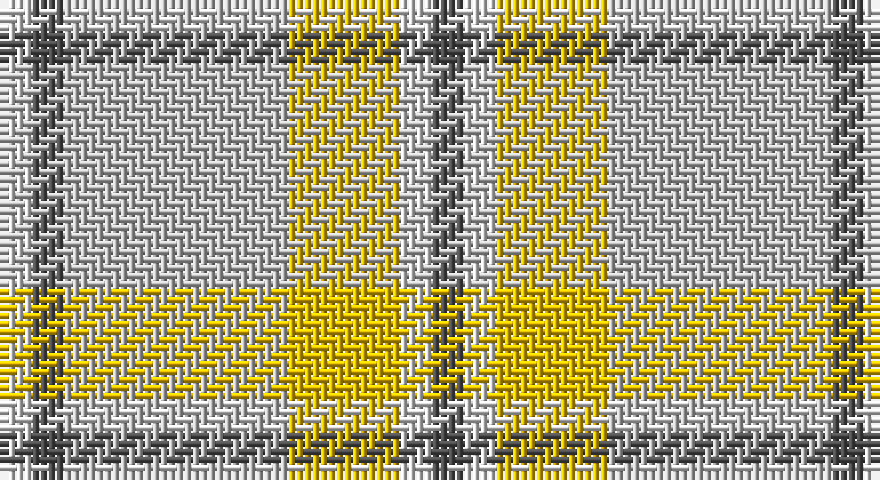

This page is one **sett** — a single exact thread-count. It belongs to the [tartan](/setts/n2w2ly7lb14n2w2/)
(the same proportion at any scale), whose colour order is pattern [BWYWBW](/stripes/bwywbw/).

Part of the [Cairngorm](/tartans/cairngorm/) tartan — the named design grouping this sett with its other cloths.

Sourced from weddslist.  It is a [6 stripe tartan](/stripes/stripes6/).

Original link http://www.weddslist.com/cgi-bin/tartans/pg.pl?source=sts

## Provenance

Earliest known date: 1985 A sample of this tartan was recorded by the Scottish Tartans Society during the period 1970 to 1990.

## Also known as

This cloth is also recorded under:

- Cairngorm #2

2 attestations — the source records this cloth was collapsed from (oldest owns this page)

<ul>
<li>undated — Cairngorm (weddslist, <a href="http://www.weddslist.com/cgi-bin/tartans/pg.pl?source=sts">record</a>)</li>
<li>undated — Cairngorm Trade Tartan (house-of-tartan, <a href="http://www.house-of-tartan.scotland.net/house/TartanViewjs.asp?colr=Def&tnam=1314">record</a>)</li>
</ul>

## Thread count
LN/4 Na4 N28 Y14 LN4 Na/4

One full sett is **108 threads**.

## Palette

Palette: <strong>Tartan Register</strong> <small style="color:#888">(3 of 4 colours)</small>
<table><thead><tr><th>Colour</th><th>Threads</th><th>Shade</th><th>Base</th><th>OKLCh</th></tr></thead><tbody><tr><td>LN/</td><td style="text-align:right;font-variant-numeric:tabular-nums">4</td><td><code style="background-color:#E0E0E0;">#E0E0E0</code> <small style="color:#888">#E0E0E0</small></td><td>W <code style="background-color:#F7F7F7;">#F7F7F7</code></td><td><small style="color:#888">oklch(90.7% 0.000 89.9)</small></td></tr><tr><td>Na</td><td style="text-align:right;font-variant-numeric:tabular-nums">4</td><td><code style="background-color:#505050;">#505050</code> <small style="color:#888">#505050</small></td><td>B <code style="background-color:#2A418A;">#2A418A</code></td><td><small style="color:#888">oklch(43.1% 0.000 89.9)</small></td></tr><tr><td>N</td><td style="text-align:right;font-variant-numeric:tabular-nums">28</td><td><code style="background-color:#C0C0C0;">#C0C0C0</code> <small style="color:#888">#C0C0C0</small></td><td>W <code style="background-color:#F7F7F7;">#F7F7F7</code></td><td><small style="color:#888">oklch(80.8% 0.000 89.9)</small></td></tr><tr><td>Y</td><td style="text-align:right;font-variant-numeric:tabular-nums">14</td><td><code style="background-color:#F0C000;">#F0C000</code> <small style="color:#888">#F0C000</small></td><td>Y <code style="background-color:#F2BF00;">#F2BF00</code></td><td><small style="color:#888">oklch(82.7% 0.169 90.5)</small></td></tr><tr><td>LN</td><td style="text-align:right;font-variant-numeric:tabular-nums">4</td><td><code style="background-color:#E0E0E0;">#E0E0E0</code> <small style="color:#888">#E0E0E0</small></td><td>W <code style="background-color:#F7F7F7;">#F7F7F7</code></td><td><small style="color:#888">oklch(90.7% 0.000 89.9)</small></td></tr><tr><td>Na/</td><td style="text-align:right;font-variant-numeric:tabular-nums">4</td><td><code style="background-color:#505050;">#505050</code> <small style="color:#888">#505050</small></td><td>B <code style="background-color:#2A418A;">#2A418A</code></td><td><small style="color:#888">oklch(43.1% 0.000 89.9)</small></td></tr></tbody></table>

# Sample pattern

## Compared to the master

This cloth is one sett of its design; the master sett (the exemplar the design is anchored on) is below for comparison.

<figure style="margin:0"><figcaption style="color:#888;font-size:smaller">this sett</figcaption></figure>
<figure style="margin:0"><figcaption style="color:#888;font-size:smaller"><a href="/setts/n2w2ly7o14n2w2/">master sett →</a></figcaption></figure>

## Nearest tartans

The nearest existing variants by ΔTartan distance, with this tartan at the top so the swatches line up against it.

ΔTartan

Tartan

Sett

—

<a href="/ttd/edit/#slug=n2w2ly7lb14n2w2~x2">Cairngorm</a> <a class="nn-out" href="/variants/s6/n2w2ly7lb14n2w2~x2/" title="open its dictionary page">↗</a>

0.87

<a href="/ttd/edit/#slug=n2w2ly7o14n2w2~x2&amp;base=n2w2ly7lb14n2w2~x2">Cairngorm</a> <a class="nn-out" href="/variants/s6/n2w2ly7o14n2w2~x2/" title="open its dictionary page">↗</a>

1.39

<a href="/ttd/edit/#slug=w1dp1lb7o4lb1w1~x4&amp;base=n2w2ly7lb14n2w2~x2">Lochnagar Trade Tartan</a> <a class="nn-out" href="/variants/s6/w1dp1lb7o4lb1w1~x4/" title="open its dictionary page">↗</a>

1.54

<a href="/ttd/edit/#slug=r4lbi30y14lb11y4~x2&amp;base=n2w2ly7lb14n2w2~x2">Trinity Bicycles (Corporate)</a> <a class="nn-out" href="/variants/s5/r4lbi30y14lb11y4~x2/" title="open its dictionary page">↗</a>

1.64

<a href="/ttd/edit/#slug=lb40dp5lb6ly26o13lb9dy3~x2&amp;base=n2w2ly7lb14n2w2~x2">de Meuron Dress (Family)</a> <a class="nn-out" href="/variants/s7/lb40dp5lb6ly26o13lb9dy3~x2/" title="open its dictionary page">↗</a>

1.74

<a href="/ttd/edit/#slug=o2dy2o15dy2w10lo15dy2lo2~x2&amp;base=n2w2ly7lb14n2w2~x2">Bannockbane Grey #2</a> <a class="nn-out" href="/variants/s8/o2dy2o15dy2w10lo15dy2lo2~x2/" title="open its dictionary page">↗</a>

1.78

<a href="/ttd/edit/#slug=y2w19lr2w2y3w3y3lr6ly25w2~x2&amp;base=n2w2ly7lb14n2w2~x2">Llama (Fashion)</a> <a class="nn-out" href="/variants/s10/y2w19lr2w2y3w3y3lr6ly25w2~x2/" title="open its dictionary page">↗</a>

1.84

<a href="/ttd/edit/#slug=w1dp1o7n4o1w1~x4&amp;base=n2w2ly7lb14n2w2~x2">Lochnagar Plaid (District)</a> <a class="nn-out" href="/variants/s6/w1dp1o7n4o1w1~x4/" title="open its dictionary page">↗</a>

1.85

<a href="/ttd/edit/#slug=lb4n2lb18r2n5o16r2o2r2o2~x2&amp;base=n2w2ly7lb14n2w2~x2">Clyde Trade Tartan</a> <a class="nn-out" href="/variants/s10/lb4n2lb18r2n5o16r2o2r2o2~x2/" title="open its dictionary page">↗</a>

1.87

<a href="/ttd/edit/#slug=lb4n2lb18r2n5y16r2y2r2y2~x2&amp;base=n2w2ly7lb14n2w2~x2">Clyde</a> <a class="nn-out" href="/variants/s10/lb4n2lb18r2n5y16r2y2r2y2~x2/" title="open its dictionary page">↗</a>

2.01

<a href="/ttd/edit/#slug=o2oi2o15w10oi2y15oi2y2~x2&amp;base=n2w2ly7lb14n2w2~x2">Bannockbane, Grey</a> <a class="nn-out" href="/variants/s8/o2oi2o15w10oi2y15oi2y2~x2/" title="open its dictionary page">↗</a>

## Neighbour map

Every grey dot is one of 14360 variants placed by the first two principal components of the ΔTartan feature space (44% of its variance). Red is this tartan; blue dots are its nearest — click one to open its page.

<svg viewBox="0 0 640 380" role="img" style="max-width:100%;height:auto;border:1px solid #e0e0e0;border-radius:4px;display:block" xmlns="http://www.w3.org/2000/svg"><image href="/nn/cloud.v1.png" width="640" height="380"/><a href="/variants/s6/n2w2ly7o14n2w2~x2/"><circle cx="250.8" cy="212.3" r="4" fill="#3465a4"><title>Cairngorm</title></circle></a><a href="/variants/s6/w1dp1lb7o4lb1w1~x4/"><circle cx="317.8" cy="230.3" r="4" fill="#3465a4"><title>Lochnagar Trade Tartan</title></circle></a><a href="/variants/s5/r4lbi30y14lb11y4~x2/"><circle cx="233.7" cy="221.6" r="4" fill="#3465a4"><title>Trinity Bicycles (Corporate)</title></circle></a><a href="/variants/s7/lb40dp5lb6ly26o13lb9dy3~x2/"><circle cx="285.4" cy="166.7" r="4" fill="#3465a4"><title>de Meuron Dress (Family)</title></circle></a><a href="/variants/s8/o2dy2o15dy2w10lo15dy2lo2~x2/"><circle cx="214.0" cy="214.8" r="4" fill="#3465a4"><title>Bannockbane Grey #2</title></circle></a><a href="/variants/s10/y2w19lr2w2y3w3y3lr6ly25w2~x2/"><circle cx="265.0" cy="156.0" r="4" fill="#3465a4"><title>Llama (Fashion)</title></circle></a><a href="/variants/s6/w1dp1o7n4o1w1~x4/"><circle cx="310.5" cy="231.4" r="4" fill="#3465a4"><title>Lochnagar Plaid (District)</title></circle></a><a href="/variants/s10/lb4n2lb18r2n5o16r2o2r2o2~x2/"><circle cx="263.0" cy="187.3" r="4" fill="#3465a4"><title>Clyde Trade Tartan</title></circle></a><a href="/variants/s10/lb4n2lb18r2n5y16r2y2r2y2~x2/"><circle cx="249.5" cy="180.8" r="4" fill="#3465a4"><title>Clyde</title></circle></a><a href="/variants/s8/o2oi2o15w10oi2y15oi2y2~x2/"><circle cx="220.4" cy="217.8" r="4" fill="#3465a4"><title>Bannockbane, Grey</title></circle></a><circle cx="262.1" cy="214.3" r="5" fill="#c00000"/></svg>

ID: /variants/s6/n2w2ly7lb14n2w2~x2/
