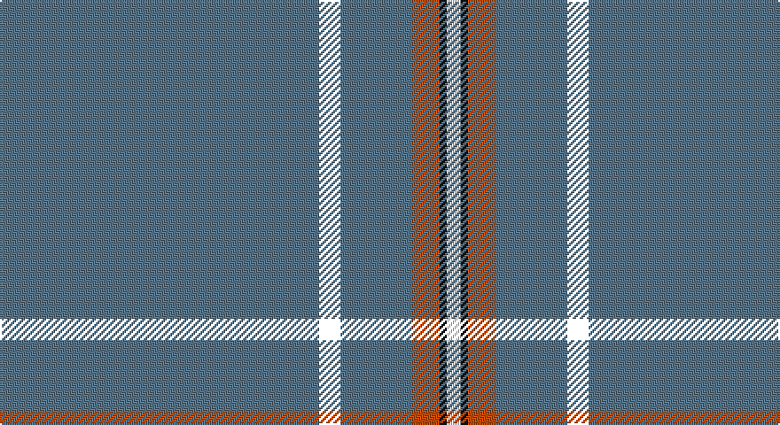

This page is one **sett** — a single exact thread-count. It belongs to the [tartan](/setts/n45k3n10o4ki1w2/)
(the same proportion at any scale), whose colour order is pattern [BKBRKW](/stripes/bkbrkw/).

Part of the [Wylie](/tartans/wylie/) tartan — the named design grouping this sett with its other cloths.

Sourced from register-of-tartans.  It is a [6 stripe tartan](/stripes/stripes6/).

Original link https://www.tartanregister.gov.uk/tartanDetails.aspx?ref=4788

## Register references

External register numbers recorded for this tartan.

- Scottish Register of Tartans: [4788](https://www.tartanregister.gov.uk/tartanDetails.aspx?ref=4788)
- Scottish Tartans Authority (ITI): 2465
- Scottish Tartans World Register: 2465

## Thread count
B/180 YY12 B40 DO16 K4 W/8

One full sett is **332 threads**.

## Palette

Palette: <strong>Logan (The Scottish Gael, 1831)</strong> <small style="color:#888">(2 of 4 colours)</small>
<table><thead><tr><th>Colour</th><th>Threads</th><th>Shade</th><th>Base</th><th>OKLCh</th></tr></thead><tbody><tr><td>B/</td><td style="text-align:right;font-variant-numeric:tabular-nums">180</td><td><code style="background-color:#587488;">#587488</code> <small style="color:#888">#587488</small></td><td>B <code style="background-color:#2A418A;">#2A418A</code></td><td><small style="color:#888">oklch(54.5% 0.045 239.7)</small></td></tr><tr><td></td><td style="text-align:right;font-variant-numeric:tabular-nums">12</td><td><code style="background-color:;"></code> <small style="color:#888"></small></td><td> <code style="background-color:;"></code></td><td><small style="color:#888"></small></td></tr><tr><td>B</td><td style="text-align:right;font-variant-numeric:tabular-nums">40</td><td><code style="background-color:#587488;">#587488</code> <small style="color:#888">#587488</small></td><td>B <code style="background-color:#2A418A;">#2A418A</code></td><td><small style="color:#888">oklch(54.5% 0.045 239.7)</small></td></tr><tr><td>DO</td><td style="text-align:right;font-variant-numeric:tabular-nums">16</td><td><code style="background-color:#C04C08;">#C04C08</code> <small style="color:#888">#C04C08</small></td><td>R <code style="background-color:#CC0000;">#CC0000</code></td><td><small style="color:#888">oklch(56.4% 0.163 43.2)</small></td></tr><tr><td>K</td><td style="text-align:right;font-variant-numeric:tabular-nums">4</td><td><code style="background-color:#101010;">#101010</code> <small style="color:#888">#101010</small></td><td>K <code style="background-color:#000000;">#000000</code></td><td><small style="color:#888">oklch(17.3% 0.000 89.9)</small></td></tr><tr><td>W/</td><td style="text-align:right;font-variant-numeric:tabular-nums">8</td><td><code style="background-color:#FCFCFC;">#FCFCFC</code> <small style="color:#888">#FCFCFC</small></td><td>W <code style="background-color:#F7F7F7;">#F7F7F7</code></td><td><small style="color:#888">oklch(99.1% 0.000 89.9)</small></td></tr></tbody></table>

# Sample pattern

## Compared to the master

This cloth is one sett of its design; the master sett (the exemplar the design is anchored on) is below for comparison.

<figure style="margin:0"><figcaption style="color:#888;font-size:smaller">this sett</figcaption></figure>
<figure style="margin:0"><figcaption style="color:#888;font-size:smaller"><a href="/setts/b86ly2b18r3k1w2/">master sett →</a></figcaption></figure>

## Nearest tartans

The nearest existing variants by ΔTartan distance, with this tartan at the top so the swatches line up against it.

ΔTartan

Tartan

Sett

—

<a href="/ttd/edit/#slug=n45k3n10o4ki1w2~x4">Wylie</a> <a class="nn-out" href="/variants/s6/n45k3n10o4ki1w2~x4/" title="open its dictionary page">↗</a>

0.94

<a href="/ttd/edit/#slug=n45ly3n10o4k1w2~x4&amp;base=n45k3n10o4ki1w2~x4">Wylie (Name)</a> <a class="nn-out" href="/variants/s6/n45ly3n10o4k1w2~x4/" title="open its dictionary page">↗</a>

1.41

<a href="/ttd/edit/#slug=db45ly3db10o4k1w2~x2&amp;base=n45k3n10o4ki1w2~x4">Wylie</a> <a class="nn-out" href="/variants/s6/db45ly3db10o4k1w2~x2/" title="open its dictionary page">↗</a>

1.60

<a href="/ttd/edit/#slug=t8lo2t8dg7t57k3lb1~x2&amp;base=n45k3n10o4ki1w2~x4">Cullen (Christian Hill) (Personal)</a> <a class="nn-out" href="/variants/s7/t8lo2t8dg7t57k3lb1~x2/" title="open its dictionary page">↗</a>

1.61

<a href="/ttd/edit/#slug=n70ly4n3ly4n7k2n2r7~x2&amp;base=n45k3n10o4ki1w2~x4">European</a> <a class="nn-out" href="/variants/s8/n70ly4n3ly4n7k2n2r7~x2/" title="open its dictionary page">↗</a>

1.79

<a href="/ttd/edit/#slug=db32r3db4k1ly3~x2&amp;base=n45k3n10o4ki1w2~x4">MacLaine of Lochbuie, hunting</a> <a class="nn-out" href="/variants/s5/db32r3db4k1ly3~x2/" title="open its dictionary page">↗</a>

1.93

<a href="/ttd/edit/#slug=db122r11w4r15ly4db6ly4db30&amp;base=n45k3n10o4ki1w2~x4">Inverness, Duke of York</a> <a class="nn-out" href="/variants/s8/db122r11w4r15ly4db6ly4db30/" title="open its dictionary page">↗</a>

1.94

<a href="/ttd/edit/#slug=dt35ly1dt3ly1dt3ly1dt20r6w1r5~x2&amp;base=n45k3n10o4ki1w2~x4">Alpha Chi Sigma Fraternity</a> <a class="nn-out" href="/variants/s10/dt35ly1dt3ly1dt3ly1dt20r6w1r5~x2/" title="open its dictionary page">↗</a>

1.97

<a href="/variants/s8/b70db5b3wi5b3w5b3k5~x2/">Wyckoff, Ann Grainger Phillips Commemorative Tartan</a>

1.99

<a href="/ttd/edit/#slug=b70db5b3w5b3w5b3r5b8~x2&amp;base=n45k3n10o4ki1w2~x4">Wyckoff, Ann Grainger Phillips</a> <a class="nn-out" href="/variants/s9/b70db5b3w5b3w5b3r5b8~x2/" title="open its dictionary page">↗</a>

1.99

<a href="/ttd/edit/#slug=w2lo44db8lo2db2lo3r1~x2&amp;base=n45k3n10o4ki1w2~x4">Reece (Name)</a> <a class="nn-out" href="/variants/s7/w2lo44db8lo2db2lo3r1~x2/" title="open its dictionary page">↗</a>

## Neighbour map

Every grey dot is one of 14360 variants placed by the first two principal components of the ΔTartan feature space (44% of its variance). Red is this tartan; blue dots are its nearest — click one to open its page.

<svg viewBox="0 0 640 380" role="img" style="max-width:100%;height:auto;border:1px solid #e0e0e0;border-radius:4px;display:block" xmlns="http://www.w3.org/2000/svg"><image href="/nn/cloud.v1.png" width="640" height="380"/><a href="/variants/s6/n45ly3n10o4k1w2~x4/"><circle cx="621.3" cy="133.2" r="4" fill="#3465a4"><title>Wylie (Name)</title></circle></a><a href="/variants/s6/db45ly3db10o4k1w2~x2/"><circle cx="592.3" cy="123.9" r="4" fill="#3465a4"><title>Wylie</title></circle></a><a href="/variants/s7/t8lo2t8dg7t57k3lb1~x2/"><circle cx="626.0" cy="132.5" r="4" fill="#3465a4"><title>Cullen (Christian Hill) (Personal)</title></circle></a><a href="/variants/s8/n70ly4n3ly4n7k2n2r7~x2/"><circle cx="626.0" cy="132.6" r="4" fill="#3465a4"><title>European</title></circle></a><a href="/variants/s5/db32r3db4k1ly3~x2/"><circle cx="596.1" cy="164.5" r="4" fill="#3465a4"><title>MacLaine of Lochbuie, hunting</title></circle></a><a href="/variants/s8/db122r11w4r15ly4db6ly4db30/"><circle cx="575.0" cy="137.8" r="4" fill="#3465a4"><title>Inverness, Duke of York</title></circle></a><a href="/variants/s10/dt35ly1dt3ly1dt3ly1dt20r6w1r5~x2/"><circle cx="558.5" cy="131.5" r="4" fill="#3465a4"><title>Alpha Chi Sigma Fraternity</title></circle></a><a href="/variants/s8/b70db5b3wi5b3w5b3k5~x2/"><circle cx="512.9" cy="109.3" r="4" fill="#3465a4"><title>Wyckoff, Ann Grainger Phillips Commemorative Tartan</title></circle></a><a href="/variants/s9/b70db5b3w5b3w5b3r5b8~x2/"><circle cx="558.6" cy="126.5" r="4" fill="#3465a4"><title>Wyckoff, Ann Grainger Phillips</title></circle></a><a href="/variants/s7/w2lo44db8lo2db2lo3r1~x2/"><circle cx="588.1" cy="118.3" r="4" fill="#3465a4"><title>Reece (Name)</title></circle></a><circle cx="597.6" cy="123.9" r="5" fill="#c00000"/></svg>

ID: /variants/s6/n45k3n10o4ki1w2~x4/
