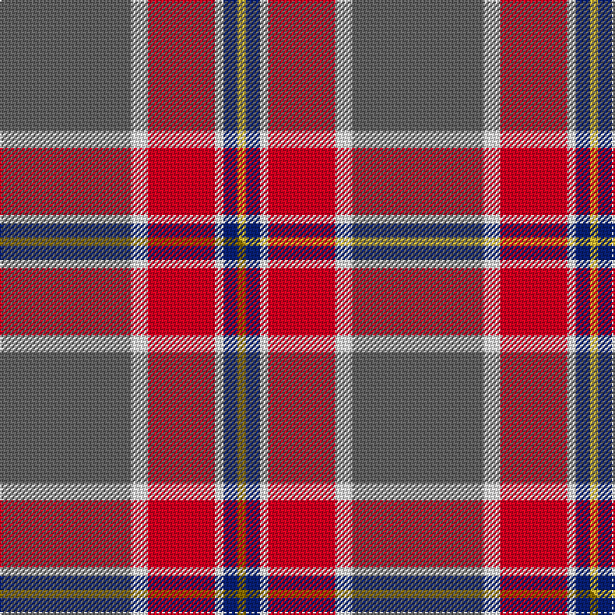

This is one **variant** — a specific cloth: this exact thread count and colourway, with its own
provenance below. It is one weaving of the [sett](/tartans/d/du/duminiak/) (the scale-free proportion — the
same cloth at any scale or shade), whose colour order is pattern [BWRWBY](/stripes/bwrwby/).

Part of the [Duminiak](/tartans/d/du/duminiak/) tartan — the named design grouping this sett with its other cloths.

Sourced from tartans-authority.  It is a [6 stripe tartan](/stripes/stripes6/).

Original link <code>http://www.tartansauthority.com/tartan-ferret/display/10597/</code> — retired · [Internet Archive copy](https://web.archive.org/web/*/http://www.tartansauthority.com/tartan-ferret/display/10597/*)

Dataset <small>— provenance for this record, inherited from the source manifest</small>

<dl class="dataset-prov">
<dt>source</dt><dd><a href="/sources/tartans-authority/">Scottish Tartans Authority</a></dd>
<dt>data captured from</dt><dd><a href="https://github.com/thetartan/tartan-database/blob/master/data/tartans-authority/data.csv">https://github.com/thetartan/tartan-database/blob/master/data/tartans-authority/data.csv</a></dd>
<dt>data date</dt><dd>28/09/2009 <small>(this record)</small></dd>
<dt>licence</dt><dd><a href="https://creativecommons.org/licenses/by-nc-nd/4.0/">CC BY-NC-ND 4.0</a></dd>
</dl>

Capture chain <small>— the hands this data passed through, oldest first; each capture carries its own licence</small>

<ol class="capture-chain">
<li><a href="https://www.tartansauthority.com/">Scottish Tartans Authority</a> <small>the heritage body’s archive — its tartan-ferret record browser is retired; dead record links are shown unlinked, with an Internet Archive copy (ITI numbers are not SRT references)</small></li>
<li><a href="https://github.com/thetartan/tartan-database">thetartan/tartan-database</a> <small>2016-2017</small> · <a href="https://creativecommons.org/licenses/by-nc-nd/4.0/">CC BY-NC-ND 4.0</a> <small>Levko Kravets's frozen compilation — the capture we vendored, and where its CC licence text came from</small></li>
<li>this dictionary <small>captured 2026-06-10 · commit 5bf86c7566</small> <small>each re-capture is a git commit to data/sources</small></li>
</ol>

## Register references

External register numbers recorded for this tartan.

- Scottish Register of Tartans: [10597](https://www.tartanregister.gov.uk/tartanDetails?ref=10597)
- Scottish Tartans Authority (ITI): 10597

## Thread count
N/94 W12 R48 W6 DB10 LY/6

One full sett is **252 threads**.

## Palette
<table><thead><tr><th>Colour</th><th>Shade</th><th>OKLCh</th></tr></thead><tbody><tr><td>DB</td><td><code style="background-color:#082077;">#082077</code> <small style="color:#888">#082077</small></td><td><small style="color:#888">oklch(30.0% 0.149 265.1)</small></td></tr><tr><td>LY</td><td><code style="background-color:#DCBC32;">#DCBC32</code> <small style="color:#888">#DCBC32</small></td><td><small style="color:#888">oklch(80.0% 0.150 95.2)</small></td></tr><tr><td>W</td><td><code style="background-color:#F7F7F7;">#F7F7F7</code> <small style="color:#888">#F7F7F7</small></td><td><small style="color:#888">oklch(97.6% 0.000 89.9)</small></td></tr><tr><td>N</td><td><code style="background-color:#636363;">#636363</code> <small style="color:#888">#636363</small></td><td><small style="color:#888">oklch(50.0% 0.000 89.9)</small></td></tr><tr><td>R</td><td><code style="background-color:#D60020;">#D60020</code> <small style="color:#888">#D60020</small></td><td><small style="color:#888">oklch(55.2% 0.224 25.5)</small></td></tr></tbody></table>

# Sample pattern

## Compared to the master

This cloth is one sett of its design; the master sett (the exemplar the design is anchored on) is below for comparison.

Its **ΔTartan distance** from the master is **0.02** — the same measure the nearest-tartans table ranks by (0 is identical; a re-scale of the same cloth is near 0, a recolour or a different proportion further).

<figure class="master-compare" style="margin:0">

this sett
master sett ★

<figcaption style="color:#888;font-size:smaller">One weave of this sett against the <a href="/setts/n47w6r24w3db5y3/">master sett ★</a>, split on the diagonal: a shared proportion runs seamlessly across it with only the shades shifting; a different proportion breaks on it.</figcaption>
</figure>

## Nearest tartan variants

The nearest existing variants by ΔTartan distance, with this cloth at the top so the swatches line up against it.

ΔTartan

Threads

Variant

Sett

—

252

<a href="/variants/s6/n47w6r24w3db5ly3~x2/">Duminiak (Personal)</a>

<a href="/ttd/edit/#slug=n47w6r24w3db5y3~x2&amp;base=n47w6r24w3db5ly3~x2" title="compare in the TTD">0.02</a>

252

<a href="/variants/s6/n47w6r24w3db5y3~x2/">Duminiak (Trevose, Pennsylvania)</a>

<a href="/ttd/edit/#slug=n10w3lb3g1r1~x10&amp;base=n47w6r24w3db5ly3~x2" title="compare in the TTD">2.54</a>

250

<a href="/variants/s5/n10w3lb3g1r1~x10/">Bagpipe Shop (Switzerland)</a>

<a href="/ttd/edit/#slug=r15w1db4y1g15~x4&amp;base=n47w6r24w3db5ly3~x2" title="compare in the TTD">2.65</a>

168

<a href="/variants/s5/r15w1db4y1g15~x4/">Eglinton, Duke of (Artefact)</a>

<a href="/ttd/edit/#slug=y9r31g12dy2lb9~x2&amp;base=n47w6r24w3db5ly3~x2" title="compare in the TTD">2.72</a>

216

<a href="/variants/s5/y9r31g12dy2lb9~x2/">Buncle (Duns)</a>

<a href="/ttd/edit/#slug=ly9r31g12dy2lb9~x2&amp;base=n47w6r24w3db5ly3~x2" title="compare in the TTD">2.72</a>

216

<a href="/variants/s5/ly9r31g12dy2lb9~x2/">Buncle (Name)</a>

<a href="/ttd/edit/#slug=r6t22r6g20y2r45t2w5~x2&amp;base=n47w6r24w3db5ly3~x2" title="compare in the TTD">2.73</a>

410

<a href="/variants/s8/r6t22r6g20y2r45t2w5~x2/">Elbrick Dress (Personal)</a>

<a href="/ttd/edit/#slug=db4do2db2w2do9o27r4~x3&amp;base=n47w6r24w3db5ly3~x2" title="compare in the TTD">2.85</a>

276

<a href="/variants/s7/db4do2db2w2do9o27r4~x3/">Unidentified 35</a>

<a href="/ttd/edit/#slug=w3db23r44db26g4y2~x2&amp;base=n47w6r24w3db5ly3~x2" title="compare in the TTD">2.89</a>

398

<a href="/variants/s6/w3db23r44db26g4y2~x2/">Tartan Lassie (Fashion)</a>

<a href="/ttd/edit/#slug=r48t16ly5g17w8dy3~x2&amp;base=n47w6r24w3db5ly3~x2" title="compare in the TTD">3.06</a>

286

<a href="/variants/s6/r48t16ly5g17w8dy3~x2/">Scottish American Soc. of Michigan</a>

<a href="/ttd/edit/#slug=r24ly2n3dy2w10r4n3dy3w2~x2~ly3307090-dy1603076&amp;base=n47w6r24w3db5ly3~x2" title="compare in the TTD">3.12</a>

160

<a href="/variants/s9/r24ly2n3dy2w10r4n3dy3w2~x2~ly3307090-dy1603076/">Manx Laxey (Red)</a>

## Neighbour map

Every grey dot is one of 13656 variants placed by the first two principal components of the ΔTartan feature space (42% of its variance). Red is this tartan; blue dots are its nearest — click one to open its page. The map is a flat projection of a many-dimensional space — [how to read it](/posts/neighbourhood-maps/).

<svg viewBox="0 0 640 380" role="img" style="max-width:100%;height:auto;border:1px solid #e0e0e0;border-radius:4px;display:block" xmlns="http://www.w3.org/2000/svg"><image href="/nn/cloud.v1.png" width="640" height="380"/><a href="/variants/s6/n47w6r24w3db5y3~x2/"><circle cx="337.8" cy="174.1" r="4" fill="#3465a4"><title>Duminiak (Trevose, Pennsylvania)</title></circle></a><a href="/variants/s5/n10w3lb3g1r1~x10/"><circle cx="297.9" cy="205.6" r="4" fill="#3465a4"><title>Bagpipe Shop (Switzerland)</title></circle></a><a href="/variants/s5/r15w1db4y1g15~x4/"><circle cx="257.4" cy="189.1" r="4" fill="#3465a4"><title>Eglinton, Duke of (Artefact)</title></circle></a><a href="/variants/s5/y9r31g12dy2lb9~x2/"><circle cx="292.8" cy="203.0" r="4" fill="#3465a4"><title>Buncle (Duns)</title></circle></a><a href="/variants/s5/ly9r31g12dy2lb9~x2/"><circle cx="273.3" cy="196.5" r="4" fill="#3465a4"><title>Buncle (Name)</title></circle></a><a href="/variants/s8/r6t22r6g20y2r45t2w5~x2/"><circle cx="321.0" cy="145.9" r="4" fill="#3465a4"><title>Elbrick Dress (Personal)</title></circle></a><a href="/variants/s7/db4do2db2w2do9o27r4~x3/"><circle cx="324.1" cy="160.9" r="4" fill="#3465a4"><title>Unidentified 35</title></circle></a><a href="/variants/s6/w3db23r44db26g4y2~x2/"><circle cx="298.2" cy="157.7" r="4" fill="#3465a4"><title>Tartan Lassie (Fashion)</title></circle></a><a href="/variants/s6/r48t16ly5g17w8dy3~x2/"><circle cx="253.0" cy="159.7" r="4" fill="#3465a4"><title>Scottish American Soc. of Michigan</title></circle></a><a href="/variants/s9/r24ly2n3dy2w10r4n3dy3w2~x2~ly3307090-dy1603076/"><circle cx="280.9" cy="145.0" r="4" fill="#3465a4"><title>Manx Laxey (Red)</title></circle></a><circle cx="331.0" cy="171.8" r="5" fill="#c00000"/><text x="320" y="376" text-anchor="middle" font-size="11" fill="#999">ground</text><text x="11" y="190" text-anchor="middle" font-size="11" fill="#999" transform="rotate(-90 11 190)">complexity</text></svg>

ID: /variants/s6/n47w6r24w3db5ly3~x2/
