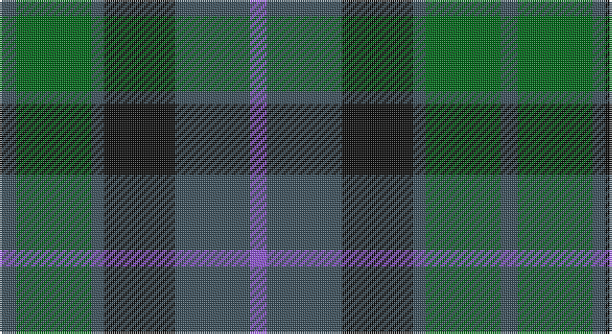

This page is one **sett** — a single exact thread-count. It belongs to the [tartan](/setts/n4g18n3k17n18p4/)
(the same proportion at any scale), whose colour order is pattern [BBKBGB](/stripes/bbkbgb/).

Sourced from register-of-tartans.  It is a [6 stripe tartan](/stripes/stripes6/).

Original link https://www.tartanregister.gov.uk/tartanDetails.aspx?ref=3705

## Register references

External register numbers recorded for this tartan.

- Scottish Register of Tartans: [3705](https://www.tartanregister.gov.uk/tartanDetails.aspx?ref=3705)
- Scottish Tartans Authority (ITI): 2510
- Scottish Tartans World Register: 2510

## Thread count
N/8 G36 N6 K34 N36 P/8

One full sett is **240 threads**.

## Palette

Palette: <strong>Tartan Register</strong> <small style="color:#888">(3 of 4 colours)</small>
<table><thead><tr><th>Colour</th><th>Threads</th><th>Shade</th><th>Base</th><th>OKLCh</th></tr></thead><tbody><tr><td>N/</td><td style="text-align:right;font-variant-numeric:tabular-nums">8</td><td><code style="background-color:#3C505C;">#3C505C</code> <small style="color:#888">#3C505C</small></td><td>B <code style="background-color:#2A418A;">#2A418A</code></td><td><small style="color:#888">oklch(41.9% 0.032 234.9)</small></td></tr><tr><td>G</td><td style="text-align:right;font-variant-numeric:tabular-nums">36</td><td><code style="background-color:#006818;">#006818</code> <small style="color:#888">#006818</small></td><td>G <code style="background-color:#006100;">#006100</code></td><td><small style="color:#888">oklch(45.0% 0.142 145.0)</small></td></tr><tr><td>N</td><td style="text-align:right;font-variant-numeric:tabular-nums">6</td><td><code style="background-color:#3C505C;">#3C505C</code> <small style="color:#888">#3C505C</small></td><td>B <code style="background-color:#2A418A;">#2A418A</code></td><td><small style="color:#888">oklch(41.9% 0.032 234.9)</small></td></tr><tr><td>K</td><td style="text-align:right;font-variant-numeric:tabular-nums">34</td><td><code style="background-color:#101010;">#101010</code> <small style="color:#888">#101010</small></td><td>K <code style="background-color:#000000;">#000000</code></td><td><small style="color:#888">oklch(17.3% 0.000 89.9)</small></td></tr><tr><td>N</td><td style="text-align:right;font-variant-numeric:tabular-nums">36</td><td><code style="background-color:#3C505C;">#3C505C</code> <small style="color:#888">#3C505C</small></td><td>B <code style="background-color:#2A418A;">#2A418A</code></td><td><small style="color:#888">oklch(41.9% 0.032 234.9)</small></td></tr><tr><td>P/</td><td style="text-align:right;font-variant-numeric:tabular-nums">8</td><td><code style="background-color:#9058D8;">#9058D8</code> <small style="color:#888">#9058D8</small></td><td>B <code style="background-color:#2A418A;">#2A418A</code></td><td><small style="color:#888">oklch(58.4% 0.190 300.8)</small></td></tr></tbody></table>

# Sample pattern

## Nearest tartans

The nearest existing variants by ΔTartan distance, with this tartan at the top so the swatches line up against it.

ΔTartan

Tartan

Sett

—

<a href="/ttd/edit/#slug=n4g18n3k17n18p4~x2">Scottish Airports</a> <a class="nn-out" href="/variants/s6/n4g18n3k17n18p4~x2/" title="open its dictionary page">↗</a>

0.40

<a href="/ttd/edit/#slug=dp4n18k17n3g18n4~x2&amp;base=n4g18n3k17n18p4~x2">Scottish Airports (Corporate)</a> <a class="nn-out" href="/variants/s6/dp4n18k17n3g18n4~x2/" title="open its dictionary page">↗</a>

0.68

<a href="/ttd/edit/#slug=dg1db5dg1k5dg6ly1~x2&amp;base=n4g18n3k17n18p4~x2">MacKay (Bonner)</a> <a class="nn-out" href="/variants/s6/dg1db5dg1k5dg6ly1~x2/" title="open its dictionary page">↗</a>

0.72

<a href="/ttd/edit/#slug=db2k2db12k8dg11r2~x2&amp;base=n4g18n3k17n18p4~x2">Murray #3</a> <a class="nn-out" href="/variants/s6/db2k2db12k8dg11r2~x2/" title="open its dictionary page">↗</a>

0.77

<a href="/ttd/edit/#slug=k3dg12k12r2db12k3~x2&amp;base=n4g18n3k17n18p4~x2">Ferguson of Balquhidder #3</a> <a class="nn-out" href="/variants/s6/k3dg12k12r2db12k3~x2/" title="open its dictionary page">↗</a>

0.84

<a href="/ttd/edit/#slug=g1db6k6g6r1g1~x6&amp;base=n4g18n3k17n18p4~x2">Callum Beg (Fashion)</a> <a class="nn-out" href="/variants/s6/g1db6k6g6r1g1~x6/" title="open its dictionary page">↗</a>

0.90

<a href="/ttd/edit/#slug=r1dy7g7db7g7db7r1~x8&amp;base=n4g18n3k17n18p4~x2">Tennant (Yules)</a> <a class="nn-out" href="/variants/s7/r1dy7g7db7g7db7r1~x8/" title="open its dictionary page">↗</a>

0.94

<a href="/ttd/edit/#slug=k4dg19k16w2db15dg4~x2&amp;base=n4g18n3k17n18p4~x2">Graham of Montrose</a> <a class="nn-out" href="/variants/s6/k4dg19k16w2db15dg4~x2/" title="open its dictionary page">↗</a>

0.95

<a href="/ttd/edit/#slug=g21k6t3g11k17db17k3~x2&amp;base=n4g18n3k17n18p4~x2">MacCallum</a> <a class="nn-out" href="/variants/s7/g21k6t3g11k17db17k3~x2/" title="open its dictionary page">↗</a>

0.96

<a href="/ttd/edit/#slug=g24db6t3k6db12k15g4~x2&amp;base=n4g18n3k17n18p4~x2">Blaylock Annandale (Name)</a> <a class="nn-out" href="/variants/s7/g24db6t3k6db12k15g4~x2/" title="open its dictionary page">↗</a>

0.97

<a href="/ttd/edit/#slug=g21k14g9db21k3db12dp3~x2&amp;base=n4g18n3k17n18p4~x2">Scotsman</a> <a class="nn-out" href="/variants/s7/g21k14g9db21k3db12dp3~x2/" title="open its dictionary page">↗</a>

## Neighbour map

Every grey dot is one of 14360 variants placed by the first two principal components of the ΔTartan feature space (44% of its variance). Red is this tartan; blue dots are its nearest — click one to open its page.

<svg viewBox="0 0 640 380" role="img" style="max-width:100%;height:auto;border:1px solid #e0e0e0;border-radius:4px;display:block" xmlns="http://www.w3.org/2000/svg"><image href="/nn/cloud.v1.png" width="640" height="380"/><a href="/variants/s6/dp4n18k17n3g18n4~x2/"><circle cx="223.0" cy="281.8" r="4" fill="#3465a4"><title>Scottish Airports (Corporate)</title></circle></a><a href="/variants/s6/dg1db5dg1k5dg6ly1~x2/"><circle cx="213.0" cy="266.7" r="4" fill="#3465a4"><title>MacKay (Bonner)</title></circle></a><a href="/variants/s6/db2k2db12k8dg11r2~x2/"><circle cx="217.5" cy="273.5" r="4" fill="#3465a4"><title>Murray #3</title></circle></a><a href="/variants/s6/k3dg12k12r2db12k3~x2/"><circle cx="225.2" cy="281.2" r="4" fill="#3465a4"><title>Ferguson of Balquhidder #3</title></circle></a><a href="/variants/s6/g1db6k6g6r1g1~x6/"><circle cx="197.7" cy="261.3" r="4" fill="#3465a4"><title>Callum Beg (Fashion)</title></circle></a><a href="/variants/s7/r1dy7g7db7g7db7r1~x8/"><circle cx="208.4" cy="281.6" r="4" fill="#3465a4"><title>Tennant (Yules)</title></circle></a><a href="/variants/s6/k4dg19k16w2db15dg4~x2/"><circle cx="223.0" cy="255.2" r="4" fill="#3465a4"><title>Graham of Montrose</title></circle></a><a href="/variants/s7/g21k6t3g11k17db17k3~x2/"><circle cx="205.9" cy="263.3" r="4" fill="#3465a4"><title>MacCallum</title></circle></a><a href="/variants/s7/g24db6t3k6db12k15g4~x2/"><circle cx="212.9" cy="249.2" r="4" fill="#3465a4"><title>Blaylock Annandale (Name)</title></circle></a><a href="/variants/s7/g21k14g9db21k3db12dp3~x2/"><circle cx="210.8" cy="270.0" r="4" fill="#3465a4"><title>Scotsman</title></circle></a><circle cx="211.5" cy="276.1" r="5" fill="#c00000"/></svg>

ID: /variants/s6/n4g18n3k17n18p4~x2/
