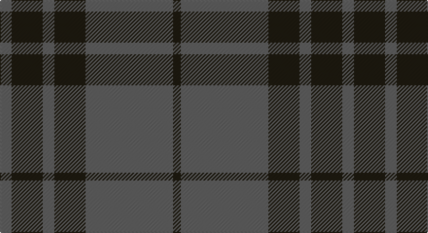

This page is one **sett** — a single exact thread-count. It belongs to the [tartan](/setts/n6k16n6k16n45k4/)
(the same proportion at any scale), whose colour order is pattern [BKBKBK](/stripes/bkbkbk/).

Part of the [Grey Spirit](/tartans/grey-spirit/) tartan — the named design grouping this sett with its other cloths.

Sourced from house-of-tartan.  It is a [6 stripe tartan](/stripes/stripes6/).

Original link http://www.house-of-tartan.scotland.net/house/TartanViewjs.asp?colr=Def&tnam=6594

## Provenance

Earliest known date: 01/03/2005 A fashion tartan from ACS Clothing of Glasgow for use in their kilt hire business. Woven by Lochcarron. The grey is actually a grey/black marl (mixture) which can't be shown graphically.

## Thread count
N/12 K32 N12 K32 N90 K/8

One full sett is **352 threads**.

## Palette

Palette: <strong>custom</strong>
<table><thead><tr><th>Colour</th><th>Threads</th><th>Shade</th><th>Base</th><th>OKLCh</th></tr></thead><tbody><tr><td>N/</td><td style="text-align:right;font-variant-numeric:tabular-nums">12</td><td><code style="background-color:#5F5F5F;">#5F5F5F</code> <small style="color:#888">#5F5F5F</small></td><td>B <code style="background-color:#2A418A;">#2A418A</code></td><td><small style="color:#888">oklch(48.5% 0.000 89.9)</small></td></tr><tr><td>K</td><td style="text-align:right;font-variant-numeric:tabular-nums">32</td><td><code style="background-color:#1E1A10;">#1E1A10</code> <small style="color:#888">#1E1A10</small></td><td>K <code style="background-color:#000000;">#000000</code></td><td><small style="color:#888">oklch(21.9% 0.019 88.7)</small></td></tr><tr><td>N</td><td style="text-align:right;font-variant-numeric:tabular-nums">12</td><td><code style="background-color:#5F5F5F;">#5F5F5F</code> <small style="color:#888">#5F5F5F</small></td><td>B <code style="background-color:#2A418A;">#2A418A</code></td><td><small style="color:#888">oklch(48.5% 0.000 89.9)</small></td></tr><tr><td>K</td><td style="text-align:right;font-variant-numeric:tabular-nums">32</td><td><code style="background-color:#1E1A10;">#1E1A10</code> <small style="color:#888">#1E1A10</small></td><td>K <code style="background-color:#000000;">#000000</code></td><td><small style="color:#888">oklch(21.9% 0.019 88.7)</small></td></tr><tr><td>N</td><td style="text-align:right;font-variant-numeric:tabular-nums">90</td><td><code style="background-color:#5F5F5F;">#5F5F5F</code> <small style="color:#888">#5F5F5F</small></td><td>B <code style="background-color:#2A418A;">#2A418A</code></td><td><small style="color:#888">oklch(48.5% 0.000 89.9)</small></td></tr><tr><td>K/</td><td style="text-align:right;font-variant-numeric:tabular-nums">8</td><td><code style="background-color:#1E1A10;">#1E1A10</code> <small style="color:#888">#1E1A10</small></td><td>K <code style="background-color:#000000;">#000000</code></td><td><small style="color:#888">oklch(21.9% 0.019 88.7)</small></td></tr></tbody></table>

# Sample pattern

## Compared to the master

This cloth is one sett of its design; the master sett (the exemplar the design is anchored on) is below for comparison.

<figure style="margin:0"><figcaption style="color:#888;font-size:smaller">this sett</figcaption></figure>
<figure style="margin:0"><figcaption style="color:#888;font-size:smaller"><a href="/setts/n45k17n6k17n6k17n6k17n45k4/">master sett →</a></figcaption></figure>

## Nearest tartans

The nearest existing variants by ΔTartan distance, with this tartan at the top so the swatches line up against it.

ΔTartan

Tartan

Sett

—

<a href="/ttd/edit/#slug=n6k16n6k16n45k4~x2">Grey Spirit Fashion Tartan</a> <a class="nn-out" href="/variants/s6/n6k16n6k16n45k4~x2/" title="open its dictionary page">↗</a>

0.77

<a href="/ttd/edit/#slug=n6k17n6k17n45k4~x2&amp;base=n6k16n6k16n45k4~x2">Grey Spirit (Fashion)</a> <a class="nn-out" href="/variants/s6/n6k17n6k17n45k4~x2/" title="open its dictionary page">↗</a>

1.21

<a href="/ttd/edit/#slug=k3n25k3n3k21n3~x2&amp;base=n6k16n6k16n45k4~x2">Slanj, Grey (Corporate)</a> <a class="nn-out" href="/variants/s6/k3n25k3n3k21n3~x2/" title="open its dictionary page">↗</a>

1.34

<a href="/ttd/edit/#slug=n45k17n6k17n6k17n6k17n45k4~x2&amp;base=n6k16n6k16n45k4~x2">Grey Spirit</a> <a class="nn-out" href="/variants/s10/n45k17n6k17n6k17n6k17n45k4~x2/" title="open its dictionary page">↗</a>

1.49

<a href="/ttd/edit/#slug=dg42o10dg3r10o3~x2&amp;base=n6k16n6k16n45k4~x2">Glen Trool (Fashion)</a> <a class="nn-out" href="/variants/s5/dg42o10dg3r10o3~x2/" title="open its dictionary page">↗</a>

1.49

<a href="/ttd/edit/#slug=lo3dy33db24dy2db2dy2~x2&amp;base=n6k16n6k16n45k4~x2">Keepers of the Quaich</a> <a class="nn-out" href="/variants/s6/lo3dy33db24dy2db2dy2~x2/" title="open its dictionary page">↗</a>

1.53

<a href="/ttd/edit/#slug=k24n18k11n4k11n18k53n4&amp;base=n6k16n6k16n45k4~x2">Spirit of Glyndwr Grey (Fashion)</a> <a class="nn-out" href="/variants/s8/k24n18k11n4k11n18k53n4/" title="open its dictionary page">↗</a>

1.55

<a href="/ttd/edit/#slug=dy6y2dy29y29dy2y6~x2&amp;base=n6k16n6k16n45k4~x2">Harmony 12 #2</a> <a class="nn-out" href="/variants/s6/dy6y2dy29y29dy2y6~x2/" title="open its dictionary page">↗</a>

1.62

<a href="/ttd/edit/#slug=dg2k12dg1k12dg12r2~x2&amp;base=n6k16n6k16n45k4~x2">Gunn (Logan)</a> <a class="nn-out" href="/variants/s6/dg2k12dg1k12dg12r2~x2/" title="open its dictionary page">↗</a>

1.63

<a href="/ttd/edit/#slug=r6dg2db2dg17r2~x4&amp;base=n6k16n6k16n45k4~x2">Loton (Personal)</a> <a class="nn-out" href="/variants/s5/r6dg2db2dg17r2~x4/" title="open its dictionary page">↗</a>

1.63

<a href="/variants/s4/g28dp10g3~x2/">Elphinstone Clan Tartan</a>

## Neighbour map

Every grey dot is one of 14360 variants placed by the first two principal components of the ΔTartan feature space (44% of its variance). Red is this tartan; blue dots are its nearest — click one to open its page.

<svg viewBox="0 0 640 380" role="img" style="max-width:100%;height:auto;border:1px solid #e0e0e0;border-radius:4px;display:block" xmlns="http://www.w3.org/2000/svg"><image href="/nn/cloud.v1.png" width="640" height="380"/><a href="/variants/s6/n6k17n6k17n45k4~x2/"><circle cx="433.2" cy="261.7" r="4" fill="#3465a4"><title>Grey Spirit (Fashion)</title></circle></a><a href="/variants/s6/k3n25k3n3k21n3~x2/"><circle cx="400.7" cy="265.0" r="4" fill="#3465a4"><title>Slanj, Grey (Corporate)</title></circle></a><a href="/variants/s10/n45k17n6k17n6k17n6k17n45k4~x2/"><circle cx="416.0" cy="247.5" r="4" fill="#3465a4"><title>Grey Spirit</title></circle></a><a href="/variants/s5/dg42o10dg3r10o3~x2/"><circle cx="466.7" cy="241.0" r="4" fill="#3465a4"><title>Glen Trool (Fashion)</title></circle></a><a href="/variants/s6/lo3dy33db24dy2db2dy2~x2/"><circle cx="440.4" cy="221.2" r="4" fill="#3465a4"><title>Keepers of the Quaich</title></circle></a><a href="/variants/s8/k24n18k11n4k11n18k53n4/"><circle cx="488.8" cy="259.5" r="4" fill="#3465a4"><title>Spirit of Glyndwr Grey (Fashion)</title></circle></a><a href="/variants/s6/dy6y2dy29y29dy2y6~x2/"><circle cx="441.8" cy="256.1" r="4" fill="#3465a4"><title>Harmony 12 #2</title></circle></a><a href="/variants/s6/dg2k12dg1k12dg12r2~x2/"><circle cx="403.1" cy="269.8" r="4" fill="#3465a4"><title>Gunn (Logan)</title></circle></a><a href="/variants/s5/r6dg2db2dg17r2~x4/"><circle cx="452.6" cy="267.9" r="4" fill="#3465a4"><title>Loton (Personal)</title></circle></a><a href="/variants/s4/g28dp10g3~x2/"><circle cx="407.7" cy="288.6" r="4" fill="#3465a4"><title>Elphinstone Clan Tartan</title></circle></a><circle cx="460.0" cy="269.0" r="5" fill="#c00000"/></svg>

ID: /variants/s6/n6k16n6k16n45k4~x2/
