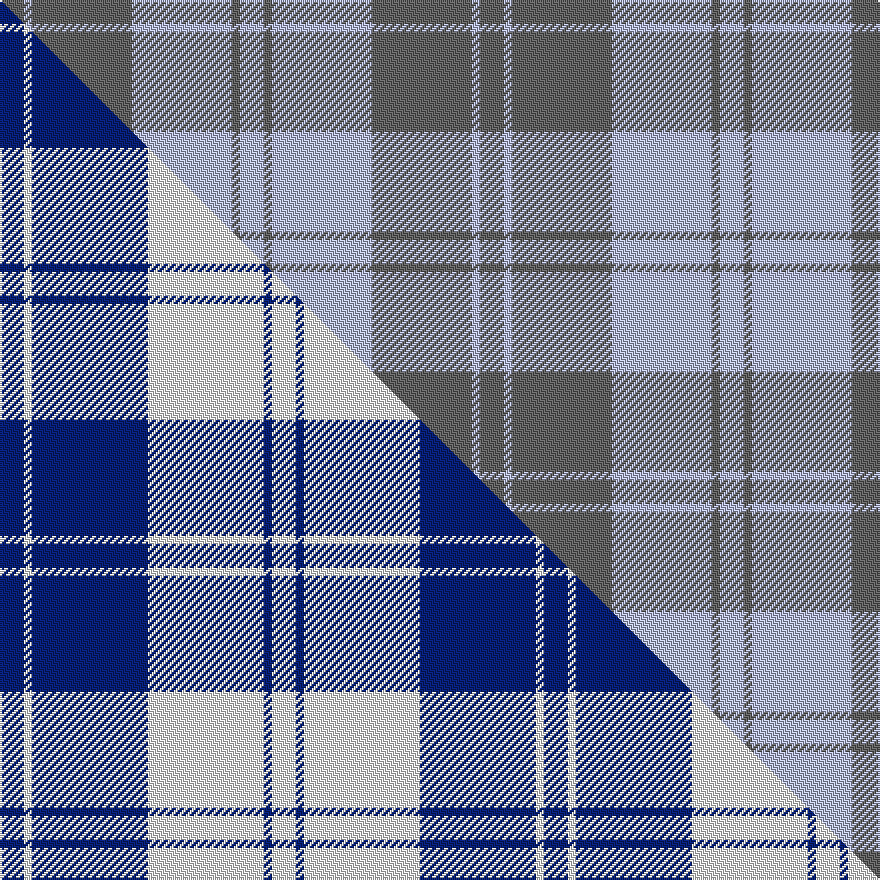

This page is one **sett** — a single exact thread-count. It belongs to the [tartan](/setts/n6lb2n25lb25n2lb6/)
(the same proportion at any scale), whose colour order is pattern [BWBWBW](/stripes/bwbwbw/).

Part of the [Erskine](/tartans/erskine-2/) tartan — the named design grouping this sett with its other cloths.

Sourced from register-of-tartans.  It is a [6 stripe tartan](/stripes/stripes6/).

Original link [https://www.tartanregister.gov.uk/tartanDetails.aspx?ref=1129](https://www.tartanregister.gov.uk/tartanDetails.aspx?ref=1129)

Dataset <small>— provenance for this record, inherited from the source manifest</small>

<dl class="dataset-prov">
<dt>source</dt><dd><a href="/sources/register-of-tartans/">Scottish Register of Tartans</a></dd>
<dt>data captured from</dt><dd><a href="https://github.com/thetartan/tartan-database/blob/master/data/register-of-tartans/data.csv">https://github.com/thetartan/tartan-database/blob/master/data/register-of-tartans/data.csv</a></dd>
<dt>data date</dt><dd>2017-01-06 <small>(dataset default)</small></dd>
<dt>licence</dt><dd><a href="https://www.tartanregister.gov.uk/copyright">Crown copyright</a></dd>
</dl>

Capture chain <small>— the hands this data passed through, oldest first; each capture carries its own licence</small>

<ol class="capture-chain">
<li><a href="https://www.tartanregister.gov.uk/">Scottish Register of Tartans</a> · <a href="https://www.tartanregister.gov.uk/copyright">Crown copyright</a> <small>the living register — still published by National Records of Scotland</small></li>
<li><a href="https://github.com/thetartan/tartan-database">thetartan/tartan-database</a> <small>2016-2017</small> · <a href="https://creativecommons.org/licenses/by-nc-nd/4.0/">CC BY-NC-ND 4.0</a> <small>Levko Kravets's frozen compilation — the capture we vendored, and where its CC licence text came from</small></li>
<li>this dictionary <small>captured 2026-06-10 · commit 5bf86c7566</small> <small>each re-capture is a git commit to data/sources</small></li>
</ol>

## Register references

External register numbers recorded for this tartan.

- Scottish Register of Tartans: [1129](https://www.tartanregister.gov.uk/tartanDetails.aspx?ref=1129)
- Scottish Tartans World Register: 2798

## Thread count
N/12 LB4 N50 LB50 N4 LB/12

One full sett is **240 threads**.

## Palette
<table><thead><tr><th>Colour</th><th>Shade</th><th>OKLCh</th></tr></thead><tbody><tr><td>N</td><td><code style="background-color:#636363;">#636363</code> <small style="color:#888">#636363</small></td><td><small style="color:#888">oklch(50.0% 0.000 89.9)</small></td></tr><tr><td>LB</td><td><code style="background-color:#B5BBDE;">#B5BBDE</code> <small style="color:#888">#B5BBDE</small></td><td><small style="color:#888">oklch(79.9% 0.050 277.6)</small></td></tr></tbody></table>

# Sample pattern

## Compared to the master

This cloth is one sett of its design; the master sett (the exemplar the design is anchored on) is below for comparison.

Its **ΔTartan distance** from the master is **0.68** — the same measure the nearest-tartans table ranks by (0 is identical; a re-scale of the same cloth is near 0, a recolour or a different proportion further).

<figure class="master-compare" style="margin:0">

this sett
master sett ★

<figcaption style="color:#888;font-size:smaller">One weave of this sett against the <a href="/setts/db6w2db29w29db2w6/">master sett ★</a>, split on the diagonal: a shared proportion runs seamlessly across it with only the shades shifting; a different proportion breaks on it.</figcaption>
</figure>

## Nearest tartan variants

The nearest existing variants by ΔTartan distance, with this cloth at the top so the swatches line up against it.

ΔTartan

Threads

Variant

Sett

—

240

<a href="/variants/s6/n6lb2n25lb25n2lb6~x2/">Erskine, Grey</a>

<a href="/ttd/edit/#slug=db6w2db29w29db2w6~x2&amp;base=n6lb2n25lb25n2lb6~x2" title="compare in the TTD">0.68</a>

272

<a href="/variants/s6/db6w2db29w29db2w6~x2/">Erskine Blue (Dance)</a>

<a href="/ttd/edit/#slug=db3w16db4w3db12w2~x3&amp;base=n6lb2n25lb25n2lb6~x2" title="compare in the TTD">0.69</a>

225

<a href="/variants/s6/db3w16db4w3db12w2~x3/">MacMugen</a>

<a href="/ttd/edit/#slug=lb10n1lb1n10lb18n5~x2&amp;base=n6lb2n25lb25n2lb6~x2" title="compare in the TTD">0.80</a>

150

<a href="/variants/s6/lb10n1lb1n10lb18n5~x2/">Harmony 13</a>

<a href="/ttd/edit/#slug=n1ly6n6lb6n1lb1~x4&amp;base=n6lb2n25lb25n2lb6~x2" title="compare in the TTD">1.62</a>

160

<a href="/variants/s6/n1ly6n6lb6n1lb1~x4/">Glen Burns (WCWM-2)</a>

<a href="/ttd/edit/#slug=n9db3n1db11n1~x6&amp;base=n6lb2n25lb25n2lb6~x2" title="compare in the TTD">1.65</a>

240

<a href="/variants/s5/n9db3n1db11n1~x6/">MacCallum, High School</a>

<a href="/ttd/edit/#slug=w5db16w5db16w33dr3~x2&amp;base=n6lb2n25lb25n2lb6~x2" title="compare in the TTD">1.73</a>

296

<a href="/variants/s6/w5db16w5db16w33dr3~x2/">Buchanan Dress Blue (Dance)</a>

<a href="/ttd/edit/#slug=y1b15w5b1w5b1~x4&amp;base=n6lb2n25lb25n2lb6~x2" title="compare in the TTD">1.86</a>

216

<a href="/variants/s6/y1b15w5b1w5b1~x4/">Whitley (Personal)</a>

<a href="/ttd/edit/#slug=b13w13b30w13b11w2b8~x2&amp;base=n6lb2n25lb25n2lb6~x2" title="compare in the TTD">1.94</a>

318

<a href="/variants/s7/b13w13b30w13b11w2b8~x2/">Jubilation Tartan</a>

<a href="/ttd/edit/#slug=ly72db16w9db4w5db16~x2&amp;base=n6lb2n25lb25n2lb6~x2" title="compare in the TTD">1.98</a>

312

<a href="/variants/s6/ly72db16w9db4w5db16~x2/">Machair</a>

<a href="/ttd/edit/#slug=t52db28w3db2w2db10~x2&amp;base=n6lb2n25lb25n2lb6~x2" title="compare in the TTD">2.00</a>

264

<a href="/variants/s6/t52db28w3db2w2db10~x2/">St Andrews Earl of Royal family Tartan</a>

## Neighbour map

Every grey dot is one of 13621 variants placed by the first two principal components of the ΔTartan feature space (42% of its variance). Red is this tartan; blue dots are its nearest — click one to open its page.

<svg viewBox="0 0 640 380" role="img" style="max-width:100%;height:auto;border:1px solid #e0e0e0;border-radius:4px;display:block" xmlns="http://www.w3.org/2000/svg"><image href="/nn/cloud.v1.png" width="640" height="380"/><a href="/variants/s6/db6w2db29w29db2w6~x2/"><circle cx="376.0" cy="239.9" r="4" fill="#3465a4"><title>Erskine Blue (Dance)</title></circle></a><a href="/variants/s6/db3w16db4w3db12w2~x3/"><circle cx="355.0" cy="274.7" r="4" fill="#3465a4"><title>MacMugen</title></circle></a><a href="/variants/s6/lb10n1lb1n10lb18n5~x2/"><circle cx="535.7" cy="275.6" r="4" fill="#3465a4"><title>Harmony 13</title></circle></a><a href="/variants/s6/n1ly6n6lb6n1lb1~x4/"><circle cx="312.2" cy="310.6" r="4" fill="#3465a4"><title>Glen Burns (WCWM-2)</title></circle></a><a href="/variants/s5/n9db3n1db11n1~x6/"><circle cx="524.9" cy="307.0" r="4" fill="#3465a4"><title>MacCallum, High School</title></circle></a><a href="/variants/s6/w5db16w5db16w33dr3~x2/"><circle cx="346.4" cy="248.7" r="4" fill="#3465a4"><title>Buchanan Dress Blue (Dance)</title></circle></a><a href="/variants/s6/y1b15w5b1w5b1~x4/"><circle cx="408.9" cy="210.8" r="4" fill="#3465a4"><title>Whitley (Personal)</title></circle></a><a href="/variants/s7/b13w13b30w13b11w2b8~x2/"><circle cx="465.6" cy="270.1" r="4" fill="#3465a4"><title>Jubilation Tartan</title></circle></a><a href="/variants/s6/ly72db16w9db4w5db16~x2/"><circle cx="394.3" cy="204.5" r="4" fill="#3465a4"><title>Machair</title></circle></a><a href="/variants/s6/t52db28w3db2w2db10~x2/"><circle cx="440.8" cy="211.4" r="4" fill="#3465a4"><title>St Andrews Earl of Royal family Tartan</title></circle></a><circle cx="469.3" cy="280.5" r="5" fill="#c00000"/><text x="320" y="376" text-anchor="middle" font-size="11" fill="#999">ground</text><text x="11" y="190" text-anchor="middle" font-size="11" fill="#999" transform="rotate(-90 11 190)">complexity</text></svg>

ID: /variants/s6/n6lb2n25lb25n2lb6~x2/
