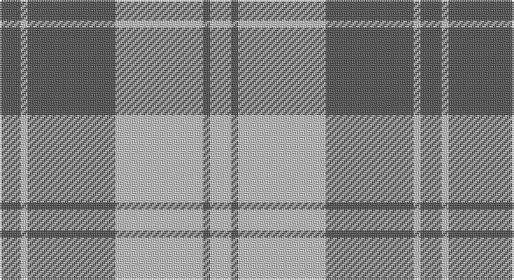

This page is one **sett** — a single exact thread-count. It belongs to the [tartan](/setts/n6lb2n25lb25n2lb6/)
(the same proportion at any scale), whose colour order is pattern [BWBWBW](/stripes/bwbwbw/).

Part of the [Erskine](/tartans/erskine/) tartan — the named design grouping this sett with its other cloths.

Sourced from register-of-tartans.  It is a [6 stripe tartan](/stripes/stripes6/).

Original link https://www.tartanregister.gov.uk/tartanDetails.aspx?ref=1129

## Also known as

This cloth is also recorded under:

- Erskine Blue
- Erskine Green
- Erskine Hunting
- Erskine Purple
- Erskine Red Dress
- Erskine Royal Blue Dress
- Erskine,
- Erskine, Black & Red
- Erskine, Blue
- Erskine, Burgundy
- Erskine, Green
- Erskine, Grey
- Erskine, Purple
- Erskine, dress
- Erskine, hunting
- Royal Scots Fusiliers

## Register references

External register numbers recorded for this tartan.

- Scottish Register of Tartans: [1129](https://www.tartanregister.gov.uk/tartanDetails.aspx?ref=1129)
- Scottish Tartans World Register: 2798

## Thread count
N/12 Na4 N50 Na50 N4 Na/12

One full sett is **240 threads**.

## Palette

Palette: <strong>Tartan Register</strong>
<table><thead><tr><th>Colour</th><th>Threads</th><th>Shade</th><th>Base</th><th>OKLCh</th></tr></thead><tbody><tr><td>N/</td><td style="text-align:right;font-variant-numeric:tabular-nums">12</td><td><code style="background-color:#505050;">#505050</code> <small style="color:#888">#505050</small></td><td>B <code style="background-color:#2A418A;">#2A418A</code></td><td><small style="color:#888">oklch(43.1% 0.000 89.9)</small></td></tr><tr><td>Na</td><td style="text-align:right;font-variant-numeric:tabular-nums">4</td><td><code style="background-color:#C0C0C0;">#C0C0C0</code> <small style="color:#888">#C0C0C0</small></td><td>W <code style="background-color:#F7F7F7;">#F7F7F7</code></td><td><small style="color:#888">oklch(80.8% 0.000 89.9)</small></td></tr><tr><td>N</td><td style="text-align:right;font-variant-numeric:tabular-nums">50</td><td><code style="background-color:#505050;">#505050</code> <small style="color:#888">#505050</small></td><td>B <code style="background-color:#2A418A;">#2A418A</code></td><td><small style="color:#888">oklch(43.1% 0.000 89.9)</small></td></tr><tr><td>Na</td><td style="text-align:right;font-variant-numeric:tabular-nums">50</td><td><code style="background-color:#C0C0C0;">#C0C0C0</code> <small style="color:#888">#C0C0C0</small></td><td>W <code style="background-color:#F7F7F7;">#F7F7F7</code></td><td><small style="color:#888">oklch(80.8% 0.000 89.9)</small></td></tr><tr><td>N</td><td style="text-align:right;font-variant-numeric:tabular-nums">4</td><td><code style="background-color:#505050;">#505050</code> <small style="color:#888">#505050</small></td><td>B <code style="background-color:#2A418A;">#2A418A</code></td><td><small style="color:#888">oklch(43.1% 0.000 89.9)</small></td></tr><tr><td>Na/</td><td style="text-align:right;font-variant-numeric:tabular-nums">12</td><td><code style="background-color:#C0C0C0;">#C0C0C0</code> <small style="color:#888">#C0C0C0</small></td><td>W <code style="background-color:#F7F7F7;">#F7F7F7</code></td><td><small style="color:#888">oklch(80.8% 0.000 89.9)</small></td></tr></tbody></table>

# Sample pattern

## Compared to the master

This cloth is one sett of its design; the master sett (the exemplar the design is anchored on) is below for comparison.

<figure style="margin:0"><figcaption style="color:#888;font-size:smaller">this sett</figcaption></figure>
<figure style="margin:0"><figcaption style="color:#888;font-size:smaller"><a href="/setts/g6r1g24r28g1r4/">master sett →</a></figcaption></figure>

## Nearest tartans

The nearest existing variants by ΔTartan distance, with this tartan at the top so the swatches line up against it.

ΔTartan

Tartan

Sett

—

<a href="/ttd/edit/#slug=n6lb2n25lb25n2lb6~x2">Erskine, Grey</a> <a class="nn-out" href="/variants/s6/n6lb2n25lb25n2lb6~x2/" title="open its dictionary page">↗</a>

1.46

<a href="/ttd/edit/#slug=g1lb4dy12lb3dy6lb12g1lb1~x4&amp;base=n6lb2n25lb25n2lb6~x2">O'Neill Pipe Band 1970 (Corporate)</a> <a class="nn-out" href="/variants/s8/g1lb4dy12lb3dy6lb12g1lb1~x4/" title="open its dictionary page">↗</a>

1.52

<a href="/ttd/edit/#slug=db3lo3db24lo30db3lo2~x2&amp;base=n6lb2n25lb25n2lb6~x2">Auburn University (Alabama)</a> <a class="nn-out" href="/variants/s6/db3lo3db24lo30db3lo2~x2/" title="open its dictionary page">↗</a>

1.58

<a href="/ttd/edit/#slug=lo72dt16w9dt4w5dt16~x2&amp;base=n6lb2n25lb25n2lb6~x2">Machair</a> <a class="nn-out" href="/variants/s6/lo72dt16w9dt4w5dt16~x2/" title="open its dictionary page">↗</a>

1.62

<a href="/ttd/edit/#slug=dg6w2dg29w29dg2w6~x2&amp;base=n6lb2n25lb25n2lb6~x2">Erskine Green</a> <a class="nn-out" href="/variants/s6/dg6w2dg29w29dg2w6~x2/" title="open its dictionary page">↗</a>

1.64

<a href="/ttd/edit/#slug=k4ly18n44k3ly10k4&amp;base=n6lb2n25lb25n2lb6~x2">Stutterheim</a> <a class="nn-out" href="/variants/s6/k4ly18n44k3ly10k4/" title="open its dictionary page">↗</a>

1.64

<a href="/ttd/edit/#slug=b6ly2b21ly2b6ly24b2ly6~x2&amp;base=n6lb2n25lb25n2lb6~x2">MacLachlan (Chief's Dress) Blue</a> <a class="nn-out" href="/variants/s8/b6ly2b21ly2b6ly24b2ly6~x2/" title="open its dictionary page">↗</a>

1.65

<a href="/ttd/edit/#slug=dy8lr29dy8lo3dy8lr8lo3~x2&amp;base=n6lb2n25lb25n2lb6~x2">Lister (Misty Mountain)</a> <a class="nn-out" href="/variants/s7/dy8lr29dy8lo3dy8lr8lo3~x2/" title="open its dictionary page">↗</a>

1.67

<a href="/ttd/edit/#slug=t11ly2r1ly2r1~x4&amp;base=n6lb2n25lb25n2lb6~x2">Carlisle, Ancient</a> <a class="nn-out" href="/variants/s5/t11ly2r1ly2r1~x4/" title="open its dictionary page">↗</a>

1.72

<a href="/ttd/edit/#slug=dt3w16dt4w3dt12w2~x3&amp;base=n6lb2n25lb25n2lb6~x2">MacMugen</a> <a class="nn-out" href="/variants/s6/dt3w16dt4w3dt12w2~x3/" title="open its dictionary page">↗</a>

1.76

<a href="/ttd/edit/#slug=db3lo30db40r3~x2&amp;base=n6lb2n25lb25n2lb6~x2">Sanix Large Muted</a> <a class="nn-out" href="/variants/s4/db3lo30db40r3~x2/" title="open its dictionary page">↗</a>

## Neighbour map

Every grey dot is one of 14360 variants placed by the first two principal components of the ΔTartan feature space (44% of its variance). Red is this tartan; blue dots are its nearest — click one to open its page.

<svg viewBox="0 0 640 380" role="img" style="max-width:100%;height:auto;border:1px solid #e0e0e0;border-radius:4px;display:block" xmlns="http://www.w3.org/2000/svg"><image href="/nn/cloud.v1.png" width="640" height="380"/><a href="/variants/s8/g1lb4dy12lb3dy6lb12g1lb1~x4/"><circle cx="303.3" cy="192.0" r="4" fill="#3465a4"><title>O'Neill Pipe Band 1970 (Corporate)</title></circle></a><a href="/variants/s6/db3lo3db24lo30db3lo2~x2/"><circle cx="384.0" cy="198.2" r="4" fill="#3465a4"><title>Auburn University (Alabama)</title></circle></a><a href="/variants/s6/lo72dt16w9dt4w5dt16~x2/"><circle cx="381.1" cy="179.0" r="4" fill="#3465a4"><title>Machair</title></circle></a><a href="/variants/s6/dg6w2dg29w29dg2w6~x2/"><circle cx="326.0" cy="200.4" r="4" fill="#3465a4"><title>Erskine Green</title></circle></a><a href="/variants/s6/k4ly18n44k3ly10k4/"><circle cx="305.0" cy="178.3" r="4" fill="#3465a4"><title>Stutterheim</title></circle></a><a href="/variants/s8/b6ly2b21ly2b6ly24b2ly6~x2/"><circle cx="325.2" cy="189.6" r="4" fill="#3465a4"><title>MacLachlan (Chief's Dress) Blue</title></circle></a><a href="/variants/s7/dy8lr29dy8lo3dy8lr8lo3~x2/"><circle cx="311.1" cy="200.8" r="4" fill="#3465a4"><title>Lister (Misty Mountain)</title></circle></a><a href="/variants/s5/t11ly2r1ly2r1~x4/"><circle cx="407.1" cy="208.9" r="4" fill="#3465a4"><title>Carlisle, Ancient</title></circle></a><a href="/variants/s6/dt3w16dt4w3dt12w2~x3/"><circle cx="293.2" cy="227.3" r="4" fill="#3465a4"><title>MacMugen</title></circle></a><a href="/variants/s4/db3lo30db40r3~x2/"><circle cx="370.8" cy="230.5" r="4" fill="#3465a4"><title>Sanix Large Muted</title></circle></a><circle cx="355.8" cy="222.2" r="5" fill="#c00000"/></svg>

ID: /variants/s6/n6lb2n25lb25n2lb6~x2/
