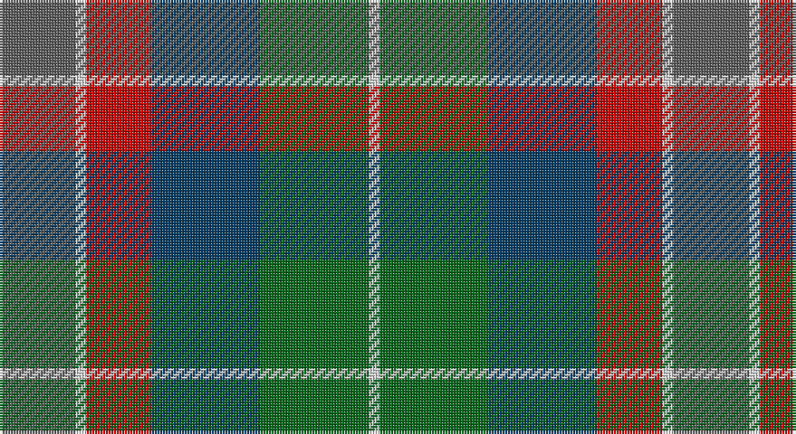

This page is one **sett** — a single exact thread-count. It belongs to the [tartan](/setts/n7w1r6dt10g10w1/)
(the same proportion at any scale), whose colour order is pattern [BWRBGW](/stripes/bwrbgw/).

Sourced from tartans-authority.  It is a [6 stripe tartan](/stripes/stripes6/).

Original link http://www.tartansauthority.com/tartan-ferret/display/10765/

## Register references

External register numbers recorded for this tartan.

- Scottish Tartans Authority (ITI): 10765

## Thread count
N/28 LN4 R24 DB40 G40 LN/4

One full sett is **248 threads**.

## Palette

Palette: <strong>Tartan Register</strong> <small style="color:#888">(4 of 5 colours)</small>
<table><thead><tr><th>Colour</th><th>Threads</th><th>Shade</th><th>Base</th><th>OKLCh</th></tr></thead><tbody><tr><td>N/</td><td style="text-align:right;font-variant-numeric:tabular-nums">28</td><td><code style="background-color:#5C5C5C;">#5C5C5C</code> <small style="color:#888">#5C5C5C</small></td><td>B <code style="background-color:#2A418A;">#2A418A</code></td><td><small style="color:#888">oklch(47.5% 0.000 89.9)</small></td></tr><tr><td>LN</td><td style="text-align:right;font-variant-numeric:tabular-nums">4</td><td><code style="background-color:#E0E0E0;">#E0E0E0</code> <small style="color:#888">#E0E0E0</small></td><td>W <code style="background-color:#F7F7F7;">#F7F7F7</code></td><td><small style="color:#888">oklch(90.7% 0.000 89.9)</small></td></tr><tr><td>R</td><td style="text-align:right;font-variant-numeric:tabular-nums">24</td><td><code style="background-color:#C80000;">#C80000</code> <small style="color:#888">#C80000</small></td><td>R <code style="background-color:#CC0000;">#CC0000</code></td><td><small style="color:#888">oklch(52.3% 0.215 29.2)</small></td></tr><tr><td>DB</td><td style="text-align:right;font-variant-numeric:tabular-nums">40</td><td><code style="background-color:#003C64;">#003C64</code> <small style="color:#888">#003C64</small></td><td>B <code style="background-color:#2A418A;">#2A418A</code></td><td><small style="color:#888">oklch(34.5% 0.089 246.0)</small></td></tr><tr><td>G</td><td style="text-align:right;font-variant-numeric:tabular-nums">40</td><td><code style="background-color:#006818;">#006818</code> <small style="color:#888">#006818</small></td><td>G <code style="background-color:#006100;">#006100</code></td><td><small style="color:#888">oklch(45.0% 0.142 145.0)</small></td></tr><tr><td>LN/</td><td style="text-align:right;font-variant-numeric:tabular-nums">4</td><td><code style="background-color:#E0E0E0;">#E0E0E0</code> <small style="color:#888">#E0E0E0</small></td><td>W <code style="background-color:#F7F7F7;">#F7F7F7</code></td><td><small style="color:#888">oklch(90.7% 0.000 89.9)</small></td></tr></tbody></table>

# Sample pattern

## Nearest tartans

The nearest existing variants by ΔTartan distance, with this tartan at the top so the swatches line up against it.

ΔTartan

Tartan

Sett

—

<a href="/ttd/edit/#slug=n7w1r6dt10g10w1~x4">McEachem (Name)</a> <a class="nn-out" href="/variants/s6/n7w1r6dt10g10w1~x4/" title="open its dictionary page">↗</a>

1.05

<a href="/ttd/edit/#slug=g4n12lo2k10y10lo3y2~x2&amp;base=n7w1r6dt10g10w1~x4">Rothesay</a> <a class="nn-out" href="/variants/s7/g4n12lo2k10y10lo3y2~x2/" title="open its dictionary page">↗</a>

1.14

<a href="/ttd/edit/#slug=db16dbi7lo4dbi2lo16dbi2y24dbi8lr11~x2&amp;base=n7w1r6dt10g10w1~x4">Wicklow County Crest (Fashion)</a> <a class="nn-out" href="/variants/s9/db16dbi7lo4dbi2lo16dbi2y24dbi8lr11~x2/" title="open its dictionary page">↗</a>

1.15

<a href="/ttd/edit/#slug=r4g11k11g2n11ly3~x4&amp;base=n7w1r6dt10g10w1~x4">Casely (Name)</a> <a class="nn-out" href="/variants/s6/r4g11k11g2n11ly3~x4/" title="open its dictionary page">↗</a>

1.17

<a href="/ttd/edit/#slug=r2dy8db2t4k4t1~x6&amp;base=n7w1r6dt10g10w1~x4">Thompson's Fancy Personal Tartan</a> <a class="nn-out" href="/variants/s6/r2dy8db2t4k4t1~x6/" title="open its dictionary page">↗</a>

1.20

<a href="/ttd/edit/#slug=r10db6g24dbi24r6ly3&amp;base=n7w1r6dt10g10w1~x4">Canine All Dogs (Fashion)</a> <a class="nn-out" href="/variants/s6/r10db6g24dbi24r6ly3/" title="open its dictionary page">↗</a>

1.22

<a href="/ttd/edit/#slug=y15k10n30o11w3y5~x2&amp;base=n7w1r6dt10g10w1~x4">McHale (Personal)</a> <a class="nn-out" href="/variants/s6/y15k10n30o11w3y5~x2/" title="open its dictionary page">↗</a>

1.25

<a href="/ttd/edit/#slug=dy9o9y9r1t1~x4&amp;base=n7w1r6dt10g10w1~x4">Jardine #2</a> <a class="nn-out" href="/variants/s5/dy9o9y9r1t1~x4/" title="open its dictionary page">↗</a>

1.26

<a href="/ttd/edit/#slug=r4g11k11g2n11y3~x4&amp;base=n7w1r6dt10g10w1~x4">Casely</a> <a class="nn-out" href="/variants/s6/r4g11k11g2n11y3~x4/" title="open its dictionary page">↗</a>

1.29

<a href="/ttd/edit/#slug=r9g3b19k3g19r13k3lo3~x2&amp;base=n7w1r6dt10g10w1~x4">Orkney (District?)</a> <a class="nn-out" href="/variants/s8/r9g3b19k3g19r13k3lo3~x2/" title="open its dictionary page">↗</a>

1.30

<a href="/ttd/edit/#slug=w3db17o16dbi2dg17ly2~x2&amp;base=n7w1r6dt10g10w1~x4">Atlantic, Ancient</a> <a class="nn-out" href="/variants/s6/w3db17o16dbi2dg17ly2~x2/" title="open its dictionary page">↗</a>

## Neighbour map

Every grey dot is one of 14360 variants placed by the first two principal components of the ΔTartan feature space (44% of its variance). Red is this tartan; blue dots are its nearest — click one to open its page.

<svg viewBox="0 0 640 380" role="img" style="max-width:100%;height:auto;border:1px solid #e0e0e0;border-radius:4px;display:block" xmlns="http://www.w3.org/2000/svg"><image href="/nn/cloud.v1.png" width="640" height="380"/><a href="/variants/s7/g4n12lo2k10y10lo3y2~x2/"><circle cx="104.7" cy="229.8" r="4" fill="#3465a4"><title>Rothesay</title></circle></a><a href="/variants/s9/db16dbi7lo4dbi2lo16dbi2y24dbi8lr11~x2/"><circle cx="106.3" cy="182.7" r="4" fill="#3465a4"><title>Wicklow County Crest (Fashion)</title></circle></a><a href="/variants/s6/r4g11k11g2n11ly3~x4/"><circle cx="98.4" cy="244.4" r="4" fill="#3465a4"><title>Casely (Name)</title></circle></a><a href="/variants/s6/r2dy8db2t4k4t1~x6/"><circle cx="163.1" cy="226.4" r="4" fill="#3465a4"><title>Thompson's Fancy Personal Tartan</title></circle></a><a href="/variants/s6/r10db6g24dbi24r6ly3/"><circle cx="141.9" cy="215.2" r="4" fill="#3465a4"><title>Canine All Dogs (Fashion)</title></circle></a><a href="/variants/s6/y15k10n30o11w3y5~x2/"><circle cx="200.4" cy="218.8" r="4" fill="#3465a4"><title>McHale (Personal)</title></circle></a><a href="/variants/s5/dy9o9y9r1t1~x4/"><circle cx="162.3" cy="222.3" r="4" fill="#3465a4"><title>Jardine #2</title></circle></a><a href="/variants/s6/r4g11k11g2n11y3~x4/"><circle cx="133.1" cy="264.8" r="4" fill="#3465a4"><title>Casely</title></circle></a><a href="/variants/s8/r9g3b19k3g19r13k3lo3~x2/"><circle cx="151.5" cy="222.4" r="4" fill="#3465a4"><title>Orkney (District?)</title></circle></a><a href="/variants/s6/w3db17o16dbi2dg17ly2~x2/"><circle cx="119.5" cy="198.7" r="4" fill="#3465a4"><title>Atlantic, Ancient</title></circle></a><circle cx="130.7" cy="223.5" r="5" fill="#c00000"/></svg>

ID: /variants/s6/n7w1r6dt10g10w1~x4/
