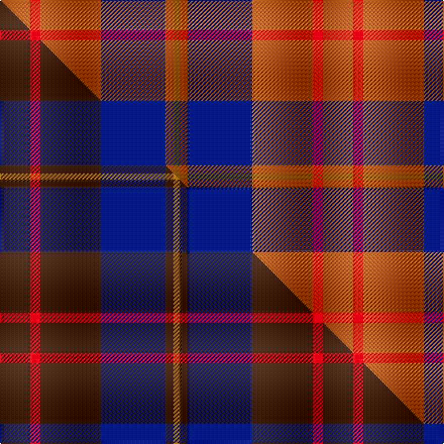

This is one **variant** — a specific cloth: this exact thread count and colourway, with its own
provenance below. It is one weaving of the [sett](/tartans/c/ca/cameron-hunting/) (the scale-free proportion — the
same cloth at any scale or shade), whose colour order is pattern [GRBRRR](/stripes/grbrrr/).

Part of the [Cameron Hunting](/tartans/c/ca/cameron-hunting/) tartan — the named design grouping this sett with its other cloths.

Sourced from weddslist.  It is a [6 stripe tartan](/stripes/stripes6/).

Original link [http://www.weddslist.com/cgi-bin/tartans/pg.pl?source=sts](http://www.weddslist.com/cgi-bin/tartans/pg.pl?source=sts)

Dataset <small>— provenance for this record, inherited from the source manifest</small>

<dl class="dataset-prov">
<dt>source</dt><dd><a href="/sources/weddslist/">Weddslist</a></dd>
<dt>data captured from</dt><dd><a href="https://github.com/thetartan/tartan-database/blob/master/data/weddslist/data.csv">https://github.com/thetartan/tartan-database/blob/master/data/weddslist/data.csv</a></dd>
<dt>data date</dt><dd>2016-11-17 <small>(dataset default)</small></dd>
<dt>licence</dt><dd><a href="https://creativecommons.org/licenses/by-nc-nd/4.0/">CC BY-NC-ND 4.0</a></dd>
</dl>

Capture chain <small>— the hands this data passed through, oldest first; each capture carries its own licence</small>

<ol class="capture-chain">
<li><a href="https://www.weddslist.com/tartans/">Weddslist</a> <small>the living privately compiled reference</small></li>
<li><a href="https://github.com/thetartan/tartan-database">thetartan/tartan-database</a> <small>2016-2017</small> · <a href="https://creativecommons.org/licenses/by-nc-nd/4.0/">CC BY-NC-ND 4.0</a> <small>Levko Kravets's frozen compilation — the capture we vendored, and where its CC licence text came from</small></li>
<li>this dictionary <small>captured 2026-06-10 · commit 5bf86c7566</small> <small>each re-capture is a git commit to data/sources</small></li>
</ol>

## Thread count
O/30 R10 O60 DB64 O8 Y/6

One full sett is **320 threads**.

## Palette
<table><thead><tr><th>Colour</th><th>Shade</th><th>OKLCh</th></tr></thead><tbody><tr><td>DB</td><td><code style="background-color:#082077;">#082077</code> <small style="color:#888">#082077</small></td><td><small style="color:#888">oklch(30.0% 0.149 265.1)</small></td></tr><tr><td>O</td><td><code style="background-color:#A65C11;">#A65C11</code> <small style="color:#888">#A65C11</small></td><td><small style="color:#888">oklch(55.0% 0.125 58.3)</small></td></tr><tr><td>R</td><td><code style="background-color:#D60020;">#D60020</code> <small style="color:#888">#D60020</small></td><td><small style="color:#888">oklch(55.2% 0.224 25.5)</small></td></tr><tr><td>Y</td><td><code style="background-color:#8B6E00;">#8B6E00</code> <small style="color:#888">#8B6E00</small></td><td><small style="color:#888">oklch(55.1% 0.113 90.4)</small></td></tr></tbody></table>

# Sample pattern

## Compared to the master

This cloth is one sett of its design; the master sett (the exemplar the design is anchored on) is below for comparison.

Its **ΔTartan distance** from the master is **0.44** — the same measure the nearest-tartans table ranks by (0 is identical; a re-scale of the same cloth is near 0, a recolour or a different proportion further).

<figure class="master-compare" style="margin:0">

this sett
master sett ★

<figcaption style="color:#888;font-size:smaller">One weave of this sett against the <a href="/setts/do15r5do30db32do4lo3/">master sett ★</a>, split on the diagonal: a shared proportion runs seamlessly across it with only the shades shifting; a different proportion breaks on it.</figcaption>
</figure>

## Nearest tartan variants

The nearest existing variants by ΔTartan distance, with this cloth at the top so the swatches line up against it.

ΔTartan

Threads

Variant

Sett

—

320

<a href="/variants/s6/o15r5o30db32o4y3~x2/">Cameron, hunting</a>

<a href="/ttd/edit/#slug=do15r5do30db32do4lo3~x2&amp;base=o15r5o30db32o4y3~x2" title="compare in the TTD">0.44</a>

320

<a href="/variants/s6/do15r5do30db32do4lo3~x2/">Cameron Hunting (Clan)</a>

<a href="/ttd/edit/#slug=db18y2o6y2o19r3~x2&amp;base=o15r5o30db32o4y3~x2" title="compare in the TTD">1.71</a>

158

<a href="/variants/s6/db18y2o6y2o19r3~x2/">Balfour blue &amp; brown</a>

<a href="/ttd/edit/#slug=o11db1o3dbi1db9r1~x4~db1913264-dbi3911270&amp;base=o15r5o30db32o4y3~x2" title="compare in the TTD">1.82</a>

160

<a href="/variants/s6/o11db1o3dbi1db9r1~x4~db1913264-dbi3911270/">Dege, of Saville Row</a>

<a href="/ttd/edit/#slug=r10b44o5dg40o62r5o10&amp;base=o15r5o30db32o4y3~x2" title="compare in the TTD">1.87</a>

332

<a href="/variants/s7/r10b44o5dg40o62r5o10/">Ballintrae</a>

<a href="/ttd/edit/#slug=db16o2db16o19r4~x3&amp;base=o15r5o30db32o4y3~x2" title="compare in the TTD">1.91</a>

282

<a href="/variants/s5/db16o2db16o19r4~x3/">Unidentified 17</a>

<a href="/ttd/edit/#slug=r2t13dr3t3dr16lb2~x4&amp;base=o15r5o30db32o4y3~x2" title="compare in the TTD">2.27</a>

296

<a href="/variants/s6/r2t13dr3t3dr16lb2~x4/">MacArthur-Fox Blue (Personal)</a>

<a href="/ttd/edit/#slug=dg7w1dg18db6r18dg2~x2&amp;base=o15r5o30db32o4y3~x2" title="compare in the TTD">2.67</a>

190

<a href="/variants/s6/dg7w1dg18db6r18dg2~x2/">Finlaggan</a>

<a href="/ttd/edit/#slug=dy15r5dy30t32dy4lo3~x2&amp;base=o15r5o30db32o4y3~x2" title="compare in the TTD">2.68</a>

320

<a href="/variants/s6/dy15r5dy30t32dy4lo3~x2/">Cameron Hunting</a>

<a href="/ttd/edit/#slug=y20db27r6db15y8db11y78dbi10r12~db2911276-dbi3514276&amp;base=o15r5o30db32o4y3~x2" title="compare in the TTD">2.78</a>

342

<a href="/variants/s9/y20db27r6db15y8db11y78dbi10r12~db2911276-dbi3514276/">Braken Tartan</a>

<a href="/ttd/edit/#slug=db2o28g13o2db13o2~x4&amp;base=o15r5o30db32o4y3~x2" title="compare in the TTD">2.89</a>

464

<a href="/variants/s6/db2o28g13o2db13o2~x4/">Edinchat</a>

## Neighbour map

Every grey dot is one of 13662 variants placed by the first two principal components of the ΔTartan feature space (42% of its variance). Red is this tartan; blue dots are its nearest — click one to open its page. The map is a flat projection of a many-dimensional space — [how to read it](/posts/neighbourhood-maps/).

<svg viewBox="0 0 640 380" role="img" style="max-width:100%;height:auto;border:1px solid #e0e0e0;border-radius:4px;display:block" xmlns="http://www.w3.org/2000/svg"><image href="/nn/cloud.v1.png" width="640" height="380"/><a href="/variants/s6/do15r5do30db32do4lo3~x2/"><circle cx="388.2" cy="235.5" r="4" fill="#3465a4"><title>Cameron Hunting (Clan)</title></circle></a><a href="/variants/s6/db18y2o6y2o19r3~x2/"><circle cx="312.6" cy="216.6" r="4" fill="#3465a4"><title>Balfour blue &amp; brown</title></circle></a><a href="/variants/s6/o11db1o3dbi1db9r1~x4~db1913264-dbi3911270/"><circle cx="318.5" cy="193.3" r="4" fill="#3465a4"><title>Dege, of Saville Row</title></circle></a><a href="/variants/s7/r10b44o5dg40o62r5o10/"><circle cx="285.4" cy="211.7" r="4" fill="#3465a4"><title>Ballintrae</title></circle></a><a href="/variants/s5/db16o2db16o19r4~x3/"><circle cx="341.6" cy="257.2" r="4" fill="#3465a4"><title>Unidentified 17</title></circle></a><a href="/variants/s6/r2t13dr3t3dr16lb2~x4/"><circle cx="304.1" cy="224.9" r="4" fill="#3465a4"><title>MacArthur-Fox Blue (Personal)</title></circle></a><a href="/variants/s6/dg7w1dg18db6r18dg2~x2/"><circle cx="316.8" cy="193.5" r="4" fill="#3465a4"><title>Finlaggan</title></circle></a><a href="/variants/s6/dy15r5dy30t32dy4lo3~x2/"><circle cx="342.8" cy="223.1" r="4" fill="#3465a4"><title>Cameron Hunting</title></circle></a><a href="/variants/s9/y20db27r6db15y8db11y78dbi10r12~db2911276-dbi3514276/"><circle cx="357.8" cy="183.1" r="4" fill="#3465a4"><title>Braken Tartan</title></circle></a><a href="/variants/s6/db2o28g13o2db13o2~x4/"><circle cx="359.0" cy="216.3" r="4" fill="#3465a4"><title>Edinchat</title></circle></a><circle cx="339.6" cy="214.3" r="5" fill="#c00000"/><text x="320" y="376" text-anchor="middle" font-size="11" fill="#999">ground</text><text x="11" y="190" text-anchor="middle" font-size="11" fill="#999" transform="rotate(-90 11 190)">complexity</text></svg>

ID: /variants/s6/o15r5o30db32o4y3~x2/
