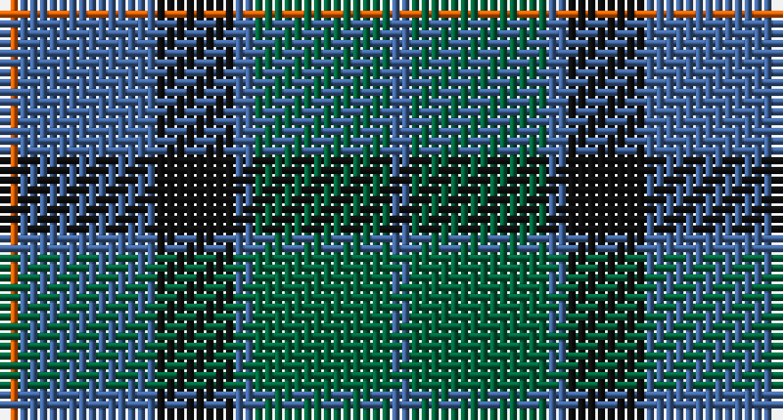

This page is one **sett** — a single exact thread-count. It belongs to the [tartan](/setts/o1b7k4b1g7b1/)
(the same proportion at any scale), whose colour order is pattern [BGBKBR](/stripes/bgbkbr/).

Sourced from house-of-tartan.  It is a [6 stripe tartan](/stripes/stripes6/).

Original link http://www.house-of-tartan.scotland.net/house/TartanViewjs.asp?colr=Def&tnam=20599

## Provenance

Earliest known date: Dupion Silk. Generated only for display purposes. reduced copy of the original 2059 Flower of Scotland.

## Also known as

This cloth is also recorded under:

- Flower of Scotland Commemorative

## Thread count
O/2 B14 K8 B2 G14 B/2

One full sett is **80 threads**.

## Palette

Palette: <strong>Tartan Register</strong> <small style="color:#888">(4 of 6 colours)</small>
<table><thead><tr><th>Colour</th><th>Threads</th><th>Shade</th><th>Base</th><th>OKLCh</th></tr></thead><tbody><tr><td>O/</td><td style="text-align:right;font-variant-numeric:tabular-nums">2</td><td><code style="background-color:#E86000;">#E86000</code> <small style="color:#888">#E86000</small></td><td>R <code style="background-color:#CC0000;">#CC0000</code></td><td><small style="color:#888">oklch(65.3% 0.187 44.9)</small></td></tr><tr><td>B</td><td style="text-align:right;font-variant-numeric:tabular-nums">14</td><td><code style="background-color:#40649C;">#40649C</code> <small style="color:#888">#40649C</small></td><td>B <code style="background-color:#2A418A;">#2A418A</code></td><td><small style="color:#888">oklch(50.3% 0.099 258.9)</small></td></tr><tr><td>K</td><td style="text-align:right;font-variant-numeric:tabular-nums">8</td><td><code style="background-color:#101010;">#101010</code> <small style="color:#888">#101010</small></td><td>K <code style="background-color:#000000;">#000000</code></td><td><small style="color:#888">oklch(17.3% 0.000 89.9)</small></td></tr><tr><td>B</td><td style="text-align:right;font-variant-numeric:tabular-nums">2</td><td><code style="background-color:#40649C;">#40649C</code> <small style="color:#888">#40649C</small></td><td>B <code style="background-color:#2A418A;">#2A418A</code></td><td><small style="color:#888">oklch(50.3% 0.099 258.9)</small></td></tr><tr><td>G</td><td style="text-align:right;font-variant-numeric:tabular-nums">14</td><td><code style="background-color:#00643C;">#00643C</code> <small style="color:#888">#00643C</small></td><td>G <code style="background-color:#006100;">#006100</code></td><td><small style="color:#888">oklch(44.3% 0.104 157.7)</small></td></tr><tr><td>B/</td><td style="text-align:right;font-variant-numeric:tabular-nums">2</td><td><code style="background-color:#40649C;">#40649C</code> <small style="color:#888">#40649C</small></td><td>B <code style="background-color:#2A418A;">#2A418A</code></td><td><small style="color:#888">oklch(50.3% 0.099 258.9)</small></td></tr></tbody></table>

# Sample pattern

## Nearest tartans

The nearest existing variants by ΔTartan distance, with this tartan at the top so the swatches line up against it.

ΔTartan

Tartan

Sett

—

<a href="/ttd/edit/#slug=o1b7k4b1g7b1~x2">Flower of Scotland MINI Tartan</a> <a class="nn-out" href="/variants/s6/o1b7k4b1g7b1~x2/" title="open its dictionary page">↗</a>

0.00

<a href="/ttd/edit/#slug=o1b7k4b1g7b1~x4&amp;base=o1b7k4b1g7b1~x2">Flower of Scotland Commemorative Tartan</a> <a class="nn-out" href="/variants/s6/o1b7k4b1g7b1~x4/" title="open its dictionary page">↗</a>

0.46

<a href="/ttd/edit/#slug=g3t1db7t1g3k1~x8&amp;base=o1b7k4b1g7b1~x2">Scott Green (Sir Walter)</a> <a class="nn-out" href="/variants/s6/g3t1db7t1g3k1~x8/" title="open its dictionary page">↗</a>

0.83

<a href="/ttd/edit/#slug=g8b1g1k6db6k1~x4&amp;base=o1b7k4b1g7b1~x2">Graham of Menteith</a> <a class="nn-out" href="/variants/s6/g8b1g1k6db6k1~x4/" title="open its dictionary page">↗</a>

0.87

<a href="/ttd/edit/#slug=t4dy28dg6t12k12t3~x2&amp;base=o1b7k4b1g7b1~x2">Thompson/Thomson/MacTavish Hunting</a> <a class="nn-out" href="/variants/s6/t4dy28dg6t12k12t3~x2/" title="open its dictionary page">↗</a>

0.94

<a href="/ttd/edit/#slug=g8t1g1k6db6k1~x4&amp;base=o1b7k4b1g7b1~x2">Graham of Menteith (Clan)</a> <a class="nn-out" href="/variants/s6/g8t1g1k6db6k1~x4/" title="open its dictionary page">↗</a>

0.94

<a href="/ttd/edit/#slug=dg1db5dg1k5dg6ly1~x2&amp;base=o1b7k4b1g7b1~x2">MacKay (Bonner)</a> <a class="nn-out" href="/variants/s6/dg1db5dg1k5dg6ly1~x2/" title="open its dictionary page">↗</a>

0.96

<a href="/ttd/edit/#slug=g7db1g1k4dp4k1~x4&amp;base=o1b7k4b1g7b1~x2">MacArthur of Milton (Clan)</a> <a class="nn-out" href="/variants/s6/g7db1g1k4dp4k1~x4/" title="open its dictionary page">↗</a>

0.99

<a href="/ttd/edit/#slug=n4g18n3k17n18p4~x2&amp;base=o1b7k4b1g7b1~x2">Scottish Airports</a> <a class="nn-out" href="/variants/s6/n4g18n3k17n18p4~x2/" title="open its dictionary page">↗</a>

1.01

<a href="/ttd/edit/#slug=g24db6t3k6db12k15g4~x2&amp;base=o1b7k4b1g7b1~x2">Blaylock Annandale (Name)</a> <a class="nn-out" href="/variants/s7/g24db6t3k6db12k15g4~x2/" title="open its dictionary page">↗</a>

1.02

<a href="/ttd/edit/#slug=db3g11t2db11b6g3~x2&amp;base=o1b7k4b1g7b1~x2">Unnamed, No 29</a> <a class="nn-out" href="/variants/s6/db3g11t2db11b6g3~x2/" title="open its dictionary page">↗</a>

## Neighbour map

Every grey dot is one of 14360 variants placed by the first two principal components of the ΔTartan feature space (44% of its variance). Red is this tartan; blue dots are its nearest — click one to open its page.

<svg viewBox="0 0 640 380" role="img" style="max-width:100%;height:auto;border:1px solid #e0e0e0;border-radius:4px;display:block" xmlns="http://www.w3.org/2000/svg"><image href="/nn/cloud.v1.png" width="640" height="380"/><a href="/variants/s6/o1b7k4b1g7b1~x4/"><circle cx="238.7" cy="253.6" r="4" fill="#3465a4"><title>Flower of Scotland Commemorative Tartan</title></circle></a><a href="/variants/s6/g3t1db7t1g3k1~x8/"><circle cx="249.7" cy="253.0" r="4" fill="#3465a4"><title>Scott Green (Sir Walter)</title></circle></a><a href="/variants/s6/g8b1g1k6db6k1~x4/"><circle cx="220.5" cy="251.3" r="4" fill="#3465a4"><title>Graham of Menteith</title></circle></a><a href="/variants/s6/t4dy28dg6t12k12t3~x2/"><circle cx="249.8" cy="242.4" r="4" fill="#3465a4"><title>Thompson/Thomson/MacTavish Hunting</title></circle></a><a href="/variants/s6/g8t1g1k6db6k1~x4/"><circle cx="218.0" cy="249.8" r="4" fill="#3465a4"><title>Graham of Menteith (Clan)</title></circle></a><a href="/variants/s6/dg1db5dg1k5dg6ly1~x2/"><circle cx="213.0" cy="266.7" r="4" fill="#3465a4"><title>MacKay (Bonner)</title></circle></a><a href="/variants/s6/g7db1g1k4dp4k1~x4/"><circle cx="233.2" cy="249.7" r="4" fill="#3465a4"><title>MacArthur of Milton (Clan)</title></circle></a><a href="/variants/s6/n4g18n3k17n18p4~x2/"><circle cx="211.5" cy="276.1" r="4" fill="#3465a4"><title>Scottish Airports</title></circle></a><a href="/variants/s7/g24db6t3k6db12k15g4~x2/"><circle cx="212.9" cy="249.2" r="4" fill="#3465a4"><title>Blaylock Annandale (Name)</title></circle></a><a href="/variants/s6/db3g11t2db11b6g3~x2/"><circle cx="198.5" cy="274.3" r="4" fill="#3465a4"><title>Unnamed, No 29</title></circle></a><circle cx="238.7" cy="253.6" r="5" fill="#c00000"/></svg>

ID: /variants/s6/o1b7k4b1g7b1~x2/
