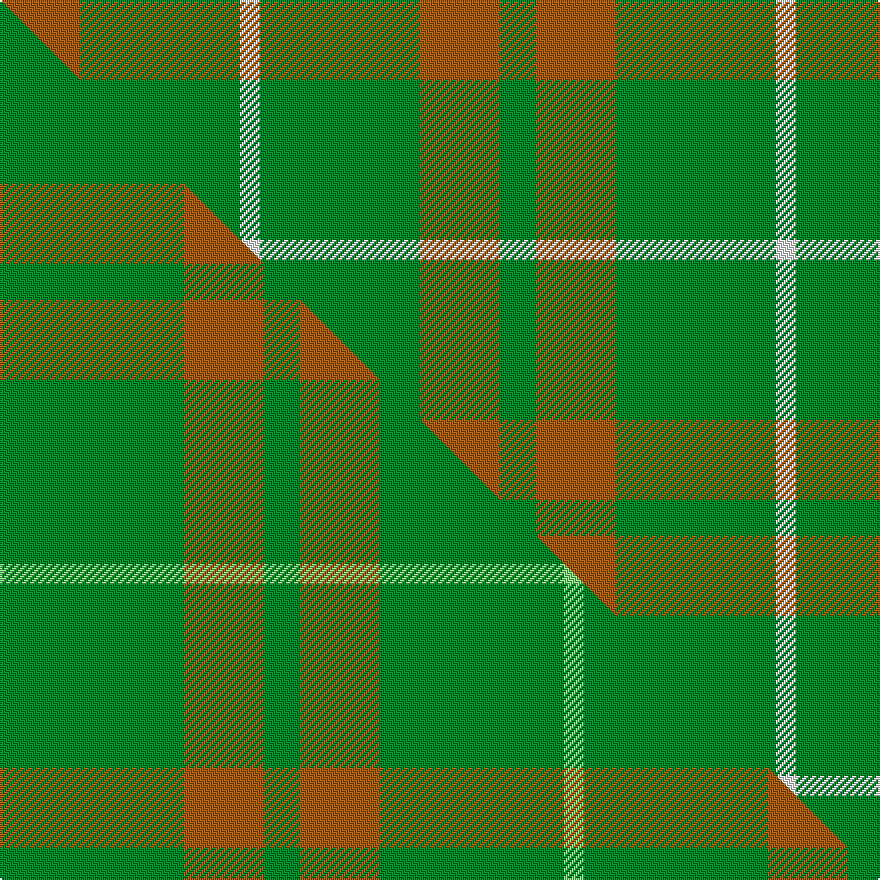

This page is one **sett** — a single exact thread-count. It belongs to the [tartan](/setts/o20g40w5g40o20g9/)
(the same proportion at any scale), whose colour order is pattern [GRGWGR](/stripes/grgwgr/).

Part of the [O'Neill](/tartans/o-neill/) tartan — the named design grouping this sett with its other cloths.

Sourced from register-of-tartans.  It is a [6 stripe tartan](/stripes/stripes6/).

Original link https://www.tartanregister.gov.uk/tartanDetails.aspx?ref=3248

## Register references

External register numbers recorded for this tartan.

- Scottish Register of Tartans: [3248](https://www.tartanregister.gov.uk/tartanDetails.aspx?ref=3248)
- Scottish Tartans Authority (ITI): 2464
- Scottish Tartans World Register: 2464

## Thread count
O/40 G80 W10 G80 O40 G/18

One full sett is **478 threads**.

## Palette
<table><thead><tr><th>Colour</th><th>Shade</th><th>OKLCh</th></tr></thead><tbody><tr><td>G</td><td><code style="background-color:#008B2A;">#008B2A</code> <small style="color:#888">#008B2A</small></td><td><small style="color:#888">oklch(55.4% 0.170 145.9)</small></td></tr><tr><td>W</td><td><code style="background-color:#F7F7F7;">#F7F7F7</code> <small style="color:#888">#F7F7F7</small></td><td><small style="color:#888">oklch(97.6% 0.000 89.9)</small></td></tr><tr><td>O</td><td><code style="background-color:#A65C11;">#A65C11</code> <small style="color:#888">#A65C11</small></td><td><small style="color:#888">oklch(55.0% 0.125 58.3)</small></td></tr></tbody></table>

# Sample pattern

## Compared to the master

This cloth is one sett of its design; the master sett (the exemplar the design is anchored on) is below for comparison.

Its **ΔTartan distance** from the master is **0.48** — the same measure the nearest-tartans table ranks by (0 is identical; a re-scale of the same cloth is near 0, a recolour or a different proportion further).

<figure class="master-compare" style="margin:0">

this sett
master sett ★

<figcaption style="color:#888;font-size:smaller">One weave of this sett against the <a href="/setts/g46o20g9o20g46lg5/">master sett ★</a>, split on the diagonal: a shared proportion runs seamlessly across it with only the shades shifting; a different proportion breaks on it.</figcaption>
</figure>

## Nearest tartan variants

The nearest existing variants by ΔTartan distance, with this cloth at the top so the swatches line up against it.

ΔTartan

Threads

Variant

Sett

—

478

<a href="/variants/s6/o20g40w5g40o20g9~x2/">O'Neill (Australia)</a>

<a href="/ttd/edit/#slug=g46o20g9o20g46lg5~x2&amp;base=o20g40w5g40o20g9~x2" title="compare in the TTD">0.48</a>

482

<a href="/variants/s6/g46o20g9o20g46lg5~x2/">O'Neill, Red</a>

<a href="/ttd/edit/#slug=o1g1o5g8lg1g1lg1~x4&amp;base=o20g40w5g40o20g9~x2" title="compare in the TTD">1.18</a>

136

<a href="/variants/s7/o1g1o5g8lg1g1lg1~x4/">O'Neill Pipe Band 1983 (Corporate)</a>

<a href="/ttd/edit/#slug=g1o8g8r1g8o8w1~x4&amp;base=o20g40w5g40o20g9~x2" title="compare in the TTD">1.29</a>

272

<a href="/variants/s7/g1o8g8r1g8o8w1~x4/">MacKinnon, hunting</a>

<a href="/ttd/edit/#slug=do6g3do3g11do1g2~x4&amp;base=o20g40w5g40o20g9~x2" title="compare in the TTD">1.62</a>

176

<a href="/variants/s6/do6g3do3g11do1g2~x4/">Carnet (Fashion)</a>

<a href="/ttd/edit/#slug=o6g2o29g29o2g6~x2&amp;base=o20g40w5g40o20g9~x2" title="compare in the TTD">1.95</a>

272

<a href="/variants/s6/o6g2o29g29o2g6~x2/">Harmony, 11</a>

<a href="/ttd/edit/#slug=dg6dy2o1dg15o3dy1dg15g6o1~x2&amp;base=o20g40w5g40o20g9~x2" title="compare in the TTD">1.95</a>

186

<a href="/variants/s9/dg6dy2o1dg15o3dy1dg15g6o1~x2/">McCall, F W (Personal)</a>

<a href="/ttd/edit/#slug=g9o20g40w5~x2&amp;base=o20g40w5g40o20g9~x2" title="compare in the TTD">2.05</a>

268

<a href="/variants/s4/g9o20g40w5~x2/">O'Neill (Australia) (Name)</a>

<a href="/ttd/edit/#slug=dg42o10dg3dr10o3~x2&amp;base=o20g40w5g40o20g9~x2" title="compare in the TTD">2.14</a>

182

<a href="/variants/s5/dg42o10dg3dr10o3~x2/">Glen Trool (Fashion)</a>

<a href="/ttd/edit/#slug=g18r6g75db6g13o35g12db6&amp;base=o20g40w5g40o20g9~x2" title="compare in the TTD">2.92</a>

318

<a href="/variants/s8/g18r6g75db6g13o35g12db6/">Glenlivet</a>

<a href="/ttd/edit/#slug=g9o20g46lg5~x2&amp;base=o20g40w5g40o20g9~x2" title="compare in the TTD">2.92</a>

292

<a href="/variants/s4/g9o20g46lg5~x2/">O'Neill, Red (Corporate?)</a>

## Neighbour map

Every grey dot is one of 13620 variants placed by the first two principal components of the ΔTartan feature space (42% of its variance). Red is this tartan; blue dots are its nearest — click one to open its page.

<svg viewBox="0 0 640 380" role="img" style="max-width:100%;height:auto;border:1px solid #e0e0e0;border-radius:4px;display:block" xmlns="http://www.w3.org/2000/svg"><image href="/nn/cloud.v1.png" width="640" height="380"/><a href="/variants/s6/g46o20g9o20g46lg5~x2/"><circle cx="532.5" cy="298.8" r="4" fill="#3465a4"><title>O'Neill, Red</title></circle></a><a href="/variants/s7/o1g1o5g8lg1g1lg1~x4/"><circle cx="430.1" cy="258.2" r="4" fill="#3465a4"><title>O'Neill Pipe Band 1983 (Corporate)</title></circle></a><a href="/variants/s7/g1o8g8r1g8o8w1~x4/"><circle cx="369.7" cy="267.3" r="4" fill="#3465a4"><title>MacKinnon, hunting</title></circle></a><a href="/variants/s6/do6g3do3g11do1g2~x4/"><circle cx="463.7" cy="279.6" r="4" fill="#3465a4"><title>Carnet (Fashion)</title></circle></a><a href="/variants/s6/o6g2o29g29o2g6~x2/"><circle cx="516.1" cy="271.8" r="4" fill="#3465a4"><title>Harmony, 11</title></circle></a><a href="/variants/s9/dg6dy2o1dg15o3dy1dg15g6o1~x2/"><circle cx="516.2" cy="208.7" r="4" fill="#3465a4"><title>McCall, F W (Personal)</title></circle></a><a href="/variants/s4/g9o20g40w5~x2/"><circle cx="449.1" cy="289.2" r="4" fill="#3465a4"><title>O'Neill (Australia) (Name)</title></circle></a><a href="/variants/s5/dg42o10dg3dr10o3~x2/"><circle cx="517.2" cy="237.5" r="4" fill="#3465a4"><title>Glen Trool (Fashion)</title></circle></a><a href="/variants/s8/g18r6g75db6g13o35g12db6/"><circle cx="470.6" cy="209.5" r="4" fill="#3465a4"><title>Glenlivet</title></circle></a><a href="/variants/s4/g9o20g46lg5~x2/"><circle cx="536.0" cy="299.8" r="4" fill="#3465a4"><title>O'Neill, Red (Corporate?)</title></circle></a><circle cx="462.4" cy="294.7" r="5" fill="#c00000"/><text x="320" y="376" text-anchor="middle" font-size="11" fill="#999">ground</text><text x="11" y="190" text-anchor="middle" font-size="11" fill="#999" transform="rotate(-90 11 190)">complexity</text></svg>

ID: /variants/s6/o20g40w5g40o20g9~x2/
