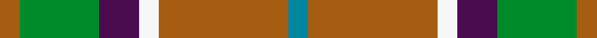

This page is one **sett** — a single exact thread-count. It belongs to the [tartan](/setts/o2g8dp4w2o13t2/)
(the same proportion at any scale), whose colour order is pattern [BRWBGR](/stripes/brwbgr/).

Sourced from register-of-tartans.  It is a [6 stripe tartan](/stripes/stripes6/).

Original link https://www.tartanregister.gov.uk/tartanDetails.aspx?ref=1099

## Register references

External register numbers recorded for this tartan.

- Scottish Register of Tartans: [1099](https://www.tartanregister.gov.uk/tartanDetails.aspx?ref=1099)
- Scottish Tartans Authority (ITI): 4804

## Thread count
O/8 G32 DP16 W8 O52 T/8

One full sett is **232 threads**.

## Palette
<table><thead><tr><th>Colour</th><th>Shade</th><th>OKLCh</th></tr></thead><tbody><tr><td>T</td><td><code style="background-color:#00879F;">#00879F</code> <small style="color:#888">#00879F</small></td><td><small style="color:#888">oklch(57.4% 0.102 216.1)</small></td></tr><tr><td>O</td><td><code style="background-color:#A65C11;">#A65C11</code> <small style="color:#888">#A65C11</small></td><td><small style="color:#888">oklch(55.0% 0.125 58.3)</small></td></tr><tr><td>G</td><td><code style="background-color:#008B2A;">#008B2A</code> <small style="color:#888">#008B2A</small></td><td><small style="color:#888">oklch(55.4% 0.170 145.9)</small></td></tr><tr><td>W</td><td><code style="background-color:#F7F7F7;">#F7F7F7</code> <small style="color:#888">#F7F7F7</small></td><td><small style="color:#888">oklch(97.6% 0.000 89.9)</small></td></tr><tr><td>DP</td><td><code style="background-color:#4B0B4F;">#4B0B4F</code> <small style="color:#888">#4B0B4F</small></td><td><small style="color:#888">oklch(30.1% 0.125 325.4)</small></td></tr></tbody></table>

# Sample pattern

## Nearest variants

The nearest existing variants by ΔTartan distance, with this cloth at the top so the swatches line up against it.

ΔTartan

Threads

Variant

Sett

—

232

<a href="/variants/s6/o2g8dp4w2o13t2~x4/">Ellan Vannin</a>

<a href="/ttd/edit/#slug=r1o4g3o1db3o1~x2&amp;base=o2g8dp4w2o13t2~x4" title="compare in the TTD">1.90</a>

48

<a href="/variants/s6/r1o4g3o1db3o1~x2/">Fraser Hunting</a>

<a href="/ttd/edit/#slug=r6g4do14w4do7g30lo4~x2&amp;base=o2g8dp4w2o13t2~x4" title="compare in the TTD">2.77</a>

256

<a href="/variants/s7/r6g4do14w4do7g30lo4~x2/">Newfoundland (District)</a>

<a href="/ttd/edit/#slug=r4g3o8w3o4g18y3~x2&amp;base=o2g8dp4w2o13t2~x4" title="compare in the TTD">2.79</a>

158

<a href="/variants/s7/r4g3o8w3o4g18y3~x2/">Newfoundland</a>

<a href="/ttd/edit/#slug=g25r9lb3y7w3dp11~x3&amp;base=o2g8dp4w2o13t2~x4" title="compare in the TTD">2.84</a>

240

<a href="/variants/s6/g25r9lb3y7w3dp11~x3/">Montessori School of Denver (School)</a>

<a href="/ttd/edit/#slug=g25r9lb3y7w3dp11&amp;base=o2g8dp4w2o13t2~x4" title="compare in the TTD">2.84</a>

80

<a href="/variants/s6/g25r9lb3y7w3dp11/">Montessori School of Denver</a>

## Neighbour map

Every grey dot is one of 13620 variants placed by the first two principal components of the ΔTartan feature space (42% of its variance). Red is this tartan; blue dots are its nearest — click one to open its page.

<svg viewBox="0 0 640 380" role="img" style="max-width:100%;height:auto;border:1px solid #e0e0e0;border-radius:4px;display:block" xmlns="http://www.w3.org/2000/svg"><image href="/nn/cloud.v1.png" width="640" height="380"/><a href="/variants/s6/r1o4g3o1db3o1~x2/"><circle cx="226.9" cy="284.6" r="4" fill="#3465a4"><title>Fraser Hunting</title></circle></a><a href="/variants/s7/r6g4do14w4do7g30lo4~x2/"><circle cx="238.5" cy="204.9" r="4" fill="#3465a4"><title>Newfoundland (District)</title></circle></a><a href="/variants/s7/r4g3o8w3o4g18y3~x2/"><circle cx="278.1" cy="238.7" r="4" fill="#3465a4"><title>Newfoundland</title></circle></a><a href="/variants/s6/g25r9lb3y7w3dp11~x3/"><circle cx="176.9" cy="204.5" r="4" fill="#3465a4"><title>Montessori School of Denver (School)</title></circle></a><a href="/variants/s6/g25r9lb3y7w3dp11/"><circle cx="176.9" cy="204.5" r="4" fill="#3465a4"><title>Montessori School of Denver</title></circle></a><circle cx="252.1" cy="231.9" r="5" fill="#c00000"/><text x="320" y="376" text-anchor="middle" font-size="11" fill="#999">ground</text><text x="11" y="190" text-anchor="middle" font-size="11" fill="#999" transform="rotate(-90 11 190)">complexity</text></svg>

ID: /variants/s6/o2g8dp4w2o13t2~x4/
